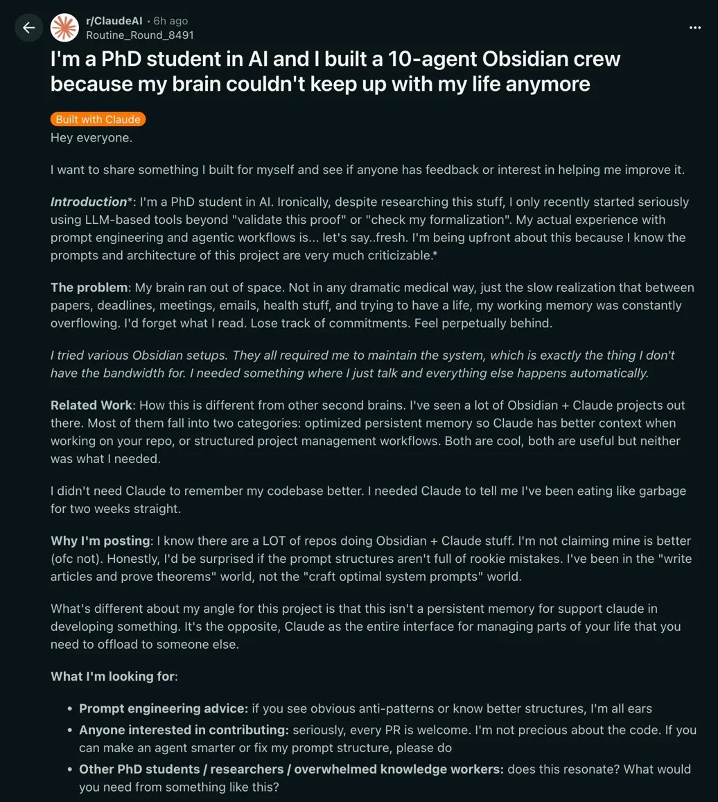

# PhD Student Built a 10-Agent Obsidian Crew to Manage His Entire Life

**Author:** Om Patel (@om_patel5)
**Date:** Mar 22, 2026
**Source:** https://x.com/om_patel5/status/2035533269429612663
**Stats:** 44 replies, 152 reposts, 1,885 likes, 3,422 bookmarks, 135.3K views

---

this PhD student in AI built a 10-agent Obsidian crew to manage his entire life

his brain couldn't keep up. papers, deadlines, meetings, emails, health stuff. he kept forgetting what he read, losing track of commitments, falling behind on everything.

tried every Obsidian setup out there. they all required him to maintain the system manually. which is the exact thing he didn't have time for.

so he built something where he just talks and everything else happens automatically.

the possibilities with this are endless AND other people can contribute and make it better because its OPEN SOURCE

