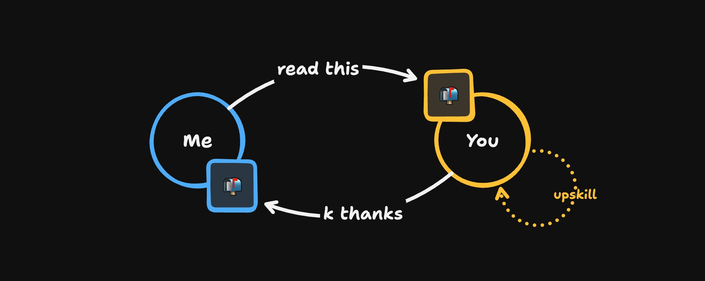

# The actor model in 2 minutes

**Author:** David K Piano (@DavidKPiano)
**Date:** March 15, 2026
**Source:** https://x.com/DavidKPiano/status/2033132659795194367
**Stats:** 73.5K Views | 13 Replies | 37 Reposts | 284 Likes | 396 Bookmarks

---

You've probably been hearing the term "actor model" popping up lately, alongside AI agent orchestration frameworks/architectures, Cloudflare durable objects, Erlang/Elixir, etc. And for good reason; it's an old (1970s) but good idea that keeps coming up and being reinvented.

So let me explain it in 2 minutes (because our attention spans are fried anyway).

Think about how you use Slack or Teams or whatever at work. You send a message to a coworker, they read it when they're ready, and they may react by doing some work, updating their todo list, etc. They can send messages back to you, or to others.

You never reach over and edit their work directly (hopefully), and you don't know what they're thinking unless they tell you.

That's the actor model. And it's a really simple, powerful way to architect software.

An actor is just an independent "worker" that communicates only through messages. Just like in real life.

Every actor has 3 things:

- **A mailbox:** queue of messages it receives
- **Private state:** can't mutate externally
- **Behavior:** how it reacts (state change and/or effects) to messages

The private state is the most important point. You can't access or modify another actor's state. This eliminates an entire class of bugs.

Behavior is just:

> state + message -> next state (+ effects)

Look familiar? Yeah, state machines fit nicely here. That's why I love them: behavior is a complete, explicit, simple function. No hidden logic. You can read it, test it, visualize it.

The isolated part is important too: one actor crashing doesn't make the entire system crash, just like one coworker screwing up doesn't take down a company. You can have a hierarchy where supervisor actors watch other actors and deal with them (e.g. restart on failure, or helping coworkers in real life).

Now look at what so many companies are building with AI agents today: frameworks where each agent maintains its own memory/context, they coordinate by talking to each other (message passing), they even have hierarchies (sub-agents etc). They react to prompts (messages): calling tools, responding, changing their own context.

That's just... actors. They've reinvented the actor model. Again.

This keeps happening and will continue happening, which is actually a good sign that the actor model foundations are sound. Isolated state, message passing, explicit behavior; all very good ideas I've been vocal about for the last decade.

In short, the actor model is just a model of real life. Independent people, communicating through messages, owning their own state, reacting to others. That's the intuition; it's really simple, and really powerful.

We keep reinventing it because it keeps being right.
