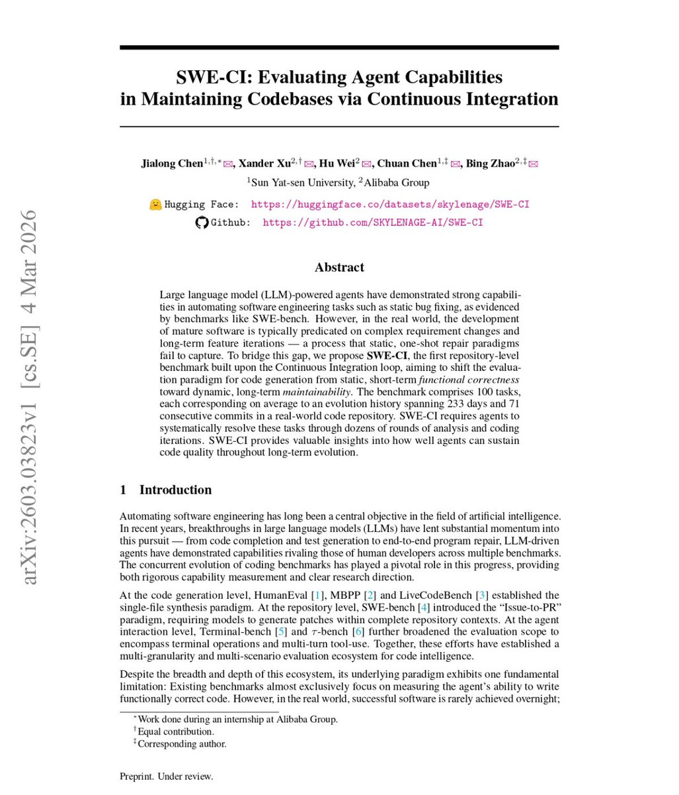

# Alibaba just proved that AI Coding isn't taking your job

**Author:** Priyanka Vergadia (@pvergadia)
**Date:** 2026-03-16
**Source:** https://x.com/pvergadia/status/2033362617352556980
**Stats:** 2,798 likes | 531 retweets | 171 replies

---

BREAKING: Alibaba just proved that AI Coding isn't taking your job, it's just writing the legacy code that will keep you employed fixing it for the next decade.

Passing a coding test once is easy. Maintaining that code for 8 months without it exploding? Apparently, it's nearly impossible for AI.

Alibaba tested 18 AI agents on 100 real codebases over 233-day cycles. They didn't just look for "quick fixes"--they looked for long-term survival.

The results were a bloodbath:

75% of models broke previously working code during maintenance.

Only Claude Opus 4.5/4.6 maintained a >50% zero-regression rate.

Every other model accumulated technical debt that compounded until the codebase collapsed.

We've been using "snapshot" benchmarks like HumanEval that only ask "Does it work right now?"

The new SWE-CI benchmark asks: "Does it still work after 8 months of evolution?"

Most AI agents are "Quick-Fix Artists." They write brittle code that passes tests today but becomes a maintenance nightmare tomorrow. They aren't building software; they're building a house of cards.

The narrative just got honest: Most models can write code. Almost none can maintain it.

*Image: First page of the paper "SWE-CI: Evaluating Agent Capabilities in Maintaining Codebases via Continuous Integration" (arXiv:2603.03823) by Jialong Chen, Xander Xu, Hu Wei, Chuan Chen, and Bing Zhao from Sun Yat-sen University and Alibaba Group. The paper proposes SWE-CI, a repository-level benchmark built on the Continuous Integration loop, shifting evaluation from static, short-term functional correctness toward dynamic, long-term maintainability. The benchmark comprises 100 tasks, each corresponding to an evolution history spanning 233 days and 71 consecutive commits in a real-world code repository.*
