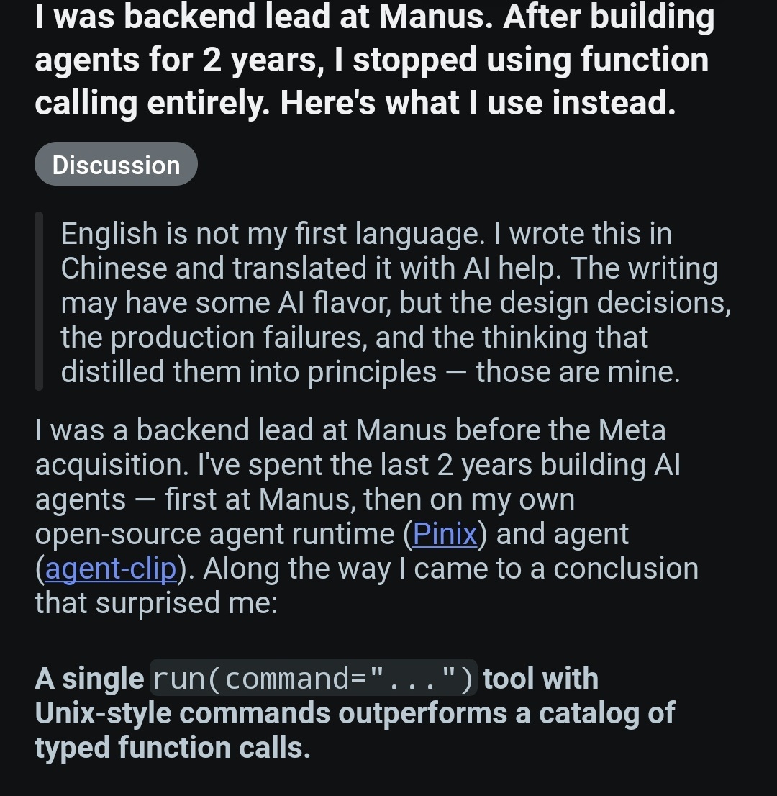
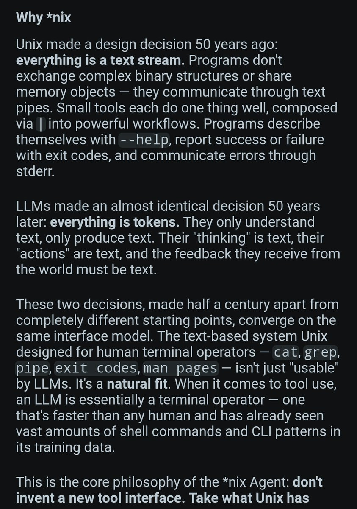
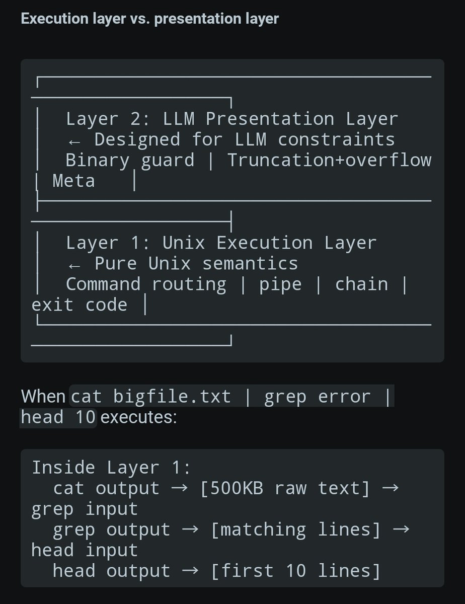

# The Best Article on Actual Agent Engineering — Shared by Dhaval Singh

- **Author:** Dhaval singh (@Dhavalsingh7)
- **Date:** March 13, 2026
- **Source:** [https://x.com/Dhavalsingh7/status/2032573413819318383](https://x.com/Dhavalsingh7/status/2032573413819318383)
- **Engagement:** 353 Likes | 4 Replies
- **Author affiliation:** Littlebird (Blue verified)

---

## Post Text

> The best article on actual agent engineering I've read. Extremely well articulated and brilliant insights
>
> Must must read if you are building any type of Agents

---

## Attached Article Screenshots

The tweet shares screenshots from an article written by a former backend lead at Manus (before the Meta acquisition), who spent the last 2 years building AI agents — first at Manus, then on open-source projects (Pinix agent runtime and agent-clip).

### Image 1: Introduction — Why Function Calling Is Dead



**Title:** "I was backend lead at Manus. After building agents for 2 years, I stopped using function calling entirely. Here's what I use instead."

**Discussion note:** "English is not my first language. I wrote this in Chinese and translated it with AI help. The writing may have some AI flavor, but the design decisions, the production failures, and the thinking that distilled them into principles — those are mine."

**Background:** "I was a backend lead at Manus before the Meta acquisition. I've spent the last 2 years building AI agents — first at Manus, then on my own open-source agent runtime (Pinix) and agent (agent-clip). Along the way I came to a conclusion that surprised me:"

**Key insight:** "A single `run(command="...")` tool with Unix-style commands outperforms a catalog of typed function calls."

### Image 2: Why *nix — The Philosophical Foundation



**Section: "Why \*nix"**

Unix made a design decision 50 years ago: **everything is a text stream.** Programs don't exchange complex binary structures or share memory objects — they communicate through text pipes. Small tools each do one thing well, composed via `|` into powerful workflows. Programs describe themselves with `--help`, report success or failure with exit codes, and communicate errors through stderr.

LLMs made an almost identical decision 50 years later: **everything is tokens.** They only understand text, only produce text. Their "thinking" is text, their "actions" are text, and the feedback they receive from the world must be text.

These two decisions, made half a century apart from completely different starting points, converge on the same interface model. The text-based system Unix designed for human terminal operators — `cat`, `grep`, `pipe`, `exit codes`, `man pages` — isn't just "usable" by LLMs. It's a **natural fit**. When it comes to tool use, an LLM is essentially a terminal operator — one that's faster than any human and has already seen vast amounts of shell commands and CLI patterns in its training data.

This is the core philosophy of the \*nix Agent: **don't invent a new tool interface. Take what Unix has** already perfected and let the LLM use it natively.

### Image 3: Execution Layer vs. Presentation Layer Architecture



**Section: "Execution layer vs. presentation layer"**

The article presents a two-layer architecture:

```
┌─────────────────────────────────────────┐
│  Layer 2: LLM Presentation Layer        │
│  ← Designed for LLM constraints         │
│  Binary guard | Truncation+overflow      │
│  Meta                                    │
└─────────────────────────────────────────┘
                    │
┌─────────────────────────────────────────┐
│  Layer 1: Unix Execution Layer          │
│  ← Pure Unix semantics                  │
│  Command routing | pipe | chain |       │
│  exit code                              │
└─────────────────────────────────────────┘
```

**Example:** When `cat bigfile.txt | grep error | head 10` executes:

```
Inside Layer 1:
  cat output → [500KB raw text] → grep input
    grep output → [matching lines] → head input
      head output → [first 10 lines]
```

The Unix Execution Layer handles pure Unix semantics (command routing, pipes, chains, exit codes), while the LLM Presentation Layer sits on top, designed for LLM constraints (binary guards, truncation+overflow handling, metadata).

---

## Key Themes

- **Function calling is overrated** for production agent systems — a single `run(command="...")` tool with Unix commands is more powerful
- **Unix and LLM paradigms converge** — both are fundamentally text-stream-based systems
- **Two-layer architecture** separates Unix execution semantics from LLM-optimized presentation
- **LLMs are natural terminal operators** — they've already ingested vast CLI patterns during training
- **Don't reinvent the wheel** — leverage 50 years of Unix tooling instead of building custom tool interfaces
