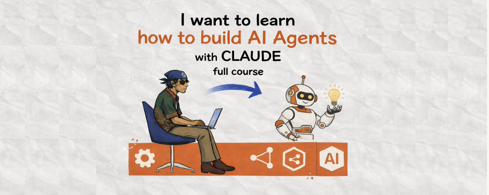

# I want to learn how to build AI Agents with Claude (full course)

**Author:** Guri Singh ([@heygurisingh](https://x.com/heygurisingh))
**Date:** March 14, 2026
**Source:** [https://x.com/heygurisingh/status/2032885031623118908](https://x.com/heygurisingh/status/2032885031623118908)
**Type:** X Article

## Stats

| Metric | Value |
|--------|-------|
| Replies | 5 |
| Reposts | 59 |
| Likes | 379 |
| Bookmarks | 891 |
| Views | 29,773 |

## Cover Image

---

## Content

> **Note:** This article is behind X's Premium paywall. The content below is what was publicly accessible without authentication. The article is truncated partway through Module 2. Modules 3, 4, and 5 are not available without an X Premium subscription.

I have combined every resource I have found to create a full course on building AI agents with Claude. In less than 15 minutes you'll understand the entire agent stack -- from single-agent loops to multi-agent teams running in parallel. After reading this article you will understand Claude's agent ecosystem better than 99% of people (yes, really).

You're about to be given a full course on building AI agents with Claude -- the same architecture that powers Claude Code, Cowork, and every production agent Anthropic ships.

Here's how to utilise this article:

- Module 1: What agents actually are (and aren't)
- Module 2: Your first agent with Claude Code
- Module 3: The Claude Agent SDK
- Module 4: Multi-agent orchestration with Agent Teams
- Module 5: Production deployment patterns

---

## Module 1: What Agents Actually Are

In every module I will give you the foundations + how to get AI to help you so that you 1: understand what's going on, and 2: build agents correctly without needing a PhD.

Let's get straight into it...

### THE DIFFERENCE BETWEEN CHAT AND AGENTS

Most people use Claude like a chatbox. You ask a question. You get an answer. That's not an agent.

An agent is a system that can plan, execute, observe results, and decide what to do next -- autonomously. It doesn't just answer your question. It takes ownership of a problem and works through it.

Here's the mental model:

**Chat** = you ask, Claude answers. One turn. Done.

**Agent** = you describe an outcome, Claude figures out the steps, executes them, checks results, adjusts if something breaks, and keeps going until the job is done.

The core loop is simple: **Think -> Act -> Observe -> Repeat.**

Claude reads a task. It decides which tool to use. It executes that tool (reading a file, running a command, searching the web). It observes the result. Then it decides the next step. This loop runs until the task is complete or Claude determines it needs your input.

This is the exact loop that powers Claude Code. When you tell Claude Code to "find and fix the bug in auth.py," it doesn't just suggest a fix. It reads the file, traces the logic, identifies the bug, writes the fix, runs the tests, and if the tests fail, it reads the error, adjusts the fix, and runs them again.

That's an agent.

### THE CLAUDE AGENT STACK

Before you build anything, you need to understand the four layers:

**Layer 1: Claude Code (the terminal agent).** This is Anthropic's agentic coding tool. It lives in your terminal. It can read files, write code, run bash commands, commit to Git, review PRs, and manage entire projects. If you want to use agents without writing any code yourself, this is where you start.

**Layer 2: The Claude Agent SDK (the builder's toolkit).** This is the same engine that powers Claude Code, exposed as a Python and TypeScript library. Everything Claude Code can do -- the agent loop, the built-in tools, the context management -- you can program it yourself. This is for developers who want to build custom agents for their own applications.

**Layer 3: MCP (the connection layer).** Model Context Protocol connects your agents to external tools -- GitHub, databases, browsers, Slack, anything with an API. MCP servers expose "tools" that Claude can call. Over 200 community servers exist as of early 2026.

**Layer 4: Agent Teams (multi-agent orchestration).** This is the newest layer. Instead of one agent doing everything sequentially, you spawn multiple agents that work in parallel, communicate with each other, and coordinate through a shared task list. One agent handles the API. Another builds the frontend. A third reviews everything the other two produce.

You don't need all four layers on day one. Most people start with Layer 1 and never leave it. But understanding the full stack means you know where to go when your needs grow.

### DO YOU NEED AN AGENT?

Not everything needs an agent. Here's the test:

- If the task is a single question with a single answer -- use chat.
- If the task requires multiple steps, tool usage, or iteration based on results -- use an agent.
- If the task has distinct parallel components where specialists would help -- use multi-agent.

A good rule: if you find yourself copy-pasting Claude's output back into Claude with "now do this next step," you need an agent.

Module 1 complete. You now understand the agent mental model. In Module 2, you're going to build your first one.

---

## Module 2: Your First Agent with Claude Code

Claude Code is the fastest path to using agents. No SDK. No code to write. Just your terminal and a description of what you want done.

### INSTALLATION

You need Node.js 18+ installed. Then run:

*[Content truncated by X Premium paywall]*

---

## Modules Not Available (Premium-only)

The following modules are behind X's Premium article paywall and could not be extracted:

- **Module 3: The Claude Agent SDK**
- **Module 4: Multi-agent orchestration with Agent Teams**
- **Module 5: Production deployment patterns**

---

## Author Bio

**Guri Singh** ([@heygurisingh](https://x.com/heygurisingh)) -- Sharing practical ways to use AI, No code, and Tech Tools. Follow me to learn and master AI, Tech tools & Digital Skills. AI Educator & Writer. DM for Collab.

