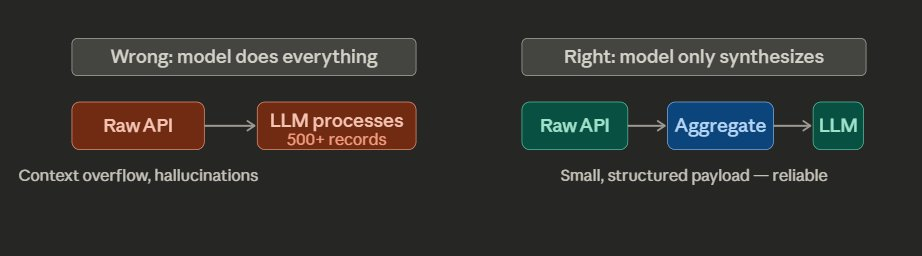
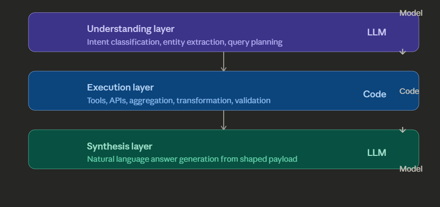
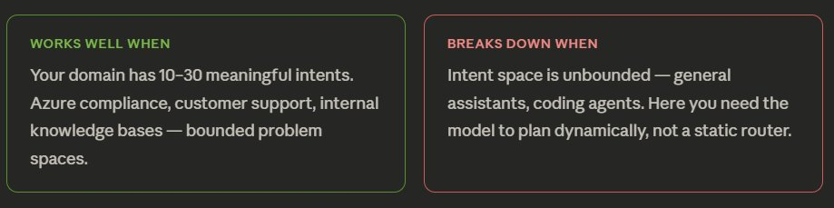
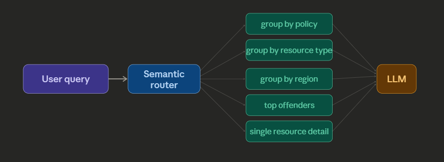
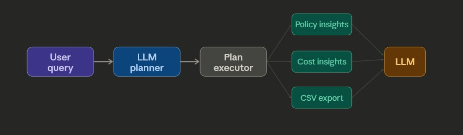
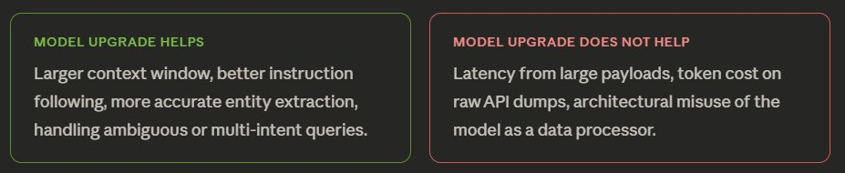

# Building AI Solutions That Actually Scale

**Author:** Jaydeep (@_jaydeepkarale)
**Date:** March 14, 2026
**Source:** https://x.com/_jaydeepkarale/status/2032866769405366532
**Stats:** 4 replies, 5 retweets, 58 likes, 5,370 views, 64 bookmarks

---

I spent the last 2 days participating in a hackathon, building a production grade AI solution, not a hobby project, not a demo app. Based on the lessons learnt, here is a general purpose framework for designing AI-powered apps that hold up in production.

Most AI prototypes feel magical. Most AI production systems feel fragile. The gap between the two isn't model quality  it's architecture. After building an AI copilot for querying Azure policy compliance, a clear set of patterns emerged that apply far beyond that specific problem.

This is the distilled version.

## The core mental model

Every AI application, regardless of domain, is solving the same structural problem: an unbounded input space (natural language) needs to produce a bounded, reliable output (an action, an answer, a structured result). The challenge is controlling that translation without brittle rule-based systems.

> The fundamental principle: Use the model for what it is uniquely good at  understanding language and synthesizing meaning. Use code for everything else.

This sounds obvious. In practice, almost every team violates it by asking the model to also do data processing, aggregation, filtering, or formatting on large payloads. That is where things break.

## The three-layer architecture

Every robust AI application ends up with three distinct layers. They may be named differently across frameworks, but they are always present.

The insight is that the model appears twice  at the start and end but never in the middle. The middle is deterministic code that you can test, version, and reason about.

## Semantic routing

Natural language queries are infinite. But the set of meaningful things a user can do in your application is not. Semantic routing is the bridge between those two facts.

Instead of trying to handle every possible phrasing, you define a bounded intent space  the finite set of things your system can actually do  and route incoming queries to the closest match. Embedding similarity, few-shot classification, or function calling can all do this job.

The router output is not just "which tool" -- it is also "how to aggregate the result." Both decisions are bounded and can be made at routing time.

## Aggregation: the most underrated layer

This is where most AI apps fall apart in production. A query like "show all non-compliant resources grouped by policy" returns thousands of rows from the API. Passing that raw payload to even a large model is slow, expensive, and unreliable.

> The insight: Natural language is infinite, but the meaningful ways to summarize any given dataset are not. Define those shapes in code, not in the model.

For an Azure compliance dataset, there are maybe six useful aggregation shapes regardless of how the question is phrased:

The semantic router selects both the tool and the aggregation strategy. The model receives a shaped, small payload. This pattern works regardless of dataset size.

## Composable tools and multi-step planning

As you add capabilities, the naive approach is to add more tools and expand the router. This works up to about three tools. Beyond that, queries start spanning multiple tools  and a single router pointing to a single tool cannot handle that.

The solution is to separate two concerns: tools that each do one thing well, and a planner that sequences them. A query like "show untagged VMs costing over $500/month and export as CSV" requires three tools in sequence tag analysis, cost filtering, export formatting. That requires a plan, not a route.

This is the natural evolution of semantic routing. Once you have three or more tools, you are essentially building a lightweight agent loop. The model becomes the orchestrator, not just the responder.

## What a better model actually fixes

There is a temptation, when things break, to upgrade the model. Sometimes that is the right call. But it is worth being precise about what model quality actually solves versus what it papers over.

> A better model is a band-aid. Proper aggregation and payload shaping is the fix and it makes even a smaller, cheaper model reliable.

## The universal pattern

Across every AI application compliance copilots, coding assistants, customer support bots, document Q&A  the same skeleton appears. Tools change. APIs change. Aggregation strategies change. The skeleton does not.

- **Bound your intent space.** Even if you cannot enumerate all user queries, you can enumerate all things your system can do. That enumeration is your routing surface.
- **Shape data before it touches the model.** For any given dataset, define the finite set of useful summaries. Route to the right shape at query time.
- **Tools are narrow; planners are broad.** Each tool does one thing. The model sequences them. Never build a tool that does three things.
- **Model appears at the edges, not the middle.** Understanding at the start. Synthesis at the end. Everything in between is deterministic code.
- **Build feature by feature.** Validate the loop on one intent before adding tools. The architecture scales; start narrow and let it grow.
