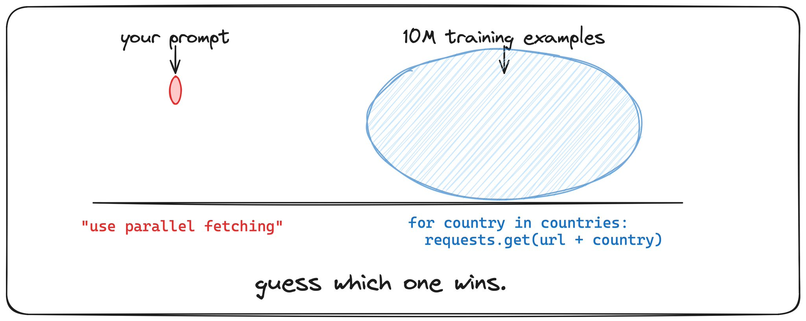
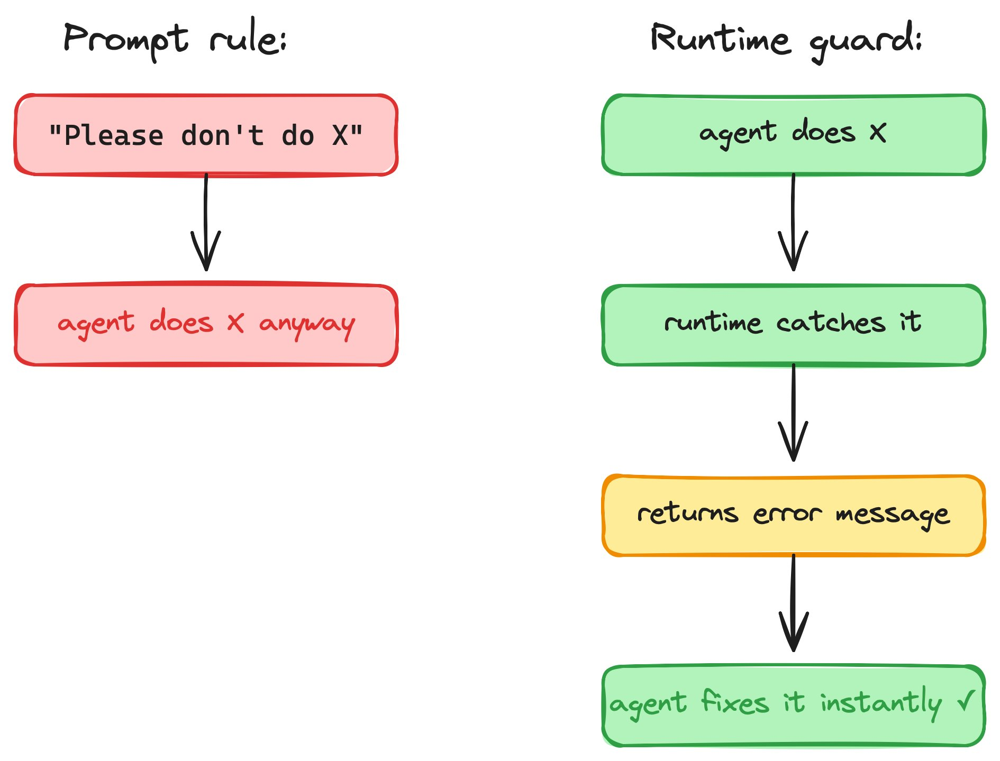
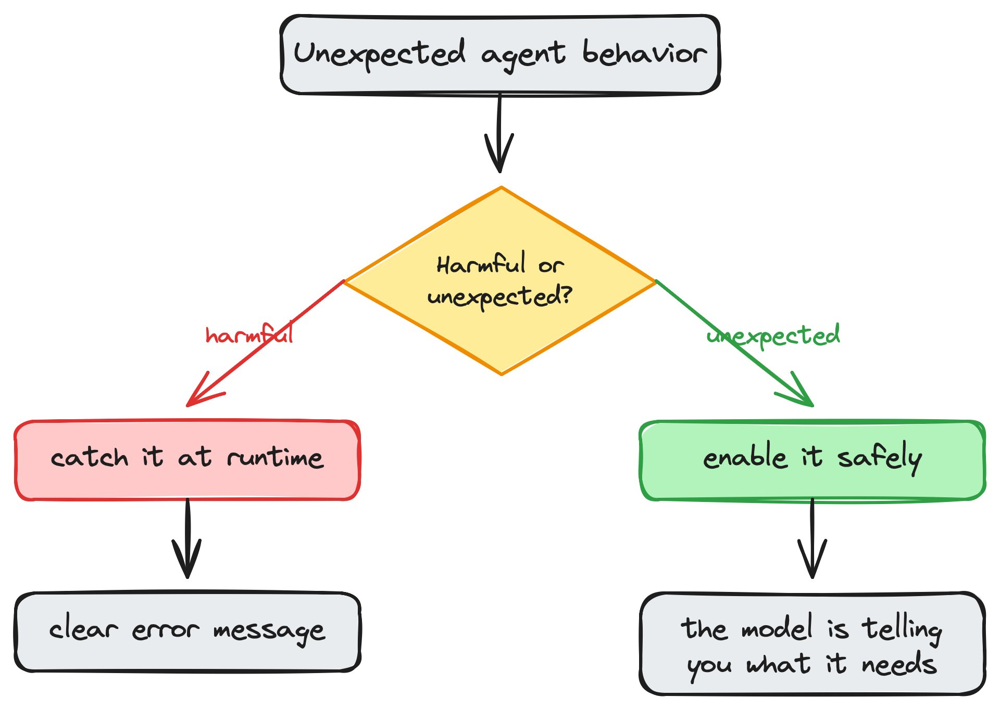

# Give your Agent Maximum Freedom

**Author:** Gregor Zunic (@gregpr07)
**Date:** Mar 13, 2026, 8:29 PM
**Source:** https://x.com/gregpr07/status/2032539581359546757
**Stats:** 9 replies, 15 reposts, 182 likes, 320 bookmarks, 19.5K views

---

## Training beats prompting. Every time.

We gave our agent a Python tool and a browser. The browser crashed. The agent inspected the runtime object, found the dead browser instance, and wrote Python code to restart it. Nobody told it to do that. Nobody would have thought to enable it.

This is what happens when you stop predicting what the model will do and start observing what it actually does.

## Training beats prompting. Every time.

We've run tens of thousands of agent sessions. The single most important thing we learned: when your prompt says one thing and the model's training says another, training wins.

**Python persistence.** We made each Python call stateless. Told the model in the system prompt. It still references variables from previous calls. Every time. Because every Python REPL it saw during training had persistent state.

**Sequential loops.** System prompt says: use Promise.all for parallel fetching. The agent runs requests.get() in a for-loop over 249 countries anyway. Because that's what 99% of Python code looks like.

**Slack via Python.** The agent has a Slack integration tool in its tool list. Ignores it. Writes raw requests.post() instead. Because that's what Stack Overflow taught it.

**Prompting is a suggestion. Training is gravity.**

## So what actually works?

If you can't prompt your way out of training priors, what do you do?

You use the one thing that IS deeply trained: error -> fix.

We told the agent "don't use sequential loops" in the prompt. Ignored. We added a runtime AST check that catches loop-based fetching and returns an error: "Sequential network calls in loop detected. Use Promise.all for parallel fetching." The agent rewrites the code with parallel fetching. Instantly. Every time.

Why does this work? Because every coding model has seen millions of error->fix loops during training. You're not fighting the training distribution anymore. You're using it.

**The principle:** don't prevent behavior through instructions. Let the model try, catch it at runtime, and return a clear error. It already knows what to do with errors.

## Freedom reveals intent

But here's the twist: not every unexpected behavior should be caught. Some of it is the model telling you what it needs.

**file:// URLs.** The agent builds a file on disk, then tries to open it via file:///workspace/output.html in the browser. Gets blocked. Tries 10 workarounds. This looks like a bug. But the agent is trying to verify its own output visually. That's actually smart. The right response isn't to block it harder -- it's to make it safe.

**Browser self-heal.** The agent inspects a dead runtime object and tries to restart it. That's not a failure mode. That's autonomous recovery. Enable it.

**Raw API calls over integrations.** The agent writes requests.post() instead of using the Slack tool. It's reaching for what it knows. Maybe your tool's interface isn't as clear as the raw API it saw during training.

**The method:** give maximum freedom in a sandbox. Observe what the model reaches for. Then decide: catch or enable. Build the harness around observed behavior, not assumed behavior.

## The less you assume, the more it works

One of the biggest learnings from building Browser Use: simplicity is very important. The model is smart enough to replan.

A few robust runtime guards plus model intelligence will always beat elaborate prompt engineering or complex heuristic systems. Don't assume what the model will do. Watch what it does. Then give it a proper harness.
