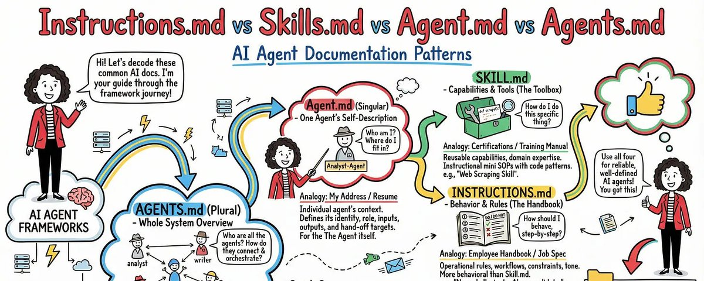
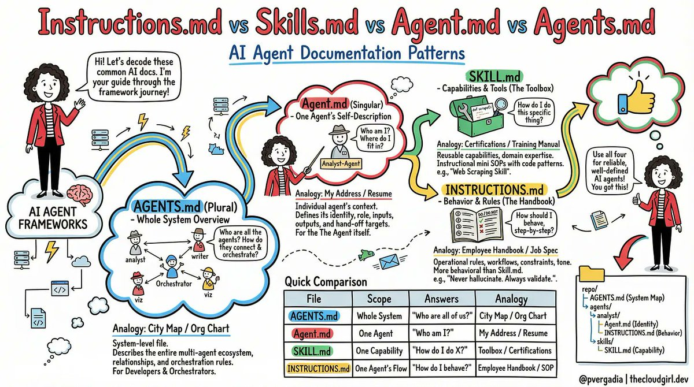
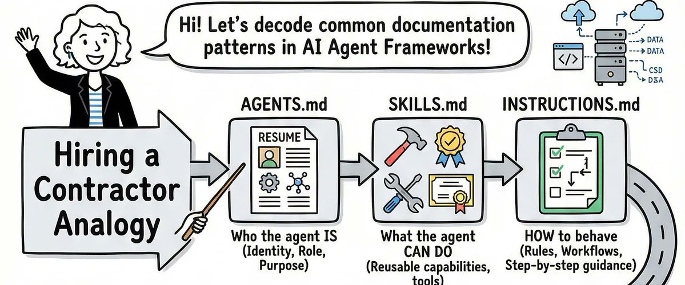
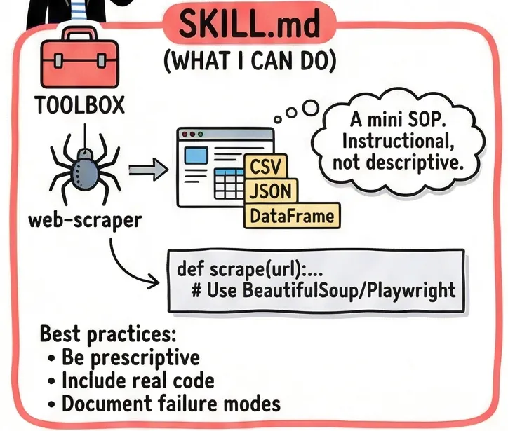
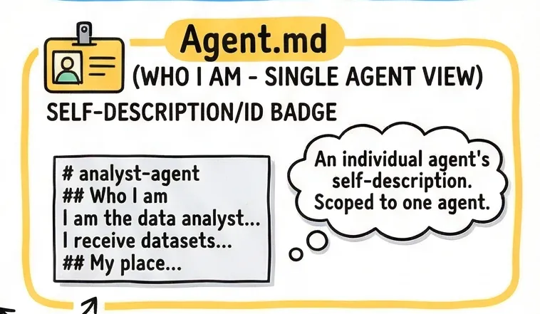
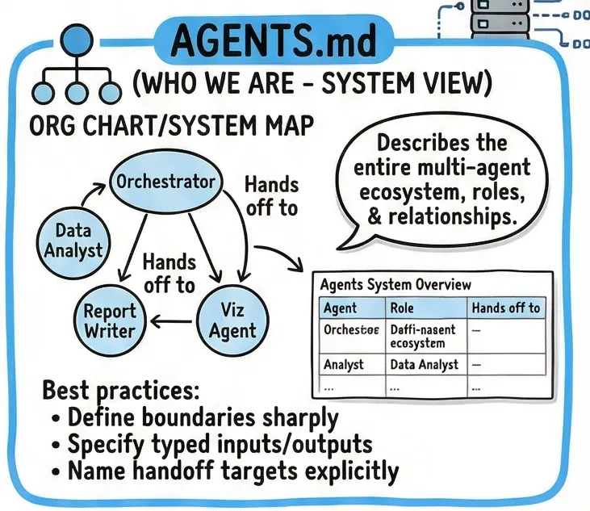
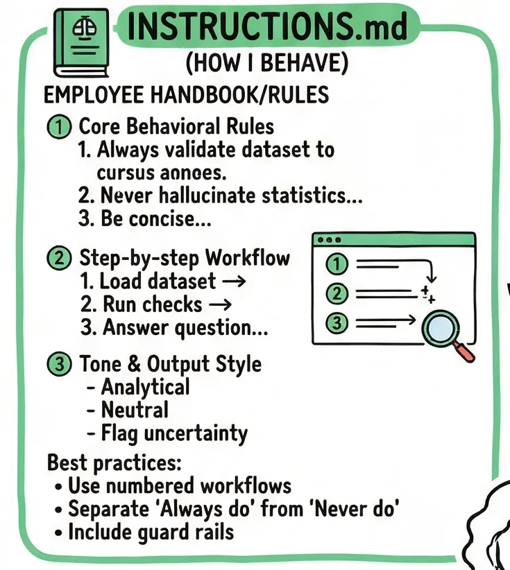
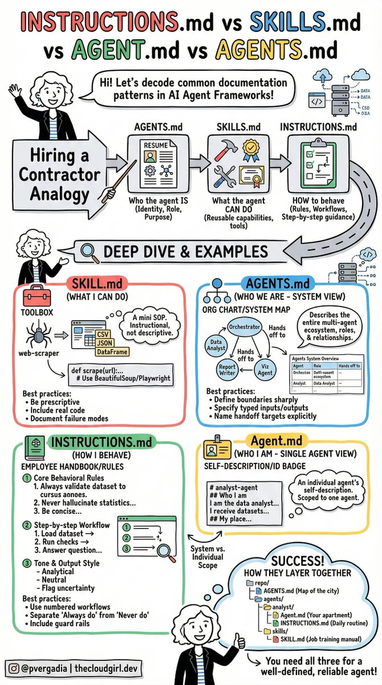

# Instructions.md vs Skills.md vs Agent.md vs Agents.md

**Author:** Priyanka Vergadia (@pvergadia)
**Date:** 2026-03-16
**Source:** https://x.com/pvergadia/status/2033403840264126816
**Stats:** 580 likes, 82 retweets, 7 replies, 1,533 bookmarks, 52,900 views

---



There's a moment every AI engineer knows well. You've built something impressive -- a multi-agent pipeline that researches, analyzes, writes, and publishes. It works great in testing. You demo it to your team and everyone is amazed. Then you push it to production, and within 48 hours, it's doing something nobody asked for. Your analyst agent is writing reports. Your writer agent is pulling data. Your orchestrator is talking directly to users. Everything is technically functional, and yet everything is wrong.

I lived that moment. And the root cause, every single time, was the same: nobody had told the agents *who they were*, *what they could do*, *where they fit*, or *how they should behave*. The agents were brilliant but unsupervised -- like hiring a team of genius contractors and forgetting to give them job descriptions.

The fix turned out to be four simple files. Not new frameworks. Not more prompts. Just four markdown files, each answering one specific question. Let me walk you through them.



## The Problem With Winging It

Most teams start the same way. They write one giant system prompt for each agent -- a sprawling wall of text that describes the agent's personality, its tools, its rules, its role, and its outputs all in one place. It works at first. Then it breaks in weird ways. The agent ignores half the prompt because it's too long. It hallucinates a rule that wasn't there. It starts doing things that made sense in isolation but clash with what another agent is doing downstream.

The root issue is that one system prompt is trying to answer four fundamentally different questions at once:

1. What can this agent *do*?
2. Who *is* this agent in the system?
3. Where does it *fit* among all the other agents?
4. How should it *behave*, step by step?

When those four questions live in the same blob of text, agents treat them all with equal weight -- or worse, they mush them together into something incoherent. The solution is to give each question its own file.



## SKILL.md (The Training Manual)

A skill file answers: *"How do I actually do this specific thing?"*

Think of it as a certification document. If you hire a data engineer, you expect them to know SQL. The SKILL.md file is the proof -- and the reference -- for exactly that knowledge.



Here's a real example. Imagine you're building a web scraping agent. Its SKILL.md would look something like this:

```
---
name: web-scraper
description: Extracts structured data from websites using BeautifulSoup
  and Playwright. Use when asked to scrape tables, listings, or articles.
---

## When to use this skill
- User provides a URL and wants structured data back
- Page may be JS-rendered (use Playwright) or static (use requests + BS4)

## Step-by-step process
1. Check if the page is JS-rendered. If yes, use Playwright headless.
2. Prefer semantic selectors: <article>, <table>, role= attributes.
   Avoid brittle CSS paths like .div > span:nth-child(3).
3. Return a pandas DataFrame. Save to /outputs/data.csv.

## Error handling
- 403 or 429: Add User-Agent header, add a 2-second delay, retry once.
- Empty results: Log the selector used. Suggest an alternative to the user.
```

Notice what's here: real code patterns, explicit steps, and -- critically -- failure modes. The best SKILL.md files don't just describe sunny-day scenarios. They tell the agent exactly what to do when things go wrong.

**Best practice:** One SKILL.md per capability. Don't bundle "scraping" and "database querying" into one file. Keep skills atomic and reusable -- other agents should be able to pick up the same skill file without modification.

## Agent.md (The Employee Badge)

An Agent.md answers: *"Who am I, and where do I fit in the system?"*

This is a per-agent file. Each agent has exactly one. It's short -- rarely more than 30 lines -- because it's not trying to teach the agent anything. It's grounding the agent in its identity.



```
# analyst-agent

## Who I am
I am the data analyst agent. I receive datasets and questions,
and I return structured AnalysisResult dicts.

## My place in the system
- Spawned by: orchestrator-agent
- I hand off to: viz-agent and writer-agent
- I never communicate directly with the user

## My capabilities
- Pandas / NumPy analysis
- SQL queries via the query_database tool
- Outlier detection and trend identification

## What I do NOT do
- Write reports or prose (-> writer-agent)
- Build charts or visualizations (-> viz-agent)
- Make business recommendations (-> human review)
```

That last section -- "What I do NOT do" -- is the most important part of any Agent.md. In my experience, agent misbehavior almost always comes from an agent filling in a gap that wasn't explicitly closed. If the analyst agent isn't told it doesn't write reports, it will eventually decide to write one, because writing a report after analysis seems like a natural next step.

**Best practice:** Keep Agent.md stable. It should almost never change once written. If you find yourself editing it frequently, that's a sign the agent's role isn't well-defined yet -- fix the system design, not the file.

## AGENTS.md (The Org Chart)

If Agent.md is one employee's badge, AGENTS.md is the company directory. It answers: *"Who are all the agents, and how does the whole system connect?"*

This is a single file that lives at the root of your project -- not inside any one agent's folder.



This does something subtle but powerful: it gives every agent a mental model of the entire system, not just their corner of it. When the analyst agent knows that a viz-agent exists downstream, it naturally starts thinking about what format its output should be in. It stops optimizing just for itself.

**Best practice:** Treat AGENTS.md like an architecture diagram. Keep it at the project root, commit it to version control, and update it whenever you add or remove an agent. New engineers joining the project should be able to read this file and understand the entire system in five minutes.

## INSTRUCTIONS.md (The Employee Handbook)

The final file answers: *"How should I behave, step by step, when I'm doing my job?"*

This is the most operational of the four files. Where SKILL.md says "here's how to scrape a page," INSTRUCTIONS.md says "here's the exact sequence you follow every time a task arrives."

```
# Instructions: Data Analyst Agent

## Core behavioral rules

1. Always validate the dataset before analyzing.
   - More than 20% nulls in any column? Warn the user before proceeding.
   - Type mismatches vs. expected schema? Raise an error -- do not guess.

2. Never hallucinate statistics.
   If a computation returns NaN or fails, say so explicitly.
   Do not estimate or fill in numbers from memory.

3. Be concise in summaries. Three sentences maximum.
   No filler: avoid phrases like "It is worth noting that..."

## Exact workflow

1. Load the dataset. Log its shape and column types.
2. Run data quality checks (nulls, duplicates, type mismatches).
3. Answer the analytical question using code only -- no guessing.
4. Populate the AnalysisResult dict.
5. Hand off to the downstream agent immediately.
   Do NOT ask the user for confirmation.

## Hard constraints
- Never read files outside /mnt/user-data/
- Never make external HTTP calls
- If analysis takes more than 30 seconds, time out and report why
```

That explicit workflow is what separates good INSTRUCTIONS.md files from bad ones. Prose instructions get interpreted loosely. Numbered steps get followed precisely. When you're debugging an agent that's doing something unexpected, a numbered workflow gives you an exact place to look: which step did it skip?

**Best practice:** Separate behavioral rules from workflow steps. Rules answer "always/never." Workflows answer "first/then/finally." Mixing them creates ambiguity about which takes priority.



## How They Work Together

Here's the structure I now use on every multi-agent project:

```
repo/
├── AGENTS.md                  <- System map. Who exists. How they connect.
└── agents/
    └── analyst/
        ├── Agent.md           <- I am analyst-agent. I report to orchestrator.
        ├── INSTRUCTIONS.md    <- Step 1: validate. Step 2: compute. Never hallucinate.
        └── skills/
            └── SKILL.md       <- Here's exactly how to run pandas analysis.
```

The mental model I keep coming back to: **AGENTS.md is the city map. Agent.md is your apartment address. INSTRUCTIONS.md is your daily routine. SKILL.md is your job training certificate.**

A city map without apartment addresses is useless at scale. An apartment without a daily routine produces chaos. A routine without training produces confident incompetence. You need all four.



## The Thing Most Teams Skip

In my experience, most teams write SKILL.md and INSTRUCTIONS.md pretty naturally they emerge from prompt engineering. What teams consistently skip are Agent.md and AGENTS.md, because they feel administrative. "We know who the agents are," teams say. "We don't need to document that."

But agents don't know what *you* know. Every time a new conversation starts, every agent begins from scratch. Without Agent.md, your analyst agent doesn't know it's the analyst. It knows it has pandas tools and some instructions. Given enough latitude, it will define its own role -- and that role will be whatever feels most natural given the task at hand. Some days that's fine. Some days your analyst starts writing CEO memos.

Four files. One for the system. One for identity. One for behavior. One for skills. That's it. And after three months of debugging agent chaos, it's the structure I wish someone had told me about on day one.
