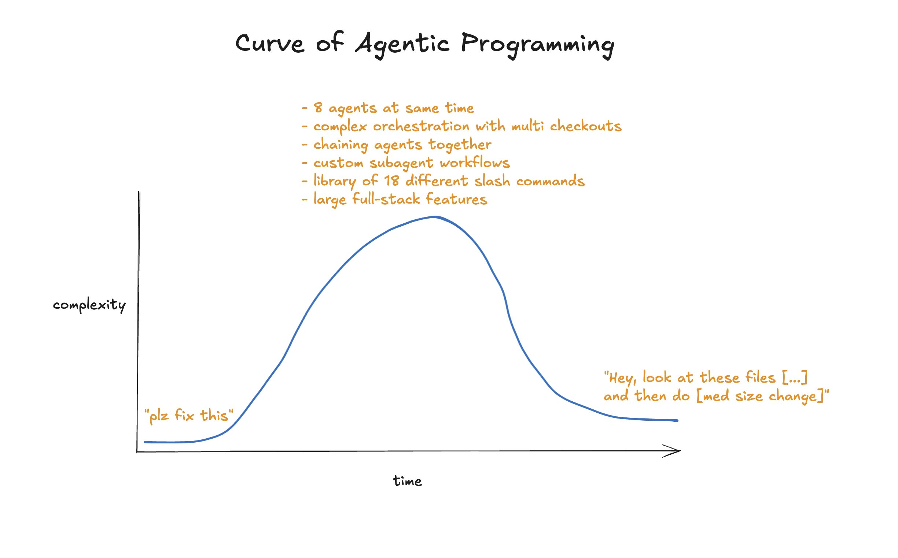

# Just Talk To It - the no-bs Way of Agentic Engineering

**Author:** Peter Steinberger
**Date:** October 14, 2025
**Source:** https://steipete.me/posts/just-talk-to-it

---

I've been quieter lately because I'm deeply focused on my latest project. Agentic engineering has advanced so significantly that it now generates practically all of my code. However, I notice many people attempting to solve problems through elaborate processes instead of actually accomplishing things.

This article was partly inspired by conversations at a recent Claude Code event in London and reflects an update to my development workflow since my last published update roughly a year ago.

## Context & Tech-Stack

I work independently on a substantial TypeScript React application totaling approximately 300,000 lines of code, alongside a Chrome extension, command-line tool, Tauri client application, and Expo mobile application. My website deploys through Vercel with new versions available for testing within two minutes via pull requests. Other applications lack automated deployment systems.

## Harness & General Approach

I've shifted entirely to the Codex CLI as my primary tool. I typically run between three and eight instances simultaneously in a 3x3 terminal grid, frequently in the same directory, with experimental work occasionally isolated in separate folders. I've tested worktrees and pull request workflows but consistently return to this configuration because it delivers results fastest.

My agents automatically make atomic git commits. I've iterated extensively on my agent configuration file to preserve a clean commit history—each agent commits only the files it modified. The models prove remarkably clever; no git hook will prevent determined agents from making changes if they're set on doing so.

Previously, I faced criticism for running parallel agents, though this approach is gradually gaining mainstream acceptance.

## Model Picker

I construct nearly everything using GPT-5-Codex at mid settings. This represents an excellent balance between capability and speed, automatically adjusting thinking depth appropriately. I've discovered that over-optimizing these settings yields minimal meaningful improvements, and avoiding endless deliberation about thinking modes feels preferable.

### Blast Radius

When contemplating changes, I consider "blast radius"—essentially how many files a modification will impact and approximately how long implementation requires. I might deploy multiple targeted changes or a few larger modifications. Multiple substantial changes simultaneously prevent isolated commits and complicate recovery if something breaks.

This intuition guides my agent monitoring. When something takes longer than anticipated, I interrupt with escape and request a status update, then either redirect the model, cancel, or continue. Don't hesitate stopping models mid-task; file changes remain atomic and models excel at resuming interrupted work.

When uncertain about impact scope, I request "give me options before making changes" to evaluate different approaches.

### Why not worktrees?

I operate a single development server. As my project evolves, I click through it testing multiple simultaneous changes. Individual trees or branches per modification would slow this considerably, while launching multiple dev servers creates friction. Additionally, Twitter OAuth registration constraints limit my available domains for callbacks.

### What about Claude Code?

I previously enjoyed Claude Code, but increasingly find it frustrating. Its language, the absolute certainties, the "100% production ready" messages while tests fail—I simply cannot continue. Codex operates more like a focused engineer methodically achieving results. It reads substantially more files before starting work, so even minimal prompts typically accomplish exactly what's needed.

### Other benefits of codex

The available context reaches approximately 230,000 tokens versus Claude's 156,000. While Sonnet offers 1 million tokens occasionally or through API pricing, Claude becomes unreliable long before depleting that capacity.

Codex uses tokens more efficiently. The context window fills substantially slower than with Claude Code. Previously, I constantly observed "Compacting…" messages using Claude; Codex rarely exhausts context.

Codex enables message queuing. Claude previously featured this, but Anthropic changed it so messages now "steer" the model. With Codex, I simply press escape and enter to send new messages. Having both options provides superior control. I frequently queue connected feature tasks and it reliably processes them sequentially.

OpenAI rewrote Codex in Rust, resulting in remarkable speed. Claude Code frequently exhibits multi-second delays and consumes gigabytes of memory. The terminal flickers especially when using Ghostty. Codex exhibits none of these issues—it feels incredibly lightweight and responsive.

The language differences "really make a difference to my mental health." Frequent frustration with Claude contrasts with rare irritation toward Codex. Extended use of both reveals this distinction clearly. Even if Codex were inferior technically, the psychological benefit alone justifies selection. Additionally, Codex doesn't scatter random markdown files throughout projects.

## What about $harness

The space between end users and model companies seems limited. Subscription services provide dramatically better value than API calls. Currently maintaining four OpenAI subscriptions and one Anthropic subscription costs approximately $1,000 monthly for essentially unlimited tokens. API usage would cost roughly ten times more (though exact mathematics involve imprecision).

Alternative tools like Amp or Factory seem unlikely to survive long-term given that both Claude Code and Codex improve constantly and converge toward identical functionality. Temporary advantages in specific areas don't substantially outcompete major AI companies. Amp repositioned GPT-5 as their "oracle," while I continuously work with Codex using the more capable model directly. While benchmarks exist, skewed usage patterns make them unreliable—Codex consistently delivers superior results to Amp.

Factory generates interest, though videos sometimes feel overwrought. Cursor dominates in tab-completion capabilities for traditional coding, with interesting experiments in browser automation and planning modes. However, persistent bugs from May remain unresolved, though apparently under active development.

Other tools like Auggie barely registered on developer timelines before disappearing entirely. Most ultimately wrap either GPT-5 or Sonnet and prove replaceable. RAG might benefit Sonnet, but GPT-5 searches so effectively that separate vector indices become unnecessary.

OpenCode and Crush show promise, particularly combined with open models. OpenAI and Anthropic subscriptions work with both through clever workarounds, but legality remains questionable and advantages questionable.

China's open models progress impressively quickly. GLM 4.6 and Kimi K2.1 approach Sonnet 3.7 quality but currently lack suitability as daily drivers.

## Plan Mode & Approach

Benchmarks miss crucial elements. Agentic engineering shifted from "crap" to "good" around May following Sonnet 4.0's release and reached another leap to "amazing" with GPT-5-Codex release.

Codex approaches prompts far more carefully and reads substantially more files before deciding strategy. It pushes back harder when you make silly requests. Claude and other agents prove more eager and attempt something immediately. Plan mode and rigorous documentation can mitigate this, though that feels like working around fundamental system weaknesses.

I rarely use extensive plan files with Codex now. Codex lacks dedicated plan mode yet proves dramatically superior at following prompts—"just talk to it" works. You gain complete control without charade overhead.

### Claude Code now has Plugins

This disappointed me significantly in Anthropic's priorities. Plugins patch model inefficiencies rather than improving underlying capability. Maintaining quality documentation for specific tasks remains sensible—I preserve a markdown docs folder containing useful references.

### Subagents

Subagents represent rebranded subtasks from May, originally intended for spinning tasks into separate contexts when the full codebase proves unnecessary—mainly for parallelization or reducing context waste from noisy build scripts. The use case remains unchanged. What others accomplish with subagents, I typically handle through separate terminal windows. Researching in one pane and pasting into another provides complete visibility and control unlike subagents, which obscure context engineering.

The recommended Anthropic subagent example on their blog demonstrates this problem. The "AI Engineer" agent contains an amalgamation of slop, mentioning GPT-4o and o1 for integration, and overall just seems like an autogenerated soup of words. No substantive content improves agent capability. Telling your model "You are an AI engineer specializing in production-grade LLM applications" changes nothing. Documentation, examples, and do/don'ts help. You'd likely achieve better results asking your agent to research AI agent best practices and load websites than using provided slop, which potentially constitutes context poison.

## How I write prompts

Using Claude previously required exhaustive prompts since "this model gets me" when supplied maximum context. While broadly applicable, prompts shortened significantly with Codex adoption. Often just one or two sentences plus an image suffice. Codex reads codebases remarkably well and "just gets me." I sometimes revert to typing since Codex needs minimal context to understand requests.

Adding images provides tremendous context. The model excels finding exactly what you show, matching strings and directly locating mentioned locations. Approximately fifty percent of my prompts contain screenshots. Rarely annotated, which actually works better but requires more time. Screenshots take roughly two seconds to drag into the terminal.

Wispr Flow with semantic correction remains superior.

## Web-Based Agents

Recent experimentation with web agents (Devin, Cursor, Codex) proved worthwhile. Google's Jules appeared promising but involved frustrating setup, and Gemini 2.5 doesn't perform well—though this might change with Gemini 3 Pro. Only Codex web gained traction. Despite annoying setup and current terminal loading issues, an older environment version works, accepting slower ramp-up times.

Codex web serves as my short-term issue tracker. Mobile ideas become one-liners via iOS app for later Mac review. More extensive phone work remains possible but deliberately avoided—work already proves addictive without constant mobile accessibility when away from computers or with friends. Someone who spent almost two months building a tool to make it easier to code on your phone acknowledges this personally.

Codex web didn't previously count toward usage limits, though those days end soon.

## The Agentic Journey

Numerous tools (Conductor, Terragon, Sculptor, and countless others) exist—some hobby projects, others drowning in venture capital. None proved sticky. They appear to work around current inefficiencies and promote suboptimal workflows. Most hide terminals, preventing visibility into complete model outputs.

Most constitute thin wrappers around Anthropic's SDK plus worktree management, lacking meaningful defensibility. Questionable value exists in facilitating phone-based coding agent access. Codex web addresses necessary use cases comprehensively.

Almost every engineer experiences a tool-building phase, partly recreational but ultimately creating tools simplifying further tool creation. Pattern recognition shows clear inefficiency targeting.

## But Claude Code has Background Tasks!

True. Codex presently lacks certain Claude conveniences. Most painful is background task management. While timeouts theoretically apply, occasions arose where tasks hung indefinitely (spinning dev servers, deadlocked tests).

This drove temporary Claude returns, but that model's other issues proved disqualifying. Currently using `tmux` instead—an established terminal tool for persistent background CLI sessions with abundant existing documentation, requiring only "run via tmux" instructions. No custom agent markdown charade needed.

## What about MCPs

Most MCPs function as marketing checkboxes. Nearly all should simply be command-line tools. As someone who wrote five MCPs myself, I know this well.

Simply referring to CLIs by name works. Initial incorrect attempts trigger help menus providing complete usage information. Afterward, operations succeed. No tooling payment exists. MCPs constantly consume tokens. GitHub's MCP consumed almost 50,000 tokens initially, later improved to 23,000. The equivalent `gh` CLI feature set exists, models already understand its usage, and costs zero tokens.

Some CLI tools remain open-sourced: `bslog` and `inngest`, for example.

`chrome-devtools-mcp` replaced Playwright for web debugging closure recently. While not daily necessity, it proves valuable when needed.

## But the code is slop!

Approximately twenty percent of my time involves refactoring—all agent-performed, avoiding manual effort. Refactoring days suit periods needing less focus, when tired, enabling significant progress without intensive concentration requirements.

Typical refactoring includes:

- Code duplication detection via `jscpd`
- Dead code removal through `knip`
- `eslint`'s `react-compiler` and deprecation plugins
- API route consolidation
- Documentation maintenance
- Oversized file decomposition
- Testing expansion
- Complex section commenting
- Dependency updates
- Tool upgrades
- File restructuring
- Slow test identification and rewriting
- Contemporary React pattern adoption
- `useEffect` elimination where unnecessary

Continuous per-commit execution proves possible, though cycling between rapid feature development and dedicated maintenance phases—essentially technical debt repayment—enhances productivity and enjoyment dramatically.

## Do you do spec-driven development?

I previously used spec-driven development in June, designing comprehensive specifications before letting models build features for extended periods. However, this approach has evolved. The current methodology involves discussion-based development where I converse with Codex, share websites and ideas, and collaboratively develop features. For complex tasks, I write specifications, submit them to GPT-5-Pro via ChatGPT for review suggestions, then reintegrate useful feedback into the main context.

I've developed intuition about context requirements for different tasks. Since GPT-5 handles larger contexts effectively, creating new contexts for planning adds approximately 10 minutes of overhead that wasn't justified under previous models.

UI-based work follows a different pattern. I intentionally under-specify initial requests, observing real-time browser updates as the model builds. Additional changes queue up during iteration, allowing the feature to morph through experimentation. Related interactions often inspire tangential improvements developed in parallel agents.

## Show me your slash commands!

I maintain minimal slash command usage:

- `/commit` — provides guidance about multiple agents working in the same folder, ensuring clean comments and preventing unwanted reversions
- `/automerge` — processes one pull request at a time, responds to bot comments, achieves CI green status, and squashes commits
- `/massageprs` — performs automerge functions without squashing, enabling parallelized processing
- `/review` — uses built-in functionality, rarely needed due to GitHub review bots

Most work proceeds without explicit commands. I develop intuition about when guidance proves necessary versus when confidence in agent understanding suffices. Few additional commands offer genuine utility.

## What other tricks do you have?

Several practical techniques enhance productivity. For long-running tasks, queuing continuation messages allows me to step away while work completes. Codex ignores superfluous messages once tasks finish.

Writing tests immediately after completing features or fixes within the same context yields superior test quality and frequently uncovers implementation bugs. UI tweaks may not warrant tests, but comprehensive coverage improves outcomes.

Preserving intent through code comments addressing tricky sections benefits both human readers and future model interactions.

When facing difficult problems, trigger words—"take your time," "comprehensive," "read all code that could be related," "create possible hypothesis"—help Codex solve challenging issues.

## How does your Agents/Claude file look like?

I maintain an 800-line Agents.md file with a symlink to claude.md, acknowledging this non-standardization creates suboptimal conditions. GPT-5 and Claude prefer different prompting approaches, making shared files problematic.

Claude responds well to emphatic formatting and threatening language. GPT-5 reacts negatively to similar tactics, requiring natural human-like communication instead.

The Agents file contains organizational documentation accumulated through iterative refinement by Codex. It includes product explanations, naming conventions, preferred API patterns, React Compiler guidance, and notes about bleeding-edge technology choices. Outdated technology guidance periodically gets pruned as models incorporate newer information.

Significant sections address preferred React patterns, database migration management, testing practices, and AST-grep rule usage. I recently experimented with text-based design system documentation with results still pending evaluation.

## So GPT-5-Codex is perfect?

No. Codex occasionally enters extended refactoring cycles, then panics and reverts everything, requiring encouragement to continue. Sometimes it forgets bash command availability, requiring prompting. Rare instances include responses in unexpected languages or raw thinking output appearing in bash execution.

These flaws remain manageable given Codex's exceptional performance across almost everything else.

The primary frustration involves text disappearing during rapid scrolling—a significant enough issue to occasionally require slowing message pace. I hope this ranks high on OpenAI's bug priority list.

## Conclusion

Don't waste your time on stuff like RAG, subagents, Agents 2.0 or other things that are mostly just charade. Just talk to it. Play with it. Develop intuition.

Extended agent interaction builds competence analogous to managing human engineers—requiring characteristics typical of senior software engineers.

Despite not writing code directly, thoughtful work persists around architecture, system design, dependencies, features, and user delight. Writing good software remains hard despite not coding personally. Using AI simply means that expectations what to ship went up.

## PS

The article itself was written entirely by hand—100% organic and hand-written. I value AI while recognizing certain tasks remain better executed traditionally. Intentional preservation of typos maintains voice authenticity.

## PPS

Header graphic credits to Thorsten Ball.
