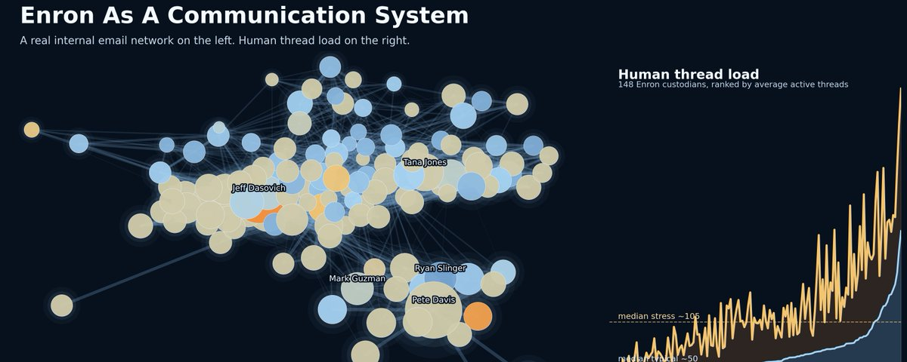
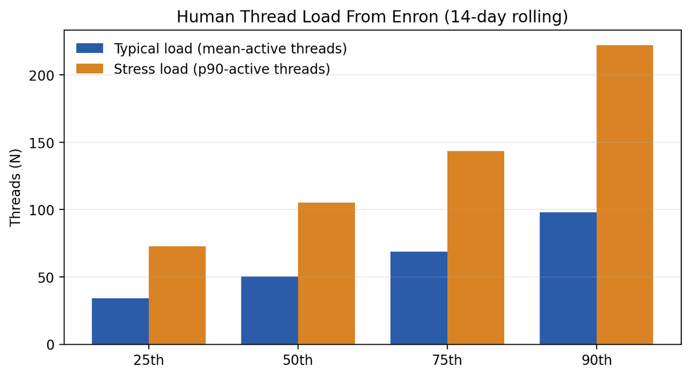
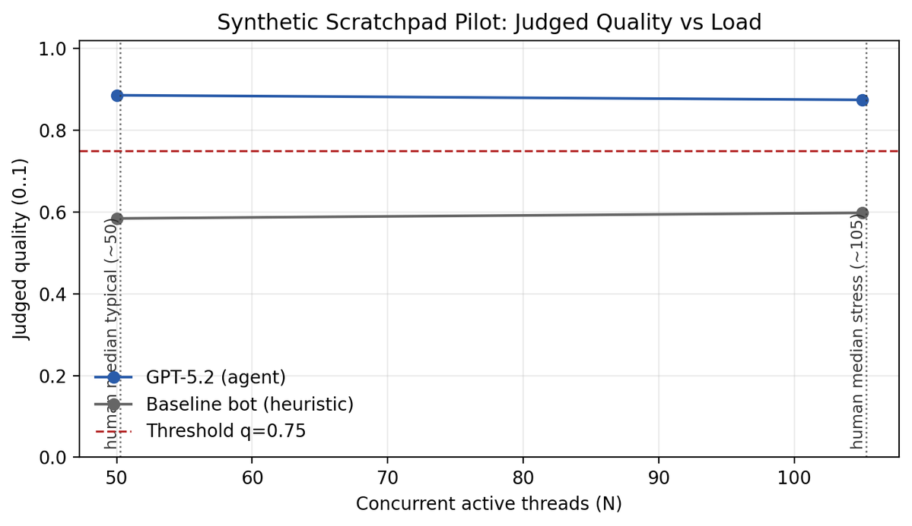
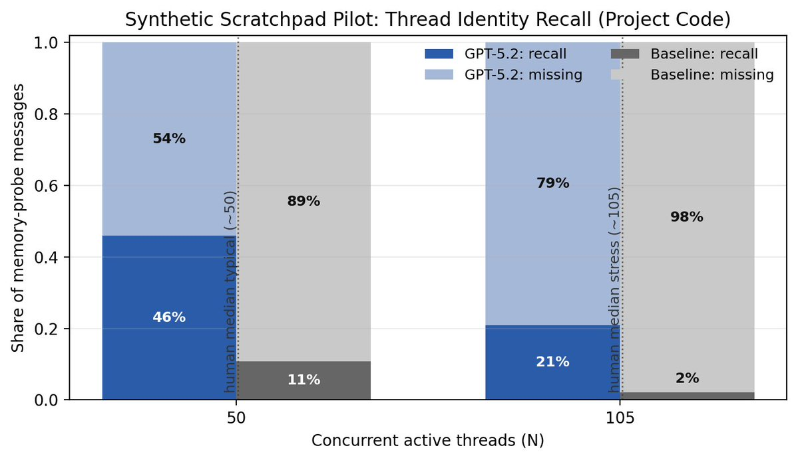
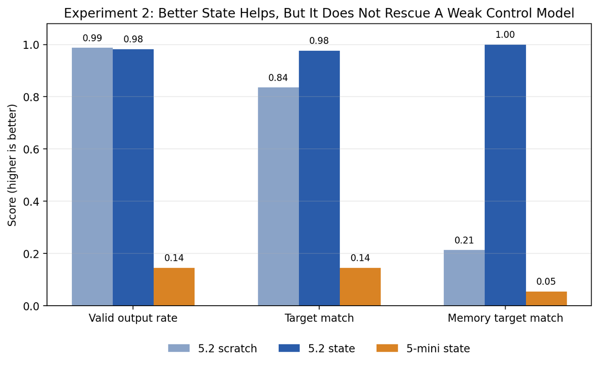
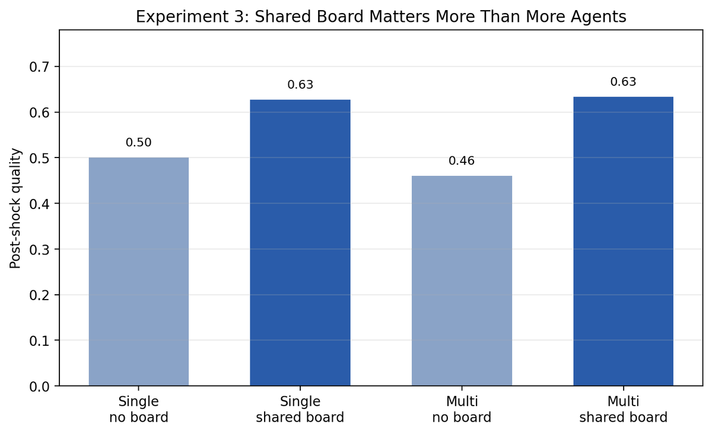
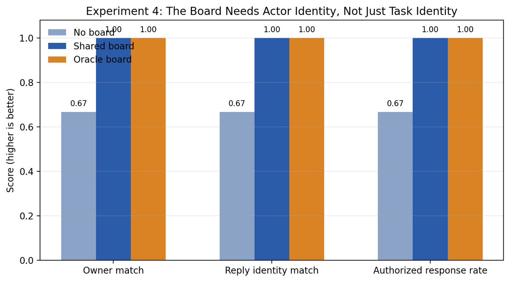

# LLM Enron: experiments on structure vs scale

**Author:** rohit (@krishnanrohit)
**Date:** March 12, 2026
**Source:** https://x.com/krishnanrohit/status/2032181522296684679
**Article:** https://x.com/i/article/2032149068580077571
**Stats:** 8 replies, 21 retweets, 167 likes, 274 bookmarks, 90,279 views

---

So I was wondering after a few conversations with @danielrock and others, how well can today's AI agents work inside a real organisation? Since real companies don't let you poke around with their emails, I found another option. Enron.

A wonderful side effect of the litigation against Enron was that we have a real treasure trove of data about its regular operations both pre and post scandals. Specifically the giant email dataset. So I actually downloaded it and cleaned it up and analysed it. First, to try and figure out what is a realistic inbox load for the people in that company, and then considering this to create realistic synthetic organisational email data and actually ask an LLM how they would actually function in this kind of an environment. Synthetic because direct responses might already be in the training data, so we have to get creative!

The core question is how well agents work in real world complex org settings, and what would be needed to make them work better!

TL;DR: Structure beats scale: giving AI agents explicit thread and role identity matters more than adding more agents or using bigger models.

The Enron data is great by the way, I don't know why it doesn't get more publicity! It shows for instance that human-realisitc inbox has like 50-100 concurrent threads, many of them with very limited context, and many of them requiring pretty good insight into the org to respond to. The volume predicts juggling strongly, and somewhat surprisingly seniority does not (once you control for volume).

To find out the answer to my broad question, I ended up running 4 experiments, sequentially.

## I. What's the right setup to make an LLM able to handle 50 or 100 concurrent email threads? Can it?

I made an email stream with the same number of interleaved threads as the realistic data. The agent can process the message sequentially, and with scratchpad memory to keep track if it needs.

The judgement on whether it got things right is judged with an LLM-as-a-judge and some objective metrics (memory recall, flags on hallucination etc).

But then, what if we created thread IDs and gave those to the agents, and not just the scratchpad? Et voila!

## II. Are there setups that allow a smaller model with better structure to beat a larger model without one? i.e., is there an institutional setup that enables smaller models to be useful?

Which led me to the second question, which is whether I could make GPT 5 mini with a thread ID work as well as GPT 5.2 with just a scratchpad.

This was a failure. Model intelligence *really* matters. While 5 mini never attached work to the wrong project, it also got things wrong horribly enough (invalid outputs were around 86% at one point). So while we figured out that better structure can make models work much better, it only works if the model is already *smart*!

Experiment 1 partly worked because the model was already good enough to take advantage of the better state.

## III. What happens when you have more agents, more parallel workers? How well can they work together?

Now for scaling. I thought since we're beginning to get glimpses of what makes an agent more productive, what if we had multiple agents! Would we be able to process the workload in parallel? Each with its own local memory of course. The equivalent of teams coming together to answer harder questions.

The options obviously multiply here. You can have  a) no boards, b) a single shared board, c) multiple with no board, and d) multiple with shared board. The backup numbers were: post-shock quality about 0.50 for single/no-board, 0.63 for single/shared-board, 0.46 for multi/no-board, and 0.63 for multi/shared-board.

Basically, don't build a swarm before you build a *board*. You need shared coordination state to get anything done. This in itself is interesting.

## IV. What specific institutional setups are necessary to make this happen?

Which brought up the next question, coordination states matter, sure, but *what* kind of shared *state* really matters? There can be many options here obviously. So I ran this on actor identity and who should own this internally and reply externally.

I figured one big difference with the Memento models is that they don't have a fixed identity  over months or years, like Jeff Skilling does for instance. Which means, providing such an anchor might be useful? Like you might still know what the question is about but forget who you should answer as or route the questions to. i.e., "task identification"  and "actor identity" are different!

However, once I made 'route_to' and 'respond_as' explicit canonical fields instead of free-form text, the no-board setup still drifted on who should handle or sign things, while the shared-board and oracle-board setups stayed consistent. Importantly, task targeting was already fine in all conditions, so this wasn't just a rerun of the the memory result.

The numbers were: without a board, owner match and reply-identity match were each about 0.67 and unauthorised response rate was about 0.33; with shared actor state, those went to 1.

Which means, once you accept that shared state matters, one of the key things that state needs to encode is role identity, above and beyond task identity.

An agent needs memory of its task but also memory of its role.

---

This is another set that tells us about what kinds of experiments can tell us about how best to use or run AI.

Across all experiments, the same pattern shows up:

- The model is less limited by raw message understanding than by missing state structure
- Explicit thread state is a real win
- Shared coordination state matters more than simply adding more agents
- Actor identity should be explicit state too
- Better architecture helps a lot but it doesn't replace baseline model reliability

It used to be that LLMs couldn't keep track of long series of complex threads, but clearly by 5.2 that's no longer the case. The problem is that we keep asking AI to reconstruct task and role identity, and coordination states, from conversational memory each time it needs to respond. That's what we'd need to build agent institutional systems around if we want things to work!

AI agents are weird because as I said above they are effectively like Guy Pierce from Memento. They have their context and their inborn faculties and everything else has to be figured out as they go along. Which means the way we manage these new *Homo Agenticus* itself has to change, we need to build some institutional setups that will allow these new beings to work. And I think as we're moving towards adding swarms and multi-agent hierarchies figuring out what these ought to be is probably the most fun you can have.
