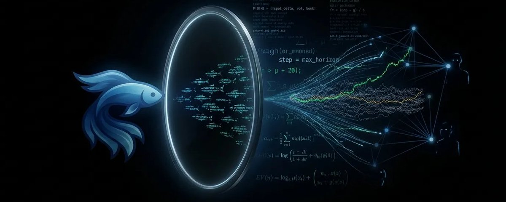

# MiroFish: The God View Engine

**Author:** BuBBliK (@k1rallik)
**Date:** March 14, 2026
**Source:** https://x.com/k1rallik/status/2032837113247395992
**Stats:** 18 replies, 69 retweets, 698 likes

---

The tweet by @k1rallik contains a link to an X article titled **"MiroFish: The God View Engine"**, describing an AI engine that generates thousands of digital humans -- each with their own personality, memory, and behavior -- drops them into a virtual world, and watches them predict the future.

---

## What Is MiroFish?

MiroFish is an open-source AI prediction engine that takes real-world data (news, reports, policy documents, even novels), spawns thousands of AI agents with unique personalities and memories, lets them interact in a simulated world, and produces a prediction report based on what emerges.

Unlike traditional predictive models that crunch historical numbers, MiroFish creates a simulated digital space filled with thousands of independent AI agents that interact with one another in parallel, creating a complex web of interactions that mimic collective social behavior.

A developer in China built this AI engine, dropped thousands of digital humans into a virtual world, and watched them predict real-world outcomes.

## The Developer

MiroFish was built by Guo Hangjiang (BaiFu), a post-2000 Chinese undergraduate student who created the entire system in approximately ten days using what he describes as "vibe coding" with Claude Code. His predecessor project, BettaFish (an AI public opinion analysis tool built in summer 2025), similarly ranked #1 on GitHub Trending in late 2024.

MiroFish topped GitHub's Global Trending list on March 7, 2026, outperforming initiatives from OpenAI, Google, and Microsoft. It accumulated 25,000+ stars and nearly 2,900 forks.

## Investment

Within 24 hours of reviewing the demo video, Chen Tianqiao -- founder of Shanda Group -- committed 30 million yuan to support the product's development. The investor emphasized that while BettaFish's technical execution wasn't exceptional, the developer's systematic problem-solving approach and capacity to identify and address genuine challenges through innovative AI methods proved genuinely valuable.

## The Five-Step Pipeline

### Step 1: Knowledge Graph Construction

The system accepts "seed material" -- news articles, reports, policy documents, financial signals, even novels -- and uses GraphRAG technology to extract entities and relationships, building a structured knowledge foundation for simulations. Rather than isolated text blocks, information is organized into connected entities that map relationships between people, institutions, and events.

### Step 2: Agent Creation & Environment Setup

Agents receive unique personalities, stances, long-term memory via Zep Cloud, and behavioral logic. Each AI agent possesses its own behavioral profile, memory, and decision-making logic. An Environment Configuration Agent establishes simulation rules.

### Step 3: Dual-Platform Parallel Simulation

The OASIS engine (from CAMEL-AI, an open-source framework published in peer-reviewed research) runs simultaneous simulations on Twitter-like and Reddit-like platforms, supporting up to one million agents with 23 different social actions. Agents post, comment, debate, and influence each other while the system tracks the prediction question.

As simulations progress, agents communicate, react to information, and influence each other's decisions, producing patterns that mimic collective social behavior.

### Step 4: Report Generation

A ReportAgent synthesizes simulation results, analyzing opinion shifts, coalition formation, and emergent patterns to produce structured prediction reports.

### Step 5: Interactive Analysis

Users can chat with individual agents, query the ReportAgent, and inject new variables for scenario testing. The platform generates interactive analytical reports enabling scenario exploration.

## Technology Stack

- **Backend:** Python 3.11+ (57.8% of codebase)
- **Frontend:** Vue.js (41.1% of codebase), Node.js 18+
- **Simulation Engine:** OASIS (CAMEL-AI)
- **Knowledge Graphs:** GraphRAG
- **Agent Memory:** Zep Cloud for long-term memory across simulation rounds
- **LLM Support:** OpenAI SDK-compatible models; Qwen-plus recommended
- **Package Manager:** uv (Python)
- **Deployment:** Supports local execution or Docker containerization

## Demonstrated Use Cases

- **Public opinion simulation** -- tracking sentiment evolution across social media
- **Financial forecasting** -- showing trader and investor reactions to market events
- **Policy impact testing** -- revealing stakeholder responses to proposed policies
- **Crisis simulation** -- modeling responses to emergency scenarios
- **Creative exploration** -- predicting lost novel endings based on character behavior
- **Marketing experimentation** -- testing campaign impacts before launch
- **Research support** -- generating scenario-based analytical reports

## Important Limitations

- The team hasn't published validation benchmarks comparing predictions to actual outcomes
- Simulations represent plausible scenarios rather than probability estimates -- the tool should serve "scenario exploration rather than precise forecasting"
- LLM API costs accumulate significantly; the README recommends fewer than 40 simulation rounds
- Research indicates LLM agents exhibit greater herd behavior susceptibility than humans, potentially over-polarizing simulated crowds
- Version 0.1.0 (December 2025) remains early-stage

## Repository

GitHub: [github.com/666ghj/MiroFish](https://github.com/666ghj/MiroFish) -- 25,000+ stars, 2,900+ forks, 132 watchers
