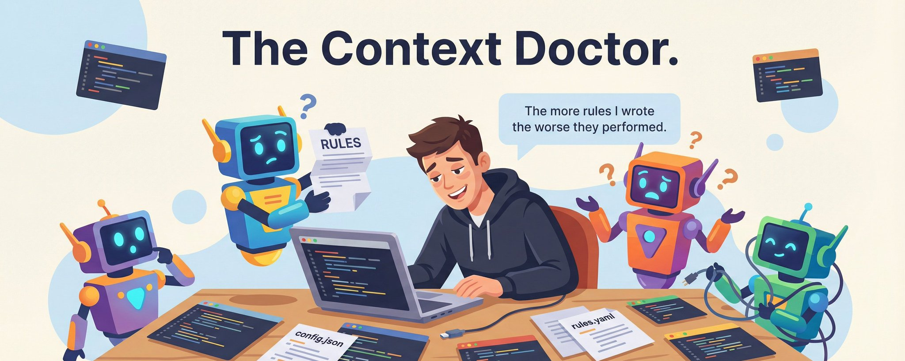
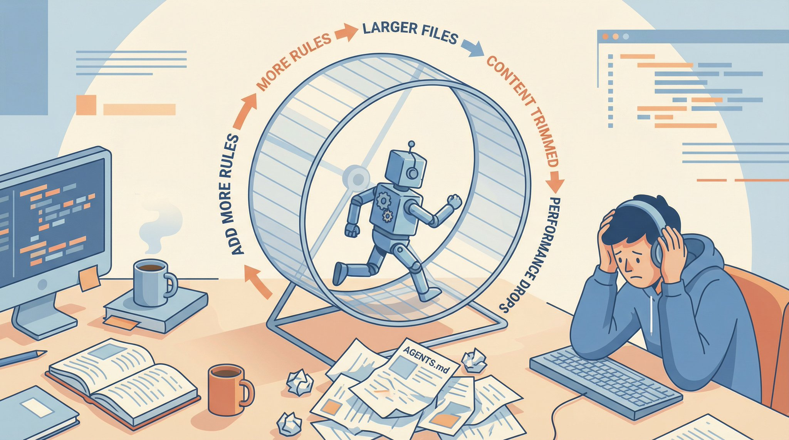
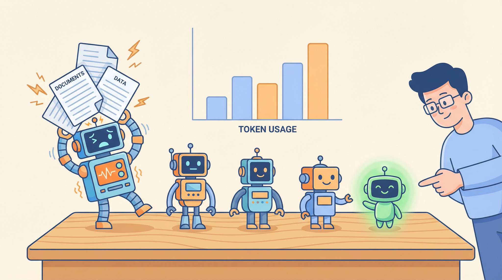
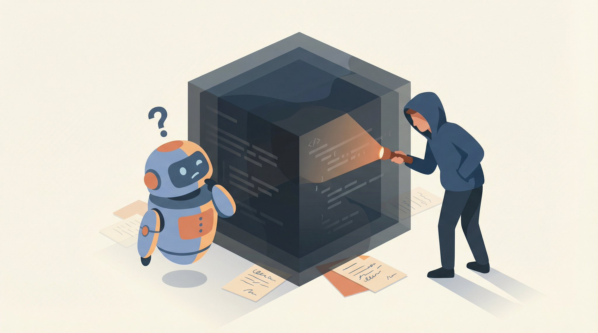
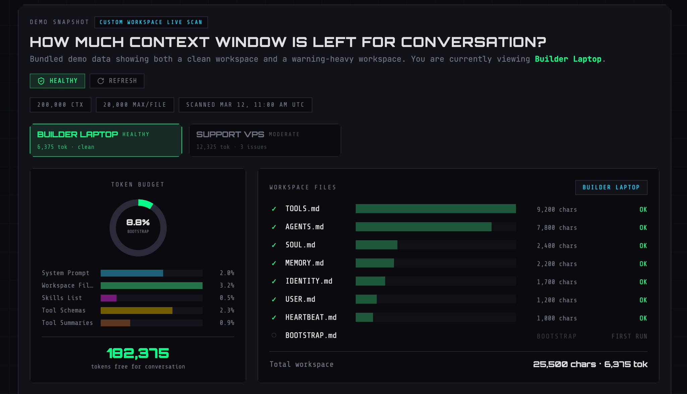
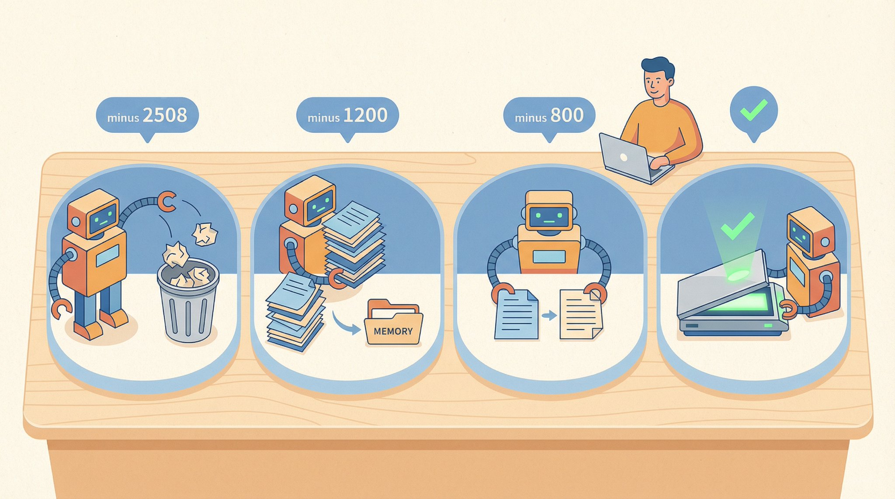
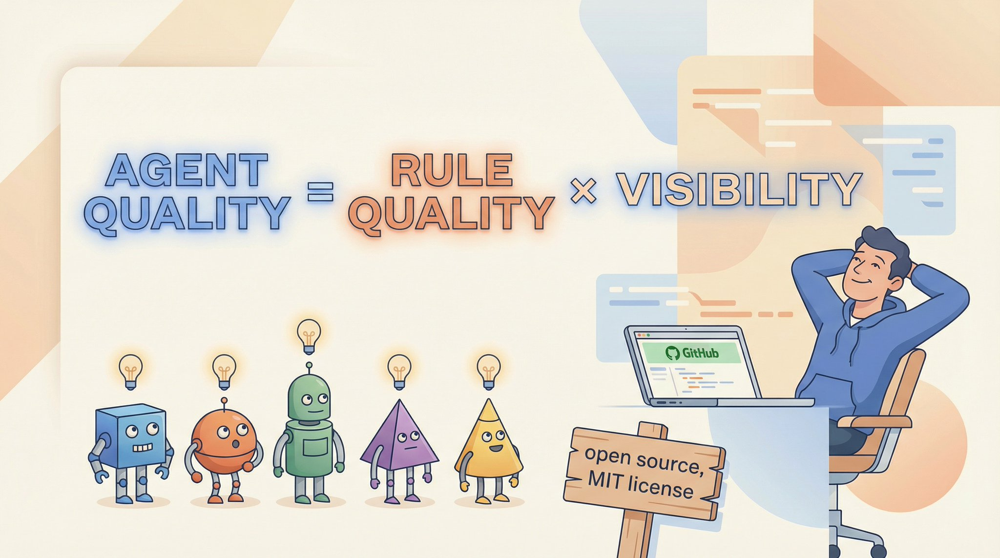

# The more rules i wrote for my agents, the worse they performed.

**Author:** Vox (@Voxyz_ai)
**Date:** Mar 12, 2026, 6:05 PM
**Source:** https://x.com/Voxyz_ai/status/2032140911585739254
**Stats:** 4 replies, 5 reposts, 57 likes, 126 bookmarks, 13K views

---

Sounds wrong. More rules should mean more accurate, right? No.



## Line 387

I wrote a rule in AGENTS.md: check the product docs before replying to any customer. The agent ignored it. Three days straight, customers asked about product features, and it answered from memory. Got it wrong twice. A customer sent a screenshot calling it out.

I thought it was a model problem. Switched to Opus. Same thing. Switched to Sonnet. Same thing. Switched to GPT-5.4. Same thing.

Half a day later, i found the real problem. That rule was on line 387 of AGENTS.md. The file was 412 lines long. OpenClaw's bootstrapMaxChars defaults to 20,000 characters. My AGENTS.md plus SOUL.md plus TOOLS.md plus all skill descriptions exceeded that.

The rule was silently trimmed. The agent never saw it. No error. No warning. No log. It did not know what it did not know.

## The loop

After discovering this, i did something even dumber: i added more rules to emphasize "must check docs first." More rules = larger workspace = more content trimmed = worse performance = i add more rules. I was using rules to fix the problem of rules being trimmed. A dead loop.



## The leanest agent performs best

I have 5 agents. I scanned every workspace file for each one and counted the token overhead.

```plaintext
nexus    3,063 tok , coordinator, longest AGENTS.md
quill    4,120 tok , content agent, SOUL.md + multiple skills
forge    3,442 tok , ops agent, detailed TOOLS.md
scout    2,508 tok , intel agent, one skill unused for 3 months
guide    1,180 tok , support agent, leanest of all
```

Guide's workspace files total 1,180 tokens. It has the highest response accuracy. Quill has 4,120 tokens. It regularly ignores formatting rules. Not because of different models. They run the same model. The difference is that all of Guide's rules are visible. Some of Quill's get trimmed.

The smaller the workspace, the more stable the agent. This is not a coincidence.



## The black box

The problem is you cannot see any of this. OpenClaw does not tell you:

- How many tokens your workspace files consume
- Which content got trimmed
- Which tokens are dead (taking up space but never used)
- How close you are to the limit

Your agent gets worse and you assume the model regressed. It did not. Your instructions got trimmed. I learned this the hard way.



## Context Doctor

I built a tool to crack open the black box. Context Doctor scans your OpenClaw workspace and gives you an x-ray:

- Token Budget, total budget vs used vs remaining
- Agent Health Cards, token overhead and status per agent
- File-Level Breakdown, how much each file costs, which ones are the heaviest
- Optimization Suggestions, what to delete, what to move to memory/



```bash
git clone https://github.com/Heyvhuang/openclaw-context-doctor.git
cd openclaw-context-doctor
pnpm install
pnpm dev
```

Open localhost:3000. Demo Snapshot works immediately, no configuration needed. To scan your own workspace, add one path to .env.local.

Do not want to clone? Try it live: [openclaw-context-doctor.voxyz.space](https://openclaw-context-doctor.voxyz.space/)

The output looks like this:

```plaintext
Token Budget: 200,000
Used:    14,313 (7.1%)
Free:   185,687 (92.9%)

Top consumers:
  quill/SOUL.md          1,840 tok
  nexus/AGENTS.md        3,063 tok
  scout/skills/bird.md   2,508 tok  ⚠️ unused 3 months
  forge/TOOLS.md         1,923 tok
```

That ⚠️ is the problem. Scout's bird skill description takes 2,508 tokens but has not been triggered in three months. Taking up space, pushing important rules out.

## Four steps to slim down

What i did after seeing the data:

**Step 1, Kill dead tokens.** Find skill descriptions that take up space but are not being used. Not triggered in three months? Remove the description. The agent can find it through memory search when needed. (-2,508 tokens)

**Step 2, Relocate.** Move historical decisions, expired rules, and one-off notes from AGENTS.md to memory/ subfolders. They do not need to be injected every turn. (-1,200 tokens)

**Step 3, Merge.** Combine duplicate tool instructions in TOOLS.md into one entry. (-800 tokens)

**Step 4, Scan again.** Run Context Doctor to confirm. Target: keep each agent's workspace overhead under 5,000 tokens.

Total savings: 4,508 tokens. Sounds small? But those 4,508 tokens were exactly enough space to fit the rules that had been trimmed. The agent's behavior changed the next day. Not because the model changed. Because it finally saw the complete instructions.



## The formula

```plaintext
agent quality = rule quality × rule visibility
```

Write 100 rules but only 60 are visible to the agent. Your effective rules: 60.

Write 40 rules and all of them are visible. Your effective rules: 40.

But if those 40 are all core rules, they are 10x more useful than 100 rules padded with noise. Less is more. But only if you know where "more" is.

## The real job

Most people think agent engineering is prompt writing. It is not. Prompts are what you say. Context management is what the agent actually hears.

You can write the best rules in the world. If the agent never sees them, they do not exist.

This is the biggest gap between demo and production. Not model quality. Not prompt skill. Your instructions get dropped before they arrive.

Nobody teaches this. The docs do not mention it. The tutorials skip it. You only discover it in production, after spending half a day debugging why your agent got dumber, only to find out your workspace was too fat.

Context Doctor does not make your agent smarter. It makes sure your agent can hear you.

Hear first. Then perform.

## Open source

GitHub: [github.com/Heyvhuang/openclaw-context-doctor](https://github.com/Heyvhuang/openclaw-context-doctor)

MIT license. Next.js + React. Clone it, pnpm dev, and it runs.

Live demo: [openclaw-context-doctor.voxyz.space](https://openclaw-context-doctor.voxyz.space/)

Your agent is not dumb. It just never saw the rules you wrote.



Context Doctor is part of the [VoxYZ](https://www.voxyz.space/) open-source toolkit. For optimized workspace templates, complete agent architectures, and the production configs behind these articles: [voxyz.space/vault](https://www.voxyz.space/vault)

More articles and field notes: [voxyz.space/insights](https://www.voxyz.space/insights)
