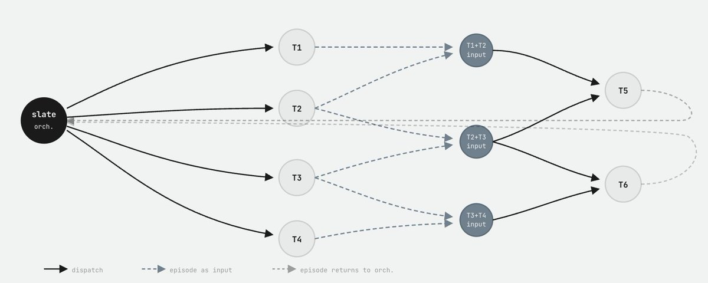

# We built RLM for coding. And it F*cking rocks. Swarm native agents are here to stay.

**Author:** akira (@realmcore_) / Random Labs (@0xrandomlabs)
**Date:** March 12, 2026
**Source:** https://x.com/realmcore_/status/2032146316730778004
**Stats:** 20 replies, 54 retweets, 647 likes

---

The tweet by akira links to an X article announcing the release of Slate, with the text:

> We built RLM for coding. And it F*cking rocks. Swarm native agents are here to stay.

The linked article (x.com/i/article/2031806324041007105) announces:

> Today we are releasing slate. Slate is the *first* frontier agent in the wild to directly use a code environment for swarm orchestration.

## What is Slate?

Slate is the first frontier agent in the wild that is built for swarm orchestration. Slate can programmatically orchestrate and solve tasks, running a massive amount of what they call **threads** (subagents).

### Key Capabilities

- Slate can work *with* you for many hours in the same session.
- Slate automatically selects the right model for the job. For example, with Slate you can plan/talk to Claude and search with GLM and execute with Codex -- Slate handles it.
- Have Slate in parallel deeply research your problem.
- Parallelize working and orchestration of many tasks at once.

## Thread Weaving: The Core Architecture

Slate moves beyond the rigid task trees and lossy compaction methods that have defined the first generation of AI coding assistants through a novel architectural primitive called **Thread Weaving**.

Slate solves the "knowledge overhang" problem -- the latent intelligence a model possesses but cannot effectively access when it is tactically overwhelmed -- by using a central orchestration thread that essentially "programs in action space", dispatching parallel worker threads to handle specific, bounded tasks via a TypeScript-based DSL.

Because it orchestrates the swarm using a TypeScript DSL, Slate is able to actually think and "program in action space". The general idea of a thread is that rather than isolating subagent context, developers genuinely want to share it with the main orchestration thread.

### How Thread Weaving Handles Memory

When a worker thread completes a task, it returns a compressed summary of the successful tool calls and conclusions rather than a sprawling transcript of every failed attempt. Because these episodes share context directly with the orchestrator rather than relying on brittle message passing, the system maintains a "swarm" intelligence.

This is not a system that uses message passing between subagents -- it functions more as a **hive mind** that can synchronize parallel threads.

## RLM: Recursive Language Models for Coding

At the heart of Slate's effectiveness is a deep engagement with Recursive Language Models (RLM). RLM functions on two principles:

1. **Reference semantics of a REPL** allow the agent to decompose work into operations that store values in references.
2. **The agent can orchestrate operations at a higher level through the Python REPL**, allowing it to think about the execution graph rather than just performing operations.

## Multi-Model Orchestration

A developer can have Claude Sonnet orchestrating a complex refactor while GPT-5.4 executes code, and GLM 5 -- a favorite for its agentic search capabilities -- simultaneously researches library documentation in the background.

Slate is the only agent of its kind that functions like this.

## Performance: Terminal Bench 2.0

In internal testing, an early version of Slate's threading system managed to pass 2/3 of the tests on the **make-mips-interpreter** task within the Terminal Bench 2.0 suite. This is a task where even the newest frontier models, like Opus 4.6, often succeed less than 20% of the time when used in standard, non-orchestrated harnesses.

## About Random Labs

Random Labs was co-founded by Kiran and Mihir Chintawar in 2024 as a Y Combinator-backed startup. The company aims to bridge the global engineering shortage by positioning Slate as a collaborative tool for the "next 20 million engineers" rather than a replacement for human developers.

Rather than simply focusing on optimized benchmarks, Random Labs builds tooling that the company itself actively uses. The agent integrates directly into the IDE, where developers spend the majority of their time, allowing it to work with near-perfect context and make meaningful changes to large, complex codebases.

The company views AI as a tool that should "create jobs, not replace them" -- their technology is designed to empower developers, giving them the tools they need to create more software and solve more problems.

> "Slate is the best debugging tool I have."
> -- Stealth founder, Fintech, NYC.

## Additional Resources

- Random Labs website: https://randomlabs.ai/
- Slate documentation: https://docs.randomlabs.ai/en/getting-started/introduction
- Blog post -- "Slate: moving beyond ReAct and RLM": https://randomlabs.ai/blog/slate
- npm package: https://www.npmjs.com/package/@randomlabs/slatecli
- VentureBeat coverage: https://venturebeat.com/orchestration/y-combinator-backed-random-labs-launches-slate-v1-claiming-the-first-swarm
- Y Combinator profile: https://www.ycombinator.com/companies/random-labs
