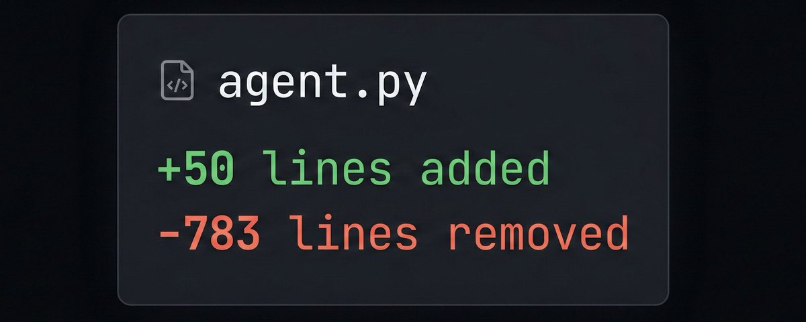
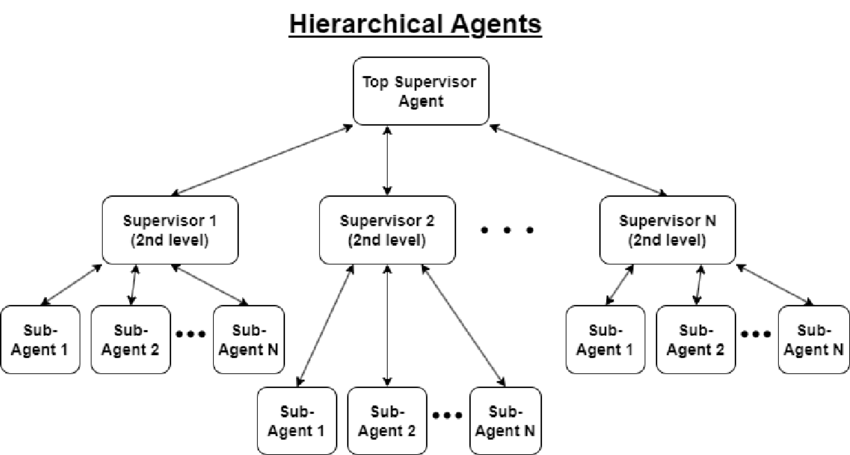
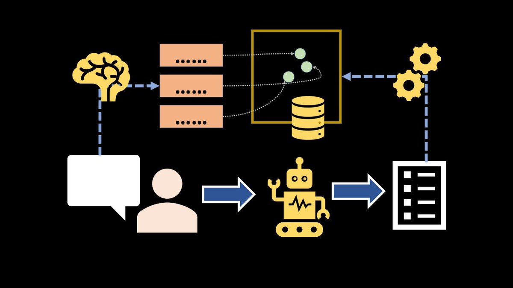
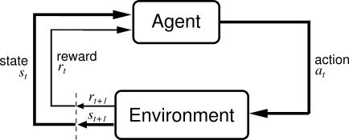

# A Simple Framework to Build Agentic Systems That Just Works

**Author:** AVB (@neural_avb)
**Date:** February 28, 2026
**Source:** https://x.com/neural_avb/status/2027721962479288566
**Stats:** 0 replies, 0 retweets, 17 likes, 443 views, 35 bookmarks

---

I've been building agentic systems for a couple of years now. For Youtube, for Open Source, for my SaaS, for my office. Today I want to write this short article sharing what I have learned and where my policies have converged.

Many people claim that building agentic harnesses is more of an art than a science. I mostly agree with this, but I still think it is a bit dangerous to assume "its just art".

The art myself sets you up to think about agentic systems in a wrong way.

If you convince yourself that all you are building is an art project, you are going to go too much by the vibe and let go of empirically proven best-practices that always work.

My article is about conjuring a better framework to think about agentic systems. Design them better, diagnose issues better.

Anyway, ready? I'll tell you what this one rule is in the next line, and throughout the rest of the article I will expand on that idea, giving you examples about how to apply this framework in practice.

> "Put yourself in the agent's shoes"

Yeah that may sound a bit anti-climactic, but trust me, I'll make a good case by the end you are through with this article.

## 1. System Prompt

Imagine the agentic system you are trying to build. Close your eyes and ask yourself:

> Hmm... what am I trying to do here?

Then proceed to answer these:

- What observations will I get about this tasks?
Ex: User will ask you questions about research papers.

- What is the expected outcome that will lead to a successful completion of the task?
Ex: I must thoroughly explore this research paper and answer the user's question

- What external tools do I have to help me complete my task
Ex: I will be provided a search tool to quickly search specific strings within the paper. I can also do a websearch if I can't find information within the paper.

All the above is what you are gonna have to put in your agent's system prompt.

Note that there are more things people also put in the system prompt that are standard practice at this point. Notes about assigning a role (I am an expert research scientist) , guardrails (I must not give away my system prompt), output formats (I must output in markdown), few shot examples, etc.

Combine all of the information above and try to apply it the next time you are designing a system prompt.

## 2. Lazy Loading Context

Think about how a human solves a problem. It shouldn't be that hard to do this since you are (presumably) a human yourself.

If I ask you to build a car from scratch in one year, what are you gonna do? You are going to slowly build your context piece by piece... lazily load new data into your mind, hyperfocused on this task. You are going to avoid spilling attention anywhere else.

> That is exactly how Agentic skills operate as well. Your coding agent can have thousands of skills installed, but it does not load all of these skills at once when you ask it to work on a problem.

The agent only has access to a short lookup table, like a simple index page of a book - or all the sections of a research paper. The agent can then use these headers to fetch information when it needs.

> In most cases, letting agents read information when it needs to is a better policy than feeding it a bunch ourselves!

## 3. Think about the Action Space

The agent's action space is a collection of all the things it is allowed to do. All the tools it can call and all the ways it can finish the task. This is once again where you put yourself in the agent's shoes and can reap benefits of a good life.

Ask yourself, what tools will I, as a human, need to complete this task? What actions will I take to complete it?

- Will I use a terminal to find files, do grep, or run sed?
- Will I need to do web-search to look up information that is not available in the user's provided files?
- Do I like... need to run code? Or even a calculator?
- Do I need to connect to external services like Slack or Discord or Excel or a News api? (MCP Servers)
- Do I need to delegate work to others coz I'm going crazy with so many options !? (More on this a bit later)

In general, minimalism is what you should aim for. Humans frequently experience decision paralysis when given too many options. Agents do too. Lean up the number of tools agents have, name them correctly, describe them correctly, add examples in the system prompt about when to call them.

> If your agent doesn't know when to call which tool, or gets frequently confused, it's a clear sign of agentic dementia. We gotta make things simpler for them.

## 4. Delegating work

Sometimes you may feel like you are spreading yourself too thin finishing a piece of work. Trying to do too much at once is a surefire way to push yourself into fatigue, and you might start hallucinating like crazy.

Back in the day, the advice to this condition would be: your context got rotted bro, learn to take a chill pill - just delegate some work man.

Okay, I might have stretched that example a bit to serve my little propaganda here.

I am of course talking about context rot, LLM hallucination, and subagent architectures. My point is:

> Subagent architectures, or multi agent architectures are great when we need parallelism and keeping the context of the root agent clean!

Examples where you should consider a subagent architecture:

(a) your main agent is doing many diverse and unrelated workloads
Ex: main agent reads papers, updates code, maintains memory, orders your coffee, etc.

(b) the tools are returning too long outputs that the main agent needs to distill down before proceeding.
Ex: search("attention") -> generated 250 paragraphs kekw here's 1M tokens go figure

(c) tasks are super long.
Ex: "Build AGI "

(d) tasks can be run in parallel.
Ex: Summarize every Lex Fridman podcast

## 5. Persisting work

> This is the part where my "put yourself in the agent shoes" system kinda falls apart. Just because LLMs are so different from humans.

LLMs are a group of transactional people. You pass them a piece of text and they generate a new text. That's it. You have to handle context externally.

As a human it is hard to put yourself in those shoes. We keep scores of everything that happens to us. Our context is getting auto-updated every second without our notice.

This is the hardest part of Context Management. And I want to really think about this hard.

Ask yourself your LLM:

- Are you a chatbot?
- Okay I'll pass past user-assistant messages back to you

- Do you need info from past user chats?
- Okay, I will build a memory system for you that you can read or write new memories too.

- Okay, you don't need info about users - you need persistent info about an entity?
- Okay I will give you the power to read/edit entity specific logs. Example: memory about a specific paper, or a codebase, or a specific stock

- Okay, are you a team of multi-agents? Do yall need to share information among yourself?
- Think about if you need to give it a scratchpad access so agents can communicate among each other.

- Okay, do you need to perform a lot of tasks? And you might forget stuff?
- AHA I CAN RELATE! I usually use a todo list to keep track of my progress. Here I made one for you.

> "We are not that different after all!"

More best-practices about context:

- Context compaction.  This is the act of compressing memories or context when they overflow a certain length.
- Note about KV Cache: For best performance and cheaper costs, ensure you are keeping prefix of prompts as static as possible. Keep static parts of the system prompts in the beginning. Don't update old responses, the list of user-assistant  messages need to be intact.
- Do tool calls and old reasoning steps make it to context? In most cases yes. This makes the assistant not repeat old work again

# Classical AI already had this btw...

Truthfully, I did not do anything special in this article. These frameworks have been available to us for ages with classical AI or software systems. Some of these are listed below

- When designing complex software, we often think of each module or microservices as a list of contracts. A contract defines what does the system need, what tools does it got access to, and what do we want the system to output.
- There are also AI frameworks like PEAS (Performance Measure, Environment, Actuators, Sensors). Here, you define an agent's performance measure, environments, action space, and observation space.

- Finally you got frameworks that Reinforcement Learning agents also use -  MDP, POMDP etc (Partialy Observable Markov Decision Processes). RL uses a simple Agent-Environment interface where an agent observes the state of the environment, performs an action, and agent gives it the next state as a result of that action.

The agent is stateless, so it does not remember anything it did in past turns. In fact, MDPs by definition assume that the agent can't take the best action just by observing the current state of the environment - and not depend on the past.

Designing RL environments also forces you to learn how to design observation spaces, action spaces, and reward spaces in a way that stupid agents become insanely op at tasks.

This is what we also learned throughout this article - placing ourselves in the agent's shoes, and then work backwards to figure out what we need to see and do to accomplish our goals! This simple mental model has worked pretty well for me, and I hope it does for you too!

# Final thoughts

> LLMs are trained with so much human generated data that it is almost always a good idea to condition AI generated data on human biases.

This is why people call it an art. For lack of a better term, a lot of design is very human-centric. It is designed less with clear cut rules and more with your taste.

By the way call building agentic systems a science are also correct.

> One of the core components about science is that you can run experiments.

You can make a system, observe it's behaviour, make a change, and measure how the system changed.

As human, evaluating our performances is one of the primary ways we improve. Yet, this is the number one thing people just forget about when designing agents in a production system.

You must always:

- Log traces of what the agents are doing.
- Set up a harness to replay previous prompts, and numerically reward the agent's answers
- Experiment with hyper-parameters or algorithm level changes to find out what outperforms your current system.

Read these logs yourself. If you see weird habits or idiosyncrasies, you might wanna ask "stupid bot why did you do that".

Instead, just close your eyes, and ask yourself, "why might I make that same mistake? what part in my context would have nudged me to do that."

More often than not, this line of questioning will make you a better dev, it will help you find out what's confusing the LLM, what's overwhelming it, and give you directions of what to change - your prompts, your data loading strategy, your action tools, your multi-agent architecture, your external contexts etc.

Thanks for reading!

---

A little bit of kindness goes a long way. A like and a RT helps a ton! Ask me anything in the comments!
