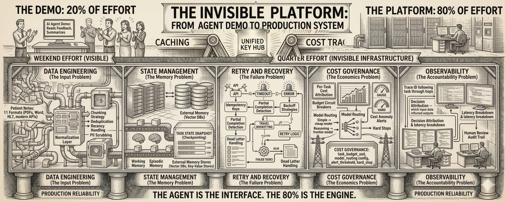

# Why 80% of Agentic AI Work Isn't AI

- **Author:** Ashutosh Maheshwari (@asmah2107)
- **Date:** March 14, 2026
- **Source:** [https://x.com/asmah2107/status/2032782212303598066](https://x.com/asmah2107/status/2032782212303598066)
- **Article:** [https://ashutoshmaheshwari.substack.com/p/why-80-of-agentic-ai-work-isnt-ai](https://ashutoshmaheshwari.substack.com/p/why-80-of-agentic-ai-work-isnt-ai)
- **Engagement:** 218 Likes | 12 Replies
- **Author affiliation:** Blue verified

---



**The unglamorous infrastructure that determines whether your agent demo becomes a production system -- or a warning story at your next postmortem.**

Here's a scene that plays out in engineering teams everywhere right now.

A senior engineer spends a weekend building an AI agent. It's genuinely impressive: it reads customer feedback, classifies sentiment, identifies product themes, and drafts a summary report. The demo gets a round of applause in Monday's standup. Leadership wants it in production by end of quarter.

Three months later, it's still not in production. The engineer is exhausted. The work has ballooned from 'build an agent' to 'build the platform the agent needs to exist in.'

Context windows that expire mid-task. Input data in seventeen different formats. Retry logic that doesn't exist. Costs that spike 40x on edge cases. An audit trail that's legally required but architecturally nonexistent.

*The agent took a weekend to build. The infrastructure to make it reliable took a quarter. This ratio is not a bug. It's the industry's dirty secret.*

Let's name the 80%.

## LAYER 1: Data Engineering -- The Input Problem

An agent is only as good as what you put into its context window. In demos, the input is always clean: a well-formatted string, a neatly structured JSON object, a PDF that actually parses.

In production, the input is a disaster.

A healthcare startup building a clinical notes agent discovered their hospital partners stored patient notes in 11 different formats: some in modern EHR APIs, some in legacy HL7 messages, some in scanned PDFs, some in literal Word documents attached to emails. Before a single LLM call could be made, they needed a data normalization layer that would have been a respectable engineering project on its own.

The data engineering work that precedes the agent call includes:

- Format normalization (PDFs, HTML, JSON, XML, plain text -- often mixed in the same dataset)
- Chunking strategy -- how you split long documents directly affects what the agent can reason about
- Deduplication -- the same document often arrives via multiple channels
- Recency handling -- stale data in context produces confidently wrong outputs
- PII scrubbing -- required before any external LLM API call in most enterprise contexts

None of this is AI work. All of it is load-bearing.

## LAYER 2: State Management -- The Memory Problem

LLMs are stateless by design. Every API call starts from scratch. This is fine for a single question. It's a fundamental architectural problem for an agent running a multi-hour task.

Imagine a legal discovery agent working through 50,000 documents. It's 6 hours in. The context window fills up. What happens to the work it's already done? What does it know about documents 1 through 3,000 when it's now on document 3,001?

Without explicit state management, the answer is: nothing. The agent has amnesia every time the context window resets.

The state management layer for a production agent includes:

- Working memory -- what the agent is actively reasoning about right now
- Episodic memory -- a record of what it's done in this task session
- Checkpointing -- serialized snapshots so tasks can be resumed after interruption
- External memory stores -- vector DBs, key-value stores for facts the agent needs to persist beyond context

**TASK STATE SNAPSHOT (checkpoint):**
```
task_id: uuid
timestamp: ISO-8601
progress: { completed: 3142, total: 50000 }
working_context: [last N relevant facts]
pending_actions: [actions queued but not executed]
escalations: [decisions requiring human review]
```

Building this is a backend engineering problem. It requires decisions about consistency, durability, and failure recovery that have nothing to do with prompt engineering.

## LAYER 3: Retry and Recovery -- The Failure Problem

Your agent calls a tool. The tool times out. What happens?

In a naive implementation: the agent receives an error, gets confused because it wasn't designed for this state, produces a hallucinated response, and continues confidently down the wrong path.

A travel booking agent at a mid-size agency had this exact failure mode. When the booking API timed out, the agent would treat the lack of confirmation as implicit success and move on to the next step -- emailing the customer with a confirmation that didn't exist. The agency discovered this after several customers showed up at airports expecting flights that were never booked.

Production-grade retry logic for agents is more complex than for APIs because the operation may be partially complete:

- Idempotency keys -- ensuring a retried action doesn't execute twice
- Partial completion detection -- knowing what succeeded before the failure
- Timeout budgets -- different timeouts for different tool categories
- Backoff strategies -- exponential backoff with jitter for external API calls
- Dead letter handling -- what to do with tasks that fail after max retries

*An agent that fails silently is more dangerous than an agent that fails loudly. Silent failures compound. Loud failures get fixed.*

## LAYER 4: Cost Governance -- The Economics Problem

This is the layer that kills production deployments more than any technical issue.

An agent that costs $0.12 per task in the demo costs $4.80 per task when you add real documents, multi-step reasoning, and retry logic. Multiply by 10,000 daily tasks. You've just created a $48,000/day line item that nobody budgeted for.

A B2B SaaS company built an agent to auto-generate RFP responses. Average document length was 40 pages. The agent used a frontier model with a large context window. Cost per RFP response: $8. They had 200 RFPs a month. $1,600/month -- manageable. Then a sales campaign brought in 800 RFPs in November. $6,400 in LLM costs for a feature that generated no direct revenue. The CFO had questions.

Cost governance infrastructure includes:

- Per-task cost attribution -- know what each agent run costs before it runs
- Model routing -- use cheap models for simple sub-tasks, expensive ones only where needed
- Context window optimization -- reducing token count is a cost engineering problem
- Budget circuit breakers -- halt agent execution if per-task cost exceeds threshold
- Cost anomaly alerts -- detect when an agent task is consuming 10x normal tokens

**COST GOVERNANCE:**
```
task_budget_usd: 0.50
model_routing:
  classification: gpt-4o-mini
  reasoning: claude-sonnet
  synthesis: claude-opus (if complexity > 0.8)
alert_threshold: 2x rolling_average
hard_stop: 5x rolling_average
```

## LAYER 5: Observability -- The Accountability Problem

When your agent makes a decision, can you explain it? Not just 'here's the output' -- but specifically which input data, which reasoning step, which tool call led to this result?

In regulated industries, this is a legal requirement. In consumer products, it's a trust requirement. In every production system, it's a debugging requirement.

The observability stack for a production agent is not just logs. It includes:

- Trace IDs that follow a task through every agent hop, every tool call, every LLM invocation
- Input/output capture at each reasoning step (with appropriate data retention policies)
- Decision attribution -- which context influenced which output
- Latency breakdown -- how much time was spent on LLM calls vs. tool calls vs. waiting
- Human review audit trail -- who saw what, when, and what they decided

Without this, you can't debug production failures, you can't improve the system, and you certainly can't explain a bad outcome to a customer or a regulator.

## THE REAL INSIGHT: Build the Platform, Not Just the Agent

The teams that are winning with agentic AI aren't the ones with the best prompts or the smartest models. They're the ones who recognized early that they were building a platform -- and staffed for it.

Data engineering. State management. Retry logic. Cost governance. Observability. This is senior engineering work. It requires the same discipline as building a payment system or a distributed database.

The agent is the interface. The 80% is the engine.

*Every successful production agent is sitting on top of an invisible platform that took longer to build than the agent itself. You just never see it in the demo.*

*What's the most painful 'invisible infrastructure' problem you've hit building agents? Reply and let me know -- the best answers become future issues.*
