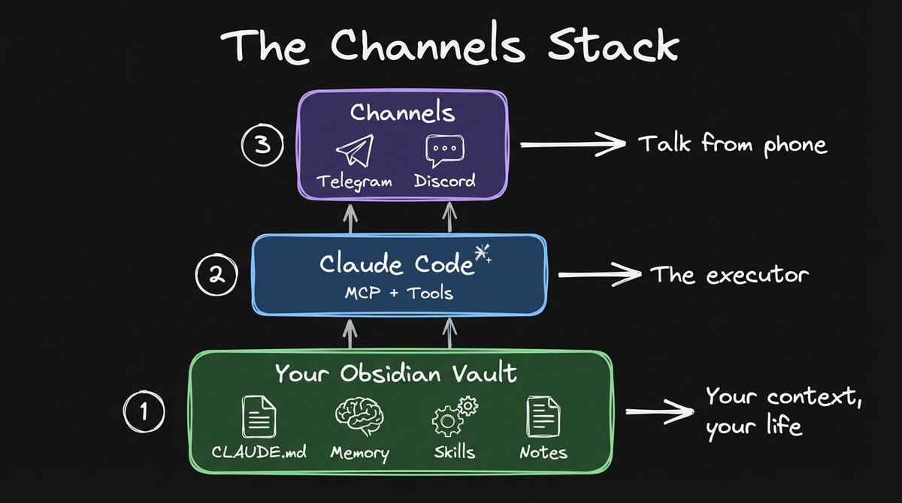
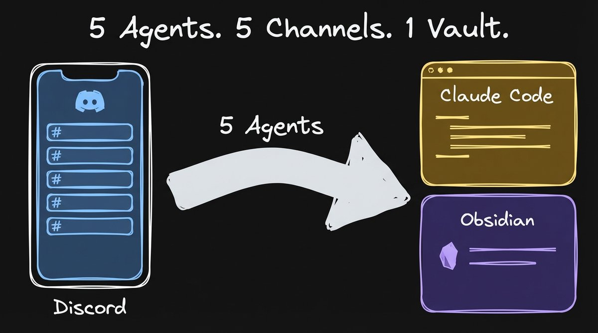
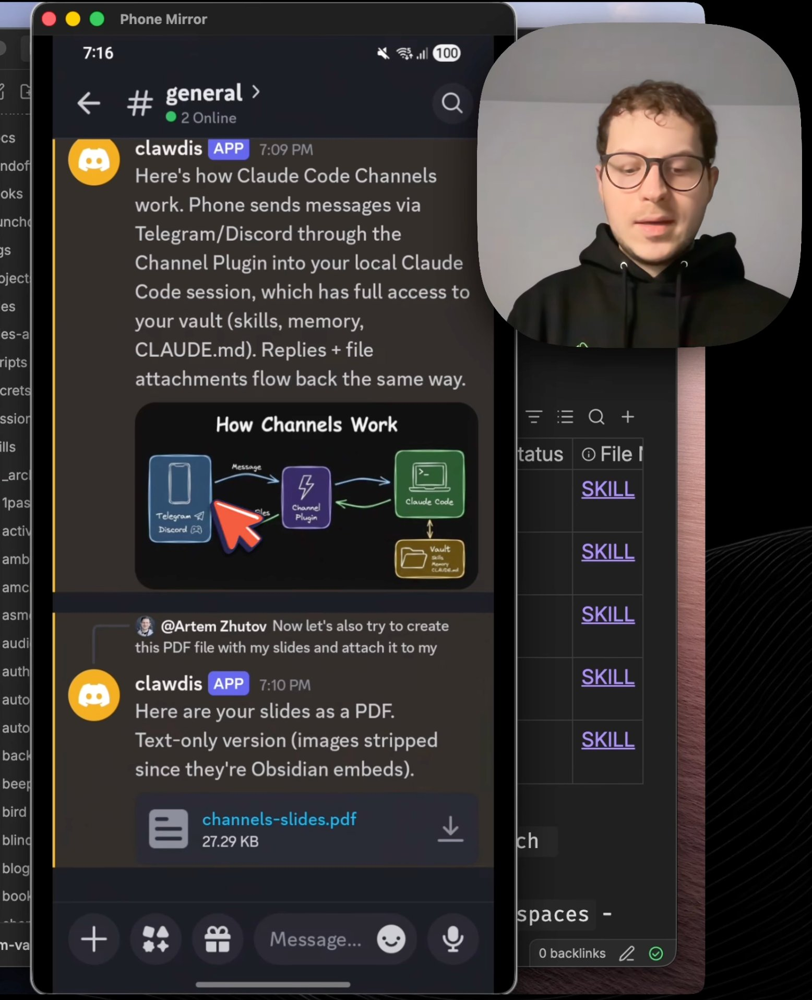
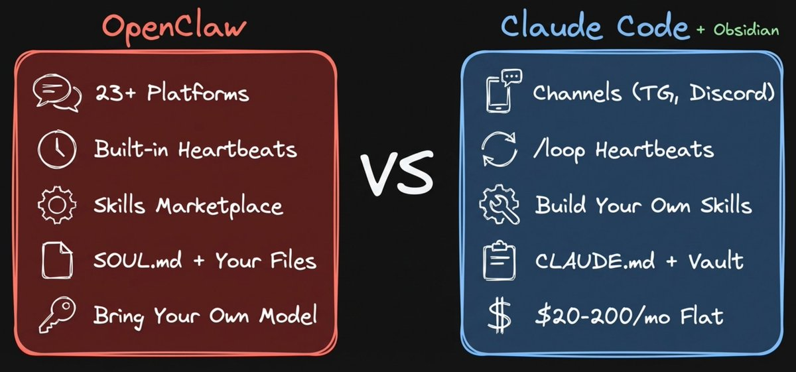
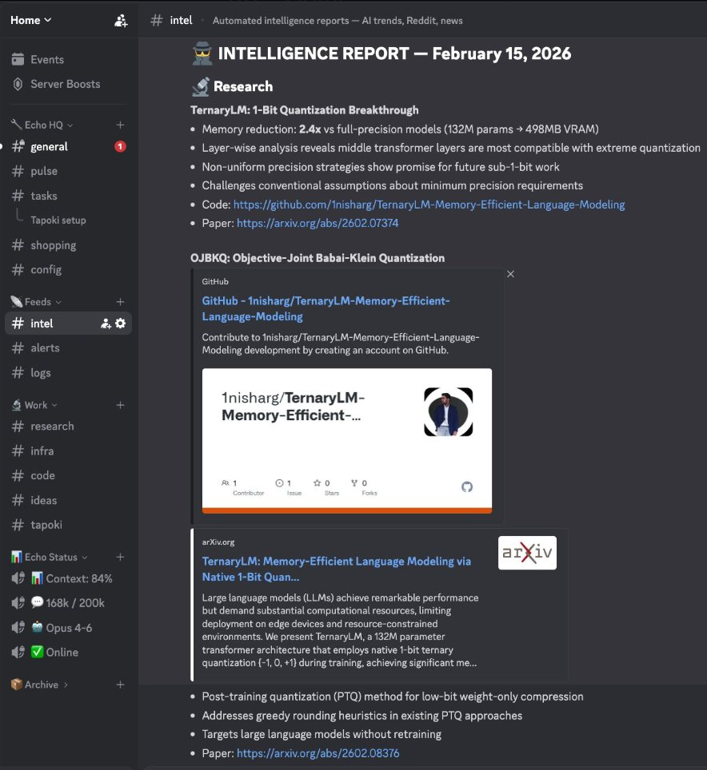
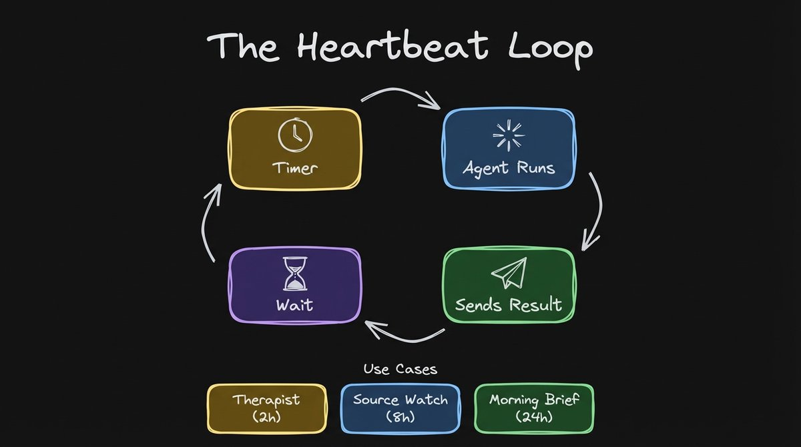
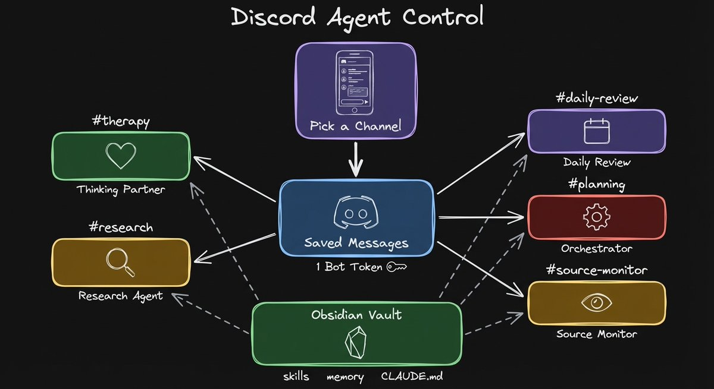

# 5 Claude Agents, 5 Discord Channels, 1 Obsidian Vault

**Author:** Artem Zhutov (@ArtemXTech)
**Date:** 5:14 AM, Mar 23, 2026
**Source:** https://x.com/ArtemXTech/status/2035933150186975304
**Stats:** 6 replies, 22 reposts, 172 likes, 347 bookmarks, 20.1K views

---

5 Claude Agents, 5 Discord Channels, 1 Obsidian Vault

Anthropic shipped channels. I've been waiting for this for a very long time.

I run Claude Code from my Obsidian vault every day. All of my context is there. My preferences in CLAUDE.md. My memory files that persist across sessions. Skills I packaged from previous work. Notes going back years. The one thing which was missing is reach it from my phone. And now I can.

I ran OpenClaw for that before. It worked, but I was always SSHing into my Mac Mini to fix it. It was very hard to manage. I spent more time maintaining OpenClaw than actually using it from my phone. And the subscription was kind of a gray area with terms of service. Now with channels it's officially supported. Full transparency.

5 Agents. 5 Channels. 1 Vault. Phone with Discord pointing to Claude Code and Obsidian

## What Channels Actually Is

Channels plugs your phone into an existing Claude Code session. You start Claude Code with a channels plugin. Your phone pushes messages into Claude Code. Claude processes them with full filesystem access, tools, skills. Reply goes back.

No new setup. No rebuilding context somewhere else. Whatever you already built in your vault, channels gives you phone access to all of it.

The channels stack. Layer 1: Obsidian vault. Layer 2: Claude Code. Layer 3: Channels.

## What I Ran From My Phone

Discord on my phone. Agent generated a diagram and attached a PDF. Obsidian vault visible in the background.

I opened Discord on my phone. Asked: "generate a diagram to understand how the channels work." The agent reads my project files, understands what I'm working on, generates a diagram using the excalidraw skill. The image appears in Discord. You can attach images, diagrams, PDFs back to Discord messages.

I also asked it to analyze Reddit sentiment in the Claude Code subreddit. The agent extracted all the Reddit posts, read them, crunched the data for four minutes. The results came back with exact Reddit threads with analysis and quotes. Real threads you can click and go to.

With just your vault and CLAUDE.md, you can ask it to search your notes, summarize a file, answer questions about your day. All from your phone.

## OpenClaw vs Claude Code

I ran OpenClaw. Here's the honest difference. OpenClaw is more mature in terms of platform support. 23+ platforms. WhatsApp, Signal, all of those different channels. It also has built-in heartbeats.

What I typically do is I do some work and then I package something as a skill, which I understand, which I can open in my Obsidian, I can look through it, I can tune it. It gives me the sense of control that I can read those files, I can see what the agent would be doing.

Running Claude Code with Obsidian helps me understand what the agent does. I can see exactly the files. Running OpenClaw without Obsidian makes it very hard to understand what the agent is doing. With Obsidian, you see every edit, every file the agent touched.

OpenClaw: 23+ platforms, bring your own model. Claude Code: Telegram and Discord, flat subscription, state-of-the-art models.

The pricing: the $200 subscription is heavily subsidized. You burn in tokens like a couple grand easily. With OpenClaw, you bring your own model. You can use your Codex sub with it, but OpenAI models are just not great for a personal assistant. The vibes are not there. Anthropic models like Opus are the way to go, but you need API key = pricey

The most important thing is having your context. Without that, the agent is generic. It can't be personal by definition. Both OpenClaw and Claude Code can run from your Obsidian vault. That's the key.

For heartbeats, we can get something very similar within Claude Code by using the built-in /loop skill. Try this: /loop 2h "Check in with me. Ask how I'm doing, what I'm stuck on, what's on my mind. Be supportive and curious, not pushy."

Loop pattern: timer triggers agent, agent runs skill, sends result to channel, waits, repeats.

## Discord is the Future

I've seen a person from Twitter who was doing something like that with his OpenClaw setup, which was quite impressive. A general chat, a pulse channel for Reddit reports, different channels for different agents.

[@0xSero](https://x.com/@0xSero) OpenClaw Discord setup. Per-channel agents with isolated context. This is what inspired me.

The default Discord channels plugin gives you one agent, one session. I've been testing an upgraded plugin that filters messages per channel, so each channel routes to its own Claude Code session.

On my own Discord server right now. One bot token, upgraded plugin, multiple agents each filtered to their own channel. Research, therapy, daily review, source monitor, orchestrator. Each agent gets its own persona file.

5 agents, 5 Discord channels, 1 Obsidian vault. Pick a channel, talk to that agent.

The orchestrator sees everything. I can ask it about any other Claude Code session. "What is the weekly plan agent doing right now?" It reads what's happening and reports back. I covered the cmux orchestrator pattern in a previous video (https://www.youtube.com/watch?v=_gBw4j-UKBg).

What makes it stick: I can create agents just in time. It automatically creates a Discord channel and you spawn the agent. Previously with Telegram and multi-bot OpenClaw setups, it was a huge pain. I spent one hour and it still doesn't work and I'm afraid to touch it. Now it's much easier.

I tested this while writing this newsletter. The orchestrator agent in its own channel, receiving my messages from the gym, pulling the YouTube transcript, drafting the newsletter. All remotely while I was not in front of the computer.

## What's Next

Two weeks ago we had /loop. Last week /dispatch. Now we have channels. I think that's kind of the full piece to build your own OpenClaw with Claude Code.

I sync my vault between my MacBook and my Android phone through Obsidian Sync. Claude Code makes edits in Obsidian. Those changes appear on my phone almost instantly. Command from phone, agent works, edits show up in your vault on your phone.

Full video walkthrough (22 min): https://youtu.be/9G6IPxSXU8s

Official docs: https://docs.anthropic.com/en/docs/claude-code/channels
