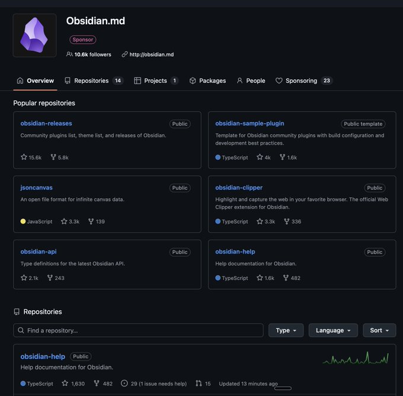
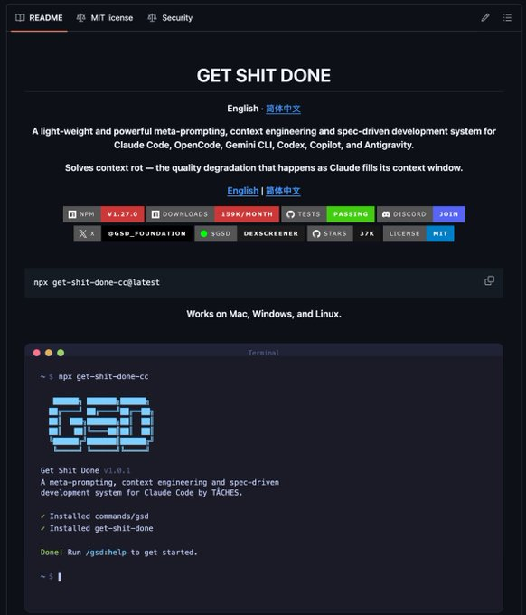

# Best GitHub Repos for Claude Code That Will 10x Your Next Project

**Author:** Sukh Sroay (@sukh_saroy)
**Date:** Mar 22, 2026
**Source:** https://x.com/sukh_saroy/status/2035613179875926059
**Stats:** 34 replies, 212 reposts, 1,488 likes, 3,015 bookmarks, 125,014 views

---

Best GitHub repos for Claude code that will 10x your next project:

1. **Superbase CLI** - [github.com/supabase/cli](https://github.com/supabase/cli)
2. **Skill Creator** - [github.com/anthropics/skill-creator](https://github.com/anthropics/skill-creator)
3. **Get Shit Done** - [github.com/gsd-build/get-shit-done](https://github.com/gsd-build/get-shit-done)
4. **Notebooklm-py** - [github.com/teng-lin/notebooklm-py](https://github.com/teng-lin/notebooklm-py)
5. **Obsidian.md** - [github.com/obsidianmd](https://github.com/obsidianmd)

