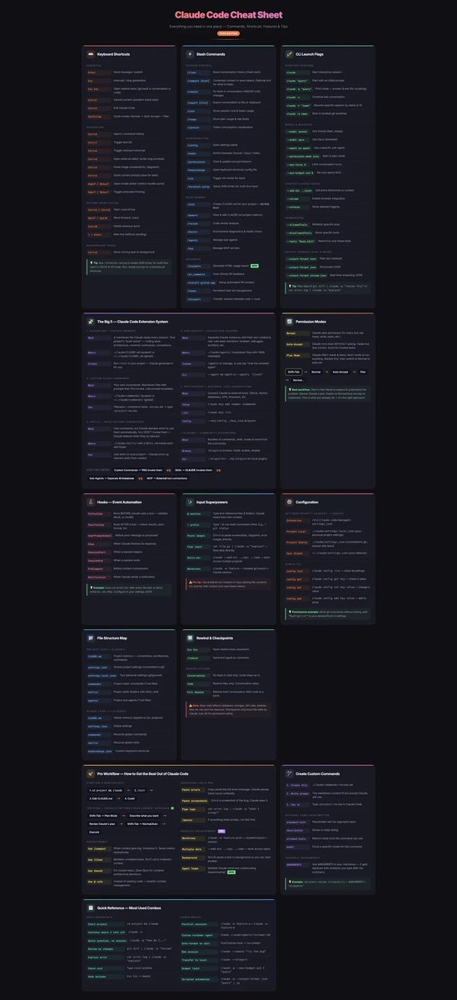

# Claude Code Cheat Sheet - Full Reference Guide

**Author:** Om Patel (@om_patel5)
**Date:** March 8, 2026
**Source:** https://x.com/om_patel5/status/2030676523661901889
**Stats:** 9 replies, 3 retweets, 42 likes

---

## Tweet 1/2 (Main Post)

most people using claude code are barely scratching the surface

someone made this cheat sheet shows just how much power is hidden inside it

keyboard shortcuts, slash commands, hooks, permission modes, custom commands, session rewind, multi-agent workflows, and configuration flags all in one place

once you see it mapped out like this you realize claude code is not just a chat tool

it is basically an AI operating system for your codebase

a few things most people miss:

1\ slash commands are insanely powerful

/clear resets context

/resume restores previous sessions

/export lets you save conversations to file

/permissions controls what tools claude can access

most devs never touch these

2\ hooks let you automate things around claude

run scripts before or after responses

trigger workflows when sessions start or end

basically event automation for your AI coding assistant

3\ permission modes change how fast claude works

normal mode asks before running tools

auto accept runs tasks automatically

plan mode forces claude to outline a plan first

switching modes completely changes how productive it is

4\ the extension system is where it gets wild

you can create:

- custom commands
- reusable project prompts
- agent teams
- tool integrations

so your entire dev workflow becomes programmable

5\ rewind and checkpoints

you can literally jump back to earlier conversation states

or restore both the code and the discussion

like git for AI sessions

once you learn these features claude code stops feeling like chatgpt

and starts feeling like a full development environment powered by AI

(attached: a full claude code cheat sheet showing shortcuts, commands, workflows, hooks, configuration, and extension systems in one visual map)

---

## Tweet 2/2 (Full Cheat Sheet Text)

# Claude Code Cheat Sheet

*Everything you need in one place -- Commands, Shortcuts, Features & Tips*

`2026 EDITION`

---

## Keyboard Shortcuts

### Essential

| Key | Action |
|-----|--------|
| `Enter` | Send message / submit |
| `Esc` | Interrupt / stop generation |
| `Esc Esc` | Open rewind menu (go back in conversation or code) |
| `Ctrl+C` | Cancel current operation (hard stop) |
| `Ctrl+D` | Exit Claude Code |
| `Shift+Tab` | Cycle modes: Normal > Auto-Accept > Plan |

### Navigation

| Key | Action |
|-----|--------|
| `Ctrl+R` | Search command history |
| `Ctrl+T` | Toggle task list |
| `Ctrl+O` | Toggle verbose transcript |
| `Ctrl+G` | Open external editor (write long prompts) |
| `Ctrl+V` | Paste image (screenshots, diagrams) |
| `Ctrl+S` | Stash current prompt (save for later) |
| `Cmd+P` / `Meta+P` | Open model picker (switch models quick) |
| `Cmd+T` / `Meta+T` | Toggle extended thinking |

### Editing (Bash-style)

| Key | Action |
|-----|--------|
| `Ctrl+A` / `Ctrl+E` | Start / end of line |
| `Opt+F` / `Opt+B` | Word forward / back |
| `Ctrl+W` | Delete previous word |
| `\` + `Enter` | New line (without sending) |

### Background Tasks

| Key | Action |
|-----|--------|
| `Ctrl+B` | Send running task to background |

> Tip: Run `/terminal-setup` to enable Shift+Enter for multi-line input in iTerm2 & VS Code. Run `/keybindings` to customize all shortcuts.

---

## Slash Commands

### Session Control

| Command | Action |
|---------|--------|
| `/clear` | Reset conversation history (fresh start) |
| `/compact [hint]` | Compress context to save tokens. Optional hint for what to keep. |
| `/rewind` | Go back in conversation AND/OR code changes |
| `/export [file]` | Export conversation to file or clipboard |
| `/cost` | Show session cost & token usage |
| `/usage` | Show plan usage & rate limits |
| `/context` | Token consumption visualization |

### Configuration

| Command | Action |
|---------|--------|
| `/config` | Open settings panel |
| `/model` | Switch between Sonnet / Opus / Haiku |
| `/permissions` | View & update tool permissions |
| `/keybindings` | Open keyboard shortcuts config file |
| `/vim` | Toggle vim mode for input |
| `/terminal-setup` | Setup Shift+Enter for multi-line input |

### Development

| Command | Action |
|---------|--------|
| `/init` | Create CLAUDE.md for your project -- **do this first!** |
| `/memory` | View & edit CLAUDE.md project memory |
| `/review` | Code review analysis |
| `/doctor` | Environment diagnostics & health check |
| `/agents` | Manage sub-agents |
| `/mcp` | Manage MCP servers |

### Advanced

| Command | Action |
|---------|--------|
| `/insights` | Generate HTML usage report (NEW) |
| `/pr_comments` | View GitHub PR feedback |
| `/install-github-app` | Setup automated PR reviews |
| `/tasks` | Persistent task list management |
| `/teleport` | Transfer session between web <-> local |

---

## CLI Launch Flags

### Starting Sessions

| Flag | Action |
|------|--------|
| `claude` | Start interactive session |
| `claude "query"` | Start with an initial prompt |
| `claude -p "query"` | Print mode -- answer & exit (for scripting) |
| `claude -c` | Continue last conversation |
| `claude -r "name"` | Resume specific session by name or ID |
| `claude -w name` | Start in isolated git worktree |

### Model & Behavior

| Flag | Action |
|------|--------|
| `--model sonnet` | Use Sonnet (fast, cheap) |
| `--model opus` | Use Opus (smartest) |
| `--agent my-agent` | Use a specific sub-agent |
| `--permission-mode plan` | Start in plan mode |
| `--max-turns N` | Limit conversation turns |
| `--max-budget-usd N` | Set max spend limit |

### Context & Directories

| Flag | Action |
|------|--------|
| `--add-dir ../path` | Add extra directories to context |
| `--chrome` | Enable browser integration |
| `--verbose` | Show detailed logging |

### Permissions

| Flag | Action |
|------|--------|
| `--allowedTools` | Whitelist specific tools |
| `--disallowedTools` | Block specific tools |
| `--tools "Bash,Edit"` | Restrict to only these tools |

### Output Formats (for -p mode)

| Flag | Action |
|------|--------|
| `--output-format text` | Plain text (default) |
| `--output-format json` | Structured JSON |
| `--output-format stream-json` | Real-time streaming JSON |

> Tip: Pipe data in! `git diff | claude -p "review this"` or `cat error.log | claude -p "explain"`

---

## The Big 5 -- Claude Code Extension System

### 1. CLAUDE.md -- Project Memory

| | |
|---|---|
| **What** | A markdown file Claude reads every session. Your project's "brain dump" -- coding style, architecture, common commands, conventions. |
| **Where** | `.claude/CLAUDE.md` (project) or `~/.claude/CLAUDE.md` (global) |
| **Create** | Run `/init` in your project -- Claude generates it for you |

### 2. Custom Slash Commands

| | |
|---|---|
| **What** | Your own /commands. Markdown files with prompts that YOU invoke. Like prompt templates. |
| **Where** | `.claude/commands/` (project) or `~/.claude/commands/` (global) |
| **Use** | Filename = command name. `review.md` > type `/project:review` |

### 3. Skills -- Auto-Invoked Knowledge

| | |
|---|---|
| **What** | Like commands, but Claude decides when to use them automatically. You DON'T invoke them -- Claude detects when they're relevant. |
| **Where** | `.claude/skills/` with a `SKILL.md` inside each skill folder |
| **Use** | Just work on your project -- Claude picks up relevant skills from context |

### 4. Sub-Agents -- Specialized Helpers

| | |
|---|---|
| **What** | Separate Claude instances with their own context & role. Like team members: reviewer, debugger, architect, etc. |
| **Where** | `.claude/agents/` (markdown files with YAML metadata) |
| **Invoke** | `/agents` to manage, or just say "Use the reviewer agent" |
| **CLI** | `--agent my-agent` or `--agents '{json}'` |

### 5. MCP Servers -- External Tool Connections

| | |
|---|---|
| **What** | Connect Claude to external tools: GitHub, Notion, databases, APIs, browsers, etc. |
| **Setup** | `claude mcp add <name> <command>` |
| **List** | `claude mcp list` |
| **Config** | `--mcp-config ./mcp.json` at launch |

### + Plugins -- Community Extensions

| | |
|---|---|
| **What** | Bundles of commands, skills, hooks & more from the community |
| **Browse** | `/plugin` to browse, install, enable, disable |
| **Dir** | `--plugin-dir ./my-plugins` for local plugins |

**How they differ:**

Custom Commands > **YOU** invoke them **vs** Skills > **CLAUDE** invokes them **vs** Sub-Agents > Separate **AI instances** **vs** MCP > **External** tool connections

---

## Permission Modes

| Mode | Description |
|------|-------------|
| **Normal** | Claude asks permission for every tool use (read, write, bash, etc.) |
| **Auto-Accept** | Claude runs tools WITHOUT asking. Faster but less control. Good for trusted tasks. |
| **Plan Mode** | Claude ONLY reads & plans. Won't write or run anything. Review first, then switch to Normal to execute. |

**Cycle:** `Shift+Tab` > Normal > Auto-Accept > Plan > Normal...

> Best workflow: Start in Plan Mode to explore & understand the problem. Review Claude's plan. Switch to Normal/Auto-Accept to implement.

---

## Hooks -- Event Automation

| Hook | Description |
|------|-------------|
| `PreToolUse` | Runs BEFORE Claude uses a tool -- validate, block, or modify |
| `PostToolUse` | Runs AFTER a tool -- check results, auto-format, lint |
| `UserPromptSubmit` | Before your message is processed |
| `Stop` | When Claude finishes its response |
| `SessionStart` | When a session begins |
| `SessionEnd` | When a session ends |
| `PreCompact` | Before context compression |
| `Notification` | When Claude sends a notification |

> Example: Auto-run `prettier` after every file edit, or block writes to `.env` files. Configure in your settings JSON.

---

## Input Superpowers

| Feature | Description |
|---------|-------------|
| `@` mention | Type `@` to reference files & folders. Claude reads them into context. |
| `!` prefix | Type `!` to run shell commands inline. E.g., `! git status` |
| Paste images | Ctrl+V to paste screenshots, diagrams, error images directly |
| Pipe input | `cat file | claude -p "analyze"` to pipe content directly |
