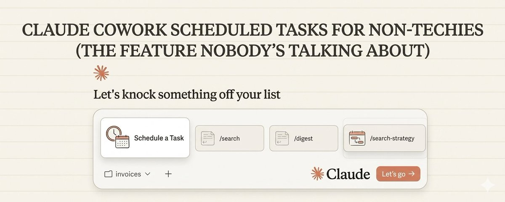

# Claude Cowork scheduled tasks for non-techies (the feature nobody's talking about)

**Author:** Nick Spisak (@NickSpisak_)
**Date:** 2026-03-07
**Source:** https://x.com/NickSpisak_/status/2030255303640371292
**Stats:** 4 replies, 20 retweets, 286 likes, 768 bookmarks, 27.5K views

---

Most people treat AI like a tool you pick up when you need it.

Open the app. Type a prompt. Get an answer. Close the app.

That's leaving the biggest unlock on the table: AI that works when you're not even there.

Claude Cowork's Scheduled Tasks let you build automations that run on a recurring schedule. No code, no terminal, no Zapier. Just plain-English instructions that execute themselves while you do something else.

Here's exactly how I'm using them to get 5+ hours back every single week.

> If you're non-technical and want to learn how to build systems like this, join our Build With AI community: http://return-my-time.kit.com/1bd2720397

---

## 1. What Scheduled Tasks Actually Are

Scheduled Tasks are recurring prompts that run automatically inside Claude Cowork. You write a plain English instruction, set a schedule (daily, weekly, whatever), and Claude executes it. It reads your files, pulls from the web, and delivers finished outputs to your folder.

No cron jobs. No code. No third-party automation platform.

You describe the task once. It runs itself from there. True set-and-forget.

## 2. Why This Is Different From Everything Else

Most automation tools require you to think in triggers, actions, and connections between apps. That's fine if you're technical. If you're not, you hit a wall fast.

Scheduled Tasks skip all of that. You're not connecting APIs (unless you want or need to) or building workflows in a visual editor. You're telling Claude what "done" looks like in normal language, and it figures out the rest. *You're not connecting APIs or building workflows in a visual editor.*

Traditional automation requires you to learn the tool. Scheduled Tasks just require you to describe the outcome.

That's the difference.

## 3. Research Briefings (My Favorite Use Case)

Every Sunday night at 8pm, Claude runs a task that researches my competitors for product updates (in my e-commerce business), upcoming critical meetings for the week (in our returnmytime business), and keeps me on track on which development/coding work needs to be top of mind.

I also have intraday checks for industry publications for relevant AI news. Then it saves a formatted summary to my briefings folder with the date in the filename.

I used to do this all manually. Now I open my laptop and it's already done and ready for the human work of reviewing what makes sense to approve and act on.

That's 45 minutes returned, every single week. Over a year, that's nearly 40 hours - a full work week - from 5 minutes of setting up scheduled task.

Efficiency. Measured in hours you can see on the calendar.

## 4. Inbox Triage on Autopilot

Here's another one I run daily now. Claude scans my email summary export, flags anything that needs a response in the next 24 hours, categorizes the rest, and writes a one-page priority list saved to my morning folder.

The prompt is three sentences. The output replaces 20 minutes of context-switching every morning.

Start by exporting your inbox data to a folder Claude can access. Then write the task: what to flag, what to ignore, what format to deliver. That's the whole setup.

If you want to understand how to set this up I wrote a full article start to finish on Google workspace here:

*(Embedded tweet reference: https://x.com/NickSpisak_/status/2029412739303494131)*

## 5. Client Follow-Up Tracker

If you run a service business, this one pays for itself immediately.

I have a scheduled task that runs every Friday afternoon. It reads my meeting notes folder, checks which clients haven't had a touchpoint in 7+ days, and generates personalized follow-up drafts. Tone-matched to my brand voice, referencing specific details from our last conversation.

Before this: I'd forget follow-ups and lose deals. After this: every client hears from me like clockwork.

That's not efficiency. That's effectiveness - directly tied to revenue. The reclaim on this one is real.

## 6. Content Pipeline Generator

This is a new one I'm starting to use. Getting ideas for the most relevant topics and ideas in AI.

I run a scheduled task every hour looking for X articles and posts that are either already viral or have potential to go viral. @coreyganim has been using this style for awhile now and its really working well. I plan on doing the same with my own unique takes from the "techy/nerdy" side.

Each draft follows my brand voice guidelines (because I set up context files). Each references real examples from my work. Each needs maybe 5-10 minutes of editing instead of 45 minutes of writing from scratch.

Three posts, written and formatted, waiting in my outputs folder when I sit down and write. Quality output without the grind.

... Not going to lie being a technical co-founder its hard sometimes to remind yourself to do content so this one is really going to help....

## 7. How to Set One Up (10 Minutes)

Here's the actual setup.

Open Claude Desktop. Go to the Cowork tab. Use the /schedule command or ask Claude to create a scheduled task.

Give it three things:

1. What to do - plain English description of the task
2. When to do it - "Every Monday at 7am" or "Daily at 6pm" or "First of every month"
3. Where to save it - which folder in your workspace gets the output

That's it. Claude handles the rest. No configuration screens. No workflow builders. No debugging.

10 minutes to set up. Runs forever after that.

## 8. The Context File Multiplier

Here's what separates a generic scheduled output from one that sounds like you wrote it: context files.

Before you build a single scheduled task, create these three files in your workspace:

- **about-me.md** - what you do, who you serve, current priorities
- **brand-voice.md** - how you write, phrases you use, tone, examples
- **working-preferences.md** - how you want Claude to operate

** Pro tip: make a plugin and skill for cowork onboarding - I have one we built and install into "boring businesses" as a service. Easy way to establish authority in the space as the AI guy....

Every scheduled task reads these automatically. Your Monday briefing knows your industry. Your content drafts match your voice. Your follow-up emails sound like you, not a chatbot.

Two hours of setup. Every output after that is personalized. This is the highest-leverage move in the entire system.

## 9. What Makes This a Real Business Tool

Here's the mental shift. Scheduled Tasks turn Claude from an assistant you talk to into infrastructure that runs your business.

An assistant helps when you ask. Infrastructure works whether you ask or not.

Every scheduled task you build is a system that compounds. Monday briefings keep you informed. Daily triage keeps you responsive. Weekly follow-ups keep revenue flowing. Content pipelines keep your audience engaged.

None of it requires you to open the app and type a prompt. It just runs.

From AI to ROI - this is what that actually looks like.

## 10. Start With One Task This Week

Don't try to automate everything at once. Pick the one recurring task that eats the most time every week. The one you dread, the one you forget, or the one that's important but never urgent.

That's your biggest time leak. Plug it first.

Build one scheduled task for it. See the output. Refine it. Then add another.

Within a month, you'll have 3-5 tasks running automatically, returning hours every week without you thinking about it.

---

That's the real unlock with Cowork. Not better prompts. Not cleverer conversations. Automated systems that return your time while you focus on the work that actually matters.

Stop tinkering. Start shipping.

> If you want help building these systems step by step, join our Build With AI community: http://return-my-time.kit.com/1bd2720397
