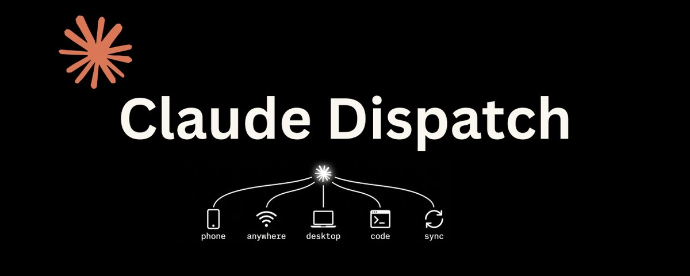

# How to Use Claude Dispatch to Run Your AI While You Sleep

**Author:** Nav Toor (@heynavtoor)
**Date:** Mar 19, 2026
**Source:** https://x.com/heynavtoor/status/2034679349157536233
**Stats:** 26 replies, 145 reposts, 1,331 likes, 3,218 bookmarks, 175.8K views

---

## The biggest complaint about Claude Cowork since it launched in January has been five words: I have to be there.

You had to sit at your desk. You had to keep the app open. You had to watch Claude work. It was powerful, but it was anchored. Your AI assistant was chained to your laptop like it was 2019.

On March 17, 2026, Anthropic fixed that. And almost nobody has noticed yet.

They shipped a feature called Dispatch. It does something deceptively simple: it lets you text your desktop AI from your phone. You send a task from anywhere. Claude runs it on your computer. You come back to finished work.

That is it. That is the whole pitch. And if you have spent any time building a Cowork system, you already understand why this changes everything.

The launch tweet hit 2.7 million views in 48 hours. Felix Rieseberg, the Anthropic engineer who announced it, described it in one line: "One persistent conversation with Claude that runs on your computer. Message it from your phone. Come back to finished work."

Dispatch is not a mobile version of Cowork. It is not a cloud agent. It is not a new AI model. It is a remote control for the system you have already built. And that distinction is what makes it the most important Cowork update since launch.

This is the complete guide. Setup. Configuration. Real workflows that work today. Honest limitations. And the exact strategies that turn Dispatch from a novelty into a genuine productivity multiplier.

Bookmark this. You will need it.

# What Dispatch actually is (and what it is not)

Before you set anything up, you need to understand what you are working with. Dispatch has been live for two days and the misconceptions are already spreading.

Here is the precise definition: Dispatch creates one persistent conversation between the Claude mobile app on your phone and the Claude Desktop app on your computer. Your phone is the messaging interface. Your computer is the engine. Everything Claude does, every file it reads, every connector it accesses, every skill it loads, happens on your desktop. Your phone just sends the instructions and receives the results.

Think of it as a walkie-talkie to a computer that is already running. Not a cloud service. Not a mobile agent. A remote control.

This means three things you need to internalize before going further:

**Your computer must be awake.** If your Mac goes to sleep or the Claude Desktop app closes, Dispatch goes dark. This is not a limitation. It is a security feature. No always-on cloud server means no always-on attack surface. Your files stay local. Your data stays on your machine. The tradeoff is that you need to keep the lid open.

**Everything you built in Cowork carries over.** Your context files, your skills, your connectors, your global instructions. All of it loads into the Dispatch session. This is critical. Dispatch is not starting from zero. It inherits your entire architecture. The system you spent weeks building is now accessible from your pocket.

**It is a research preview.** MacStories tested it and reported roughly 50/50 reliability on complex tasks. Information retrieval works well. Cross-app actions are inconsistent. This is early software. Treat it accordingly. But "early" in the Claude ecosystem tends to mean "transformative within 60 days." Cowork itself went from rough preview to daily workhorse in under eight weeks.

# Setup in under 5 minutes (step by step)

The setup is absurdly simple. I timed it. Two minutes and fourteen seconds from start to paired devices. Here is every step.

## What you need before you start

- The latest version of the Claude Desktop app on your Mac or Windows PC. If you have not updated recently, go to claude.com/download and grab the newest version. Dispatch requires the March 2026 update.
- The latest version of the Claude mobile app on your iPhone or Android. Open your app store and update. Dispatch will not appear if you are on an older version.
- A paid Claude plan. Max subscribers ($100 to $200 per month) have access right now. Pro subscribers ($20 per month) are getting access within days. If you are reading this on Pro and do not see Dispatch yet, check back tomorrow.
- An internet connection on both devices. Your phone talks to your computer through the internet, not Bluetooth or local Wi-Fi.

## Step 1: Open Dispatch on your desktop

Launch Claude Desktop. Click the Cowork tab. In the left sidebar, you will see a new option: Dispatch. Click it. You will land on a page explaining the feature. Click "Get started."

On the next screen, you get two toggles. The first gives Claude access to your files. The second keeps your computer awake while Dispatch is active. Turn both on. The file access toggle is what lets Dispatch use your entire Cowork setup. Without it, Claude can only chat. With it, Claude can read your folders, use your skills, and access your connectors.

## Step 2: Pair your phone

A QR code appears on your desktop screen. Open the Claude app on your phone. You will see a new Dispatch entry in the sidebar. Tap it. Scan the QR code.

That is it. No API keys. No configuration files. No OAuth dance. Scan and go.

Once paired, you will see the same conversation on both devices. Send a message from your phone, it appears on your desktop. Claude's responses show up on both. One persistent thread. Two devices. Zero sync headaches.

## Step 3: Test the connection

From your phone, type: "What files do you have access to right now?"

Claude should respond with a list of folders and files from your Cowork setup. If it does, you are live. If it does not, check that file access is toggled on in the Dispatch settings on your desktop.

Total setup time: under five minutes. Probably under three.

# 12 Dispatch workflows that actually work right now

Marketing copy and early reviews are flooding in. Most of them describe what Dispatch could do. Here is what it actually does, tested in the 48 hours since launch. I have categorised these by reliability: what works consistently, what works sometimes, and what you should wait on.

## Works reliably (80%+ success rate)

1. **Morning inbox triage from bed** — Before you get up, text Dispatch: "Summarize my top 10 unread emails and flag anything urgent." By the time you are brushing your teeth, you know what your day looks like. This works because it is information retrieval through your Gmail connector. Dispatch excels at pulling data and summarizing it.

2. **File lookups while you are away** — "Find the PDF I downloaded last week about the Q1 budget." Instead of remoting into your computer or trying to remember the filename, Dispatch searches your files and sends back what it finds. Fast and reliable.

3. **Meeting prep on the commute** — "Check my calendar for today and prepare briefing docs for each meeting using files from my project folder." You walk into the office with prep already done. This combines your calendar connector with file access and your meeting prep skill if you have one.

4. **Quick research summaries** — "Read the three most recent documents in my Research folder and give me a one-paragraph summary of each." Perfect for catching up on reading you have been putting off. Claude reads the files on your desktop and sends the summaries to your phone.

5. **Notion and Slack catch-ups** — "Summarize my recent Notion notes" or "What were the key messages in the marketing Slack channel today?" If you have these connectors set up, Dispatch pulls the data and delivers a clean summary. Tested and working.

6. **Expense processing** — "Process all receipt images from my receipts folder and create a categorized spreadsheet." If you have an expense processing skill, Dispatch loads it automatically and runs the whole workflow. You come home to a finished spreadsheet.

## Works sometimes (50-70% success rate)

7. **Creating documents from templates** — "Draft a client proposal for the Anderson account using my proposal template and the latest email thread." This involves multiple steps: reading emails, loading a template, generating content. It works when all connectors respond cleanly. It fails when one step times out.

8. **Multi-step file organization** — "Organize everything in my Downloads folder by file type." This works but can be slow. Dispatch processes the task on your desktop and the results appear gradually. For large folders, expect some lag.

9. **Spreadsheet creation from raw data** — "Create an Excel spreadsheet summarizing the data in the three CSV files in my analytics folder." This works when the files are clean. Complex data or ambiguous column names can cause issues.

## Wait on these (unreliable in the preview)

10. **Cross-app workflows** — "Read this email, create a task in Notion, and send a summary to Slack." Multi-step workflows that chain multiple connectors together are the most likely to fail. The individual steps work. The chaining is inconsistent. Give it a few weeks.

11. **Browser-based actions** — "Open this URL in my browser and save the content." Dispatch can trigger browser actions through Cowork, but reliability is low. Stick to file and connector-based workflows for now.

12. **Sharing or sending outputs** — MacStories found that summarizing and finding data worked well, but sharing from Claude did not. If your workflow ends with "and send it to someone," do the sending yourself for now.

# The real shift: from synchronous to asynchronous AI

Here is why Dispatch matters more than its current feature set suggests.

Every AI tool you have used until now has been synchronous. You sit down. You type. You wait. You read. You type again. The AI only works when you are watching.

Dispatch is the first consumer AI feature that is genuinely asynchronous. You send a task and walk away. Claude works while you live your life. You come back to results.

This is not a small distinction. This is the difference between a calculator and a factory. A calculator is powerful, but it only works when you press the buttons. A factory runs whether you are there or not.

Think about what your Cowork system does right now. It drafts emails. It processes expenses. It organizes files. It creates presentations. It summarizes documents. Every single one of those tasks currently requires you to be sitting at your desk, watching Claude work.

Dispatch removes that requirement. Not for every task. Not with perfect reliability. But enough to change how you think about what AI does for you.

The people who will get the most from this feature are not the ones who use it to check emails from bed. They are the ones who realize that every Cowork workflow they have already built is now triggerable from anywhere. Your morning briefing. Your expense processing. Your meeting prep. Your file organization. All of it, from your phone, while you are doing something else entirely.

Cowork made AI do your work. Dispatch makes AI do your work while you are not there.

That is the shift. And it is just beginning.

# How to make Dispatch 10x more reliable

The 50/50 reliability that early reviewers reported is real. But it is not the whole story. Most of those tests were run without optimized Cowork setups. When you pair Dispatch with a properly architected system, reliability jumps significantly. Here is how.

## 1. Build context files if you have not already

Dispatch inherits everything from your Cowork setup. If your Cowork setup is bare, Dispatch has nothing to work with. Create your about-me.md, brand-voice.md, and working-style.md files. These give Claude the context it needs to produce quality output on the first try, even when you are giving terse instructions from your phone.

Phone prompts tend to be short. "Process my receipts" is a typical Dispatch message. Without context files and skills, Claude has to guess how you want receipts processed. With them, it already knows.

## 2. Use skills for every repeated workflow

Skills are even more important in Dispatch than in regular Cowork. When you are typing on your phone, you do not want to write detailed instructions. You want to say "do the thing" and have Claude know exactly what "the thing" means.

If you have a meeting prep skill, you can text "prep for my 2pm meeting" and get a complete briefing. Without the skill, you would need to explain the format, the sources, the level of detail. That is painful on a phone keyboard.

## 3. Keep tasks focused and information-based

The workflows with the highest success rates are all information-focused: summarize, find, list, retrieve, compile, analyze. These are read operations. Claude reads your files, reads your connectors, and sends you text.

The workflows that fail most are write operations that span multiple tools: create a document AND send it via email AND log it in Notion. Keep each Dispatch message to one clear action. If you need a chain, send the tasks separately.

## 4. Set global instructions for Dispatch-specific behavior

Add a line to your Cowork Global Instructions: "When receiving a message via Dispatch, confirm the task before executing. If any step is ambiguous, ask for clarification before proceeding."

This prevents Claude from misinterpreting a terse phone message and running in the wrong direction. A quick confirmation round-trip adds thirty seconds and saves you from a ten-minute redo.

## 5. Test before you trust

Run every new Dispatch workflow while you are near your computer first. Watch what Claude does on the desktop while you send instructions from your phone. Identify where it succeeds and where it stumbles. Only add workflows to your "dispatch from anywhere" rotation after they have worked three times in a row.

# Dispatch vs. everything else: where it fits

Before Dispatch, the only way to control an AI agent remotely was to build it yourself. The most talked-about approach was OpenClaw, an open-source framework that lets you set up always-on AI agents on a dedicated machine.

OpenClaw requires a dedicated computer (most people bought a Mac Mini), Node.js 22+, a WebSocket gateway, extensive configuration, and significant technical knowledge. A Czech productivity author bought a Mac Mini, set up OpenClaw, and ran six AI agents that assigned tasks to each other. It worked. It also required the kind of setup that would make most people quit before finishing.

Dispatch requires a QR code scan.

That gap is not just convenience. It is accessibility. OpenClaw is for developers and power users who enjoy configuring infrastructure. Dispatch is for everyone who has a Claude subscription and a phone. The audience difference is a hundred to one.

Claude Code also has a Remote Control feature that serves a similar purpose for developers. If you are already using Claude Code in a terminal, Remote Control lets you monitor and interact with coding sessions from your phone. Dispatch is the same concept, adapted for Cowork's non-technical audience.

The positioning is clear: Dispatch is the remote control for the rest of us.

# Honest limitations (read this before you rely on it)

I am not going to oversell this. Dispatch is a research preview. It shipped two days ago. Here is what you need to know about its current state.

- **No notifications.** When Claude finishes a task, your phone does not buzz. You have to manually check the Dispatch thread to see if work is done. This is the most-requested missing feature and Anthropic will almost certainly add it. For now, check back periodically.

- **One thread only.** There is no way to start a new conversation or manage multiple threads. Everything lives in a single persistent thread. If you send five tasks, they all run sequentially in the same context. For now, keep the thread focused.

- **No scheduled tasks.** Dispatch and scheduled tasks are managed separately. You cannot use Dispatch to create or modify scheduled tasks. Your existing scheduled tasks still run on their normal cadence.

- **Speed is inconsistent.** Some tasks return in seconds. Others take minutes. Complex file operations can feel slow compared to sitting at your desktop. This is the reality of a remote operation: there is network latency on top of processing time.

- **No mobile Cowork.** Dispatch is not Cowork on your phone. You cannot browse files, manage skills, or adjust settings from mobile. You can only send messages and receive responses. All configuration happens on the desktop.

These limitations are real. They are also temporary. Cowork went from "rough but promising" to "daily workhorse" in eight weeks. Dispatch will follow the same trajectory. The question is not whether these problems get fixed. It is whether you build the habit now so you are ready when they do.

# The 5-minute daily Dispatch routine

Here is the exact routine I am building around Dispatch. Five minutes total. Run it every morning before you leave your desk.

**6:00 AM -- Before getting out of bed.** Pick up your phone. Open the Claude app. Go to Dispatch. Type: "Good morning. Summarize my top emails, check my calendar for today, and list any files that changed in my project folder yesterday." Put the phone down. Get ready for your day.

**6:30 AM -- While having breakfast.** Check Dispatch on your phone. Your briefing is waiting. Scan it. If anything needs action, send a follow-up: "Draft a reply to the email from [person] about [topic]. Keep it under 100 words." Put the phone down again.

**7:00 AM -- Commute or transition.** Text one more task: "Prepare a briefing doc for my 10am meeting using the latest files in my project folder." By the time you sit down at your desk, the briefing is done.

Three messages. Five minutes of phone time. An hour of work completed before you touch your keyboard.

That is the promise of asynchronous AI. Not more screen time. Less screen time, with more done.

# What this means for the next six months

Dispatch is a research preview. It launched two days ago. But the trajectory it signals is unmistakable.

Anthropic built Cowork in ten days after launch and shipped Dispatch six weeks later. That pace tells you everything about where this is going.

Today, your computer has to be awake. Tomorrow, we will see always-on cloud agents that run on Anthropic's infrastructure. No hardware dependency. No lid-open requirement. Just a persistent AI that works when you work and works when you sleep.

Today, there are no notifications. Tomorrow, Claude will message you when your task is done, when something needs your attention, or when it found something you should see.

Today, it is one thread. Tomorrow, it will be multiple parallel threads, each handling a different domain of your work. A thread for email. A thread for files. A thread for research.

Every system you build in Cowork today becomes more powerful when these features arrive. Your context files. Your skills. Your connectors. Your scheduled tasks. None of that work is wasted. All of it transfers directly to whatever Dispatch becomes next.

The people who start building now are not just getting value from Dispatch today. They are positioning themselves for the system Dispatch is becoming.

Claude has over one million new signups per day. It just overtook ChatGPT as the number one app in the Apple App Store. Anthropic's daily active users have more than tripled since the beginning of 2026. The migration is real. The ecosystem is growing. And the people who build their systems earliest will have the deepest foundations when everyone else catches up.

Download Claude Desktop. Set up Cowork. Pair your phone. Send your first Dispatch task.

Then go live your life. The work will be done when you get back.
