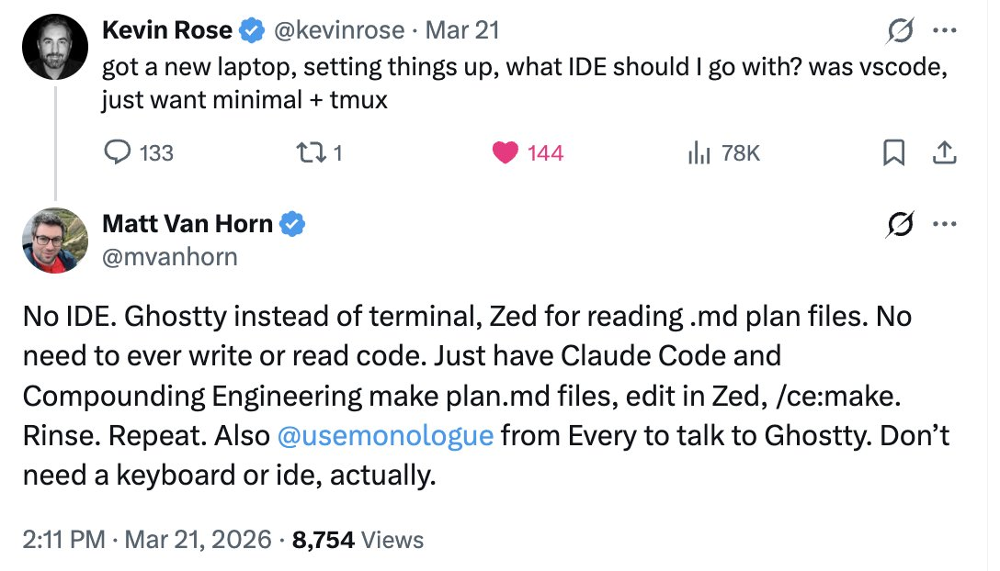
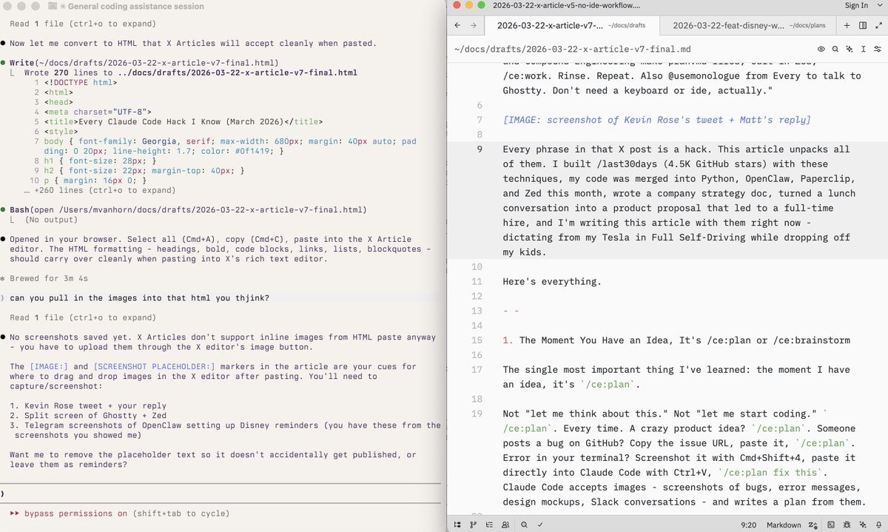
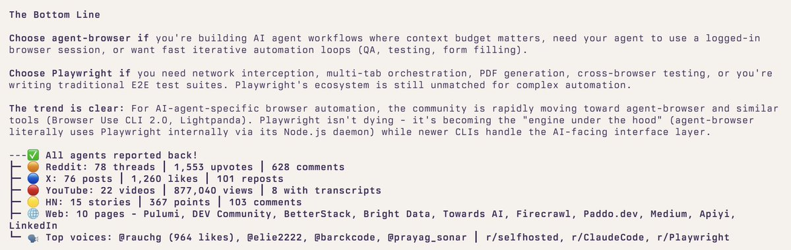
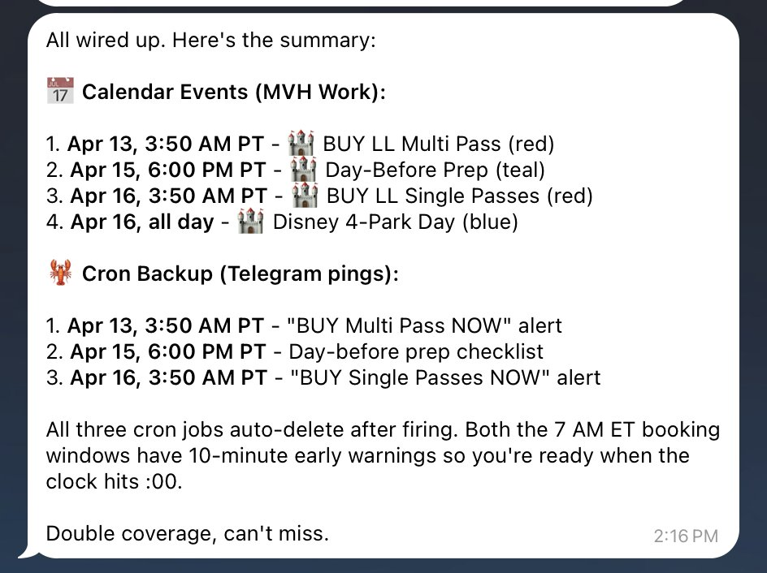

# Every Claude Code Hack I Know (March 2026)

**Author:** Matt Van Horn (@mvanhorn)
**Date:** 12:13 AM, Mar 23, 2026
**Source:** https://x.com/mvanhorn/status/2035857346602340637
**Stats:** 60 replies, 228 reposts, 1.9K likes, 7.4K bookmarks, 647.1K views

---


[@kevinrose](https://x.com/@kevinrose) asked what IDE to use. My reply got the most engagement out of 128 answers: "No IDE. Just plan.md files and voice." Here's everything I meant by that.



## 1. The Moment You Have an Idea, It's /ce:plan or /ce:brainstorm

The single most important thing I've learned: the moment I have an idea, it's /ce:plan.

Not "let me think about this." Not "let me start coding." /ce:plan. Every time. A crazy product idea? /ce:plan. Someone posts a bug on GitHub? Copy the issue URL, paste it, /ce:plan. Error in your terminal? Screenshot it with Cmd+Shift+4, paste it directly into Claude Code with Ctrl+V, /ce:plan fix this. Claude Code accepts images - screenshots of bugs, error messages, design mockups, Slack conversations - and writes a plan from them.

Here's what happens under the hood when you run it. /ce:plan launches multiple research agents in parallel. One analyzes your codebase - reads your files, finds patterns, checks your conventions. Another searches your docs/solutions/ for learnings from past bugs. If the topic warrants it, more agents research external best practices and framework docs. All simultaneously.

Then it consolidates and writes a structured plan.md: what's wrong, what approach to take, which files to touch, acceptance criteria with checkboxes, patterns to follow from your own code. Not generic advice. Grounded in your codebase, your conventions, your history.

/ce:work takes that plan and builds it. Breaks it into tasks, implements each one, runs tests, checks off criteria. Context gets lost? Start a new session, point it at the plan, pick up where you left off. The plan is the checkpoint that survives everything.

Traditional dev is 80% coding, 20% planning. This flips it. As [@jarodtaylor](https://x.com/@jarodtaylor) put it: "If you spend 80% of your time planning it with Opus and then let subagents swarm on it..." The thinking happens in the plan. The execution is mechanical.

Compound Engineering is the plugin that makes this real. From [@EveryInc](https://x.com/@EveryInc):

```
/plugin marketplace add EveryInc/compound-engineering-plugin
```

I became a superfan. Then I became a contributor, the #3 contributor on GitHub, 21 commits, behind only the core team. [@kevinrose](https://x.com/@kevinrose) introduced me to it a few weeks ago.

I have 70 plan files and 263 commits on /last30days. The gap is early commits before I had this discipline. My rule now: unless it's literally a one-line change, there's always a plan.md first.

## 2. Get Voice-Pilled

I couldn't stand voice notes before LLMs. Apple's built-in dictation made me want to throw my phone. But voice-to-LLM is different. The transcription doesn't have to be perfect because Claude Code understands context. It guesses what the mic got wrong. You can mumble, trail off, restart a sentence. Voice finally works because the listener is smart enough to fill in the gaps.

Monologue ([@usemonologue](https://x.com/@usemonologue), from Every - same company that makes Compound Engineering) pipes speech into whatever app is focused. You talk, it types into Claude Code. WhisperFlow is great too. Pick one. I bought a gooseneck microphone for the office.

I'm dictating this right now from Full Self-Driving in my Tesla, dropping off my kids. This paragraph was spoken, not typed.

## 3. Run Four to Six Sessions at Once

This is how I actually spend my day. Four to six Ghostty windows, each running a separate Claude Code session. One is writing a plan. One is building from a different plan. One is running /last30days research. One is fixing a bug I found while testing the last thing.

While /ce:plan spins up research agents in one window, I switch to another window and /ce:work a plan that's already written. While that builds, the third window gets a new bug pasted in. By the time I cycle back to the first window, the plan is done and waiting in Zed.

This is why bypass permissions (next section) is non-negotiable. If every session asks "Allow?" on every action, you can't context-switch. They all need to run autonomously. Check in, react, move on. GitHub is there if you break or ruin everything.

This is also why my MacBook dies in about an hour. Six Claude sessions in parallel. Just ordered the new MacBook Pro.

## 4. Three Settings That Change Everything

Claude Code's default mode asks permission for every edit, every command. You need three config changes.

**"Dangerously skip permissions"** (yes, that's what it's actually called). ~/.claude/settings.json:

```json
{
  "permissions": {
    "allow": [
      "WebSearch", "WebFetch", "Bash", "Read", "Write",
      "Edit", "Glob", "Grep", "Task", "TodoWrite"
    ],
    "deny": [],
    "defaultMode": "bypassPermissions"
  },
  "skipDangerousModePermissionPrompt": true
}
```

skipDangerousModePermissionPrompt: true is the key. Without it, Claude asks you to confirm every session. You can also Shift+Tab to toggle it. Credit: [@danshapiro](https://x.com/@danshapiro) (Glowforge founder, author of Hot Seat). When I set up a friend's Claude Code, the AI actively tried to stop him from enabling this. You have to be direct. It's your computer.

**Sound when Claude finishes.** Add to the same file:

```json
{
  "hooks": {
    "Stop": [
      {
        "hooks": [
          {
            "type": "command",
            "command": "afplay /System/Library/Sounds/Blow.aiff"
          }
        ]
      }
    ]
  }
}
```

Walk away. Come back when you hear the sound. With four to six sessions running, you need to know which one just finished. Credit to Myk Melez.

**Zed autosave.** In Zed settings (Cmd+,):

```json
{
  "autosave": {
    "after_delay": {
      "milliseconds": 500
    }
  }
}
```

This is the Google Docs-like trick. Zed saves every 500 milliseconds. Claude Code watches the filesystem. When Claude edits a file, changes appear in Zed instantly. When you type in Zed, Claude sees it within a second. Ghostty on one half, Zed on the other, both looking at the same file. It feels like collaborating on a Google Doc except one collaborator is an AI.



## 5. Research Before You Plan

Before I /ce:plan, I often run /last30days on it first.

I was deciding between Vercel's agent-browser and Playwright. Instead of reading docs, I ran /last30days Vercel agent browser vs Playwright. In a few minutes: 78 Reddit threads, 76 X posts, 22 YouTube videos, 15 HN stories. Agent-browser uses 82-93% less context tokens. Playwright dumps 13,700 tokens just for tool definitions. [@rauchg](https://x.com/@rauchg)'s post got 964 likes.

Fed the entire output into /ce:plan integrate agent-browser. The plan came out grounded in what the community actually knows right now, not six-month-old training data.

/last30days is open source (4.5K stars, [github.com/mvanhorn/last30days-skill](https://github.com/mvanhorn/last30days-skill)). It searches Reddit, X, YouTube, TikTok, Instagram, HN, Polymarket, and the web in parallel. I do this for everything. Before I pick a library, before I build a feature, before I write this article. I ran /last30days Compound Engineering to get fresh community quotes for section 1. Research, plan, build. That's the real loop.



## 6. Turn Any Meeting into a Plan.md

I had lunch with a potential candidate. We discussed a new product idea that wasn't being worked on at the company. We also talked about food, restaurants, kids. An hour and a half of normal conversation with product brainstorming woven through it.

I had Granola running. After lunch, I pasted the full transcript - ninety minutes mixed with tangents about sushi - into Claude Code: /ce:plan turn this into a product proposal.

Here's what made it magic: Claude Code already knows where our product code lives on GitHub. It also has access to my company strategy folder - every prior strategy plan.md I've written. So when it processed the Granola transcript, it wasn't just extracting ideas from lunch conversation. It was cross-referencing against our actual codebase and every strategic decision we've made before. Granola context + codebase + prior strategy plans = gold.

One-shotted an incredible proposal. Goals, user stories, technical approach, milestones. Ignored the parts about restaurants. Sent it to the candidate that evening.

He's now working with us full time on that product.

Granola now has MCP support, so I use it directly inside Claude Code. No more copy-pasting. Every meeting's context flows straight into the plan.

## 7. Use Plan Files for Everything, Not Just Code

I was writing a strategy doc for my company. Claude Code and the markdown file open side by side. Talked into Monologue: "Give me three approaches for the go-to-market. Outline the pros and cons of each."

Three options appeared in Zed. "Option two is closest but the language in option one is better. Combine them." Updated instantly. "Now address the biggest risk." Added. "Second paragraph is too long." Shortened.

Claude Code pulls in our GitHub, so it understands the current product. It also has access to all my prior strategy plan.md files. When I'm writing new positioning, it has the full context of every strategic decision I've made before. That compounding context is what makes each plan better than the last.

Strategy docs, product specs, competitive analysis, this article. Same workflow. Talk, plan, iterate.

## 8. Run a Mac Mini for Remote Claude Code

I have a Mac Mini set up for OpenClaw, but there are two other things I've done with it:

**Telegram from your phone.** Claude Code has a Telegram integration. I message my Mac Mini from my phone via Telegram. At dinner, think of a bug, type /ce:plan fix the timeout issue into Telegram. Plan is waiting in Zed when I'm back at a screen. Claude Code even uses my OpenClaw AgentMail to email me plan files when I'm away.

**tmux on airplane flights.** Credit: Nathan Smith. Claude Code doesn't handle airplane wifi well. Connection drops, session dies and it does not even tell you. But tmux into your Mac Mini first and the session runs on that machine. Your laptop is just a window. WiFi drops for 20 minutes over the Atlantic? Reconnect. Session is exactly where you left it and it did work.

Shipped features the entire flight back from Europe.

## I Also Use This Workflow for Open Source

If you look at my GitHub profile ([github.com/mvanhorn](https://github.com/mvanhorn)), here are some of the projects I've been merged into recently, all with plan.md files before any lines of code were written:

- **Python** - defaultdict repr infinite recursion, man page text wrapping
- **OpenCV** - HoughCircles return type, YAML parser heap-overflow
- **Vercel Agent Browser** - Appium v3 vendor prefix, WebSocket fallback, batch command workflows (#5 contributor)
- **OpenClaw** - browser relay, rate limit UX, iMessage delivery, Codex sandbox detection, voice calls
- **Zed** - $ZED_LANGUAGE task variable, Reveal in Finder tab context menu, git panel starts_open setting
- **Paperclip** - SPA routing, plugin domain events, promptfoo eval framework (#3 contributor)
- **Compound Engineering** - plan gating, serial review mode, skills migration, NTFS colon handling (#3 contributor)

## My Wife Is Mad at Me

I carry my laptop everywhere. Four to six Ghostty tabs plus Zed. She is not thrilled. The Mac Mini + Telegram helps. But when I want multiple plans evolving in parallel in real time, I need the laptop. She really wants me to stop bringing it to school drop off.

Sorry, sweetie.

## This Article Was Written with This Workflow

This is a markdown file in Zed. Claude Code is running in Ghostty. I talked into Monologue: "the theme is wrong, rewrite the opening." "Add the Granola story." "Don't call Zed my IDE." Claude rewrites. Changes appear in Zed. I react. Seven complete rewrites.

That's everything I know. A voice app, a plan file plugin, three config changes, four to six parallel sessions, a Mac Mini, and meetings that turn into product proposals. No IDE. No code. Talk, plan, build. From a desk, from a couch, from a car.

## Bonus: When You Run Out of Tokens

This kind of efficiency will blow through your $200/month Claude Max plan. Four to six parallel Opus sessions all day adds up.

The answer: also get the $200/month Codex plan. Install the Codex CLI, and Compound Engineering can build with Codex credits instead. I just shipped /ce:work --codex to Compound Engineering - it merged today - that delegates implementation to Codex when Claude credits run low.

Some friends use Codex for code reviews of Claude Code work and vice versa. Others prefer Codex's code output but call it from Claude Code for orchestration. The two plans complement each other. Claude for planning, Codex for heavy implementation.

I also have a "night-night" mode I run to work while I sleep but explaining that is for another time.

## Bonus 2: The Disney World Play-by-Play

To show this workflow soup to nuts on something that isn't code, here's a real example from today. I was at the soccer field watching my kids game. Another parent and I were talking about Disney World trips. I pulled out my laptop and showed her.

**Step 1:** /last30days Disney World. Two minutes later, the full picture. 66 Reddit threads (11,804 upvotes), 34 X posts, 8 YouTube videos. Price shock is the dominant conversation - an $8,500 trip report on r/DisneyPlanning hit 183 comments. Six rides closed in March alone. Buzz Lightyear reopens April 8 with new blasters. Rock 'n' Roller Coaster is becoming a Muppets ride. DinoLand is demolished.

**Step 2:** "What will be open / not open in Pairl April 16th to be specific" (typos and all - CC doesn't care). Claude checked the refurbishment calendar, cross-referenced the last30days data, gave me the full open/closed list.

**Step 3:** /ce:plan I'm going to be at Disney World for one day. I want to do at least three parks, maybe four, probably four, because I'm crazy. I want to do Guardians at Epcot, do a few rides at Hollywood Studios, do a few rides at World, do the Everest ride at Animal Kingdom, and at least one Avatar ride. Plus: "What is the strategy to get all the Genie Plus and the other things to make this work? Also, one week before, don't I have to look up something? What do I buy when? Help me set the reminders. I don't care about food. I do not have a hotel. happy to pay the $25 for one time pass"

Claude's research agents spun up, cross-referenced with the last30days data, and wrote a structured plan.md: park order (AK -> HS -> Epcot -> MK), exact Lightning Lane booking strategy, three alarm reminders for April 13/14/15 at 7:00 AM, which rides need Single Pass ($14-22 each) vs Multi Pass, height requirements for my kids.

**Step 4:** Opened the plan in Zed. Reviewed it. Said for the other parent to make her plan "So I'm going on a trip to Disney World, and I'm doing three days in the parks. Tell me the most efficient routes, what passes to get, what extras to have... it's an eight and five-year-old." Claude wrote a new 305-line plan with Rider Switch protocols, day-by-day itineraries, and a "measure your 5-year-old in shoes this week" warning.

**Step 5:** "csn you pushCan you publish this last one on a Vercel site in light mode? That's easy to see." (More typos. Still doesn't matter.) Claude built a clean HTML page and deployed it.

Live at [disney-plan-ebon.vercel.app](https://disney-plan-ebon.vercel.app/)

**Step 6:** Dropped the .md file into OpenClaw via Telegram. Said "can you make a plan to add all these reminders to YOU with dobel safeties in case you mess up day before / calendar etc." OpenClaw read the plan, set up calendar events on my work calendar AND cron job backups that ping me on Telegram. Double coverage for every critical booking window. Apr 13 at 3:50 AM PT: "BUY Multi Pass NOW." Apr 16 at 3:50 AM: "BUY Single Passes NOW." Both 10 minutes before the 7 AM ET window opens. Auto-delete after firing.



Voice to research to plan to website to automated reminders. At a soccer field.

That's the workflow. It works for code, strategy, open source, articles, and apparently Disney World.

/last30days is open source. 4.5K stars. 70 plan files and counting.

- [@slashlast30days - github.com/mvanhorn/last30days-skill](https://github.com/mvanhorn/last30days-skill)
- [Compound Engineering: @EveryInc](https://github.com/EveryInc/compound-engineering-plugin)
- Monologue: [@usemonologue](https://x.com/@usemonologue) (from Every)
- Granola: [granola.ai](https://granola.ai) (now with MCP)
- Ghostty: [ghostty.org](https://ghostty.org)
- Zed: [zed.dev](https://zed.dev)
