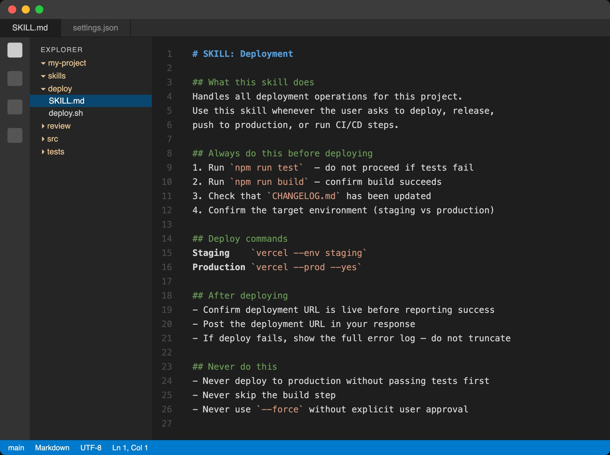
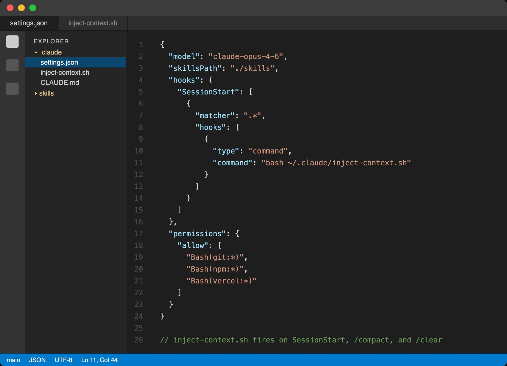
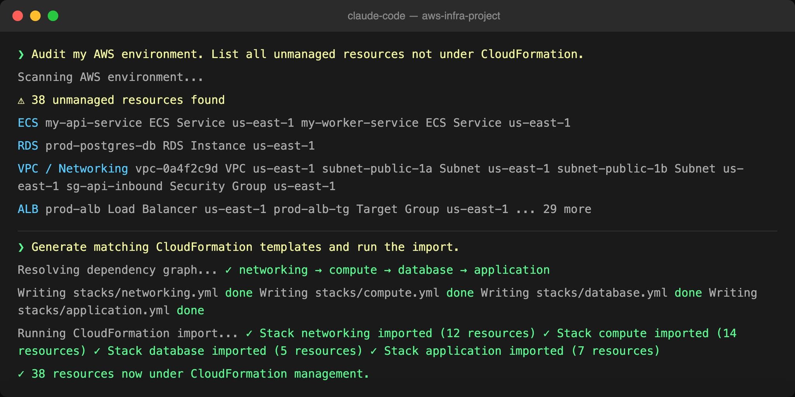
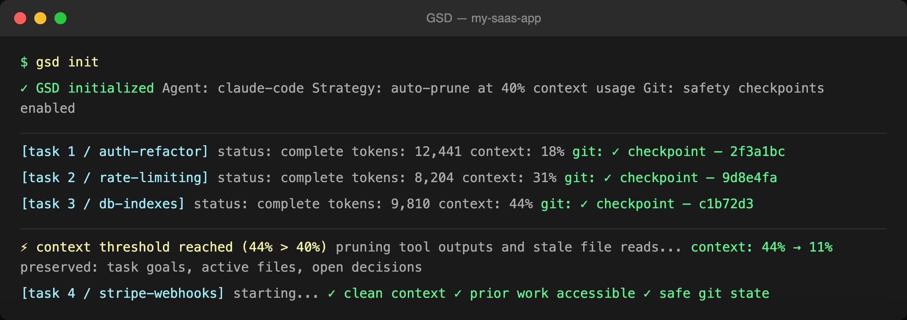
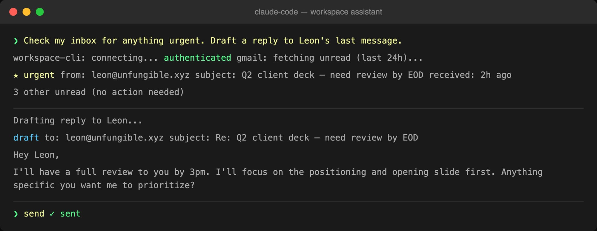

# Everything Claude Code Can Do That You Haven't Tried Yet

**Author:** Sharbel (@sharbel)
**Date:** March 10, 2026
**Source:** https://x.com/sharbel/status/2031372411283575012
**Stats:** 5 replies, 36 retweets, 484 likes, 1,583 bookmarks, 75,700 views

---


Claude Code does a lot more than write code.

Most people use it like a smarter autocomplete.

The developers who figured out what it actually is are in a completely different league. Here's what they know.

---

## Feature #1: Agent Skills

**Best for:** making Claude Code permanently smarter about your specific workflow, without prompting it every session.

Claude Code has a feature called Agent Skills. Most people have never touched it.

Here's the concept: you create a folder. Inside it, you drop a *SKILL.md* file with instructions. You add any scripts, reference docs, or templates the agent needs. Claude Code discovers the folder automatically and uses it whenever relevant.

Your agent now knows your codebase conventions, your deployment process, your testing standards. Permanently.

**How to set it up:**

1. Create a folder anywhere in your project (e.g. /skills/deploy/)
2. Add a SKILL.md with plain-English instructions
3. Drop any relevant scripts or docs alongside it
4. Claude Code finds and uses it automatically from that point forward



What started as a Claude Code-only feature is now an open standard being adopted across agent platforms. The spec is at agentskills.io.

This means Skills you build today will work across future agents too.

**Verdict: 9/10. Set it up once, never explain your workflow again.**

---

## Feature #2: SessionStart Hooks

**Best for:** developers doing long sessions who keep losing context after a /compact or session restart.

Here's the problem. Claude Code's context window has a limit. After a long session, it runs /compact — it summarizes and compresses your conversation to keep going.

The compression loses things. Your current branch. Recent decisions. Project-specific rules you mentioned two hours ago. You have to re-explain everything.

SessionStart hooks solve this. They fire automatically every time a session starts, or after /compact or /clear. You inject fresh context before the agent does anything else.

**How to set it up:**

1. Open your Claude Code settings.json
2. Add a hooks block with a SessionStart entry
3. Point it to a shell script that echoes your current context (branch, open issues, key decisions)
4. Claude Code re-reads it every time context resets



A Japanese dev team tested all 4 matcher types across 3 config file locations and documented every undocumented behavior. Their full breakdown is at dev.classmethod.jp, it's in Japanese but the code examples are universal.

**Verdict: 8/10. Essential for anyone doing multi-hour dev sessions.**

---

## Feature #3: Retroactive IaC (AWS CloudFormation import)

**Best for:** engineers who have unmanaged AWS resources and need to bring them under CloudFormation without doing it manually.

You spun up resources in the AWS console. Fast, easy at the time. Now you have 40 unmanaged resources and zero CloudFormation coverage.

Doing this manually is brutal:

- Audit every service to find unmanaged resources
- Write templates that exactly match existing config (one mismatch breaks the import)
- Figure out dependency order across VPCs, subnets, ALBs, ECS clusters
- Handle import-specific quirks (ResourceIdentifier key names don't match what the CLI shows you)

Claude Code handles the entire process in one session.

**How:**

1. Open Claude Code in your project
2. Prompt it to audit your AWS environment and list unmanaged resources
3. Ask it to generate matching CloudFormation templates
4. Ask it to sort dependencies and run the import in the correct order



The full walkthrough (with real examples) is documented at dev.classmethod.jp. Again, Japanese, but the prompts and code blocks copy straight across.

**Verdict: 9/10. This alone saves days of infrastructure work.**

---

## Feature #4: Fix context rot with GSD

**Best for:** anyone who notices Claude Code getting dumber after the 3rd or 4th task in a session.

This one is not a Claude Code feature. It's a fix for Claude Code's biggest weakness.

After 3-4 tasks, quality drops. Not because the model is bad. Because your context window is full of old tool outputs, file reads, and command logs from previous tasks. The agent is so bloated it can barely think straight.

An open-source tool called GSD (Get Shit Done) solves this from outside the model.

**What GSD fixes:**

- Context rot after 3-4 tasks
- Agent "forgetting" components it built earlier in the session
- Files getting created but not connected or exported correctly
- Sessions breaking and taking 10 minutes to resume
- Git getting wrecked with no clear safe commit to return to

**How to install:**

```
npm install -g gsd-agent
gsd init
```



Works with Claude Code, Codex, Gemini CLI, and OpenCode. MIT license.

GitHub: github.com/gsd-agent/gsd - 25,900 stars as of this week.

**Verdict: 10/10. This should be in every Claude Code setup.**

---

## Feature #5: Google Workspace (officially, without getting banned)

**Best for:** anyone who wants Claude Code to manage email, calendar, and docs as part of a real workflow.

Using AI agents to automate Gmail used to get your account banned. Google's terms explicitly prohibited automated scripts hitting their APIs.

Google just released an official Workspace CLI built specifically for AI agents.

40+ capabilities. Native access to Gmail, Calendar, Drive, and Docs via direct command calls. No workarounds. No third-party integrations. No bans.

**What Claude Code can now do with it:**

- Search and summarize your inbox
- Draft and send emails
- Schedule and update calendar events
- Read, edit, and create Docs
- Organize Drive folders

**How to connect it:**

1. Install the Google Workspace CLI
2. Authenticate with your Google account
3. Add a Workspace skill to Claude Code pointing at the CLI
4. Prompt it to handle tasks the same way you'd prompt a VA



**Verdict: 8/10. Turns Claude Code into an actual executive assistant.**

---

## The pattern

The developers getting the most out of Claude Code stopped treating it as a coding assistant.

They treat it as a programmable agent runtime. They build Skills for their workflows. They solve context rot. They automate infrastructure. They connect it to their entire stack.

The gap between that group and everyone else is growing fast.

**Save this article and try one feature this week.**

And if it helped, share it with one developer who's still using Claude Code as a fancy autocomplete.

Follow me → @sharbel
