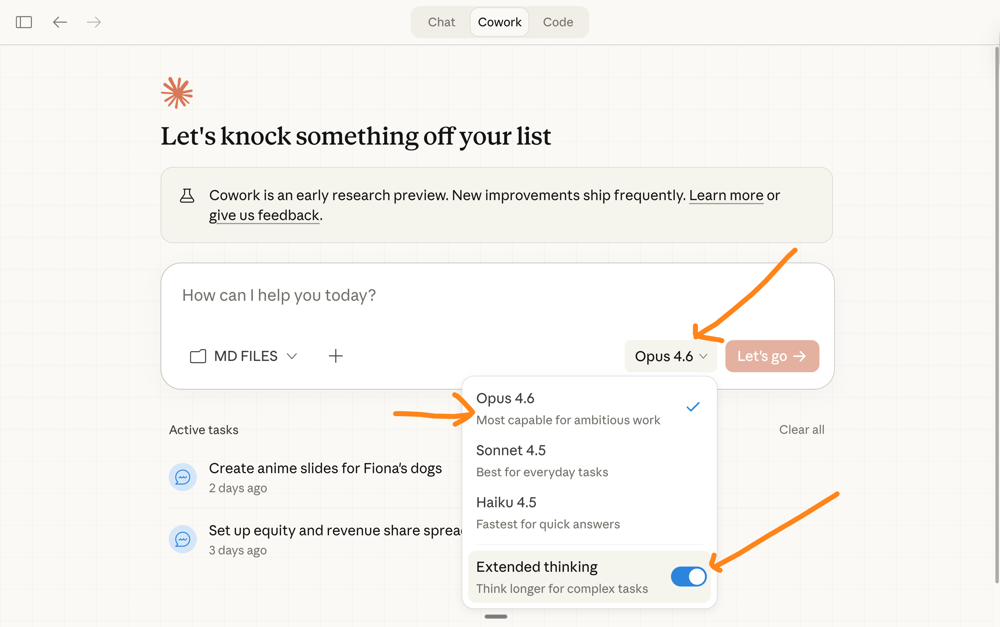
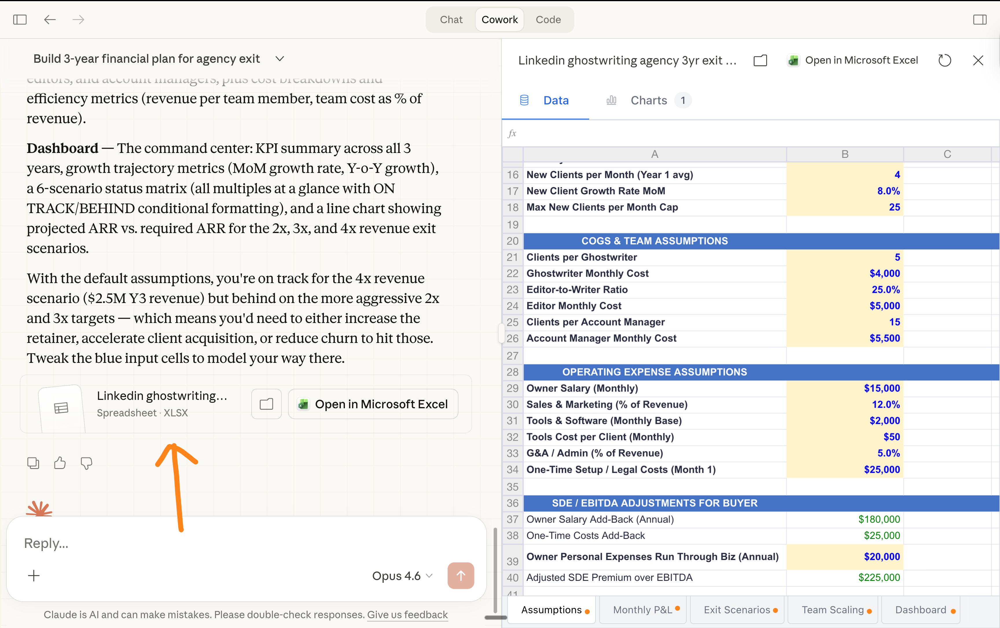
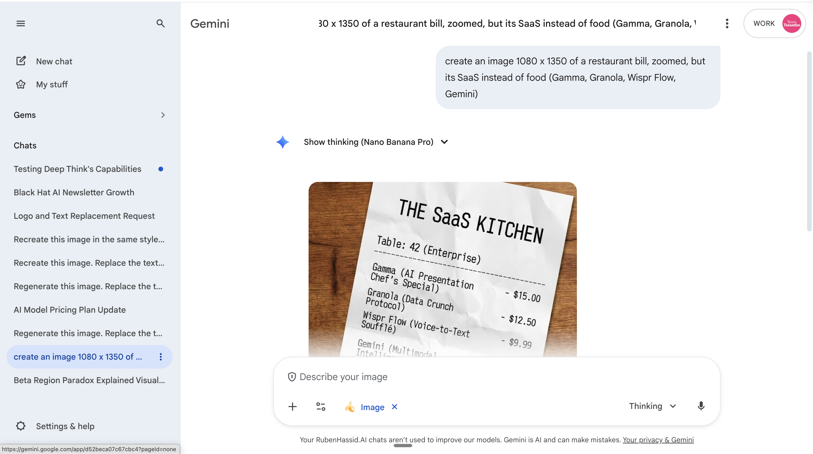
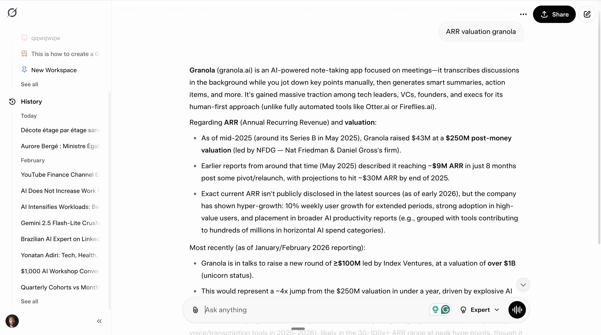
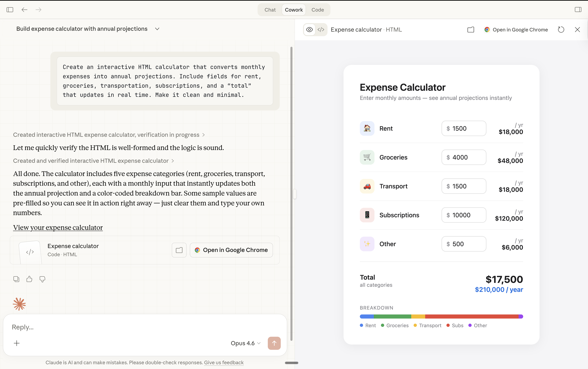
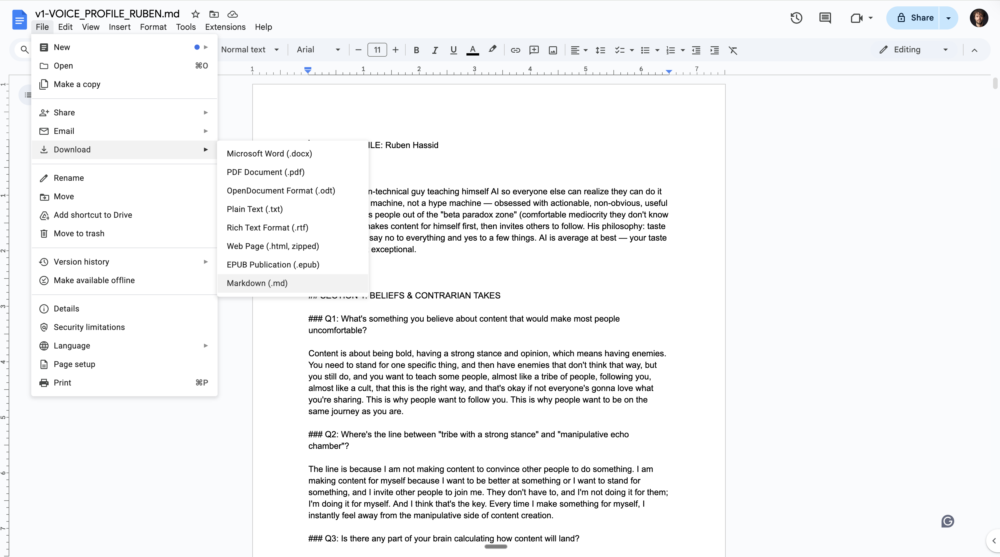

# How to set up Claude the right way (so you actually stop going back to ChatGPT)

**Author:** Ruben Hassid (@rubenhassid)
**Date:** February 20, 2026
**Source:** https://x.com/rubenhassid/status/2024871775574593798
**Article:** https://ruben.substack.com/p/claude
**Stats:** 50 replies, 395 retweets, 3,644 likes

---

*The tweet links to a full Substack article. The complete article content follows below.*


---

The people I talk to every day quietly switched.

The creators I follow. The teams I consult for. The founders in my DMs. One by one, they stopped opening ChatGPT. And they all moved to the same place.

Claude.

See, I've been writing about AI for three years. Thousands of posts and hundreds of millions of views. So people often ask me, "Ruben, I've seen your newsletter about [tool], but do you really use it?" If I write about it, I do use it.

And right now, in February 2026, Claude is the single most important AI tool for anyone doing knowledge work. Not because it's perfect (it's not, and I will share where it falls short). But because what it does well, nothing else comes close.

This is the guide I wish someone gave me before I wasted months on the wrong AI. Every feature. Every install step. Every first prompt.

1. Save this guide and spend 30 minutes this weekend to master Claude.

2. Send it to anyone asking you, "I keep hearing about Claude, but I never tried it".

## Claude is not one tool. It's six.

You think Claude is "like ChatGPT but from Anthropic." A chatbot. A text box. You type, it responds. That was true in 2024. In 2026, Claude is six things:

1. Cowork (a desktop app that works on your actual files)
2. Model (most of you use the wrong Claude)
3. Excel (an AI inside your spreadsheets)
4. Plugins (turn Claude into a specialist for your exact job)
5. Artifacts (interactive outputs you can use, not just read)
6. Projects (persistent context folders that remember everything)

I ranked them from most to least important.

---

## 1. Claude Cowork



### What it is (in 10 words):

Kind of like ChatGPT, but much better.

### Why does it matter:

Claude Cowork lives on your computer. It reads your files. It creates documents. It builds spreadsheets. It writes code you'll never see to answer you. It asks *you* questions when it needs clarity (*instead of guessing wrong*).

Cowork is the Claude Code of knowledge workers. Yes, Claude Code is not on my list because my audience *(myself included)* does not code. But it's just as good.

### How to install Cowork:

1. Go to [claude.com/download](https://claude.com/download). Download the app.

2. You need a Pro account ($20/month). Or $17/month if you pay annually.

3. Open the app. Click the **Cowork** tab at the top.

4. Select a folder from your computer. This is how Claude reads your files.

5. Pro tip: create markdown files about [you](https://ruben.substack.com/p/i-am-just-a-text-file) - or anything you **[want](https://ruben.substack.com/p/magic)**.

6. Made a full guide on how to use Cowork **[here](https://ruben.substack.com/p/quit-chatgpt)**.

### Your first prompt:

```
I want to [YOUR TASK] so that [WHAT SUCCESS LOOKS LIKE].

First, read the uploaded files completely before responding.

DO NOT start executing yet. Instead, ask me clarifying questions (use AskUserQuestion) so we can refine the approach together step by step.

Only begin work once we've aligned.
```

The key is to force Cowork to ask you questions.

It starts generating a form to prompt you to get better answers from Claude.

I'm obsessed with this feature. I don't even need to be clear anymore. Claude forces me to be clear. And if I feel like we're not going in the right direction, I say it. Claude Cowork will generate a new form to build up on the mistakes.

And with over 1,000,000 token context window *(its ability to reason with a lot of text from your conversation)*, I never felt like Cowork was hallucinating.

### The mindset shift (if you're coming from ChatGPT):

ChatGPT trained you to write better prompts. Longer prompts. Cleverer prompts. You have a folder of saved prompts you haven't opened in weeks.

Forget that.

With Claude Cowork, the game is text files.

Take everything you know (*your writing style, your brand rules, your best examples, your past work*) and put it in .md or .txt files. Drop them in a folder. Point Claude to that folder. Here's how:

Claude reads your files before responding. The more context you give it as files, the less prompting you need. The output goes from *"generic AI"* to *"this actually sounds like my work."*

Now, pro tip: don't just upload hundreds of texts. Be mindful of both the quantity and quality of *what* you upload. It takes time to do it at first (writing these text files), but it compounds with time since you stop prompting.

1- You write the best md. files (like briefs for your team)

2- You start all of your prompts to Claude with *"Read this & then ask me questions to do [task]."* I simply stopped prompting differently.

I wrote a full guide on how to create your own text file [here](https://ruben.substack.com/p/i-am-just-a-text-file). Start there.

---

## 2. Use the right Claude



**Opus 4.6 + Extended.**

Right now, the model you want is **Opus 4.6**. It dropped on February 5, 2026. It's the smartest model available. Period.

### How to set it up:

1. Open any Claude chat (on claude.ai or Cowork).
2. Click the model selector dropdown at the bottom of the chat.
3. Select **Opus 4.6** + Extended Thinking.

Do not forget to turn on **Extended Thinking**. It forces Claude to *think* first.

### About internet access.

Claude can connect to your tools. Slack, Google Drive, Notion, Figma, and 50+ others. They're called Connectors.

Go to Settings > Connectors. Browse the directory. Click "**Add.**" Done.

Once connected, Claude can search your Slack messages, pull from your Google Docs, or reference your Notion pages mid-conversation.

---

## 3. Claude in Excel



### What it is (in 10 words):

An AI inside your spreadsheet that creates/reads formulas.

### Why it matters:

Claude in Excel is different. It lives *inside* your spreadsheet. It reads every tab. It knows what D14 actually contains.

### How to install (takes 3 minutes):

1. Open Microsoft Excel (desktop or web). You need Excel 2016 or later.
2. Go to Insert > Get Add-ins (Windows) or Tools > Add-ins (Mac).
3. Search "Claude by Anthropic." Look for the official one with the Claude logo.
4. Click "Add" or "Get It Now."
5. Sign in with your Claude account.

You need a paid Claude plan (Pro, Max, Team, or Enterprise). The add-in itself is free.

---

## 4. Claude Plugins



Pre-built skill packs that make Claude an expert instantly. Plugins give Claude specialized capabilities for sales, marketing, legal, finance, data analysis, product management, and customer support functions.

### How to install:

Open Claude Cowork, visit claude.com/plugins, browse the directory, click install, and the plugin activates automatically. Each plugin includes its own slash commands.

Example prompts include drafting marketing content with voice profiles or building interactive dashboards from CSV data using slash commands like `/draft-content` and `/build-dashboard`.

---

## 5. Claude Artifacts



Interactive outputs inside Claude (instead of just text like a chatbot). No installation required -- they work automatically in Claude Cowork.

You can create an interactive HTML calculator that converts monthly expenses into annual projections, or build a visual comparison chart and project tracker. Claude highlights every cell it modifies, requiring user approval before changes take effect.

---

## 6. Claude Projects



A folder of chats where Claude remembers the files you upload. Projects require a Pro or Team plan. You can create projects, upload key files like brand docs, writing samples, reference material, and data. The author notes he has discontinued personal use due to bugs, preferring Cowork with markdown files instead.

---

## Where Claude Falls Short

Claude cannot generate images. For visual content creation, use Gemini instead. Video generation is better handled through Seedance 2.0 or upcoming Gemini VEO-4. Real-time search capabilities are stronger in Grok, which has better internet connectivity through X integration.

---

## Your First 30 Minutes with Claude

- **Minutes 0-5:** Download the desktop app and get a Pro account ($20/month).
- **Minutes 5-10:** Create a markdown text file documenting your personal work style and communication preferences.
- **Minutes 10-15:** Start your first Cowork conversation by selecting files and attempting a task.
- **Minutes 15-20:** Explore plugin installation by browsing the library and testing slash commands.
- **Minutes 20-25:** Try artifacts by requesting an interactive HTML weekly planner.
- **Minutes 25-30:** Try Claude in Excel by having it explain formulas or create new spreadsheets.

---

## The Real Reason to Switch

"I don't care about Claude, ChatGPT, Grok, Gemini, or any other models." The newsletter aims to filter AI noise rather than promote specific tools. The conclusion encourages readers to share the article with others and subscribe for ongoing guidance on AI implementation in daily work.
