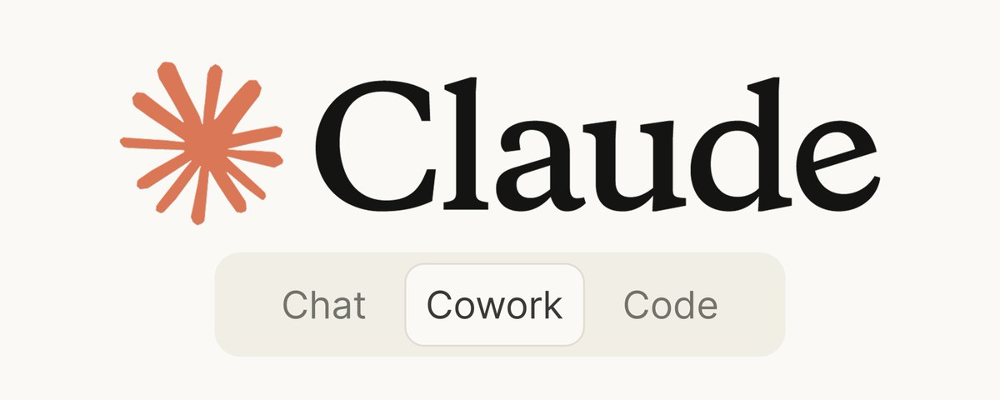

# How to Use Claude Cowork Like a Second Employee

**Author:** Jesse Pujji (@jspujji)
**Date:** March 19, 2026
**Source:** https://x.com/jspujji/status/2034616093386678778
**Stats:** 30 replies, 219 reposts, 1.9K likes, 9.6K bookmarks, 1.6M views

---



Almost every marketer I talk to is talking to Claude: First draft. Research. Ideation.

90% of them are wasting their time inside the "Chat" feature.

But there's a rare unicorn marketer using *this* tool, already in Claude, and doubling their capacity.

One hire. But two employees.

Claude Cowork is one of the single most impressive AI tools I've seen.

My team and I have spent hours in multiple AI tools (ChatGPT, Lovable, Gamma, etc.)…

Cowork is one of the only tools I can see us still using in 6 months.

BTW: If you're non-technical and need AI-powered marketing support in data analysis, research, and campaign creation, this resource is what I train my talent in.

Join the waitlist for the talent here:
https://tinyurl.com/2admhthh

## Claude Cowork 101 (What is it?)

Cowork is an agentic desktop tool built into the Claude app.

It was released in early January, but it's still in early research preview. That means it's still early enough that it's not being widely adopted.

Cowork gives Claude direct read/write access to folders on your computer and the ability to complete multi-step tasks without your supervision.

In simpler terms, you define what "done" looks like. Claude makes a plan, breaks it into smaller tasks, and delivers finished files to your folder.

You prompt. You come back to finished work.

## Stop treating Cowork like it's Chat. It's not.

Chat is all about prompting and process.

It's great, but I've seen how prompting can actually make tasks take longer, even for great marketers.

These marketers get stuck in judgment, engineering prompts to be perfect, then refining output, only for the output to change what they liked to begin with.

That iteration loop is shorter in Cowork.

Here's how:

**Chat** = you ask, it answers. You're always driving.

**Code** = developer tool. Terminal, git, command line. If you code, it's incredible. If you don't, it's irrelevant.

**Cowork** = you delegate a task, walk away, and come back to finished files in your folder.

For marketers without a dev background, Cowork is the one that matters.

Here's why: Cowork automates tasks that get in the way of strategy: the file organization, the research pulls, the brief formatting, and the competitor analysis. Everything that gets crammed into your "Admin Block."

It's less back and forth than prompting ChatGPT.

And more similar to how marketers are used to delegating (no prompt libraries involved).

## How to Set It Up (20 Minute version)

This won't take long. But do it right the first time. It'll save you every session after.

**Step 1: Download Cowork**

Download Claude Desktop from claude.com/download (Cowork can't be downloaded through the browser).

Sign in with a paid plan (I use the Pro plan at $20/month).

Open the app. Open Cowork.

**Step 2: Keep your Workspace Safe**

Before you get anything done, create a dedicated workspace for Claude to work in.

If something goes wrong (it might), this keeps your files safe.

Cowork only has access to the contents of this file. Treat that seriously:

Create a folder:

Folder Title: Claude Workspace

- Sub-folder: Context (This is the files you're inputting)
- Sub-folder: Projects (This is where active projects will live)
- Outputs: Where Cowork will deliver finished work

**Step 3: Build Your Context Files**

Context determines how Claude will talk to you, and the work it spits out for you.

If you want "generic AI voice," skip step 3.

Upload your "context file" in a plain-text .md file type.

Here are the 3 that I use:

who-i-am.md → Literally answers who I am, a brief intro, what I do, my current priorities, where I spend time, and also where I don't spend time (just as helpful).

how-i-talk.md → When Cowork is creating writing for me, it's all based on this: how I communicate, samples of my writing. I've used multiple Granola recordings to train this to my speaking voice.

how-you-work.md → How Cowork should work for you. EX: "Don't delete without confirming. Ask questions in a concise, bullet point format. Output format should be .pdf."

These should take you more than 10 minutes to create.

But that means every session won't start from scratch. Instead, Cowork will know your voice, how you work, and build off of that for every task.

**Step 4: Create Global Instructions**

Cowork Global instructions define how Claude operates across all sessions.

It's similar to the context file, but more condensed.

These instructions apply to every Cowork session.

Include information like:

- Preferences
- Conventions
- Context
- Guardrails

Here's what mine looks like:

"I'm Jesse Pujji, a CEO at multiple companies with several different enterprise clients. Before beginning a new task, review my context file. Always ask clarifying questions in a concise bullet point format before executing, no more than 5 questions. Then show a brief plan. Default outputs: .docx, .pdf. Do not delete files without approval."

Now, you won't be starting from scratch every time.

## The Building Blocks of Cowork

This is the 201 level of Cowork.

Most teams aren't trained in each of these building blocks, but my teams are (and I see a difference).

**Skills:** Give your Cowork access to specialized knowledge and workflows designed to complete tasks in a specific, repeatable way. Cowork + skills is like an employee with a specific certification.

To play with skills, first make sure skills are turned on; go to:

Settings → Capabilities → ✅ Code execution and file creation

To customize what skills you use with Cowork, you can either:

- Download pre-built skills from sites like Notion, Figma, and Atlassian
- Create your own skills with Claude Chat

**Connectors:** This is how you get Cowork to talk to software outside of Claude: Slack, Google Calendar, and Granola.

(These live right underneath skills in "Capabilities).

**Plug-ins:** Bundles of skill, entire repeatable workflows, in one installable package. Curating plug-ins turns Cowork into a second employee.

Here are some of the plug-ins that move the needle for my team:

## The Cowork Plug-Ins You Should Install

Using plug-ins to string together skills, commands, and connectors into roles makes task outputs quick.

It also takes the manual building off your plate and puts you into execution.

These are the plug-ins marketers will need:

**1. Productivity** (not just marketers)

- Manages tasks, calendars, and daily workflows
- Type /productivity:start and Claude reviews your day
- Connects to Slack, Notion, Asana, Linear, and more

**2. Marketing** (for someone who's running content/campaigns)

- Type /marketing:draft-content and Claude pulls your brand voice, audience data, and recent campaigns
- Generates blog posts, email sequences, social copy, and ad variations
- Tracks what's performing and suggests what to write next

**3. Design** (for marketers reviewing design)

- Type /design:review and drop a screenshot or Figma link
- Claude audits for accessibility, spacing, consistency, and UX patterns
- For marketers without formal design training, this is a handicap to A+ designs

Start with these 3.

There are dozens available in Cowork's library.

Even more available from GitHub and other libraries.

Here's how my team uses them in practice:

## 3 ways my team uses Cowork today

**1. Client Organization**

The problem: We placed a Growth Assistant doing ops working in a client with 4 months of files dumped into one folder. Briefs, assets, screenshots, notes, 12 of the same assets with slightly different dimensions.

The prompt:

```
Organize all files in /client-a/raw into subfolders by type: briefs, assets, reports, creative, and notes. Rename all files using the format YYYY-MM-DD-descriptive-name. Create a summary log documenting every change. Don't delete anything. If a file could belong to multiple categories, put it in /needs-review.
```

What Cowork gives you: Every file is categorized into subfolders by type, renames everything by data and format (YYYY-MM-DD-descriptive-name format), and creates a summary log documenting every change. What needs review goes into "/needs-review."

This solves one of those easy 2hr problems that no one has time to solve.

And it put their ops assistant on actual ops work. Not an organization.

**2. Micro-Influencer Sourcing for UGC**

The problem: 15-20 low-cost, micro-influencers in a specific niche for a UGC campaign. But you don't have the time to manually scroll through Instagram, TikTok, Reels, check follower counts, vet style, and build a spreadsheet.

The prompt:

```
Research micro-influencers (5K-50K followers) in the [niche] space on Instagram and TikTok. I'm looking for creators who post [content style] and whose audience matches this ICP: [description]. Build a spreadsheet with: handle, platform, follower count, avg engagement rate, content style notes, and any contact info you can find. Save to /client-b/influencer-sourcing/.
```

What Cowork gives you: Creators matching your ICP, niche, platform + a shortlist with handles, follower counts, engagement rates, content style notes, and contact info. Will need human review, but draft one is done.

This is changing how my team is doing UGC.

**3. Competitor Analysis (Up to Date)**

The problem: You want weekly competitor analysis, but it falls off the list every Monday.

The prompt (using /schedule)

```
Every Monday at 7am, research [competitor names] for news, product updates, pricing changes, or positioning shifts from the past 7 days. Check [industry publications] for relevant coverage. Save a summary brief to /competitive-intel/YYYY-MM-DD-weekly-brief.md. Flag anything that directly impacts our positioning.
```

What happens: Every Monday at 7 am, Cowork delivers a competitor list with product updates, pricing changes, new content plays, etc as a formatted brief to your folder. (This uses scheduling, so it will only work if your computer is on!)

The result is higher visibility, which puts my team into a strategy.

Exactly what I want.

## It's time to change how you market

Most marketing teams are going to keep using AI like it's Google.

That's not a competitive edge.

What builds your moat is what always has worked: how you delegate.

2026's best marketers are leveraging Cowork and building their team to build systems that run whether they're at their desk or not.

Start with one workflow. Automate the task you keep pushing to Friday. See what happens when you get that hour back every week.

And if you're looking for AI-trained talent that can operate this system, I'm placing marketers trained in Claude Cowork. $3,500.

Talent trusted by HubSpot, Notion, and Reddit.

https://tinyurl.com/2admhthh
