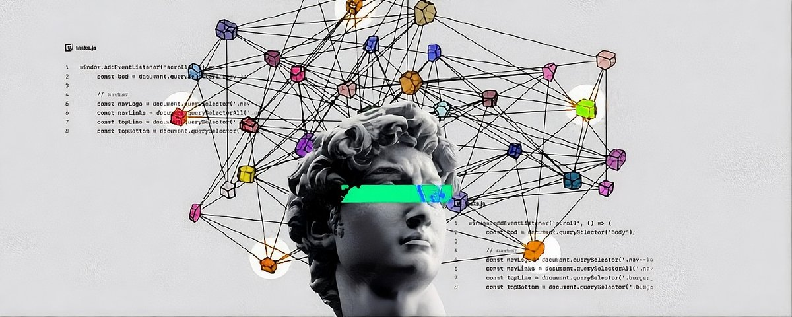

# How to write Prompts to ship 100x faster

**Author:** Himanshu (@nothiingf4)
**Date:** March 8, 2026
**Source:** https://x.com/nothiingf4/status/2030682331670056964
**Stats:** 14 replies, 27 retweets, 128 likes, 344 bookmarks, 29K views

---



I spent 6 months figuring out why some prompts work
most will bookmark and do nothing  but

this  guide  covers all the tactics that actually matter,
1% who apply this will ship 10x faster while others guess

I've been using in Claude code and Codex for a while now, and I figured out exactly what separates prompts that get the work done from ones that you  waste your time writing aimlessly. Here's everything I know.

You have probably had the moment you ask ChatGPT or Claude something, get back a wall of generic bullsh*t, and think, "Why is this thing so dumb?" but you have to know a few things before calling it dumb. It's not dumb. You just don't know how to communicate with it. By the way I have mentioned few good prompt templates in the last part of this article

## Prompt mistakes you are making unwillingly

To know what works for you is the first half of your job, the other half is to know where you are going wrong. So that you don't make the recurring mistakes.

1. Asking multiple unrelated things in one go/prompt -  when you chain unrelated tasks together, it distributes the model's attention.
2. Being vague about the negative space - telling the model what you want is good; telling it what you don't want is equally powerful.
3. Prompt & forget - most people just send one prompt, get a mediocre answer, and give up. What you should do is consider the first response as a draft and iterate over it to land on a  final plan.
4. Not giving the model permission to say "I don't know"  - To stop getting fake answers just add a simple rule to your prompt. "If you aren't sure, say so instead of guessing"
5. When you forget that longer chat with AI isn't always better - people think that longer prompts work better but they don't. Adding extra fluff, repeating yourself, or giving confusing instructions just mess up the things. Keep it strict and to the point. Every single sentence you write needs a clear reason to be there.

I will be doing that with the help of prompt engineering.

But before let's understand what is prompt engineering. It is the art of communicating with LLMs so clearly and strategically that they have to give you something useful.

*[Image: diagram with anatomy of a prompt]*

The things that I am going to mention now matters more than ever right now. With tools like Claude Code, Cursor, and Codex turning developers into Vibe coders people who ship entire features by just describing what they want the quality of your instructions directly determines the quality of what gets built. A bad prompt to any agent doesn't just give you a bad answer; it gives you bad code, bad decisions, and wasted hours debugging something that should have worked in the first place.

## Tactic 1: Start with Context - 3 W's

Think of an LLM as a cracked contractor who shows up to your house? If you just say "fix something" They will look at you and say, "What do I have to fix?" Which shows that they lack context over here. If you say this thing is broken in our house or whatever. I need you to repair it for me or patch it up before tonight. Then they have every info that they need to plan out for their task and execute it perfectly.

Three W's Framework -

- what is the task?
- Who is the audience?
- What format/outcome do you expect?

Without context:

```markdown
Write a summary of this article.
```

With context:

```markdown
You are a content editor at a tech startup.
Summarize the following article  about AI regulation for a non-technical LinkedIn audience.
Keep it under  150 words and use a professional but approachable tone.
[what you needed]
```

The difference in output quality is very much. Context works because it narrows the model's attention. It also reduces the probability space the model needs to search over when generating the response for you.

Less ambiguity = better output.

## Tactic 2: Be Specific, not Vague

Vague prompts are the number one source of disappointment for LLMs. Let me show you how they actually do this technically. LLMs are probability machines. At every step taken they are calculating what word most likely comes next. A vague prompt leaves that probability distribution wide open. A specific prompt narrows it dramatically.

Vague:

```markdown
Write something about Python.
```

Specific:

```markdown
Write a Python function that takes a list of dictionaries, filters out
entries where the "status" key equals "inactive", and returns the
filtered list sorted by "created_at" in descending order. Include
type hints and a docstring.
```

The specific prompt can get you something like this -

```python
from typing import List, Dict, Any
from datetime import datetime

def filter_active_records(records: List[Dict[str, Any]]) -> List[Dict[str, Any]]:
    """
    Filters out inactive records and returns them sorted by creation date (newest first).

    Args:
        records: A list of dictionaries, each containing 'status' and 'created_at' keys.

    Returns:
        A filtered and sorted list of active records.
    """
    active = [r for r in records if r.get("status") != "inactive"]
    return sorted(active, key=lambda x: x["created_at"], reverse=True)
```

Doesn't it look clean, precise, exactly what you asked for?

*[Image: wide vs narrow token probability distribution]*

## Tactic 3: Use Step by Step Instructions

Think of it as feeding a recipe to your LLM. Even LLMs feel painful for the vague multi-step task you gave them.

Breaking a task into numbered steps does two things:

- It forces the model to process each step sequentially.
- It prevents it from hallucinating a shortcut.

This technique is very powerful in coding and in teaching context.

Without steps:

```markdown
Explain recursion and quiz me.
```

With steps:

```markdown
Do the following three things in order:
1. Explain the concept of recursion in Python, clearly and simply.
2. Show one concrete code example of a recursive function (use factorial).
3. Give me a short 2 question quiz to test my understanding.
Do not move to the next step until the current one is complete.
```

This is what you can get with a well structured step-by-step instruction:

```python
def factorial(n: int) -> int:
    """
    Calculates the factorial of n using recursion.
    Base case: factorial(0) = 1
    Recursive case: n * factorial(n - 1)
    """
    if n == 0:
        return 1
    return n * factorial(n - 1)

# factorial(5) -> 5 * 4 * 3 * 2 * 1 = 120
```

There are several studies that show that stepwise prompts reduce confusion in models' internal processing, where each step acts like a checkpoint which the LLM tries to achieve and keeps track of the generation path.

## Tactic 4: Set the Output Format

You are the master of your own answer. Models are not picky about how they give you the answers. They will give you a wall of text, JSON, bullet points, or Markdown unless you tell them otherwise. You are the director here. Model gives you the right where you can choose your output; only you should be capable enough to choose.

Unformatted request:

```markdown
What are the pros and cons of using PostgreSQL vs MongoDB?
```

With format instructions:

```markdown
Compare PostgreSQL and MongoDB. Format your response as a JSON object with
two keys: "postgresql" and "mongodb". Each key should contain an object
with "pros" (array of strings) and "cons" (array of strings). Limit to
3 items per category.
```

Expected output:

```json
{
  "postgresql": {
    "pros": [
      "Strong ACID compliance for data integrity",
      "Powerful SQL query support with JOINs",
      "Excellent for structured, relational data"
    ],
    "cons": [
      "Rigid schema makes rapid iteration slower",
      "Vertical scaling is more complex",
      "Steeper learning curve for beginners"
    ]
  },
  "mongodb": {
    "pros": [
      "Flexible document schema for fast iteration",
      "Horizontal scaling out of the box",
      "Great for unstructured or semi-structured data"
    ],
    "cons": [
      "Weaker consistency guarantees by default",
      "No native JOIN support -- needs aggregation pipelines",
      "Can lead to data duplication without careful design"
    ]
  }
}
```

You can directly parse it into your application. Format instruction essentially acts as a "Filter" during token scoring. The model prioritizes outputs that match the structural pattern you have defined in the prompt.

*[Image: CoT flowchart]*

## Tactic 5: Ask for Reasoning

This can be a very powerful method on the list. When you specifically ask a model to reason through a problem before answering, you activate a chain of thoughts (COT).

Instead of:

```markdown
Is it better to use async/await or threading in Python for I/O-bound tasks?
```

Without CoT the model jumps straight to a conclusion.

Try:

```markdown
I'm building a Python script that makes 50 concurrent API calls.
Think step by step:
1. What are the relevant options for concurrency in Python?
2. What are the tradeoffs between async/await and threading for I/O-bound work?
3. Based on your reasoning, what would you recommend and why?
```

```markdown
1. For I/O-bound concurrency in Python, the main options are:
threading, multiprocessing, and asyncio (async/await).

2. Threading uses OS-level threads, works but has overhead from
context switching and is limited by the GIL for CPU-bound work.
For I/O-bound tasks, threads spend most time waiting, so the GIL
isn't a bottleneck. Asyncio uses a single thread with an event loop, much lighter, purpose-built for high-concurrency I/O.

3. Recommendation: Use async/await with asyncio and aiohttp for 50
concurrent API calls. It handles this scale cleanly without the
overhead of spawning 50 threads.
```

By using this trick not only will you get an answer; model also gives you, the reasoning behind the answer which you can verify, critique, and build on. Studies have shown us that COT prompting can improve accuracy on reasoning tasks by significant margins, especially with large models. The "let's think step by step" phrase introduced by Kojima et al. (2022) is now one of the most studied prompts in AI research.

Even something as simple as appending "think step by step before answering" to an existing prompt often produces more meaningful and better results.

## Tactic 6: Use Examples and Constraints

There is a term known as few-shot prompting. Which is a technique of giving the model one or more input-output examples within the prompt itself before asking it to handle your real task, it's remarkably effective especially for formatting, tone, and classification tasks.

```markdown
You are a Python code reviewer. Review the code below and respond ONLY in
this format:

Issue: [short description]
Severity: [low/medium/high]
Fix: [one-line suggestion]

Example:
---
Code: for i in range(len(my_list)):
Issue: Using range(len()) instead of direct iteration
Severity: low
Fix: Use `for item in my_list:` instead
---

Now review this:
def get_user(id):
    result = db.execute("SELECT * FROM users WHERE id = " + id)
    return result
```

The model now has a very clear structural template to mirror. It will almost return:

```markdown
Issue: SQL query built with string concatenation - SQL injection vulnerability
Severity: high
Fix: Use parameterized queries: db.execute("SELECT * FROM users WHERE id = ?", (id,))
```

Constraint that you gave like "respond in under 100 words" or "do not use technical jargon" function as a guard rail that prunes the model's output candidates during generation, keeping things on track and responding with the relevant information while following the constraints mentioned in the prompt.

*[Image: Vague vs structured Prompt]*

## Tactic 7: Combine Everything

In the real world there's nothing such as picking the best tactic mentioned here. It's about learning which tactic to use when. The best prompts layer multiple techniques together, that can be as a reference for you.

```markdown
system_prompt = """
You are a senior backend engineer reviewing Python code for a fintech startup.
Your reviews must be structured, precise, and educational.

When reviewing, follow these steps in order:
1. Identify any security vulnerabilities (prioritize these)
2. Spot performance issues
3. Note code style or readability concerns

For each issue, respond in this exact format:
Category: [security/performance/style]
Issue: [description]
Impact: [what could go wrong]
Fix: [corrected code snippet]

Example:
Category: security
Issue: Hardcoded API key in source code
Impact: Key exposed if repo is ever made public
Fix: Use environment variables -- os.getenv("API_KEY")
"""

user_prompt = """
Review the following code:

def process_payment(user_id, amount):
    api_key = "sk_live_abc123xyz"
    response = requests.get(
        f"https://payment.api/charge?user={user_id}&amount={amount}&key={api_key}"
    )
    return response.json()
"""
```

If you remove any of those layers mentioned in the prompt, you can notice the difference between the outputs. These tactics aren't alternatives to each other. They are the ultimate ingredients you need to complete your dish.

```markdown
Layers of a Great Prompt -- What Each One Does:
1. Context -> "Senior backend engineer at a fintech startup" -- sets domain, expertise level, and stakes
2. Step-by-step instructions -> "Follow these steps in order" -- prevents skipping security issues and jumping to style feedback
3. Format instructions -> "Category / Issue / Impact / Fix" -- locks output into a structure you can parse consistently
4. Few-shot example -> The hardcoded API key example -- shows the model exactly how a completed review should read
5. Specificity -> The actual payment function code -- concrete input means concrete, targeted output
```

This single prompt is structured in a way which produces a review that's consistent, structured, and immediately actionable for almost every single time.

## But why will you use it? (The Short Science Bit)

At their core LLMs are predicting the most probable next token at every step. Every element of the prompt is nudging those probabilities:

- Context - narrow the model's focus. It's just like tuning the frequency of your radio. Till you get the right one
- Specificity - reduces entropy. fewer valid next tokens = more accurate outputs.
- Step-by-step instructions - create Sequential Processing Checkpoints. It minimizes the compounding error.
- Format Instructions - Act as structural filters. The model internally scores output and pushes the highest matching ones to the top.
- Chain of thoughts - activates deeper reasoning pathways, surfacing intermediate logic before committing to a final answer.
- Examples - anchors the model's output distribution to a pattern you have already approved.

None of this is magic. It is just learning to speak the same probabilistic language that these models understand.

## The Takeaway

Prompt engineering isn't about tricks or magic words you can put in your prompts. It's about Clarity, Structure, and Intention you are writing your prompts with. Models are powerful. Your job is to give them a clear enough signal to do what they are actually capable of.

Start small. Pick one tactic from this article and apply it to your next prompt. Notice the difference then add another tactic to it. You will quickly realize that most of the time the model isn't the problem, the prompt is.

And once you understand that, you have unlocked a skill that compounds fast.

## Prompt Templates You Can Use Right Now

```markdown
Here are four ready-to-use templates for the situations you'll hit most often. Each one is built using the tactics from this article, copy them, modify them, make them yours.

Template 1: Code Review

You are a senior [language] engineer. Review the following code for a [context, e.g. "production API"].
Check in this order: (1) security vulnerabilities, (2) performance issues, (3) readability.
For each issue found, respond in this format:
Issue: [description]
Severity: [low/medium/high]
Fix: [one-line correction or code snippet]
If no issues exist in a category, write "None found."

Code:
[paste code here]


Template 2: Writing / Content

You are a [role, e.g. "senior tech writer"]. Write a [format, e.g. "600-word blog post"] about [topic] for [audience].
Tone: [e.g. "casual but authoritative"]
Do NOT: use jargon, write a generic intro, or include filler phrases like "In today's world..."
Structure it as: intro-> 3 key points -> actionable takeaway


Template 3: Decision-Making / Analysis

I need to decide between [option A] and [option B] for [specific context].
Think step by step:
1. What are the key criteria for this decision?
2. How does each option perform against those criteria?
3. What are the risks of each choice?
4. What would you recommend and why?
Be direct in your recommendation. If you need more information to decide, ask for it.


Template 4: Debugging

I am getting this error: [paste error]
Context: I am building [what you're building] using [tech stack].
Here is the relevant code: [paste code]
Think step by step:
1. What is the most likely cause of this error?
2. Are there any other possible causes?
3. What is the fix, and why does it work?
Provide the corrected code snippet at the end.
```

Follow me for such quality posts