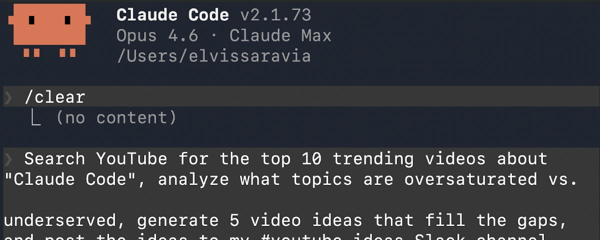
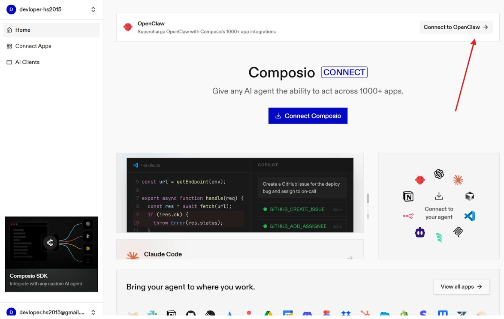
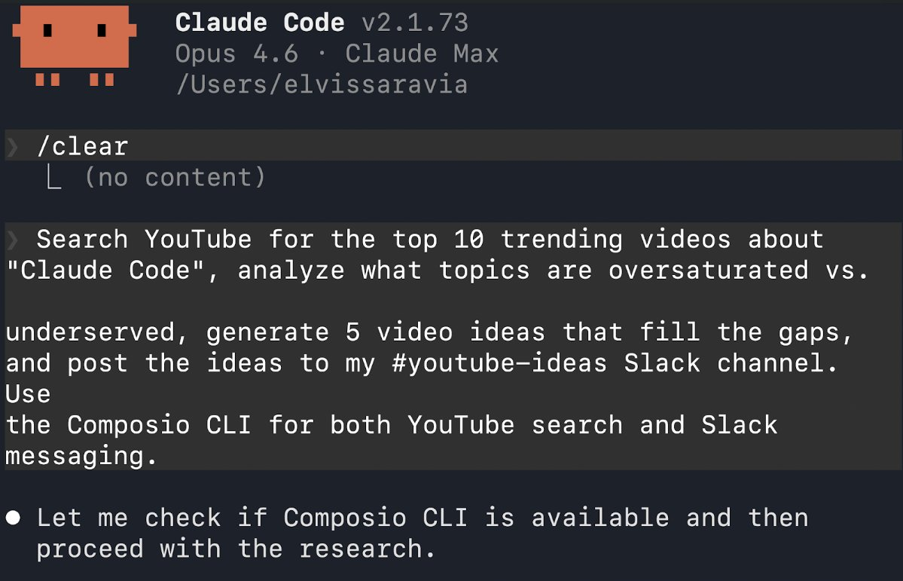
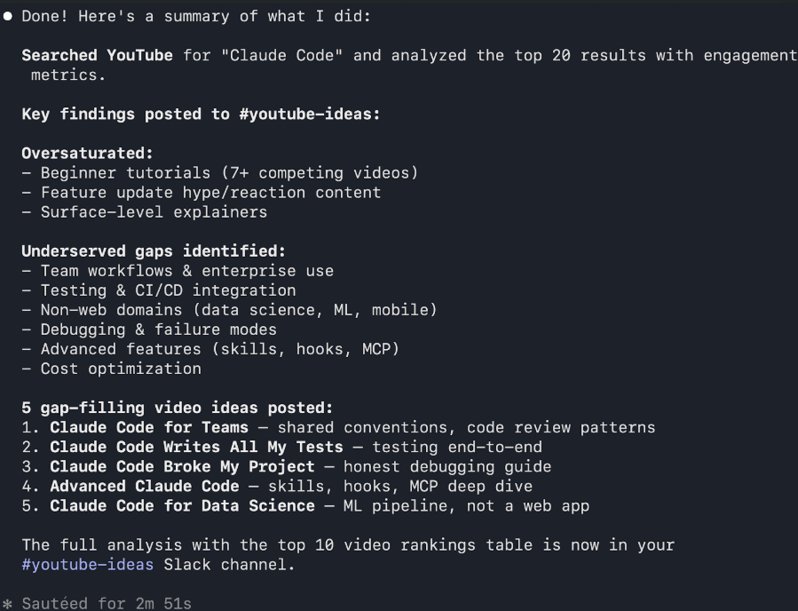

# The Missing Piece in Every Claude Code Setup

**Author:** elvis (@omarsar0)
**Date:** March 14, 2026
**Source:** https://x.com/omarsar0/status/2032822511709147640
**Stats:** 8 replies, 47 retweets, 365 likes, 54.7K views

---



I was running Claude Code against a Slack MCP server when it died with "MCP server requires re-authorization, token expired." Fine, OAuth again. Browser opens, I click Allow, Claude Code comes back with: "Authentication successful, but server reconnection failed. You may need to restart manually." So I restart. Then it fails again. Turns out Claude Code was storing the OAuth refresh tokens in macOS Keychain but not actually using them to refresh — a known bug, open for months.

Every service you connect expires independently. On a bad day, you're re-authing two or three times before lunch.

I have tried building my own auth system, but that required me to maintain the code in case services change. And I was doing this for each service I needed to plug into my agents. It's too much hassle. So I went on the hunt and found Composio, which not only solves this messy auth problem but also offers a brilliant technical solution that enables my agents to efficiently use 100s of services/tools without overloading my context.

If you're running Claude Code or OpenClaw and re-authing the same MCP servers every day, this is probably the highest-leverage fix available right now.

If you are facing this issue, read below on how I figured it out (with a concrete example).

## The Problem

If you've deployed OpenClaw or Claude Code, you've seen how messy authentication gets. You copy API keys by hand during setup, store tokens in plaintext config files, and scatter credentials across services with no central management.

The consequences are already showing up. Bitsight found over 30,000 publicly exposed OpenClaw instances. Snyk reported that 7.1% of ClawHub skills leak credentials. Google has permanently banned accounts for OAuth token reuse, and Anthropic updated its ToS to prohibit it.

## How Composio Solves It

Composio was built specifically for this problem. Instead of pasting keys into config files, it routes authentication through managed OAuth flows with encrypted credential storage, scoped per-user permissions, and automatic token refresh. It's SOC 2 and ISO 27001 compliant, so your agent gets exactly the access it needs, nothing more, and credentials never sit in a config file.

The toolkit coverage is what makes Composio practical at scale. It offers 1,000+ agent-first toolkits for business apps like Salesforce, HubSpot, Jira, Google Workspace, Datadog, PagerDuty, Notion, and Confluence. Many of these are apps that don't have first-party MCP integrations, which means entire sectors of business workflows were previously out of reach for AI agents.

## How to Set It Up

For OpenClaw, you can add Composio as a plugin or via MCP. The plugin installs with one command, or you paste a single MCP URL into your OpenClaw config and authenticate.

Here is how you set up via MCP:

1. **Create an account:** Go to platform.composio.dev and sign up / login
2. **Set up MCP:** Head to the Connect to OpenClaw and copy the prompt
3. **Head to OpenClaw and paste the prompt:**

```plaintext
Add a new MCP server called "composio" with transport type HTTP. Use the URL https://connect.composio.dev/mcp and add the header "x-consumer-api-key: your-api-key".
```



## A Real Example with Composio CLI

As an AI educator, I spend a lot of time creating technical AI content. And I am always researching new content ideas and what's resonating with learners.

So I've been trying to find a solid setup in Claude Code to automate some of that research. The automation is easy, but consistently authenticating into content services like YouTube and messaging apps like Slack to manage notifications has been a nightmare.

They say coding agents love CLIs. So I decided to set up the Composio CLI and use it through Claude Code to solve this auth problem once and for all. It worked extremely well, but I was more surprised by how easy it was to get things up and running.

Install it with one line, log in, and you're ready to search tools, connect apps, and execute workflows from the terminal:

```bash
curl -fsSL https://composio.dev/install | bash

composio login

composio link github

composio search "create a github issue"
```

The setup was almost anticlimactic. Three commands, OAuth opened in my browser, I clicked Allow, and it was done. No restart required. No token stored in a config file anywhere. The first time Claude Code completed a task end-to-end — searched YouTube, analyzed the results, posted to Slack — without stopping to ask me for a credential, was the moment I felt it. Two apps, one auth flow, zero babysitting.

Here's the exact prompt I ran in Claude Code:

```plaintext
Search YouTube for the top 10 trending videos about Claude Code, analyze what topics are oversaturated vs. underserved, generate 5 video ideas that fill the gaps, and post the ideas to my #youtube-ideas Slack channel. Use the Composio CLI for both YouTube search and Slack messaging.
```

Claude Code leverages Composio tools via the CLI. Specifically, Claude Code searched YouTube, analyzed the trending landscape, identified content gaps, generated five video ideas, and pushed them directly to Slack. Two apps, one auth layer, no tokens pasted anywhere.

Here is Claude Code's result after using Composio CLI to gather all the research:





And here is what it sent to Slack (also using the Composio CLI):


And from here, you can run all kinds of interesting automations like having Claude Code or OpenClaw report every morning on YouTube video ideas that get sent to your Slack, Telegram, or any other messaging app of choice.

If you're running Claude Code or OpenClaw and re-authing the same MCP servers every day, this is probably the highest-leverage fix available right now. Single URL in your config, and it handles the rest.

Do you think this could be helpful for you? Would love to hear and be happy to help out if you are having authentication issues in your agents.

## Other Workflows Composio Unlocks

The great thing about solving this auth problem for your agents is that workflows become easier to reuse and compound more quickly. Agents can now retrieve the latest context within your apps to ensure more accurate, timely results. Here are a few more workflows that are possible with the Composio integration:

- **For a GTM engine**, connect HubSpot, Gmail, and Slack, so your agent pulls pipeline data, drafts outreach, and posts updates to the team channel, all through managed OAuth rather than raw API keys.

- **For SRE monitoring**, connect Datadog, PagerDuty, and Slack, so your agent watches alerts, correlates incidents across services, and drafts responses around the clock.

- **For investor updates**, connect Google Sheets, Gmail, and Notion so your agent pulls financial data, compiles reports, and sends updates to stakeholders with no custom scripts stitching APIs together.

The pattern is always the same. Authenticate once, connect your apps, and let the agent orchestrate across all of them.

## Under the Hood

Composio uses 5 meta-tools with just-in-time discovery instead of preloading hundreds of tool definitions into context, which means your agent's token budget goes toward reasoning rather than loading schemas. When execution fails, it recovers automatically through alternative tools, direct API calls, sandboxed code generation, or headless browser fallback.

Your agent handles orchestration. Composio handles everything between "the agent wants to do something" and "the thing is actually done," safely and at scale.

What's the most annoying auth problem you've hit with Claude Code or OpenClaw? Drop it below — curious if others are seeing the same token refresh bug.
