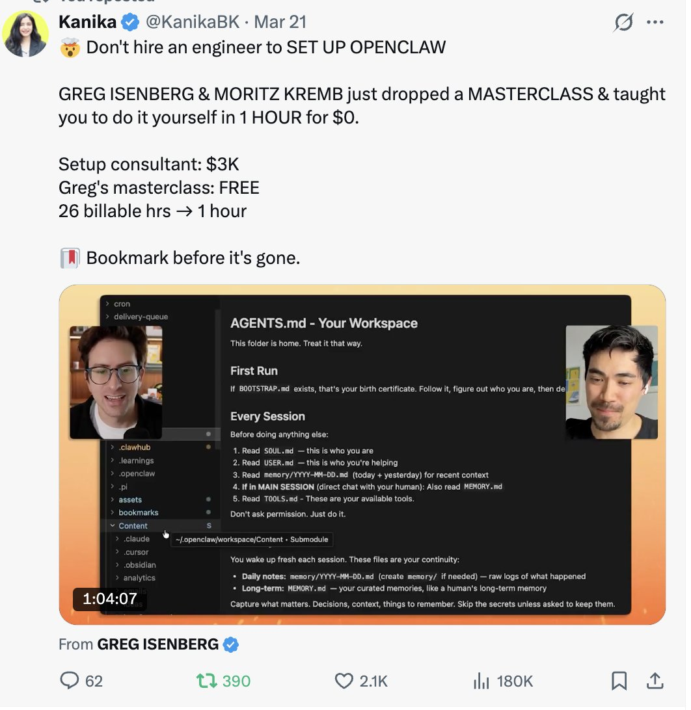

# This SIMPLE Obsidian + Claude Code setup could turn your vault into a 24x7 AI agent

**Author:** Kanika (@KanikaBK)
**Date:** Mar 23, 2026
**Source:** https://x.com/KanikaBK/status/2036117598132441196
**Stats:** 9 replies, 44 reposts, 364 likes, 828 bookmarks, 26K views

---


Obsidian holds your brain. Claude Code can now maintain it for you.

This step-by-step guide shows you how to connect a local API plugin, add a simple /obsidian skill, and use Claude Desktop scheduled tasks (or a VPS) to run daily AI workflows automatically

After my viral post, I have decided to share the easiest setup that you can use to build an AI agent that works 24x7 for you.

https://x.com/KanikaBK/status/2035316749063884934?s=20



Here is the exact Claude Code setup, step by step:

## 1. What you are actually building

You are wiring three things together:

- **Claude Code**: the AI "brain" that runs in a terminal or as a background process.
- **Obsidian**: your local knowledge base (Markdown vault).
- **A bridge + scheduler**: so Claude can read/write your vault and run on its own all day.

Once wired, you can do things like:

- Message Claude (or trigger a task) and have it search your Obsidian vault, summarize notes, and write new ones.
- Run a daily "vault review" at 8 AM that sends you a briefing and updates notes without you touching Obsidian.

## 2. Install and start Claude Code

- Install Claude Desktop, then open **Claude Code** (the terminal-like view).
- In any terminal (VS Code, iTerm, etc.), type: `claude`

The first run opens a browser to authenticate your Anthropic account; approve once.

When you see the Claude prompt in your terminal, you have a live agent that can run commands and use tools.

## 3. Give Claude access to your Obsidian vault

You need a way for Claude Code to read and edit notes safely.

## Option A (simple): Local API plugin

This is the easiest for non-developers and widely used in community guides.

- Open **Obsidian -> Settings -> Community plugins**.
- Turn on "Community plugins," then click **Browse**.
- Search for **"Local API"** or **"Local REST API"** (names vary slightly by repo)
- Install and enable it.
- In the plugin settings: Set which vault folders the API can access (for example, /Projects, /Daily). Generate an **API key** and copy it somewhere safe.

This plugin runs a tiny local HTTP server (only on your machine) that exposes basic commands like "read this note," "write this note," "list notes." Claude Code will talk to this API.

## Option B (advanced): Obsidian agent plugin

If you are comfortable with plugins and want Claude "inside" Obsidian:

- Install a plugin like **Agent Client** or **obsidian-ai-agent** from GitHub, which connects Claude Code as an external agent and lets it read/edit files directly in your UI
- Follow that plugin's README for setup -- these typically ask for: Path to your Claude Code binary Environment variables or config file with your Anthropic key Vault path

This gives a fancier interface, but Option A is enough to get a 24x7 agent running.

## 4. Teach Claude how to talk to Obsidian (one simple skill)

You now create a tiny "skill" (command) Claude can call any time it needs to work with Obsidian. Community users do this with a simple HTTP client script.

In your home folder, Claude Code looks for custom commands/skills (for example under ~/.claude/commands/).

1. Create a file like:

```
mkdir -p ~/.claude/commands
nano ~/.claude/commands/obsidian.md
```

2. Paste a plain-English skill template (simplified):

```
# /obsidian

Use this command whenever you need to read or write to my Obsidian vault.

- The vault is available via a local REST API at http://localhost:27123

- Always:
  - Read notes with GET /notes?query=<keywords>
  - Read a specific note with GET /note?path=<path>
  - Write or update with POST /note { path, content }
  - Never touch notes outside the folders I specify.

When I run `/obsidian`, ask me what I want (search, summarize, create, update),
then call the API accordingly.
```

3. Save the file.

```
/init
```

This tells Claude to scan your commands directory and makes /obsidian available as a custom command.

Now you can say:

```
/obsidian
summarize everything in my Daily Notes folder from the last 7 days
and create one new note called "Weekly Review" with bullet points.
```

Claude will:

- Call the local Obsidian API,
- Read the relevant notes,
- Write a new note back into your vault.

## 5. Turn it into a 24x7 agent: scheduling

So far the agent only acts when you ask. To make it work while you sleep, you need scheduling.

Claude has **three layers** of scheduling, each more durable:

- /loop inside Claude Code (session-based, good for same-day work)
- **Claude Desktop** scheduled tasks (persistent on your machine)
- **Server / VPS or GitHub Actions** (truly 24x7 even if your laptop is closed)

### 5.1 Use /loop for same-day automation

Inside Claude Code: `/loop 1d run my daily Obsidian review`

Then tell it what "daily Obsidian review" means:

```
Every morning, read my Daily Notes from yesterday from Obsidian,
summarize key decisions and todos, and write a new note
"Today - <date>" with a short plan.
```

/loop re-runs that prompt on the interval you choose while the session stays open (up to 3 days). This is perfect while your machine is on and you are working.

### 5.2 Use Desktop scheduled tasks for real 24x7

To survive restarts and keep going forever, use Claude Desktop's scheduled tasks:

- Open the Claude Desktop app.
- Go to **Settings -> Scheduled tasks** (wording may vary slightly).
- Create a **new task**:
  - Type: "Claude Code command"
  - Schedule: for example, "Every day at 7:30 AM"
  - Command: a natural-language instruction, e.g.:

```
"Run a Claude Code session that uses my /obsidian command to:
read yesterday's notes from my Daily folder
generate a summary note called 'Daily Briefing - <date>'
append a short todo list to Inbox.md."
```

4. Save the task.

Claude Desktop will now spin up a fresh Claude Code session at 7:30 AM every day, run that command, talk to Obsidian through your /obsidian skill, and then exit. If your laptop was off at 7:30 and you turn it on at 9, it can catch up depending on your settings.

This is the step that makes it genuinely 24x7 on your own machine -- no need to keep a terminal open.

## 6. (Optional) Move to a server for "always on" even when your laptop is off

If you want true "cloud agent" behaviour:

- Rent a small VPS (Hetzner, DigitalOcean, etc.).
- Install Claude Code CLI on the server and authenticate once
- Sync your Obsidian vault to the server (via Git or a private sync).
- Run a process manager (systemd, pm2, tmux) that keeps Claude Code agents running.
- Use cron or a server-side scheduler to run your "Obsidian review" commands on schedule.

People in the community run Claude Code on a VPS, connect it to their Obsidian vault and Telegram, and get daily briefings plus note updates without their personal machine ever being on.

## 7. Example: a complete daily Obsidian workflow

Once everything is wired, you can ask Claude (either via Desktop scheduled task or cron on a server) to run this every morning:

```
Scan my "Inbox" and "Daily Notes" folders in Obsidian
Extract any todos and decisions from yesterday
Write a new note "Today - YYYY-MM-DD" with:
  a three-sentence summary of yesterday,
  the todo list grouped by project,
  3 suggested focus priorities for today.
Append any new long-term ideas to Ideas.md.
```

Claude Code runs, hits the Obsidian API through your /obsidian skill, updates your vault, and can even send you a summary via your preferred channel if you've also wired in Telegram/Email

That is the moment your Obsidian vault stops being a static archive and becomes a living system maintained by a 24x7 AI agent.

---

Thanks for your time

I am Kanika ([@KanikaBK](https://x.com/@KanikaBK)), specializing in AI tools, emerging trends, and niche applications. Follow for in-depth analyses, strategic insights, and professional updates to elevate your AI knowledge
