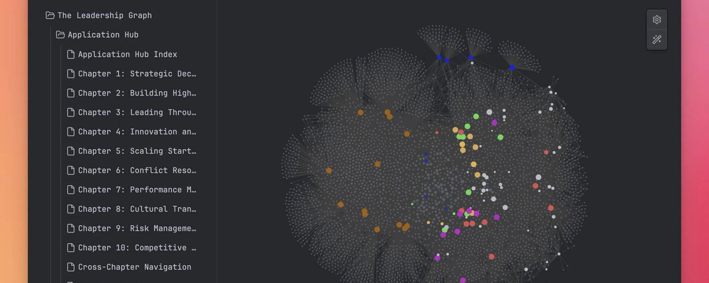

# Obsidian + Claude Code is the most underrated productivity stack in tech right now. (Full course)

**Author:** CyrilXBT (@cyrilXBT)
**Date:** Mar 22, 2026
**Source:** https://x.com/cyrilXBT/status/2035761611764347219
**Stats:** 46 replies, 234 reposts, 2,114 likes, 6,701 bookmarks, 593.2K views

---

Everyone wants a personal AI assistant.

Not a chatbot that forgets what you said five minutes ago. Not a tool you have to re-explain yourself to every single time you open it. A real one. Something that knows your work, your research, your thinking, your history, and talks back with actual context.

That is what Tony Stark had with JARVIS.

And right now, in 2026, you can build something remarkably close to it using two tools that most people are completely sleeping on.

Obsidian and Claude Code.

## What Is Obsidian and Why It Changes Everything

Obsidian is a note taking app. But calling it that is like calling Bitcoin a savings account. Technically true but wildly underselling it.

Everything you write in Obsidian lives locally on your device as plain text markdown files. No cloud lock in. No subscription holding your data hostage. Just folders full of your thoughts, your research, and your ideas stored in a format that any program can read.

That last part is everything.

Because when your knowledge base is just a folder of text files, you can point any AI at it.

Most people use Obsidian to take notes and stop there. The ones building real leverage are using it as a structured personal database that feeds directly into AI tools. That is a completely different game.

## What Is Claude Code and What Makes It Different

Claude Code is Anthropic's command line tool built for builders and developers.

It does not just answer questions. It reads files, writes code, edits documents, and works directly inside your local environment.

This is the key difference between Claude Code and using Claude in a browser. In a browser, Claude knows nothing about you when you open a new tab. With Claude Code running locally, you can give it direct access to your Obsidian vault.

Your entire knowledge base becomes its context.

Every note you have ever written, every idea you captured, every research thread you followed becomes something Claude can reference, connect, and build on. You stop prompting a generic AI. You start talking to an AI that actually knows your work.

## How the Setup Actually Works

This is not as technical as it sounds.

You install Claude Code through your terminal. You point it at your Obsidian vault folder. You start asking it questions.

At the most basic level you can ask things like "summarize everything I have written about DeFi this year" or "find all my notes that mention AI agents and pull out the key ideas." It reads your files, processes them, and comes back with actual answers based on your own thinking.

But it goes much further than retrieval.

You can ask Claude Code to find gaps in your research. You can ask it to connect ideas across notes you wrote months apart. You can ask it to draft an article based entirely on your existing notes, in your voice, using your frameworks. You can ask it to build tools on top of your vault. Custom dashboards. Automated summaries. Daily briefings pulled straight from your own knowledge base.

This is where JARVIS starts to feel real.

## Why This Is a Weapon for Crypto and AI Builders

Think about how much information you consume in this space every single day.

Market updates. Protocol research. Thread breakdowns. Alpha from your timeline. Ideas you want to develop. Trades you want to track. Narratives you want to follow.

Most people let that information wash over them and forget 90% of it.

The people building real edge are capturing everything, organizing it, and feeding it back into their workflow through AI.

Imagine having six months of your own crypto research sitting in Obsidian and being able to ask Claude "based on everything I have tracked, which narratives are showing up repeatedly right now."

That is not a generic AI answer. That is your own pattern recognition, amplified.

For content creators the leverage is even bigger. Your entire content history lives in your vault. Every thread idea, every breakdown, every angle you explored. Claude Code can find what you have not covered yet, identify your strongest performing angles, and draft new content that sounds like you because it is built entirely from your own writing.

## The Shift Most People Are Missing

Right now the majority of people using AI are using it as a search engine replacement.

They ask questions and take the output at face value.

The next level is using AI as an extension of your own thinking.

When Claude has access to your Obsidian vault it is not answering from the internet. It is answering from you. Your frameworks. Your research. Your perspective. Your accumulated knowledge built over months or years.

That is the difference between having a smart assistant and having JARVIS.

## Where to Start Today

If you are already using Obsidian, install Claude Code today and spend one hour pointing it at your vault.

Just start asking it questions about your own notes. You will immediately see what I mean.

If you are not using Obsidian yet, start there first. Build the habit of capturing everything. Research, ideas, market thoughts, content angles, all of it.

The vault is the foundation.

Claude Code is the engine.

Together they give you something most people will not have for another two years.

Your own JARVIS.

And in this space, being two years early is the entire game. For more content like this follow [@cyrilXBT](https://x.com/@cyrilXBT)
