# You Don't Know Claude Code: Architecture, Governance, and Engineering Practices

**Author:** Tw93 (@HiTw93)
**Date:** March 15, 2026 (tweet) / March 12, 2026 (article)
**Source:** https://x.com/HiTw93/status/2033181380432339045
**Article URL:** https://tw93.fun/en/2026-03-12/claude.html
**Stats:** 740 likes, 11 replies

---

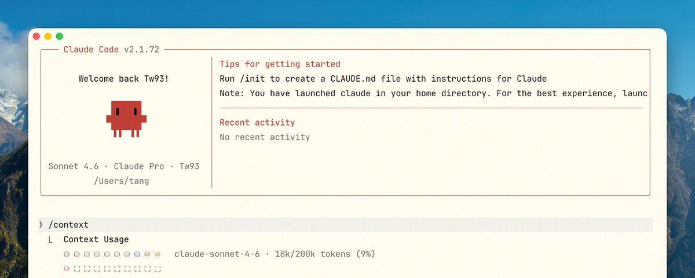

This handbook is written for engineers who already use Claude Code and want workflows that are more predictable, more controllable, and easier to verify. Unless noted otherwise, the guidance here is drawn from six months of intensive Claude Code usage across two accounts.

## Core Framework: Six Layers

The author presents Claude Code architecture as six interdependent layers:

| Layer | Purpose |
|-------|---------|
| CLAUDE.md / rules / memory | Long-term context and boundaries |
| Tools / MCP | Action capabilities |
| Skills | On-demand methodologies |
| Hooks | Enforced behaviors |
| Subagents | Context-isolated workers |
| Verifiers | Validation and auditability |

**Key principle:** "Over-index on one layer and the system becomes unstable."

## Execution Model

Claude Code operates as an iterative agent loop: gather context, take action, verify result, loop or complete.


The author identifies **five critical surfaces** requiring attention:

- **Context surface:** What's always loaded vs. on-demand
- **Action surface:** Available capabilities
- **Control surface:** Constraints and auditing
- **Isolation surface:** Context and permission boundaries
- **Verification surface:** Output validation mechanisms

## Context Engineering

The most significant constraint isn't capacity but noise. A typical context allocation breaks down as:


- Fixed overhead: ~15-20K tokens (system instructions, skill descriptors, MCP definitions)
- Semi-fixed: ~5-10K tokens (CLAUDE.md, memory)
- Available for work: ~160-180K tokens

"A typical MCP server such as GitHub can expose 20-30 tool definitions at roughly 200 tokens each, which is 4,000-6,000 tokens."

### Best Practices

Keep CLAUDE.md compact and operational, emphasizing commands, constraints, and boundaries. Use `.claude/rules/` for path-specific conventions rather than centralizing everything. Proactively inspect context consumption with `/context` commands rather than relying on automatic compression.

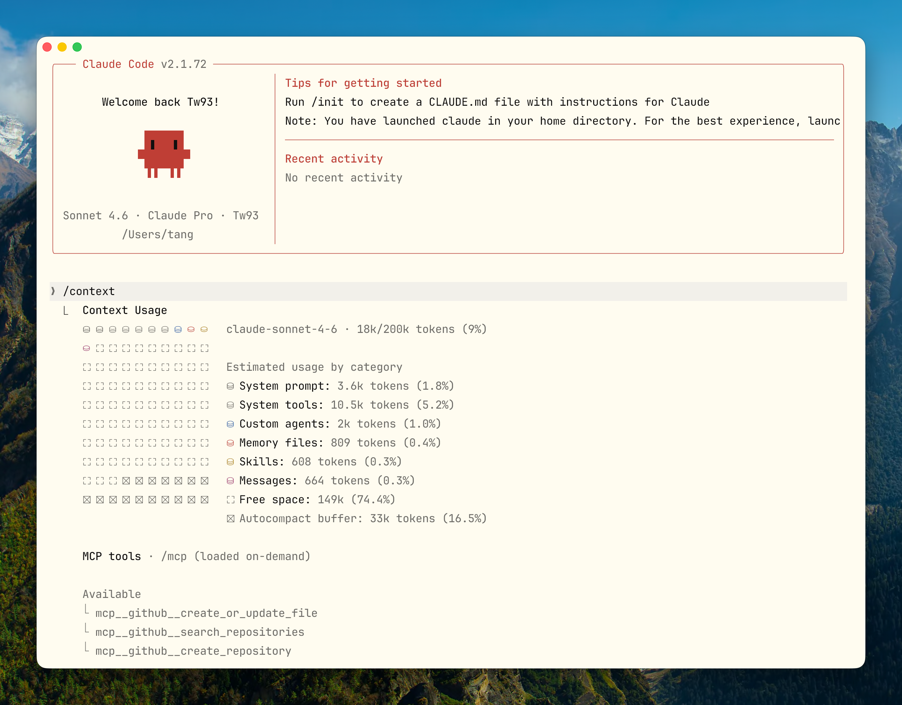

The author recommends explicit **Compact Instructions** that specify what should survive compression: architecture decisions, modified files, verification status, and open issues.

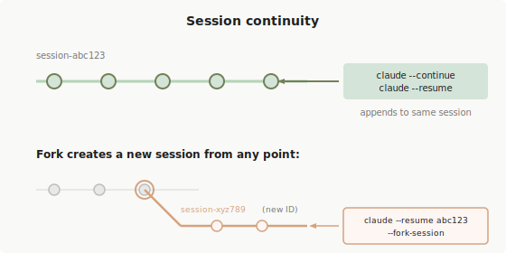

## Skills Design

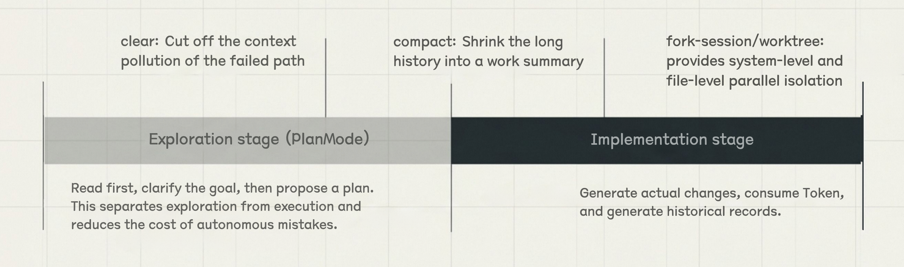

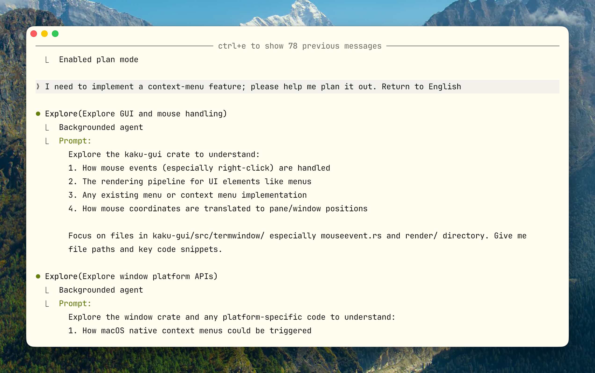

Skills function as on-demand workflow packages whose descriptors remain in context while full bodies load conditionally. Effective skills:

- Clearly signal when to use them
- Define complete steps, inputs, outputs, and stop conditions
- Keep navigation and core constraints in SKILL.md
- Relocate large reference materials to supporting files

Three typical skill categories emerge from practice:

1. **Checklists:** Quality gates (release validation)
2. **Workflows:** Standardized operations with explicit rollback (config migration)
3. **Domain experts:** Decision frameworks with evidence collection (runtime diagnosis)

Keep descriptors brief -- roughly 9-10 tokens for frequently-used skills versus 45+ for verbose descriptions.

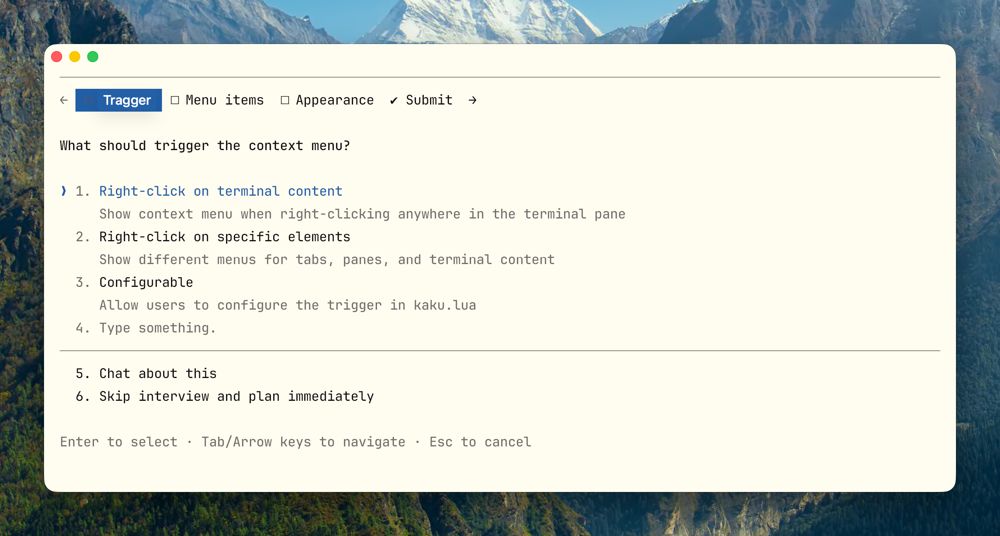

## Tool Design Principles

Tools optimized for agent selection differ substantially from human-facing APIs:

- Use descriptive prefixes (`jira_issue_get` vs. `query`)
- Include corrective error guidance
- Support response format options (concise/detailed)
- Keep scope tightly bounded

The author notes that tool evolution at Anthropic illustrates important patterns: Version 1 (flags within existing tools) failed because Claude skipped them; Version 2 (markdown formatting) lacked hard enforcement; Version 3 (dedicated `AskUserQuestion` tool) succeeded through explicit tool calls that became pause signals.

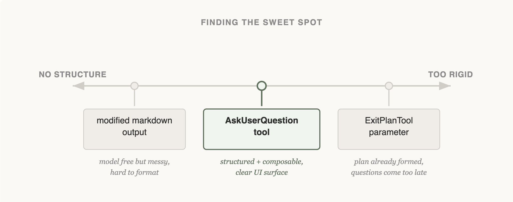

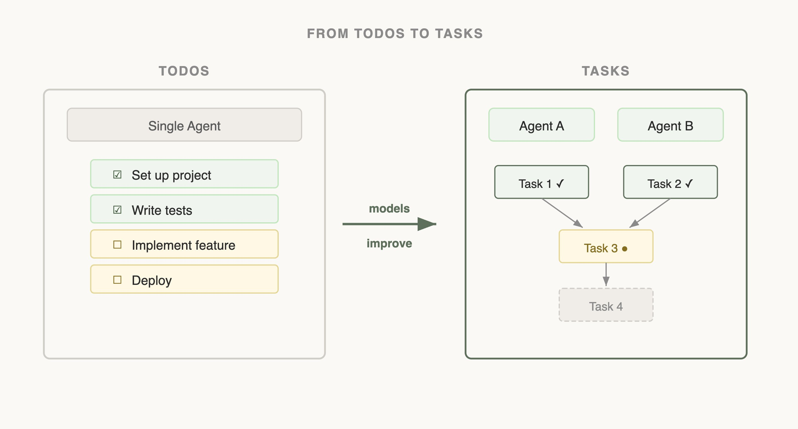

## Hooks: Deterministic Enforcement

Hooks move decisions from ongoing model judgment into deterministic processes. Suitable use cases include:

- Blocking modifications to protected files
- Auto-formatting/linting after edits
- Injecting dynamic context (git branch, env vars)
- Post-completion notifications

Unsuitable for hooks: complex semantic judgments, long-running processes, decisions requiring multi-step reasoning.

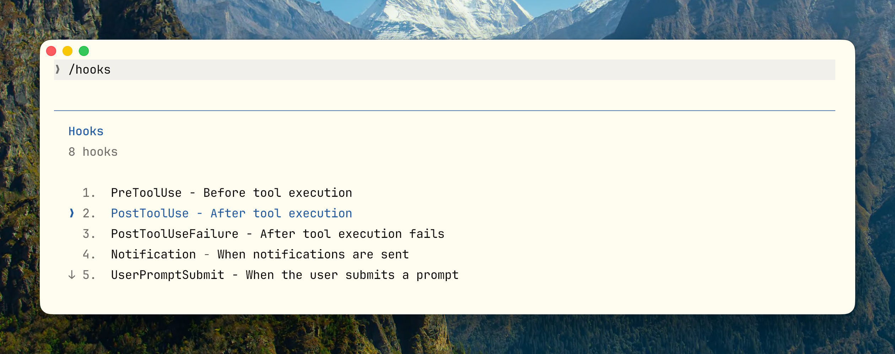

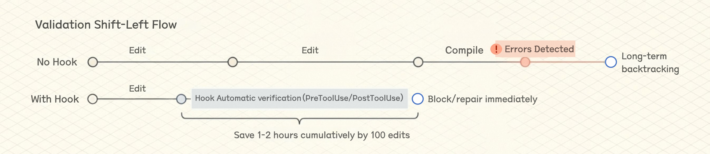

Hooks provide early error detection -- "In a 100-edit session, saving 30-60 seconds each time adds up to 1-2 hours. That is material."

## Subagents: Isolated Execution

Subagents provide context isolation and output summarization rather than pure parallelism. The main value: preventing large intermediate outputs from polluting the main context window.

Configuration constraints matter: limit tools to only what's necessary, match model selection to task difficulty, set explicit turn limits, and use worktree isolation when file modifications occur.

## Prompt Caching as Architecture Constraint

Caching isn't merely cost optimization -- it fundamentally shapes architectural choices. Content layout matters because prefix matching caches from request start to each breakpoint:

1. System prompt (static)
2. Tool definitions (static)
3. Chat history (dynamic)
4. User input (final)

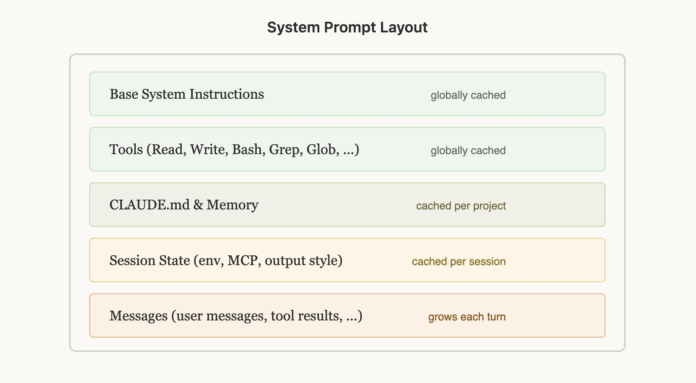

Switching models mid-session negates cache benefits since caching is model-specific. Switching to Haiku after extended Opus discussion rebuilds the entire cache, making it more expensive than continuing with Opus.

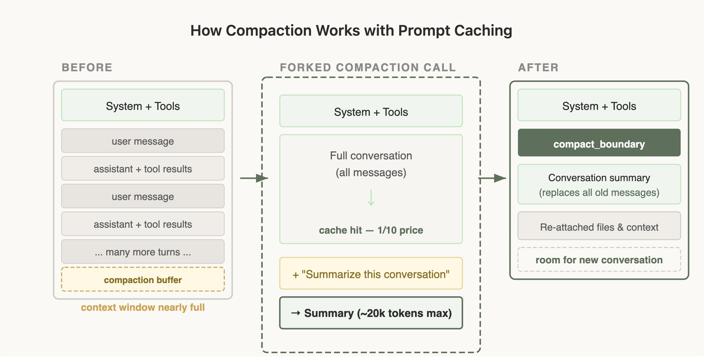

## Session & MCP Management

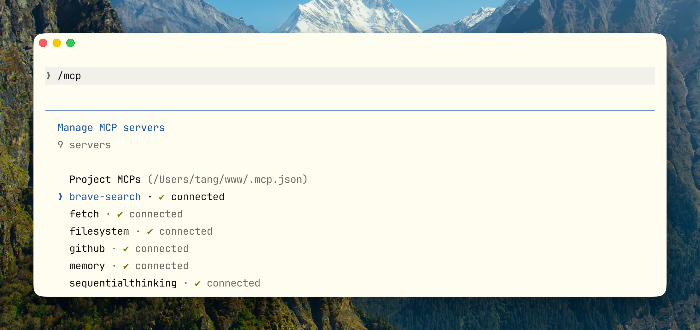

## Verification Loops

Without verification, Claude's completion claims have limited engineering value. Verification spans multiple levels:

- **Lowest:** Exit codes, lint, typechecking, unit tests
- **Middle:** Integration tests, screenshots, contract tests, smoke tests
- **Higher:** Production metrics, monitoring, manual checklists

The critical test: "If you cannot clearly explain how Claude knows it's done correctly, it's probably not suitable for autonomous completion."

## Practical Commands

Essential commands for active context management:

- `/context` -- Inspect token consumption breakdown
- `/clear` -- Reset session after repeated corrections
- `/compact` -- Compress while preserving key decisions
- `/mcp` -- Manage connections and tool costs
- `/hooks` -- View/update enforcement rules
- `--continue` -- Resume latest session
- `--fork` -- Branch from existing checkpoint
- `-p` -- Non-interactive mode for CI integration

## Writing Effective CLAUDE.md

The file functions as a collaboration contract, not team documentation. Include only information that must persist across every session:

- Build, test, lint, run commands (highest priority)
- Directory structure and module boundaries
- Code style and naming constraints
- Environment dependencies and pitfalls
- Prohibitions and high-risk operations
- Information surviving compression (Compact Instructions)

**Exclude:** Long backgrounds, complete API docs, vague principles, obvious inferences, large reference materials.

Template structure emphasizes operational clarity over comprehensive documentation.

## Field Notes: Real Project Integration

The author's Kaku terminal project (Rust + Lua + custom configuration) revealed practical patterns:

**Environment transparency matters:** A `doctor` command providing structured environment reports eliminates assumptions. Semantic subcommands (`init`, `config`, `reset`) guide agent behavior better than inferred file locations.

**Hooks for mixed languages:** Type-specific validation (Rust via `cargo check`, Lua via `luajit`) detects compilation failures immediately rather than after lengthy build sequences.

**Complete reference structure:**
```
Project/
├── CLAUDE.md
├── .claude/
│   ├── rules/
│   ├── skills/
│   ├── agents/
│   └── settings.json
└── docs/ai/
```

## Common Anti-Patterns

| Anti-Pattern | Symptom | Fix |
|--------------|---------|-----|
| CLAUDE.md as wiki | Context pollution | Keep contract-only, move materials to skills |
| Skill grab-bags | Unstable triggering | One skill = one thing |
| Too many tools | Wrong selection | Merge overlapping tools, clear naming |
| No verification | Subjective completion | Bind verifiers to task types |
| Over-autonomy | Runaway execution | Minimize roles, set maxTurns |
| No segmentation | Diluted context | Use /clear for switches, /compact for phases |
| Uncleaned commands | Irreversible danger | Regularly review allowedTools |

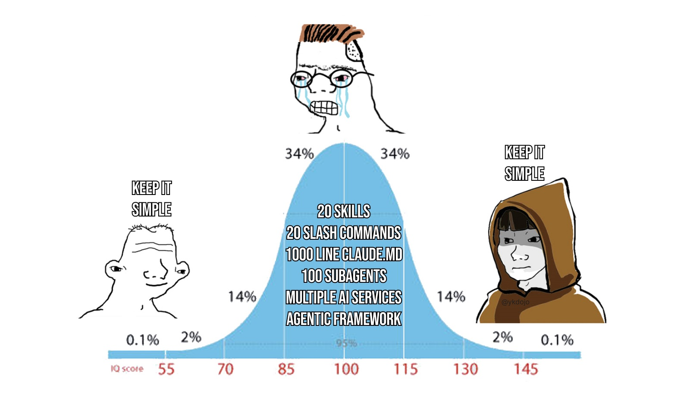

## Three-Stage Maturity

Claude Code usage progresses through stages:

1. **Tool User:** "How do I use this feature?" (Limited efficiency gains)
2. **Process Optimizer:** "How do I smooth collaboration?" (Significant improvements through CLAUDE.md and Skills)
3. **System Designer:** "How do I enable constrained autonomy?" (Qualitative shift in capability)

The progression reflects moving from feature-focused thinking toward systems design around constraints and verification.

## Conclusion

"If you cannot clearly articulate what 'done' looks like, the task is probably not ready for autonomous execution." Success requires acceptance criteria, verification loops, and explicit governance -- not just model capability. The framework presented -- from context engineering through verification -- provides practical scaffolding for treating Claude Code as an engineering system rather than a conversational tool.
