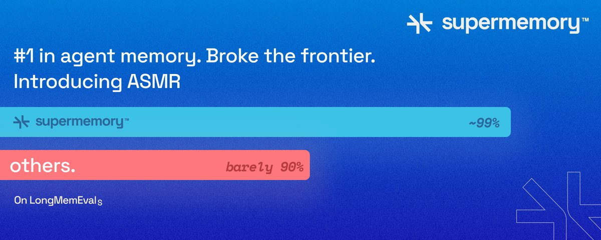
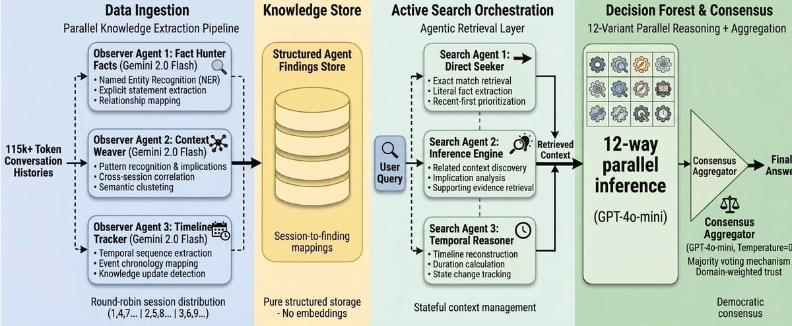
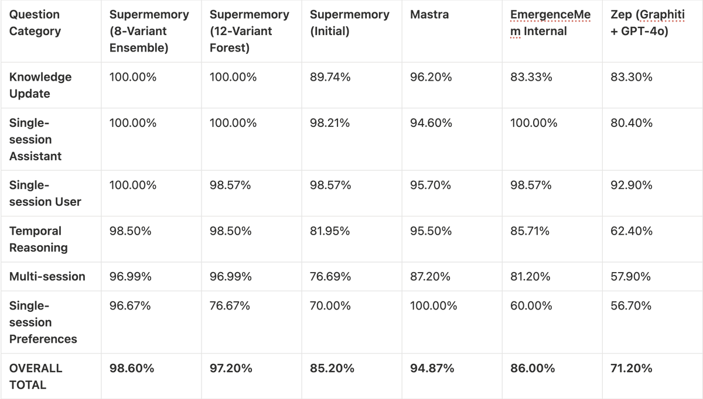
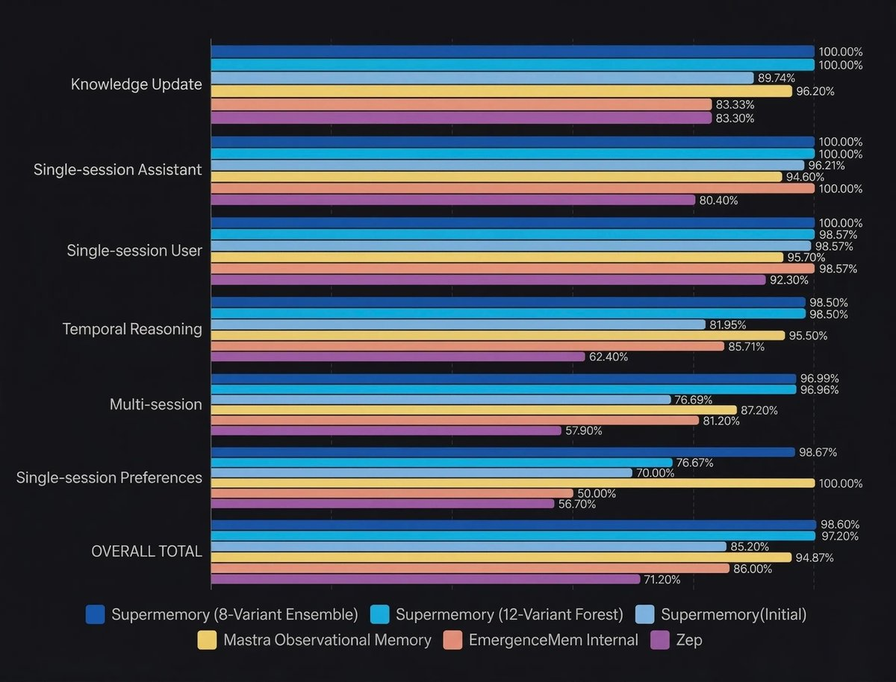

# We Broke the Frontier in Agent Memory: Introducing ~99% SOTA Memory System

**Author:** Dhravya Shah (@DhravyaShah)
**Date:** Mar 22, 2026
**Source:** https://x.com/DhravyaShah/status/2035517012647272689
**Stats:** 262 replies, 669 reposts, 3,879 likes, 8,541 bookmarks, 2.3M views

---

**Note: This was a stunt.**

> *Follow-up post by @DhravyaShah (7 hours later):*
> We scored 99% on LongMemEval to prove a point. Two days ago, we announced that we scored ~99% on LongMemEval with a new memory system. The entire internet latched on to it. Everyone was really, really excited about this - sharing it with friends,...
> (25 replies, 26 reposts, 116 likes, 74 bookmarks, 79K views)

Agent memory might be completely solved now.

In a few years, BILLIONS of agents will be highly personalized and specialized per user - constantly learning and evolving on everything we do. This is why we've been researching about AI memory for years now. What happens when we finally perfect it?

A few months ago, we published our first research report showing Supermemory achieving ~85% on LongMemEval-s result that put us ahead of every publicly benchmarked memory system at the time. Today, we're publishing a new result: ~99% on LongMemEval_s.

To be absolutely clear upfront: this is not in our main production Supermemory engine (yet). Rather, this blog covers a new, highly experimental agentic flow we built to see exactly how far we could push the absolute limits of memory retrieval and reasoning, independent of our core production constraints. A few months of research got us here.

This is how we got there. Introducing our new technique: **ASMR (Agentic Search and Memory Retrieval)**

This technique is:

- Really easy to implement
- Does not require a Vector Database OR embeddings and can be done completely in-memory
- This means it can be embedded into other systems, even things like robots.

## Introduction

LongMemEval is one of the most rigorous publicly available benchmarks for long-term memory. Unlike benchmarks that test simple retrieval over short contexts, LongMemEval is designed to simulate the chaos of real production environments: 115k+ token conversation histories, contradictory information, events spread across multiple sessions, and questions that require reasoning about time.

The reason most memory systems score poorly is usually retrieval--not reasoning. Even when recall is high, if there's a lot of noise with retrieval, the LLM might struggle to use it. The problem is getting only the right information into the context window in the first place, and harder still: knowing when a retrieved fact is stale and a newer version supersedes it.

To solve this, we stepped away from traditional RAG and built a multi-agent orchestrated pipeline.

## Setup & Experimental Architecture

Standard vector search is good in general. However, it falls apart when dealing with the nuance of dense, multi-session temporal data. Semantic similarity matching cannot reliably distinguish between an old fact and a new correction. To tackle the complexities of LongMemEval, we had to rethink our ingestion and retrieval pipeline from the ground up, replacing vector math with active agentic reasoning.

Just like **ASMR**, this technique is simple and satisfying.

### 1. Parallel Orchestration & Ingestion (Observer Agents)

Instead of chunking and embedding user sessions, we deployed an agent orchestrator utilizing **3 parallel reader (observer) agents** (powered by Gemini 2.0 Flash). These agents read through raw sessions concurrently (e.g., Agent 1 takes sessions 1, 3, 5; Agent 2 takes 2, 4, 6).

Their goal is targeted knowledge extraction across six vectors: Personal Information, Preferences, Events, Temporal Data, Updates, and Assistant Info. These structured findings are then stored natively and mapped to their source sessions.

### 2. Active Agentic Retrieval (Search Agents)

When a question arrives, we do not query a vector database. Instead, we deploy **3 parallel search agents**. These agents actively read and reason over the stored findings, each with a specialized focus:

- **Agent 1:** Searches for direct facts and explicit statements.
- **Agent 2:** Looks for related context, social cues, and implications.
- **Agent 3:** Reconstructs temporal timelines and relationship maps.

The orchestrator compiles the findings from all three search agents, pulling verbatim session excerpts for detail verification. This allows for intelligent retrieval based on actual cognitive understanding rather than just keyword or mathematical similarity.

### 3. The Agent-Orchestrated Answering Ensembles

Once the context is assembled, a single prompt cannot handle the sheer variety of question types in LongMemEval. Some questions require you to infer details, whereas others require you to be laser-specific. We experimented with two distinct agentic answering flows:

**Run 1: The 8-Variant Ensemble (98.60% Accuracy)**
In our first approach, we routed the retrieved context through 8 highly specialized prompt variants running in parallel (e.g., a Precise Counter, a Time Specialist, a Context Deep Dive). Each variant independently evaluated the context and generated an answer. If *any* of the 8 distinct reasoning paths successfully arrived at the ground truth, the question was marked correct. This parallel multi-judging approach allowed us to hit a staggering **98.60% overall accuracy**, perfectly covering our blind spots.

**Run 2: The 12-Variant Decision Forest (97.20% Accuracy)**
To test a system that produces a single, authoritative answer rather than relying on multiple independent attempts, we expanded our architecture into a 12-variant Decision Forest.

Here, 12 highly specialized agents (powered by GPT-4o-mini) independently answered the prompt. Then, we introduced an **Aggregator LLM** to act as the final judge. The Aggregator synthesized the 12 answers using majority voting, domain trust, and conflict resolution. This singular consensus model also achieved an incredibly high **97.20% accuracy**.

## Results

The performance of this experimental architecture fundamentally shifts what is possible in long-term AI memory. To understand the scale of this achievement, here is how our experimental agentic flows stack up against both our original production engine and the broader industry overall:

This system also does not affect the agent's latency as much as you'd expect - however this is a point we're constantly working on.

## What we learnt & What's Next

Building a system that hits ~99% accuracy on a production-grade benchmark yielded a few critical engineering insights:

- **Agentic Retrieval Beats Vector Search:** Ditching vector embeddings for active search agents was the single biggest unlock. Agents actively searching for context eliminated the semantic similarity trap that causes traditional RAG to fail on temporal changes and updates.
- **Parallel Processing is Critical:** Splitting the ingestion and retrieval workloads across multiple dedicated agents (3 reading, 3 searching) dramatically improved both the speed and granularity of fact extraction. It also helped prevent conflicts as each agent was allowed to have a specialized focus while extracting.
- **Specialization Beats Generalization:** Routing context through dedicated specialist agents (like a Counter or a Detail Extractor) vastly outperforms any single master prompt.

Because this was an experimental sandbox rather than our core Supermemory engine, we want the AI community to be able to learn from and build upon this architecture.

We will be open-sourcing the complete code for this experimental agentic flow soon. Memory is a constantly evolving challenge, and while this research pushes the ceiling of what's possible, we're already looking at how to translate these pure-agent retrieval techniques into our core production environments.

In exactly **11 days (beginning of April)**, we will be publishing and open sourcing everything about this new agent memory system. It will be built in public, a spectacle for all of you to see. We're having fun.

Check out our github [https://github.com/supermemoryai](https://github.com/supermemoryai) and keep eyes on there for a release

Agent memory is now (probably) a solved problem?

