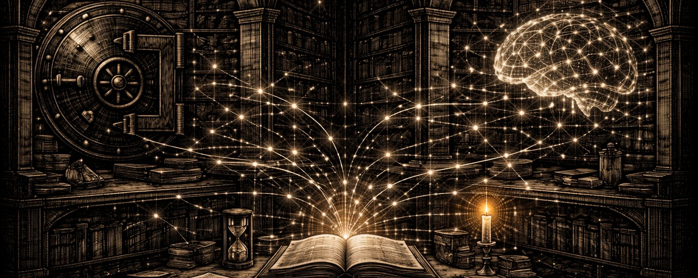
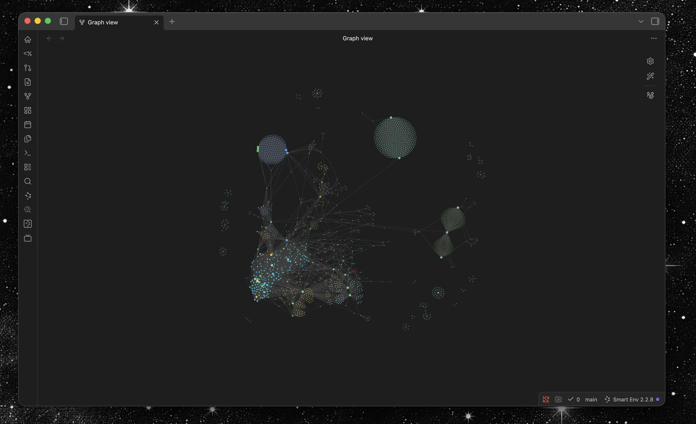

# Claude + Obsidian: The Memory Stack That Compounds

**Author:** Nyk (@nyk_builderz)
**Date:** March 9, 2026
**Source:** https://x.com/nyk_builderz/status/2030904887186514336
**Stats:** 28 replies, 85 retweets, 825 likes, 205.2K views

---



Teams burn 30-40 minutes per Claude session re-explaining what they already knew yesterday. That's a full workday per week lost to repetition.

Everything is a context problem. When people say AI can't do real work, what they're actually saying is that they gave it bad context.

Every session starts from zero. Your architecture, your conventions, that edge case it debugged for an hour --- gone when the window closes. Everyone says the fix is bigger context, but the real failure isn't reasoning, it's drift.

I wired Claude into an Obsidian vault with a three-tier memory system. Sessions stopped resetting. Output compounds instead of plateauing.

Here's the checklist, every config file, and the exact runbook. save this

## The Memory Problem Nobody Talks About

Cowan's research places the limit of active attention at 4 chunks, plus or minus 1. Not words, not tokens --- chunks of meaningful structure.

A 200k context window doesn't change this constraint. It changes how much raw text the model can scan. Scanning is not knowing.

I call this context amnesia --- your AI is intelligent, even brilliant, but it has no continuity. Every session IS a first date.

The symptoms are predictable:

- It re-asks questions you've answered before
- It proposes patterns you've explicitly rejected
- It loses track of decisions made three sessions ago
- It treats your codebase like it's seeing it for the first time

Coding was solved first because the structure was already there. Codebases were text files with relationships between them. The agent reads the code, follows the imports, and understands the architecture. That was natural because this is how programmers already worked with code.

Knowledge work doesn't have that structure yet. Mostly outdated knowledge bases or wikis nobody reads.

But some people were building it anyway. The obsidian and tools for thought nerds spent years figuring out how to structure knowledge. Notes that link to each other, ideas that are atomic and composable, maps of content that give you the topology of an entire domain.

Turns out they accidentally engineered the perfect architecture for LLMs.

The fix isn't a smarter model. It's giving the model a memory system so that it can operate.

## The 3-Layer Memory Architecture

Here's the structure. Each layer solves a different failure mode.

```
+-------------------------------------------+
| Layer 3: Ingestion Pipeline               |
| video/audio -> structured knowledge       |
+-------------------------------------------+
| Layer 2: Knowledge Graph                  |
| obsidian vault + mcp bridge               |
+-------------------------------------------+
| Layer 1: Session Memory                   |
| CLAUDE.md + auto-memory directory         |
+-------------------------------------------+
```

Layer 1 teaches the model who you are. Layer 2 gives it a searchable brain. Layer 3 feeds that brain from the real world.

They compound.

Skip one, and the others degrade.

## Layer 1: Session Memory

You're not configuring a tool. You are teaching a colleague what you've already decided.

CLAUDE.md is where this starts. It's the first thing Claude reads in every session. Most people treat it like a config file. The teams that get the most leverage treat it like a teaching document.

Here's the framing we use in ours:

> This vault is your exosuit
>
> When you join this session, you put on the accumulated knowledge of the entire organization
>
> You are not an assistant
>
> You are the driving force behind a company that compounds knowledge into competitive advantage

What belongs in CLAUDE.md:

- architecture decisions that don't change weekly
- naming conventions and code patterns
- workflow preferences (which tools, which package managers)
- explicit boundaries (what to never do)

Then there's the auto-memory directory. This is where Claude persists in observations across sessions --- patterns it noticed, solutions that worked, and things you corrected it on.

```
~/.claude/projects/<project-hash>/memory/
+-- MEMORY.md        # always loaded into context
+-- debugging.md     # solutions to recurring problems
+-- patterns.md      # confirmed codebase conventions
+-- architecture.md  # key architectural decisions
+-- preferences.md   # user workflow preferences
```

The rule: MEMORY.md stays under 200 lines. It's a routing document, not a dump. Detailed notes go in topic files and get linked from MEMORY.md.

This is the cheapest layer to implement, and it changes the feel of every session, immediately. But it has a ceiling --- it can only hold what fits in context at session start.

That's where layer 2 comes in.

## Layer 2: Knowledge Graph

Do we call it vibe note-taking? maybe. But there's a deeper point.

An Obsidian vault is not a note-taking app. It's a persistence layer your AI can query at runtime. The system IS the files.

You don't need Obsidian for knowledge management with Claude Code --- you need markdown files with wikilinks in folders. Obsidian is one good interface for that.

The graph is what matters.

The bridge between Claude and your vault is the MCP --- model context protocol. Two servers make this work:

- **smart-connections** --- semantic search over your entire vault. Claude can find relevant notes even when it doesn't know the exact title or path
- **qmd** --- structured queries, collection management, and metadata operations. The precision tool for when Claude needs specific notes by path or tag

Here's the MCP config that wires them in:

```json
{
  "mcpServers": {
    "smart-connections": {
      "command": "python",
      "args": ["smart-connections-mcp/server.py"],
      "env": {
        "OBSIDIAN_VAULT_PATH": "~/obsidian/your-vault"
      }
    },
    "qmd": {
      "command": "qmd",
      "args": ["mcp"],
      "env": {
        "HOME": "~"
      }
    },
    "obsidian": {
      "command": "npx",
      "args": ["-y", "obsidian-mcp"]
    }
  }
}
```

But the bridge is only as good as what's on the other side. Vault structure matters A LOT. An unstructured dump of notes doesn't scale.

You need wikilinks as semantic connections, atomic composable markdown notes, maps of content for navigation and attention management, metadata for queries, and progressive disclosure.



I use four levels of filtering so retrieval finds the right depth on the first pass:

```
obsidian-vault/
+-- 00-home/          # maps of content
|   +-- index.md
|   +-- daily/
|   +-- top-of-mind.md
+-- atlas/            # structural overview
|   +-- projects.md
|   +-- research.md
|   +-- vault-information-arch.md
+-- inbox/            # unprocessed captures
|   +-- queue-generated/
+-- knowledge/        # curated knowledge graph
|   +-- graph/
|   |   +-- agent-daily/
|   |   +-- research/
|   |   +-- repo-research/
|   +-- memory/
+-- sessions/         # raw session transcripts
+-- voice-notes/      # transcribed voice captures
```

The key insight is prose-as-title. Notes are named as claims, not categories.

Not `memory-systems.md` but `memory graphs beat giant memory files.md`

Not `retrieval-notes.md`, but `hybrid retrieval outperforms pure semantic search.md`

When Claude searches the vault, the result titles alone tell it whether a note is relevant --- before it reads a single line of content.

Links work the same way. wiki-link-as-prose --- links that read as sentences:

> we learned that [[memory graphs beat giant memory files]]
> when we [[benchmark retrieval like search infrastructure]]

The graph becomes self-documenting. Retrieval becomes navigation.

## Layer 3: Ingestion Pipeline

The first two layers give Claude a brain and a way to access it. But brains need feeding.

Most knowledge doesn't start as text in your vault. It starts as a YouTube video, a conference talk, a voice memo, a podcast episode. The gap between "I watched something useful" and "Claude can find it" is where most knowledge dies.

The hardest knowledge to capture isn't in documents, it's in people's heads.

When your CTO decides on PostgreSQL over MongoDB, maybe the decision gets written down. But the reasoning, the tradeoffs she considered, the context that made it obvious to her but invisible to everyone else --- that's lost.

Meetings used to be the ultimate time sink, but now you can record conversations, an agent mines them exhaustively, and the tacit knowledge locked in people's heads becomes a structured graph state. This is not about meeting summaries nobody reads; it's active synchronization with your thinking and the externalized representation of your thinking.

brain-ingest closes the gap. One command:

```
brain-ingest "https://youtube.com/watch?v=..." --apply
```

What happens under the hood:

- downloads and transcribes locally (no data leaves your machine)
- extracts structured knowledge: claims, frameworks, action items
- generates an Obsidian note with proper frontmatter and wiki-links
- drops it into your vault's inbox for review

A raw transcript is noise --- thousands of filler words, false starts, repetition. A structured knowledge note is a signal.

From a single 90-minute conference talk, brain-ingest typically extracts:

- 12-18 distinct claims worth preserving
- 3-5 named frameworks or mental models
- 5-8 actionable techniques
- 2-4 concrete examples with context

That's the material that compounds when Claude retrieves it six weeks later during an unrelated problem.

You can also feed it local files and raw transcripts:

```
brain-ingest "/path/to/recording.mp4" --apply
brain-ingest --transcript "/path/to/notes.txt" --title "Team Retro" --apply
```

## The Graph Improves Itself

This is the part that changes everything:

Agents don't get bored with maintenance, and they don't skip the update because they're late for a meeting. The thing that killed every wiki is the exact thing agents are built for.

The agent notices when two notes contradict each other and flags the tension. It notices when the spec is out of sync with your codebase. While working, friction signals accumulate automatically, and when enough observations pile up, the agent proposes structural changes to the system itself.

It refactors its own instructions. It evolves its own architecture when the current one creates too much drag.

Btw, humans have externalized knowledge for thousands of years, this is what really enabled progress. Each medium --- cave paintings, parchment, books, digital information --- let the next generation build on what came before instead of starting from scratch.

Agents live in context windows like humans live in lifespans. They are temporary, bounded and forget everything when the session ends. They need externalized knowledge for the same reason we needed writing: to transcend the limits of individual memory.

A knowledge graph is an agent's library. Every session, it picks up the accumulated knowledge of the entire organization and operates from there.

## The Setup Checklist

Copy this. Do it in order:

1. Create CLAUDE.md in your project/system root with architecture decisions, conventions, and boundaries
2. Enable auto-memory in Claude Code settings --- let it persist observations across sessions
3. Set up an Obsidian vault with the folder structure above (or adapt to your existing vault)
4. Install Smart-Connections MCP server --- `pip install smart-connections-mcp`
5. Install qmd MCP server --- `npx -y @tobilu/qmd mcp`
6. Add the MCP config JSON to your Claude settings
7. Run brain-ingest on your last 3 most valuable video/audio sources
8. Set up LACP hooks for session orientation and quality gates --- github.com/0xNyk/lacp (coming soon)
9. Commit to the session rhythm: orient -> work -> persist

The first session after setup feels different. Not because Claude got smarter. Because it stopped forgetting.

## Closing

Memory is not a feature. It's an operating system for attention.

What happened to software development with vibe coding is about to happen to knowledge work. 2025 was agents writing code, 2026 is agents disrupting knowledge work.

The best context window in the world can't replace a system that compounds what it learns.

Your AI is already a graph traverser. The question is whether you gave it a graph worth traversing.
