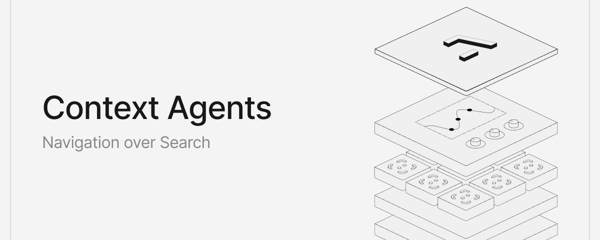

# Context Agents: Navigation over Search

**Author:** Ashpreet Bedi (@ashpreetbedi)
**Date:** 2026-03-10
**Source:** https://x.com/ashpreetbedi/status/2031416367610744960
**Stats:** 12 replies, 53 retweets, 579 likes, 1,093 bookmarks, 45,499 views

---

If you had to give an agent access to all your emails, Slack, Notion, Google Drive, would you:

1. Embed everything in a vector database and search for relevant chunks at runtime.
2. Give the agent tools to access each source directly, so it can navigate through them and pull what it needs.

## From search to navigation

When you point Claude Code at a codebase, it navigates. It reads the directory structure, follows imports, checks dependencies, builds a map of where things live. It gets more accurate the more it explores.

When you apply this pattern to personal and work data, and add a learning loop so the agent improves with use, you get what I'm calling a context agent.

A coding agent navigates a codebase. A context agent navigates everything else: your emails, your calendar, your documents, your databases, your Slack threads. The key is that each source is queried using its native interface. Email is queried by sender and date. A database is queried with SQL. A calendar is queried with time ranges. Nothing gets flattened into vectors.

## Three Generations of Context

An agent's response is only as good as the context it has access to.

This problem is important enough to be its own discipline: Context Engineering. The industry has gone through three generations of context-gathering, each solving the need of its time.

### **Generation 1: Semantic RAG (2023)**

Embed your documents, store in a vector database, search at query time, inject the top results into the prompt. RAG gave LLMs access to large knowledge bases without stuffing everything into the context window.

It was a breakthrough with incredible developer adoption. Entire companies were built around it. But it had two limitations:

1. The search query is the raw input message. The system embeds the input message and retrieves whatever is semantically closest. There's no reasoning about what information is actually needed before searching.
2. Vector storage flattens everything into one interface. Your docs, email inbox, calendar. All chunked, embedded, and searched the same way.

### **Generation 2: Agentic RAG (2024-25)**

Better tool calling paved the way for Agentic RAG, where the model searches its knowledge base using tool calls. IMO improvements in tool calling have consistently been the most under-hyped jumps in model capability.

The key shift is moving the search for context from query time, to run time.

Instead of embedding the user's raw input and hoping for relevant chunks, the agent reasons about what information it actually needs, then runs targeted searches. This solves limitation one.

But limitation two remains. The agent is still searching a vector store. It's just smarter about when and what to search. The sources are still flattened. There's still no memory of what worked last time.

### **Generation 3: Agentic Navigation (2026-)**

This is the context agent. The agent doesn't search a vector store. It navigates a context graph: a set of heterogeneous sources, each queried on its own terms. It builds a map of where things live, learns which retrieval strategies work, and improves with every interaction.

The shift from generation 2 to generation 3: navigation over search as the core retrieval primitive.

A SQL database should be queried with SQL. A calendar should be queried with time ranges. A file system should be navigated by structure.

## Context Agents in Practice

[Pal](https://github.com/agno-agi/pal) is a personal context-agent that learns how you work. It navigates a set of heterogeneous sources to gather context:

1. A local file system with preferences, voice guidelines, and templates.
2. Tools like Gmail, Google Calendar, and Slack.
3. A PostgreSQL database for structured data (notes, people, projects, decisions).

Each source keeps its native query interface. Databases get queried with SQL. Email gets queried by sender. Files get navigated by directory structure. A learning loop ties it together: every interaction improves the next one.

What makes a context agent different is the execution loop, designed for routing and navigation:

1. **Classify** intent from the input message.
2. **Recall** metadata and routing patterns from knowledge and learnings.
3. **Read** from the right sources, in the order informed by learnings.
4. **Act** through tool calls.
5. **Learn** so the next request is better.

## The Navigation Loop

You tell Pal: "Prepare for my meeting with Sarah". Pal:

1. **Classifies** the task as meeting prep.
2. **Recalls** from knowledge that Sarah is a contact with a linked project and a `partnership-brief.md`. Learnings have a routing strategy: calendar -> email -> notes -> files.
3. **Reads** the meeting and agenda via CalendarTools. Sarah's thread from yesterday via GmailTools. Notes tagged "sarah" via SQLTools. The project brief via FileTools.
4. **Acts** by synthesizing into a coherent brief. Here's the agenda, here's what Sarah sent yesterday, here's the project status, here are the open questions from your notes.
5. **Learns** by saving a discovery that Sarah-related context spans these four sources. Next time, skip the broad search and go directly to them.

Four sources. Each queried through its native interface. Each summarized independently, then synthesized.

## Knowledge and Learnings

Steps 2 and 5 are where the improvement happens. They're powered by two systems that have a blurry boundary at the moment.

**Knowledge is the map.** A metadata index of where things live. As Pal works, it records what files exist, what tables have been created, what sources are available, and where specific information was found before. Knowledge is structural awareness, not content storage.

When Pal discovers that Project X information lives across a SQL table, a markdown brief, and a Gmail thread, it saves that mapping as a discovery. Next time someone asks about Project X, it navigates directly to those three places.

Knowledge entries are prefixed by type:

- **File:** what context files exist, their purpose and intent tags
- **Schema:** what SQL tables exist and their structure
- **Source:** what tools are available and their capabilities
- **Discovery:** where information was found for specific topics

In a multi-user setup, Knowledge is shared. The map of where things live is the same for everyone. Learnings are namespaced per user. Your compass is yours.

**Learnings are the compass.** As Pal completes tasks, it records which retrieval strategies succeeded, which patterns it notices in how you work, and any corrections you've made.

When Pal figures out that meeting prep works best by checking calendar first, then email, then notes, then files, it saves that sequence. When you correct it ("Sarah works at Acme Corp, not Acme Inc"), that correction always takes priority over everything else.

Learnings are also prefixed:

- **Retrieval:** which sources and queries worked for a given request type
- **Pattern:** recurring behaviors the agent has noticed
- **Correction:** explicit user fixes. These always win.

The difference between knowledge and learnings is that knowledge tracks where things are, learnings track how to get to them.

Knowledge is shared across users. The file system, the schemas, the sources are structural facts. Learnings are namespaced per user. Your retrieval patterns, your corrections, your preferences stay yours. In both cases, the prompt stays the same. What improves is the context the agent brings to it.

## Scheduled Tasks

A context agent that only runs when you ask is reactive. Scheduled tasks make it proactive. Pal ships with five scheduled tasks:

- **Daily briefing** (8 AM weekdays): calendar, emails, priorities.
- **Inbox digest** (12 PM weekdays): morning email summary, flag responses.
- **Weekly review** (5 PM Friday): fill weekly-review template, save to meetings/.
- **Context refresh** (8 AM daily): re-index context files, prune stale facts.
- **Learning summary** (10 AM Monday): summarize patterns from learnings.

Each task can post its results to Slack (if needed).

## What's Next

Pal is an open-source experiment. A working one, but still an experiment.

Context agents can also be built for teams and organizations: an agent that navigates across Slack, Notion, Drive, and internal databases, learns which retrieval strategies work for your org's data, and gets better with use.

If you try Pal and something breaks, please report by opening an issue.

Build on it, break it, make it yours.

- [Pal on GitHub](https://github.com/agno-agi/pal)
- [Agno Docs](https://docs.agno.com/)
