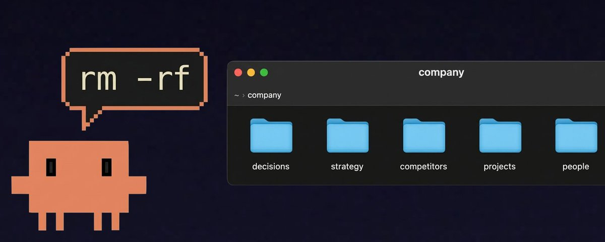

# a file system is not all you need

**Author:** Kevin Gu (@gukevinr)
**Date:** March 12, 2026
**Source:** https://x.com/gukevinr/status/2031889622385729730
**Stats:** 48 replies, 77 retweets, 908 likes, 2,364 bookmarks, 347,826 views

---



there are a couple of articles going around on structured context graphs for knowledge work and argue that markdown files are the best primitive

heres one:

> [Referenced tweet by @unknown (ID: 2026492755430474002)](https://x.com/i/status/2026492755430474002)

and the diagnosis is true: context is the bottleneck. companies are sitting on scattered knowledge: decisions, rationale, meeting outputs, changing priorities. agents need a structure to traverse it without starting from zero every time

but this ongoing romanticization of putting everything in markdown files is reinventing the database in the worst possible substrate. heres why

## the data modeling problem

the article talks about wikilinks as "semantic connections" and maps of content for navigation

but the moment you need to query across your graph, like find all decisions that contradict the current roadmap, you're doing a full text scan across thousands of files. a real database gives you joins, indexes, constraints. markdown files just give you grep

that company directory tree?

```markdown
company/
├── org/
│   ├── decisions/
│   ├── strategy/
│   ├── competitors/
├── projects/
│   ├── product-alpha/
│   │   ├── features/
│   │   ├── decisions/
```

that's a schema. decisions have a many-to-many with features. competitors link to research

congratulations, you've built a database

> [Referenced tweet (ID: 1629629860175032320)](https://x.com/i/status/1629629860175032320)

of course it works at a small scale. lots of things do

## maintenance is the real killer

the article names the right failure mode. every wiki and knowledge base dies because maintenance is expensive. then it handwaves the solution with "agents don't get bored of maintenance"

the problem is structural

if your source of truth is a google doc and you've extracted claims into a markdown note, you now have two copies. two copies drift. no matter how diligent your agent is, the moment the original doc gets edited by a human, the note becomes stale

a database with a reference to the original source doesn't have this problem. you store a drive file id, a slack message url, a notion block id. information dependencies should be encoded in the database

and when that google doc updates, you trace everything derived from it and cascade the update. dependency tracked, provenance preserved. zero drift by design, not by maintenance discipline

## the code analogy breaks here

people extend the code analogy to justify cramming everything into files: agents already live in filesystems, so give company context the same shape

but code was easier for models because code has more than textual structure. it's executable. unit tests run every update to catch errors

company context is nothing like that

a meeting note linking to a strategy doc is not the same relation as a file importing a module. a summarized decision is not self-verifying. a product plan doesn't throw an exception because the sales team is operating on a different assumption. that contradiction can sit there for months, sounding perfectly coherent in prose

so "the agent can traverse the graph" is a much weaker claim than it sounds. traversal is not truth maintenance. a model can move beautifully through a network of notes and still fail to determine which parts are live, which parts are stale, which parts are binding, and which parts were always just one person's interpretation

## the flattening problem

a note might contain a decision. or a guess. or a meeting summary. or a stale belief that was true three months ago. or someone's personal framing of an issue another team would strongly disagree with

all of it becomes text. all of it becomes traversable. all of it looks more structurally similar than it really is

what is authoritative? what is speculative? what is current? what has been superseded? who owns this piece of knowledge?

a markdown graph makes many things readable. it does not make them governable

and here's the irony: the filesystem is presented as minimalist, but in practice you start adding metadata. status tags. typed links. templates. special notes for decisions. rules for what agents can rewrite and how provenance gets preserved

at some point you're not escaping the need for a richer system. you're rebuilding one inside a folder tree because the folder tree feels philosophically cleaner. the complexity doesn't disappear. it just gets hidden away

## schema is context too

here's something the file advocates miss entirely: structure is itself information for the agent

when data lives in a typed schema, the agent knows how it was generated. it knows what kind of thing it's reading. it knows what other records depend on it and what it depends on. it can reason about provenance, not just content

a markdown file can tell an agent what a decision says. a schema can tell it whether that decision is still active, who made it, what it superseded, what was derived from it, and what needs to be re-evaluated if it changes

## better architecture

```
work apps → drive, slack, CRM, linear, code repos
file layer → instructions, synthesis, agent scratchpad, SOPs for where things live
database layer → extracted info, relationships, pointers to sources, metadata, provenance
```

the work apps are where the source of truth comes from

the file layer is the hot access metadata. where you kickstart the agent with base instructions and teach it basic procedures to form a prior of how/where to look

the database is the graph. it stores derived information, structure, relationships, dependency chains. it points to where things actually live and tracks what was derived from what

## give your agents a database

> [Referenced tweet (ID: 2011638639831499041)](https://x.com/i/status/2011638639831499041)

the end state is an agent that can write its own ETL

it ingests from your existing sources through their APIs. it maintains a structured index with typed relationships and dependency tracking. when a source updates, it knows exactly what to re-evaluate. when you reject its suggestion and do something differently, that goes in a table as a local system of record the agent can reference and learn from over time

when it spawns, the agent can lean on this structure by querying a live graph of your organization's context, tracing claims back to their origin, updating derived beliefs when the ground truth changes

## the future belongs to organizations that accumulate context

not organizations that write better notes or wikis. organizations that build a structured, pointer-based, provenance-aware layer that gets smarter as they operate

decisions don't evaporate into slack. research doesn't die in someone's head. when a source updates, everything derived from it updates too. when an agent makes a suggestion you reject, that goes in a table. the organization learns from its own record

that's what compounding context actually looks like. a live graph that traces claims to their origin, preserves the distinctions that matter, and makes the whole organization legible to the agents working inside it

and this is whats needed for agents to go from copilots to coworkers
