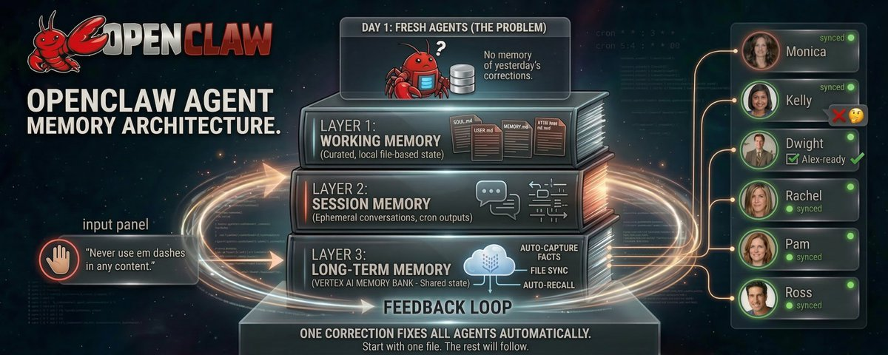

# How I Manage Memory for My 24/7 OpenClaw Agent Team (and why one correction fixes all Agents)

**Author:** Shubham Saboo (@Saboo_Shubham_)
**Date:** March 15, 2026
**Source:** https://x.com/Saboo_Shubham_/status/2033026472856952849
**Stats:** 5 replies, 7 retweets, 62 likes

---



> **Note:** This post is an X Article (long-form article published natively on X). The full article text could not be extracted directly due to X's JavaScript rendering requirements. The content below is reconstructed from the article's metadata, preview text, and the author's related detailed writings on the same topic (particularly his Unwind AI article "How I Built an Autonomous AI Agent Team That Runs 24/7").

---

## Preview

Most AI agents forget everything the moment the session ends.
I run six agents 24/7 on a Mac Mini. Research, content, engineering, newsletters, LinkedIn, coordination. They run on cron schedules. They don't remember yesterday unless I build the system for it.

## The Core Problem

AI agents wake up with no memory of previous sessions. Every conversation starts fresh. This is a feature of how LLMs work, not a bug. But it means memory must be explicit and deliberate.

## The Memory Architecture

Saboo runs two layers of memory for his agent team:

### Layer 1: Daily Logs (memory/YYYY-MM-DD.md)

Raw notes from each session. What happened, what was drafted, what feedback came in. The agent writes these throughout the day.

### Layer 2: Long-term Memory (MEMORY.md)

Curated insights distilled from daily logs. Lessons learned, preferences discovered, patterns noticed.

From the AGENTS.md that every agent follows at the start of every session:

```
## Memory

You wake up fresh each session. These files are your continuity:
- **Daily notes:** `memory/YYYY-MM-DD.md` — raw logs of what happened
- **Long-term:** `MEMORY.md` — curated memories

### Write It Down - No "Mental Notes"!
- Memory is limited. If you want to remember something,
  WRITE IT TO A FILE.
- "Mental notes" don't survive session restarts. Files do.
- When someone says "remember this" → update the memory file
- When you learn a lesson → update the relevant file
- Text > Brain
```

## Why One Correction Fixes All Agents

The key insight: when you correct one agent's behavior, the correction lands in a shared configuration file (AGENTS.md or MEMORY.md), not in ephemeral chat. Since all agents read from the same root-level configuration files at session start, a single correction propagates across the entire team.

For example:
- Kelly learned that Saboo's writing voice has no emojis and no hashtags. That went into her memory file. Every future draft reflects it without repeating the instruction.
- Dwight learned which types of stories pass the "Alex filter" (their target audience profile) and which ones to skip. That correction persists in his memory.

When corrections are structural (applying to all agents), they go into the shared AGENTS.md. When they are agent-specific, they go into that agent's MEMORY.md. Either way, the correction survives session restarts and compounds over time.

## The File System Is the Coordination Layer

No API calls between agents. No message queues. No orchestration framework. Just files.

- Dwight does research and writes findings to `intel/DAILY-INTEL.md`
- Kelly wakes up, reads that file, drafts tweets from it
- Rachel reads the same file, drafts LinkedIn posts
- Pam reads it, writes the newsletter

The workspace structure:

```
workspace/
├── SOUL.md              # Monica (main agent, lives at root)
├── AGENTS.md            # Behavior rules for all sessions
├── MEMORY.md            # Monica's long-term memory
├── HEARTBEAT.md         # Self-healing cron monitor
├── agents/
│   ├── dwight/
│   │   ├── SOUL.md
│   │   ├── AGENTS.md
│   │   └── memory/
│   ├── kelly/
│   │   ├── SOUL.md
│   │   ├── AGENTS.md
│   │   └── memory/
│   ├── ross/
│   │   ├── SOUL.md
│   │   └── memory/
│   ├── rachel/
│   │   └── ...
│   └── pam/
│       └── ...
└── intel/
    ├── DAILY-INTEL.md       # Dwight's generated research
    └── data/
        └── 2026-02-11.json  # Structured data (source of truth)
```

## Three Critical Rules for Agent Memory

1. **Instructions in conversation don't survive, but MEMORY.md and AGENTS.md do.** If it's not written to a file, it doesn't exist. Durable rules belong in files, not chat.

2. **Enable memory flush with enough buffer to trigger.** OpenClaw has a built-in safety net (safeguard compaction) that saves context before compaction. Before compaction runs, it silently triggers the agent to write important context to a daily memory file, so when the session gets trimmed, nothing critical is lost.

3. **Make retrieval mandatory.** Add a rule to AGENTS.md that says "search memory before acting." Without this, the agent guesses instead of checking its notes.

## The Compounding Effect

The agents actually get better over time. Not because the model improves. Because the context they load gets richer.

After two weeks of running, Saboo recommends:
- Start a MEMORY.md file
- Review daily logs
- Identify which corrections keep recurring
- Distill them into permanent entries

When you find yourself repeating the same correction to multiple agents, that's the signal to build a shared-context layer -- put it in the root AGENTS.md where all agents will read it.

## Memory Maintenance

Agent output quality degrades when memory files get cluttered or contradictory. The fix: periodic memory maintenance.

During heartbeats, agents periodically review their daily logs and distill the important stuff into MEMORY.md. Daily files are raw notes. MEMORY.md is curated wisdom.

Context window overflow happens when agents read too many files at session start, running out of room for actual work. The fix: keep SOUL.md short (40-60 lines), keep AGENTS.md focused, only load today's memory file plus yesterday's. The agent does not need to read its entire history every session.

## Related Resources

- [How I Built an Autonomous AI Agent Team That Runs 24/7](https://www.theunwindai.com/p/how-i-built-an-autonomous-ai-agent-team-that-runs-24-7) -- Full tutorial by the same author covering the complete setup
- [How to set up OpenClaw Agents that actually get better Over Time (My exact stack after 40 Days)](https://x.com/Saboo_Shubham_/status/2027463195150131572) -- Earlier X Article on the iterative improvement methodology
