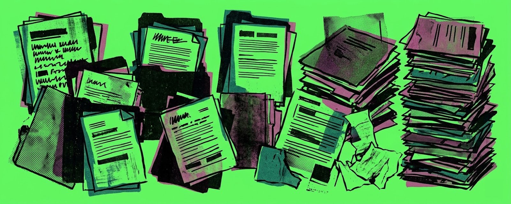

# I built a second brain out of markdown files

**Author:** Gabriel Valdivia (@gabrielvaldivia)
**Date:** March 11, 2026
**Source:** https://x.com/gabrielvaldivia/status/2031812714935328968
**Stats:** 15 replies, 38 retweets, 568 likes, 42.4K views

---

Your life context is scattered across a dozen apps: Gmail, Slack, iMessage, Figma, Google Calendar, Granola, Apple Health, etc. Their data has been kept away in a walled garden. No single tool sees the full picture.

I've been experimenting with a system that pulls from all of them and writes everything into markdown files in a single git repo. Just folders and plain text files that AI agents can act on. Here's how it works:

## The Architecture

The whole thing is built on folders and markdown files. If you can read a text file, you can read the entire system.

- `journal/` — daily freeform journal
- `digests/` — end-of-day structured recaps
- `identity/` — a living profile of who I am
- `people/` — notes on everyone I interact with
- `clients/` — client and lead tracking
- `work/` — tasks, Figma comments, business ops
- `health/` — daily metrics from Apple Health
- `blog/` — synced from Substack
- `twitter/` — synced from X
- `youtube/` — daily watch history

The interface is Claude Code. I've written 15 custom skills that each know what sources to check, what files to read and write, and how to cross-reference everything. They run in the terminal, operate on the repo, and commit their changes to git.

## Data sources

The system connects to everything I use daily through MCP servers and local scripts I've co-created with Claude. Some are queried live, others are synced into markdown on a schedule. Some of the channels I've included so far:

- Gmail (inbox + sent)
- Google Calendar (multiple accounts)
- Slack (multiple workspaces)
- Beeper (iMessage, WhatsApp, Signal, Discord)
- iMessage (directly from macOS chat.db)
- Figma comments (via Figma MCP server)
- Granola (meeting transcripts)
- Apple Health (via Sumi iOS app)
- Git commits (across all repos)
- Slackdone (task manager)
- Substack (blog posts)
- X / Twitter (via IFTTT → Google Sheets)
- YouTube (watch history)

## The Daily Rhythm

Three cron jobs keep the system running without me thinking about it:

**7:00 AM — Morning briefing.** Reviews yesterday's digest, checks today's calendar across multiple Google accounts, pulls overnight messages from iMessage and Beeper, reads my task list, and sends a summary to my phone including the day's weather, notable meetings, and open loops. On weekends it switches to personal mode — no work tasks, just family plans and friend meetups.

**12:00 PM — Mid-day sync.** Pulls all data sources into markdown. Tasks from Slackdone (a custom app I built to track Slack lists across multiple workspaces), Figma comments, blog posts from Substack, YouTube watch history, tweets from X. Commits and pushes.

**8:00 PM — Full sync + nightly digest.** This is the big one.

## The Digest

The nightly /digest skill is the most complex. It sweeps through every communication channel I used that day, then it writes a structured recap:

- **Meetings** — time, attendees, key decisions, and action items
- **Email** — thread summaries including what I sent, not just what I received
- **Conversations** — grouped by client (Slack, Beeper, iMessage, and Figma threads combined), with a separate section for personal conversations
- **Shipped** — git commits, completed tasks, and anything deployed
- **Open Loops** — things that need follow-up where someone is waiting on me
- **Wins** — anything worth celebrating, even small things

The key design choice is grouping conversations by client, not by channel. A single client might have activity across Slack, Figma comments, email, and iMessage in the same day. The digest combines all of that into one section so I get the full picture of what happened with each client.

## Cross-Referencing

The biggest failure mode of any "daily summary" tool is to remain aware of communication across different channels. An inbound email exists, so the system flags it as "needs a reply," but you replied two hours ago on Slack. Or someone asked you for something in a meeting, and you already sent it via iMessage.

So before the digest writes anything as an open loop, it does a two-pass verification:

**Pass 1:** Draft every potential open loop from the day's data.

**Pass 2:** For each candidate, re-query fresh data from Gmail sent, Beeper outbound, Slack, Figma, and iMessage. If there's any evidence I already responded, it gets dropped. The verification log is shown before the digest is written, so I can see the reasoning.

## Meeting Prep

Before any call, the /meeting-prep skill pulls recent Slack messages, email threads, Beeper and iMessage conversations with the attendees, open Figma comment threads for that client, tasks in "ready for review," recent digests for context, and Granola transcripts from past meetings.

Then it writes a briefing: what I need to know, open items to discuss, and a "small talk" section with real details from recent conversations so I'm plugged in even if I miss messages across dozens of Slack channels.

Today it prepped me for a call with a new potential client. It found the original intro email, traced the scheduling thread, identified who accepted and who declined, noted that I'd never spoken to them before, flagged which of my apprentices might have capacity, and even reminded me that my wife's night out starts at 7pm so I should keep the call tight.

## The Identity Profile

The system maintains a living profile of who I am. Every sync, it reads my activity across journal entries, tweets, blog posts, YouTube watch history, sent emails, and conversations. Then it updates a markdown file tracking my beliefs, interests, communication patterns, and how my thinking is evolving.

The identity profile was supposed to be a way for the system to know my preferences so it could write better summaries. But it turned into something more like a mirror. It noticed I was journaling about the same tension between scaling the business and doing hands-on design work before I consciously recognized it as a real conflict I needed to resolve. It picked up that my tone in emails to one client had shifted from enthusiastic to transactional, which made me realize I was losing interest in the engagement before I'd admitted it to myself.

It's like a mirror that gets sharper over time. When I started tweeting about creativity, it picked that up as a signal and added it to my profile. When my health data showed I was cycling more, it noted the pattern.

## Journal

I built a small iOS app called Sumi for journaling into the system. Every entry is committed directly to the git repo as a markdown file. Entries queue offline first and sync when you're back online.

It also reads Apple Health data — steps, heart rate, HRV, walking heart rate, distance, flights climbed, exercise minutes, weight, sleep, workouts — and syncs daily summaries to the repo. The digest picks this up and writes it conversationally: "Big movement day: 16,726 steps. Evening bike ride, 38 minutes."

## Task Management

I built a small app called Slackdone that turns Slack lists into a unified task board across multiple workspaces. The system syncs those tasks into markdown, but it also writes back. After a meeting today, I told the agent to update my tasks based on the Granola transcript. It read the transcript, created new tasks, updated existing ones, and added detailed notes from the meeting. I didn't open a task manager or copy-paste from meeting notes. I just said "update the tasks based on the latest meeting" and it did the rest.

This is the part that feels different from most AI workflows. The agent is using context from multiple tools I already use. It creates tasks, sets assignees, updates statuses, and writes notes with enough context that anyone on my team can pick them up.

## What I Didn't Expect

This system changed how I think about AI tools.

Most AI products focus on the interface: the thing you open, interact with, and depend on. Another approach is to treat AI as the operator: what it reads, writes, cross-references, and synthesizes. LLMs can turn a previous complex data layer into easy-to-read text files I own. No vendor lock-in, proprietary formats, or databases to migrate. If Claude disappeared tomorrow, the markdown files are still there, perfectly readable by another AI agent.

But the bigger surprise was about self-understanding.

The conversation around AI tends to revolve around productivity: save time, automate tasks, get more done. This project has definitely helped me there. But it's also helped me in a more interesting way: introspection. A system that reads everything you write and say —across every channel— can show you who you're actually being, not who you think you are.

I told the system to be a coach, not an assistant. To celebrate shipping, not busywork. To call out things I might be avoiding. And it does, because it has the receipts. It knows I said I'd follow up with someone three days ago and never did. It knows I keep pushing the same task to next week. It knows when my "open loops" section is growing faster than my "wins" section.

Your calendar says your priorities. Your sent messages reveal your tone. Your journal shows your anxieties. Your task list shows what you avoid. No single source tells the full story, but together they paint a picture that's hard to ignore. There's something freeing about that. It can serve as an accountability partner that never forgets and never judges, but also never lets you off the hook.

Learn more about it here: https://gabos.vercel.app/
