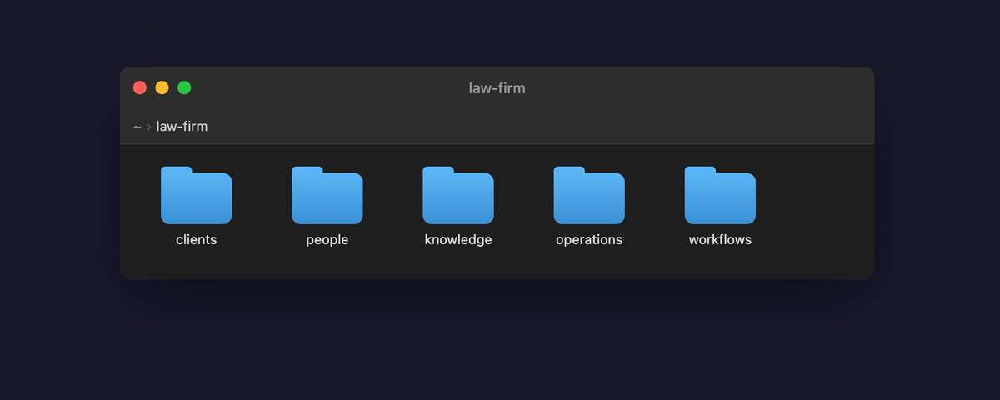

# Your Company is a Filesystem

**Author:** Eli Mernit (@mernit)
**Date:** February 10, 2026
**Source:** https://x.com/mernit/status/2021324284875153544
**Stats:** 98 replies, 328 retweets, 3,305 likes

---

> **Note:** This post is an X Article (long-form). The full body text is only available on x.com via JavaScript rendering. The preview and key excerpts are preserved below.

One of the reasons Openclaw is so good is because its entire context is a filesystem on your computer. Openclaw runs on a computer and lets you talk to it via a chat app like Telegram or iMessage.

The architecture of an AI agent can be reduced to two components: the filesystem as state, and Claude as the orchestrator. By modeling the company as a filesystem, an agent is able to solve business problems by simply reading and writing files.

The filesystem becomes the source of truth for the agents that are the most useful.
