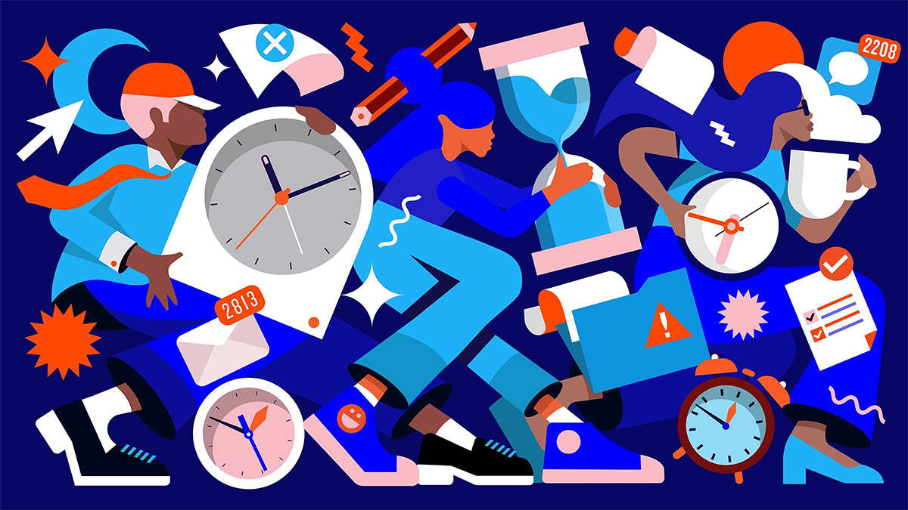

# AI Doesn't Reduce Work -- It Intensifies It

**Author:** Aruna Ranganathan and Xingqi Maggie Ye
**Date:** February 9, 2026
**Source:** https://hbr.org/2026/02/ai-doesnt-reduce-work-it-intensifies-it

---

Right now, many companies are worried about how to get more employees to use AI. After all, the promise of AI reducing the burden of some work -- drafting routine documents, summarizing information, and debugging code -- and allowing workers more time for high-value tasks is tantalizing. But are they ready for what might happen if they succeed?

While leaders are focused on promised productivity gains, they may find themselves surprised by the complex reality, and may not see what these gains are costing them until it's too late.

In their in-progress research, the authors discovered that AI tools didn't reduce work, they consistently intensified it. In an eight-month study of how generative AI changed work habits at a U.S.-based technology company with about 200 employees, they found that employees worked at a faster pace, took on a broader scope of tasks, and extended work into more hours of the day, often without being asked to do so. Importantly, the company did not mandate AI use (though it did offer enterprise subscriptions to commercially available AI tools). On their own initiative workers did more because AI made "doing more" feel possible, accessible, and in many cases intrinsically rewarding.

While this may sound like a dream come true for leaders, the changes brought about by enthusiastic AI adoption can be unsustainable, causing problems down the line. Once the excitement of experimenting fades, workers can find that their workload has quietly grown and feel stretched from juggling everything that's suddenly on their plate. That workload creep can in turn lead to cognitive fatigue, burnout, and weakened decision-making. The productivity surge enjoyed at the beginning can give way to lower quality work, turnover, and other problems.

This puts leaders in a bind. What should they do? Asking employees to self-regulate isn't a winning strategy. Rather, companies need to develop a set of norms and standards around AI use -- what the authors call an "AI practice." Here's what leaders need to know, and what they can do to set their employees up for success.

## How Generative AI Intensifies Work

From April to December last year, the authors studied how generative AI tools changed work habits at the tech company. They did this through in-person observation two days a week, tracking internal communication channels, and more than 40 in-depth interviews across engineering, product, design, research, and operations. They identified three main forms of intensification.

### Task expansion

Because AI can fill in gaps in knowledge, workers increasingly stepped into responsibilities that previously belonged to others. Product managers and designers began writing code; researchers took on engineering tasks; and individuals across the organization attempted work they would have outsourced, deferred, or avoided entirely in the past. Generative AI made those tasks feel newly accessible. These tools provided what many experienced as an empowering cognitive boost: They reduced dependence on others, and offered immediate feedback and correction along the way. Workers described this as "just trying things" with the AI, but these experiments accumulated into a meaningful widening of job scope. In fact, workers increasingly absorbed work that might previously have justified additional help or headcount.

There were knock-on effects of people expanding their remits. For instance, engineers, in turn, spent more time reviewing, correcting, and guiding AI-generated or AI-assisted work produced by colleagues. These demands extended beyond formal code review. Engineers increasingly found themselves coaching colleagues who were "vibe-coding" and finishing partially complete pull requests. This oversight often surfaced informally -- in Slack threads or quick desk-side consultations -- adding to engineers' workloads.

### Blurred boundaries between work and non-work

Because AI made beginning a task so easy -- it reduced the friction of facing a blank page or unknown starting point -- workers slipped small amounts of work into moments that had previously been breaks. Many prompted AI during lunch, in meetings, or while waiting for a file to load. Some described sending a "quick last prompt" right before leaving their desk so that the AI could work while they stepped away. These actions rarely felt like doing more work, yet over time they produced a workday with fewer natural pauses and a more continuous involvement with work. The conversational style of prompting further softened the experience; typing a line to an AI system felt closer to chatting than to undertaking a formal task, making it easy for work to spill into evenings or early mornings without deliberate intention.

Some workers described realizing, often in hindsight, that as prompting during breaks became habitual, downtime no longer provided the same sense of recovery. As a result, work felt less bounded and more ambient -- something that could always be advanced a little further. The boundary between work and non-work did not disappear, but it became easier to cross.

### More multitasking

AI introduced a new rhythm in which workers managed several active threads at once: manually writing code while AI generated an alternative version, running multiple agents in parallel, or reviving long-deferred tasks because AI could "handle them" in the background. They did this, in part, because they felt they had a "partner" that could help them move through their workload. While this sense of having a "partner" enabled a feeling of momentum, the reality was a continual switching of attention, frequent checking of AI outputs, and a growing number of open tasks. This created cognitive load and a sense of always juggling, even as the work felt productive.

Over time, this rhythm raised expectations for speed -- not necessarily through explicit demands, but through what became visible and normalized in everyday work. Many workers noted that they were doing more at once -- and feeling more pressure -- than before they used AI, even though the time savings from automation had ostensibly been meant to reduce such pressure.

## What This Means for Organizations -- and How an "AI Practice" Can Help

All of this produced a self-reinforcing cycle. AI accelerated certain tasks, which raised expectations for speed; higher speed made workers more reliant on AI. Increased reliance widened the scope of what workers attempted, and a wider scope further expanded the quantity and density of work. Several participants noted that although they felt more productive, they did not feel less busy, and in some cases felt busier than before. As one engineer summarized:

> "You had thought that maybe, oh, because you could be more productive with AI, then you save some time, you can work less. But then really, you don't work less."

Organizations might see this voluntary expansion of work as a clear win. After all, if workers are doing this of their own initiative, why would that be bad? Isn't this the productivity explosion we've been promised?

But the research reveals the risks of letting work informally expand and accelerate: What looks like higher productivity in the short run can mask silent workload creep and growing cognitive strain as employees juggle multiple AI-enabled workflows. Because the extra effort is voluntary and often framed as enjoyable experimentation, it is easy for leaders to overlook how much additional load workers are carrying. Over time, overwork can impair judgment, increase the likelihood of errors, and make it harder for organizations to distinguish genuine productivity gains from unsustainable intensity. For workers, the cumulative effect is fatigue, burnout, and a growing sense that work is harder to step away from, especially as organizational expectations for speed and responsiveness rise.

Instead of responding passively to how AI tools reshape workplaces, both individuals and companies should adopt an "AI practice": a set of intentional norms and routines that structure how AI is used, when it is appropriate to stop, and how work should and should not expand in response to newfound capability. Without such practices, the natural tendency of AI-assisted work is not contraction but intensification, with implications for burnout, decision quality, and long-term sustainability.

As organizations work to build their AI practice, they should consider adopting:

### Intentional pauses

As tasks speed up and boundaries blur, workers could benefit from brief, structured moments that regulate tempo: protected intervals to assess alignment, reconsider assumptions, or absorb information before moving forward. These pauses would not slow work overall; they would simply prevent the quiet accumulation of overload that emerges when acceleration goes unchecked. For example, a decision pause could require, before a major decision is finalized, one counterargument and one explicit link to organizational goals -- widening the attention field just enough to protect against drift. Incorporating such pauses into everyday workflow is one way organizations can support better decisions, healthier boundaries, and more sustainable forms of productivity in AI-augmented environments.

### Sequencing

As AI enables constant activity in the background, organizations can benefit from norms that deliberately shape when work moves forward, not just how fast. This includes batching non-urgent notifications, holding updates until natural breakpoints, and protecting focus windows in which workers are shielded from interruptions. Rather than reacting to every AI-generated output as it appears, sequencing encourages work to advance in coherent phases. When coordination is paced in this way, workers experience less fragmentation and fewer costly context switches, while teams maintain overall throughput. By regulating the order and timing of work -- rather than demanding continuous responsiveness -- sequencing can help organizations preserve attention, reduce cognitive overload, and support more thoughtful decision-making in AI-forward workplaces.

### Human grounding

As AI enables more solo, self-contained work, organizations can benefit from protecting time and space for listening and human connection. Short opportunities to connect with others -- whether through brief check-ins, shared reflection moments, or structured dialogue -- interrupt continuous solo engagement with AI tools and help restore perspective. Beyond perspective, social exchange supports creativity. AI provides a single, synthesized perspective, but creative insight depends on exposure to multiple human viewpoints. By institutionalizing time and space for listening and dialogue, organizations re-anchor work in social context and help counter the depleting, individualizing effects of fast, AI-mediated work.

## Conclusion

The promise of generative AI lies not only in what it can do for work, but in how thoughtfully it is integrated into the daily rhythm. The research suggests that without intention, AI makes it easier to do more -- but harder to stop. An AI practice offers a counterbalance: a way to preserve moments for recovery and reflection even as work accelerates. The question facing organizations is not whether AI will change work, but whether they will actively shape that change -- or let it quietly shape them.
