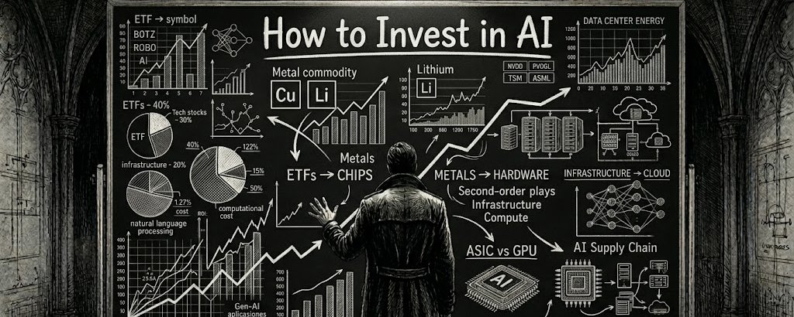
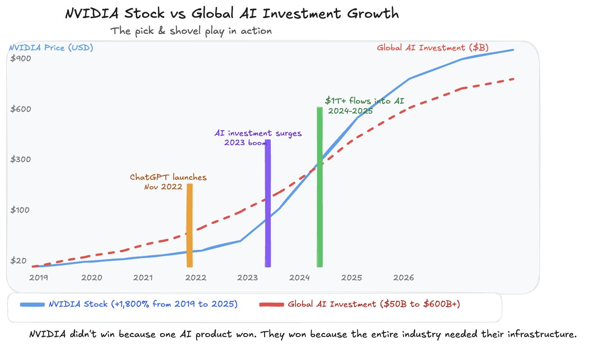
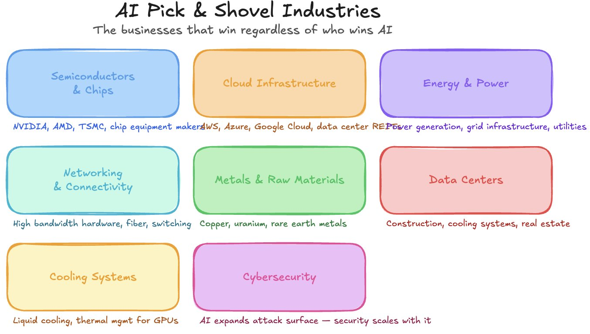
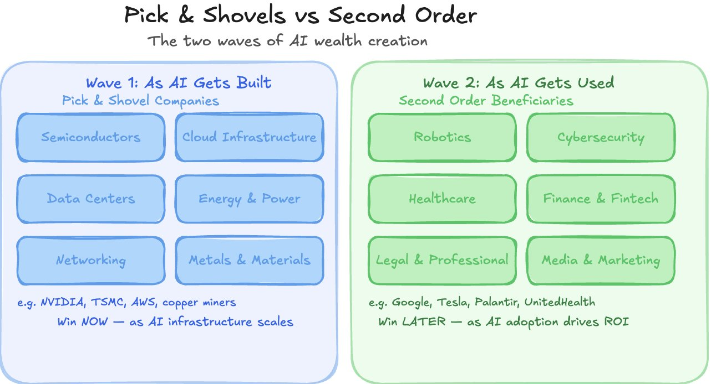
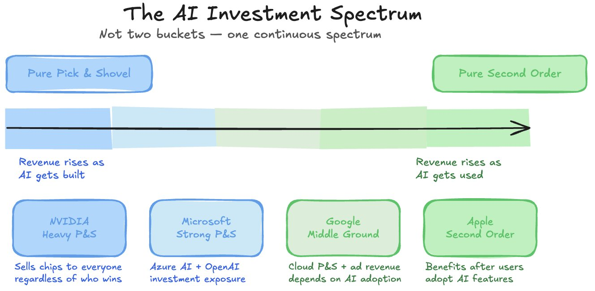
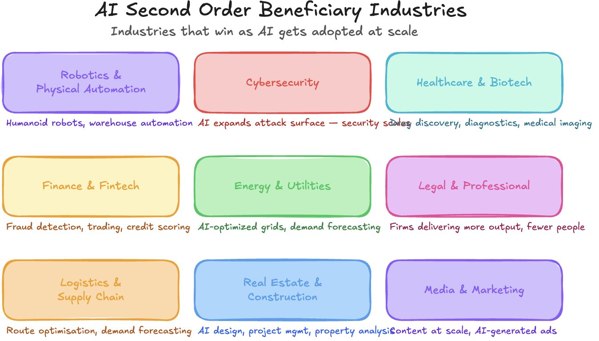
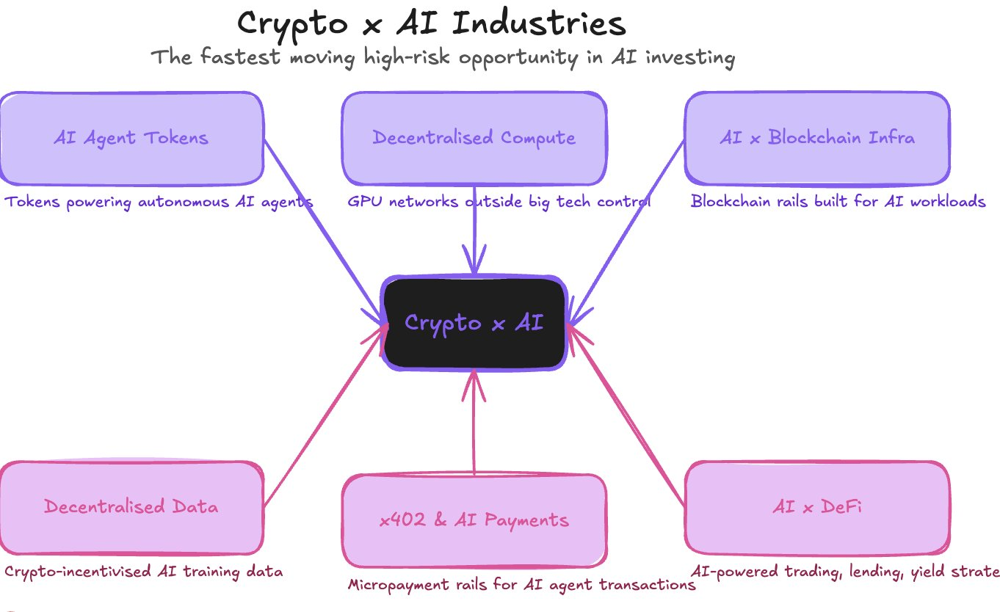
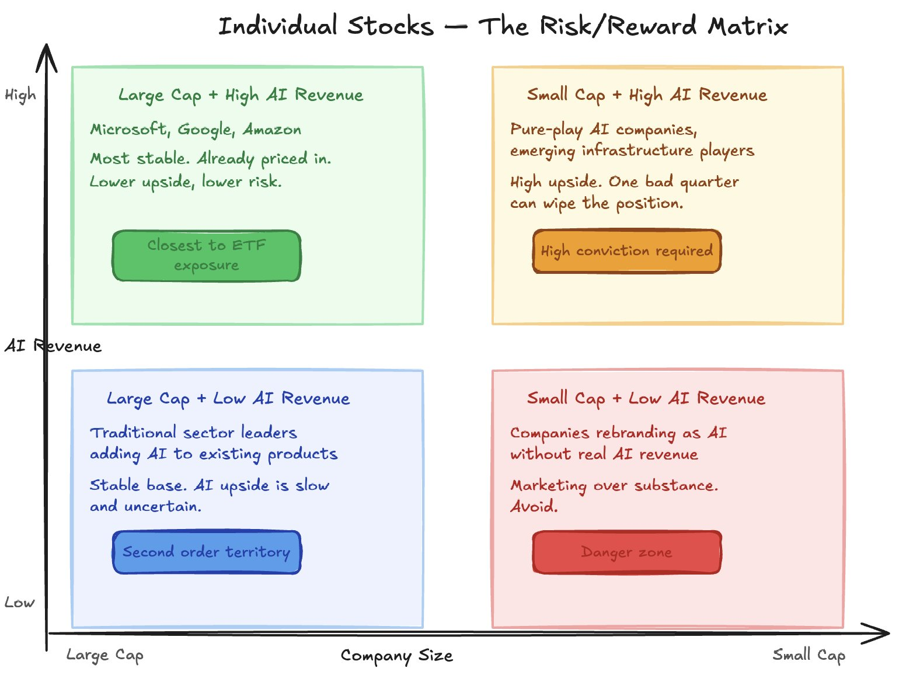
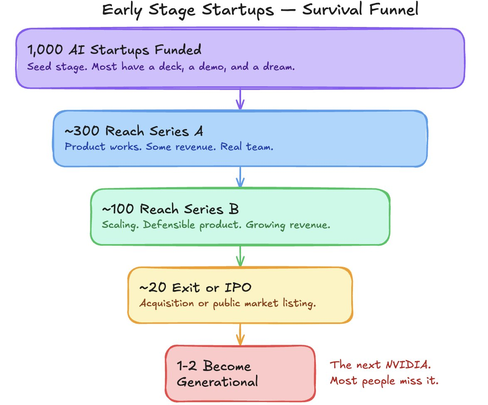
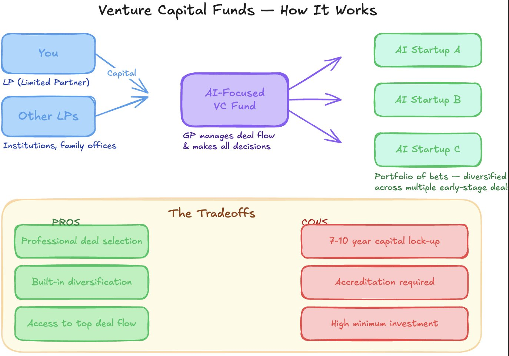

# How to Invest in AI (capitalize on the gold rush)

- **Author:** AI Edge (@aiedge_) / Miles Deutscher (@milesdeutscher)
- **Date:** March 13, 2026
- **Source:** [X Article](https://x.com/aiedge_/status/2032466807043580159)
- **Type:** X Article (long-form)

## Stats

| Metric | Value |
|--------|-------|
| Views | 1,829,740 |
| Likes | 2,114 |
| Retweets | 210 |
| Replies | 51 |
| Bookmarks | 11,719 |
| Quotes | 22 |

---



---

If you're not actively thinking about how to invest in the best technological advancement ever built, you're destined to lose.

Every decade or so, the world gets a gold rush moment.

The internet in the 90s created tech giants like Google, Amazon, and Apple from nothing and quietly made millionaires out of the engineers, investors, and early believers.

Mobile adoption in the early 2000s led to the rise of social platforms like Facebook, creating an entirely new digital marketing economy.

Crypto in the 2010s created a new asset class and a new generation of young, rich millionaires.

Each of these moments created two distinct groups of people:

1. Those who saw it coming and inherited a new wave of wealth
2. Those who were left saying, "I knew about it. I just never did anything."

If you've been in the latter camp for every single one of those moments, it genuinely doesn't matter, because what's sitting in front of you right now is bigger than all of them combined.

The AI gold rush is underway, and trillions are flowing through; there's no question about that.

The real question is - what are you going to do about it?

In today's article, I'm going to share my thoughts on how the average person can capitalize on and invest in the AI gold rush.

This is comprehensive and detailed - you'll want to bookmark this so you don't lose it.

**Important notes before we get started: READ THIS**

- *I'm not a financial advisor, and everything here is for educational purposes only.*
- *I'm going to limit listing specific companies and specific stock/ETF tickers; however, I may mention companies as examples. Note that if I mention a company, I may or may not own it (i.e., if I say NVIDIA is an example of a "pick-and-shovel play," I may own the company mentioned)*
- *I am not here to shill or sell you anything, and everything here is my opinion only.*

**The final section of this article is the one investment that requires zero capital and delivers the highest return of anything on this list. - stick around for it.**

---

## Pick-and-Shovels

During the original gold rush, the people who got incredibly rich were not the miners. They were the ones selling the picks, shovels, and the supplies miners needed.

The miners took on all the risk, and the suppliers benefited regardless of who actually found gold, who got rich, or who went bankrupt.

The same logic applies to AI.

Pick-and-shovel companies are the businesses that make money every time AI grows - regardless of which AI model wins, which startup succeeds, or which product takes off.

The most obvious example is NVIDIA. We all know how crazy their company growth has been over the past five years (+1300% stock price).

They didn't win because ChatGPT became the #1 AI on the app store.

They won because OpenAI, Anthropic, and hundreds of other AI companies NEEDED their infrastructure.



In other words, pick-and-shovel companies don't rely on **outcomes** or **success rates**.

These pick-and-shovel businesses are where I think everyone should be researching.

Many of you own the S&P500, and if you do, you already have exposure to many pick-and-shovel companies.

Here are some P&S industries worth researching:



One more pick-and-shovel angle worth researching: **raw metals**.

Metals like Copper and Aluminum are essential in manufacturing physical AI infrastructure.

---

## Second-Order Beneficiaries

Pick-and-shovel investments are the most direct way to invest in AI infrastructure, but there is a second layer of opportunity that most people overlook entirely.

Second-order beneficiaries are companies that do not sell AI infrastructure directly but whose businesses grow significantly as AI adoption spreads and customers gain real ROI.

The key distinction is timing:

Pick-and-shovel companies win as AI is built, while second-order beneficiaries win as AI gets used.



Think of it this way: when electricity was invented, the obvious picks-and-shovels were power companies and copper-wire manufacturers.

But the second-order winners were the factories, appliance makers, and retail businesses that could suddenly operate at a scale previously impossible.

**Now, you have to understand this.**

There can be overlap between pick-and-shovel companies and second-order beneficiaries.

For example, a company like Google relies on Gemini AI adoption to grow advertising revenue and cloud market share, but also builds the underlying AI infrastructure that others run on. It is both a tool supplier and a downstream beneficiary.

So, instead of thinking of pick-and-shovels and second-order beneficiaries as two distinct "investment buckets," think of it more like a spectrum.



**The one question to ask yourself:**

*"Does this company make more money because AI is being built OR because AI is being used?"*

**Second-order beneficiary sectors to research further:**



---

## Targeted Exposure

Ok, so you understand the two investment buckets and the AI spectrum between the two.

Now, I'm going to cover the broad investment vehicles that you can use to get targeted exposure to these industries - deeper than just the S&P 500.

**ETFs**

Not everyone wants to pick individual stocks. And honestly, most people don't need to.

ETFs (exchange-traded funds) give you diversified exposure to an industry or sector without having to research and pick individual companies yourself.

You buy one asset and get exposure to several companies across the entire industry.

For example, a Robotics & Automation ETF will hold companies across industrial automation, humanoid robotics, and AI-powered manufacturing.

Without recommending specific tickers, you can use this prompt in any LLM to source ETFs you may be interested in.

All you have to do is tell it which market you're in [US/UK/AU/Other] and give a list of industries you'd like ETFs for (you can use the ones I mentioned earlier).

### ETF Research Prompt

```
I want to build targeted ETF exposure to the AI investment opportunity. Here is my context:
Location and market: [your country]
Risk tolerance: [low / medium / high]
Investment horizon: [X years]
Monthly investment budget: [amount]
Current portfolio: [brief description — e.g. "mostly S&P 500 index funds"]
Based on this, recommend ETFs across these five categories:
1. Broad AI & Technology
2. Semiconductors & Chips
3. Robotics & Automation
4. Cybersecurity
5. Clean Energy & Grid Infrastructure
For each recommendation provide:
— Fund name and ticker
— Top 5 holdings
— Expense ratio
— Where it sits on the pick and shovel to second order spectrum
— Any overlap with other funds on this list
— A one sentence explanation of why it fits my specific situation
Flag any funds that are more marketing than substance — heavy on the AI buzzword but light on genuine AI revenue exposure. I want real exposure, not themed packaging.
```

What comes back is a personalised ETF shortlist tailored to your situation.

I like Perplexity Finance and Claude (extended thinking) as financial research tools.

---

## High Risk Exposure & Asymmetric Bets

Everything covered so far has been on the relatively safer end of the AI investment spectrum. ETFs, pick-and-shovel blue chips, second-order beneficiaries - these are all measured, diversified ways to get exposure.

This section is different.

Just so we're on the same page, by High Risk Exposure & Asymmetric Bets, I specifically mean investment vehicles where it's a realistic scenario for your money to 10x or go to zero.

Of course, nothing is "safe" in investing, and the other categories could absolutely pump 10x or send to zero as well.

With that said, here are the four high-risk categories worth understanding:

### 1. Crypto x AI

AI and crypto are converging faster than most people realise. AI agent tokens, decentralised compute networks, and blockchain infrastructure projects being built specifically for AI workloads are all emerging categories.

If you follow me @milesdeutscher, you'll know I've posted many threads on this sector over the past two years.

Some Crypto x AI industries worth researching:



### 2. Individual Stocks

Picking individual AI companies, particularly smaller-cap names outside the obvious giants, carries significant concentration risk. One bad earnings report, one regulatory change, or one better-funded competitor can wipe out a position. The upside is very direct, but all your chips are on one horse.



Research and act accordingly.

### 3. Early Stage Startups

The highest risk and highest potential reward on this entire list. AI startups are being funded at a pace not seen since the dot-com era. Most will fail. A small number will become the next NVIDIA or OpenAI.



If this betting style interests you, you can prompt an LLM to tell you how to invest in early-stage startups (many platforms allow you to do this).

### 4. Venture Capital Funds

Lastly, if you have the capital and accreditation, AI-focused VC funds offer diversified exposure to a portfolio of early-stage bets, with professional deal selection - less risk than picking individual startups yourself, but still significantly higher than any ETF or public-market investment.



---

## The Highest ROI Investment: Your Career & Skillset

Every investment category covered so far requires capital.

This one doesn't.

The single highest return on investment available to most people right now is not a stock, an ETF, or a crypto token.

It is the decision to build AI skills that the market is desperately willing to pay for.

I have watched people in my personal network go from average salaries to six-figure freelance incomes in under twelve months, and your income is your most powerful wealth-building tool.

And unlike every other investment on this list, the downside is zero. You cannot lose the skills you build.

Here is how I think about the ROI comparison:

A $10,000 investment in an AI ETF might return 15-20% annually if the thesis plays out. That is $1,500 to $2,000 in year one.

A $10,000 investment in AI education, tools, or mentors could genuinely return $50,000 to $100,000 in year one if you package and sell those skills correctly.

"That sounds great. But, which skills do I actually build?"

Glad you asked; that's exactly why I wrote this:

*(Embedded reference to previous article on AI skills - tweet ID 2031735799994265818)*

You need to answer three questions to capitalize on the AI gold rush:

1. What AI-powered income streams can I build outside of my 9-5? (covered in my AI skills article above)
2. **How do I position myself inside the AI industry - the right people, communities, and networks to be around?** (something I cover constantly here @aiedge_)
3. **How do I use AI to become the most valuable person in my current role so I'm irreplaceable?** (exactly what I'm covering in my article next Friday)

Invest in the market, but always invest in yourself first.

---

## Final Thoughts

This is hands down my favorite article I've ever written.

I really hope you found it valuable.

Everything I write about comes from real experience, real conversations with people in my network, and real observations from being deep in the AI space for over two years. I write every word myself (no AI slop), and I only publish things I would stake my own money on.

If that's the style of content you want on your feed, be sure to follow me @aiedge_ - I'm posting AI articles just like this 3x/week.

I'm curious - what AI topics do you want me to cover in the future? I read every comment, so leave suggestions down below.

Lastly, if you could, please Like/Repost this article so others can see it.
