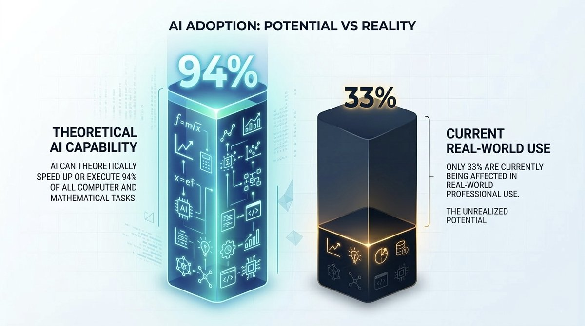
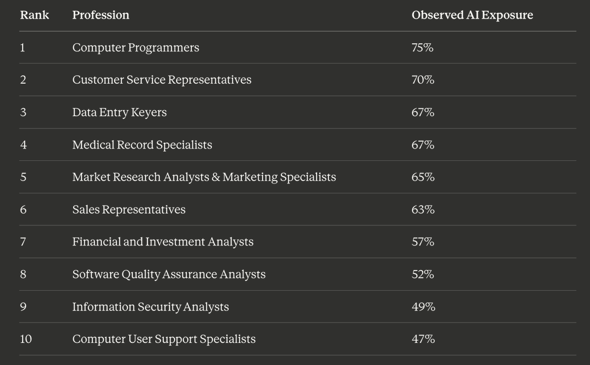
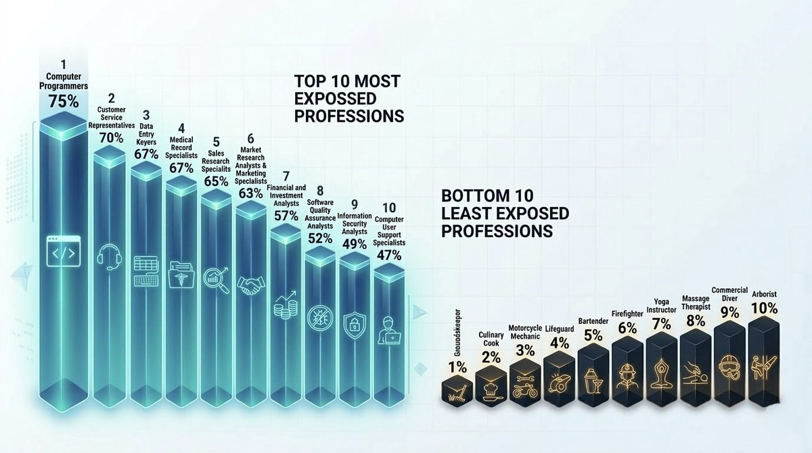
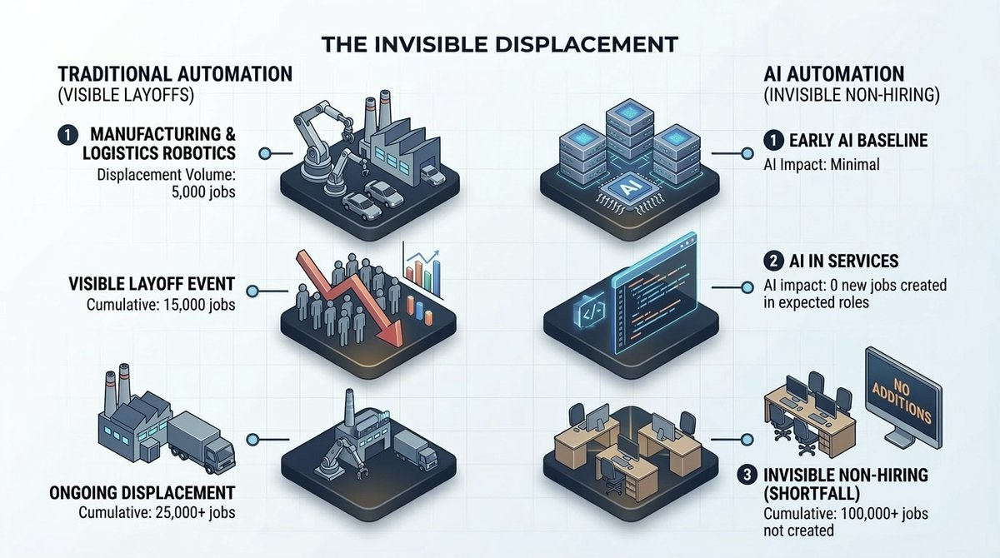
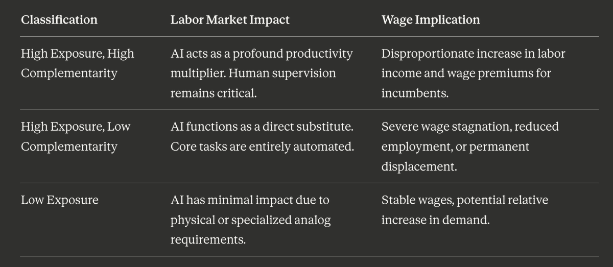
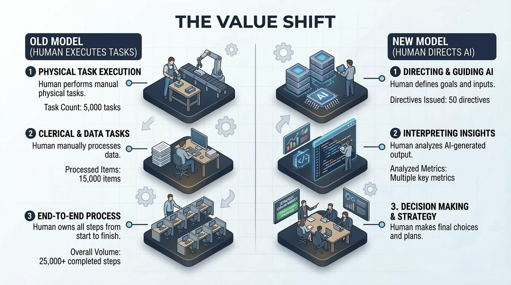
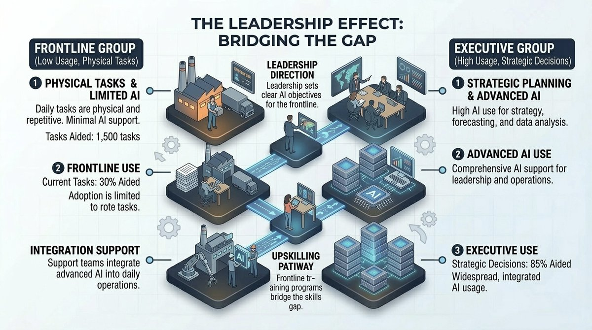
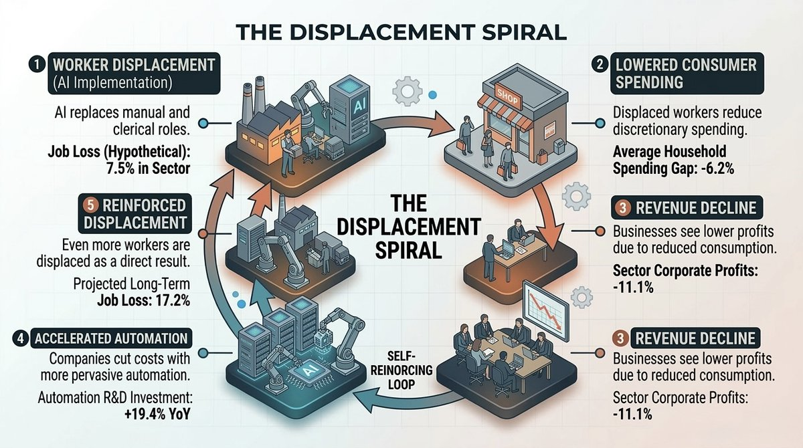

# How to survive the AI labour market apocalypse

**Author:** hoeem (@hooeem)
**Date:** March 12, 2026
**Source:** [https://x.com/hooeem/status/2032201610374349211](https://x.com/hooeem/status/2032201610374349211)
**Type:** X Article (native long-form)

| Stat | Value |
|------|-------|
| Replies | 54 |
| Reposts | 183 |
| Likes | 1,755 |
| Bookmarks | 7,696 |
| Views | 1,436,600 |

**Author bio:** helping you turn screen time into cash flow using modern stacks to create digital leverage. Followers: 151K. Newsletter: [sevenc.substack.com](https://sevenc.substack.com)

---

Anthropic proved AI can already do your job.

Citrini mapped exactly how that ends badly.

This article will show you how to avoid becoming a casualty in the AI labour market apocalypse, it will do this by combining deep research on Anthropic's raw workforce research, IMF macroeconomic modelling, Citrini's market intelligence, real data, and from the same public data governments are reading whilst quietly hoping you do not.

It's no secret that the labour market is weakening at a rapid rate because of AI, and the scary part is that AI is still just a baby.

*[Embedded tweet: https://x.com/i/status/2029912852018937897]*

*[Embedded tweet: https://x.com/i/status/2025927642407440633]*

The data in the labour market says it all.

And the majority of people will miss this because:

1. The doomers are wrong.
2. The utopians are wrong.

The truth is far more dangerous because it's nuanced.

**If you work with a computer for a living, this article is the most important thing you'll read this year.**

I'm not being dramatic, the data is though, and I've utilised all the data available and conducted deep research upon deep research upon deep research to present you the following.

# LESSON 1: WHAT IMPACT AI WILL ACTUALLY HAVE

> **"The real threat isn't what AI *can* do -- it's what it's *already* doing"**

Just look at recent technological revolution such as industrial robotics, or the digital software wave of the 90s, they mechanised physical labour or digitised routine clerical tasks.

Well, this one is different.

**AI automates cognitive labour.** Advanced judgment. Complex information processing. The exact skills you went to college + uni to develop.

A robotic arm is confined to a specific physical trajectory on an assembly line. A language model adapts to virtually any task involving text generation, software architecture, or data analysis.

That's not an incremental shift. That's a fundamental inversion of which humans are "safe."

But here's where it gets interesting, and where most commentators get it completely wrong.

- **The 94/33 Gap: Why the Panic Is Premature (But the Threat Is Real)**

There's a massive difference between what AI *can theoretically achieve* in a lab and what it *actually executes* in the real economy.

Historically, automation forecasts have been wildly exaggerated. Why? Because they ignored the friction of deployment, regulatory constraints, software integration nightmares, and the messy complexity of real human workflows.

Researchers at Anthropic developed a metric called **"observed exposure"** to fix this forecasting problem. Instead of asking "could AI do this task?" they asked "is AI actually doing this task in the real world right now?"

They cross-referenced AI capabilities against real-world usage data from the Anthropic Economic Index and the U.S. O*NET occupational database (which tracks the precise tasks required for hundreds of professions). They weighted full automation like backend API integrations running autonomously, far heavier than passive chatbot usage.

Here's what they found:

**AI can theoretically speed up or execute 94% of all computer and mathematical tasks.**

**Only 33% are currently being affected in real-world professional use.**

Read that again.

The gap is enormous. And it exists for real, structural reasons:

- Legal and compliance limitations slow deployment in regulated industries
- Proprietary software integrations are expensive and complex
- Human oversight remains critical: AI "hallucinations" in high-stakes environments (law, medicine, aviation) create near-zero tolerance for unsupervised automation
- 97% of observed AI usage tasks are rated as theoretically feasible for automation, but actual deployment penetration remains fractional

**The friction is real. But it's temporary.**

The long-term trajectory is crystal clear: that 94/33 gap will narrow as the tech advances and corporate adoption matures.

The question isn't *if *it closes. It's *when*.

- **What Jobs Are At Risk First:**

When you analyse which roles face the highest degree of actual disruption right now, a clear pattern emerges. The jobs currently getting hit hardest are concentrated in digital architecture, cognitive processing, and routine information management.

**The pattern is unmistakable.** If your job involves processing structured data, generating software code, or handling routine client communications, you're in the blast radius.

The Bureau of Labour Statistics projects that highly exposed professions will grow significantly more slowly through 2034.

Meanwhile, the *least* exposed occupations? Entirely reliant on physical abilities, spatial dexterity, and real-world environmental interaction. Groundskeepers. Culinary cooks. Motorcycle mechanics. Lifeguards. Bartenders.

**The person pouring your beer is more job-secure than the person managing your portfolio.**

Let that sink in.

- **The Demographic Reversal That Changes Everythin**

Here's where this gets historically unprecedented.

During the automation wave of the 1980s and 1990s, economists documented something called **Skill-Biased Technical Change (SBTC)**. That era displaced blue-collar production workers and less-educated clerical staff. It hollowed out the industrial middle class. It *rewarded* college-educated analytical workers, their wages surged while non-degree workers' wages cratered.

**The current AI transition targets the exact opposite demographic.**

Anthropic's research is unambiguous: workers in the most highly exposed professions are disproportionately:

- **Older**
- **Female**
- **Highly educated**
- **Higher-paid**

The numbers are stark. Workers with bachelor's degrees or higher face a **27% exposure rate** to algorithmic automation. Workers with less than a high school education? **3%.**

Your degree doesn't protect you anymore. It *targets* you.

Female-dominated occupations like administrative assistants, medical record specialists, generalised clerks, these are heavily in the crosshairs. Language models are specifically designed to optimise the text and data workflows these roles depend on.

**This demographic inversion demands a complete rethinking of economic safety nets.** Traditional labour policies were built to retrain displaced factory workers. NOT highly compensated, degree-holding professionals who've never experienced job insecurity in their lives.

- **The Entry-Level Paradox: The Crisis Nobody Sees Coming**

Here's the part that should terrify you, even if your current job feels safe.

Since late 2022, overall unemployment rates among highly exposed professional cohorts haven't measurably spiked. No mass layoffs directly attributable to AI. The doomers pointing at aggregate unemployment data and screaming are looking at the wrong chart.

**The real damage is invisible. And it's happening to the youngest workers.**

Since early 2024, workers aged 22-25 are being hired significantly less frequently in high-AI-exposure professions. Not fired. Just... never hired in the first place.

This is the **"entry-level paradox"** and it's devastating.

Here's the mechanism:

Organisations use AI to handle routine such as: foundational tasks, initial code drafts, basic data analysis, preliminary document reviews. These are precisely the tasks that historically served as the training ground for junior employees learning the nuances of their industry.

**By automating these tasks, companies boost quarterly productivity but rip out the bottom rungs of the corporate ladder.**

The long-term implication is catastrophic. If entry-level roles vanish, the pipeline for developing senior talent, you know, people with the complex judgment, intuition, and experience that AI currently lacks quickly runs completely dry.

**AI's impact isn't showing up as people losing jobs. It's showing up as jobs that never get created and economic growth that never materialises.**

Think about Tyler Perry. He indefinitely paused an **$800 million** studio expansion after seeing what generative video models could do. That's not a layoff headline. That's thousands of construction workers, set designers, camera operators, and support staff who will simply never be hired. Infrastructure that will never be built. An economic ripple that never happens.

**That's the real shape of this crisis. Not a tidal wave. A drought.**

- **The Two Forces Tearing the Economy Apart**

To understand the full picture, you need to grasp the dual macroeconomic forces at work: **augmentation** and **displacement**.

AI simultaneously makes some workers dramatically more productive, allowing them to execute tasks previously far beyond their individual capability, while brutally displacing millions whose core functions get matched by machine efficiency.

In a normal year, roughly one million U.S. workers get displaced through standard market churn and localised automation. AI has the capacity to significantly elevate that baseline over time.

And the fallout is permanent. Displaced older workers frequently never return to formal employment. Those who do manage to re-enter the workforce face **permanent earnings losses of 20-30%**, triggering broader community decline and cascading socioeconomic failures.

The International Monetary Fund mapped this out by categorising global occupations along two axes: **exposure to AI** and **complementarity with AI**.

**The brutal takeaway:** Your ability to acquire AI-related skills dictates your economic fate.

College majors directly relevant to *building* AI earn starting salary premiums averaging **$4,100 higher**. Majors that merely *use* AI as end-users don't capture the same upside.

**The wealth concentrates among those who build the models. Not those who prompt them.**

Model simulations confirm that with high complementarity, higher-wage earners experience a *more-than-proportional*increase in labour income. Translation: **AI makes the rich richer faster.**

At the geopolitical level, advanced economies get hit first and hardest. They have more cognitive white-collar roles in both the high-complementarity and low-complementarity categories, meaning more polarisation, more volatility, more immediate structural transformation.

Emerging markets face a different risk: getting left behind entirely if they fail to build digital infrastructure and digital literacy fast enough.

**If productivity gains are massive enough, the economic pie grows for everyone. But without proactive reallocation and regulatory frameworks, the default outcome is severe amplification of income and wealth inequality on a global scale.**

**Now before we move on to lesson 2 I want to plug my free newsletter that I release every Sunday (there's a paid one on Saturday but that is not AI related), you can subscribe to my free one and get geopolitical news, market analysis, and AI literacy fed to you, for free, every single week so you don't miss a thing, you can join here:**

*[Embedded tweet: https://x.com/i/status/1640004722609225728]*

# LESSON 2: WHAT YOU SHOULD DO ABOUT IT

- **Your Window Is Open. It Won't Stay Open.**

The transition to an AI-integrated economy fundamentally changes the calculus of career longevity, corporate strategy, and organisational survival.

Passive "technological literacy" doesn't cut it anymore. You need an aggressive, systemic restructuring of how you deploy your skills, build your value, and position yourself in this market.

**The playbook has to execute simultaneously across three levels:** individual, organisational, and institutional. This way you can see how each level is going to be playing this transition period.

Here's each one:

**1: Individual Adaptation**

Industry analysts and AI executives warn that professionals may have a window as short as **18 months** to pivot their core skill sets before AI transitions from "productivity booster" to "comprehensive task replacement engine."

**In the AI economy, the advantage doesn't go to the hardest worker, the most diligent researcher, or the fastest typist. It goes to the worker who adapts fastest.**

Your primary imperative: **shift your professional identity away from routine task execution and toward strategic decision-making, ethical judgment, and complex system orchestration.**

AI models excel at rapid, deterministic execution. They fundamentally lack contextual awareness, ethical judgment, and long-term strategic foresight.

**If your role consists entirely of templated workflows such as: **generating standard financial reports, writing basic marketing copy, filtering data sets, **you are in the highest risk impact zone right now.**

Here's what you need to do:

**Master AI Literacy. This is the non-negotiable skill of the 2020s: **the way spreadsheet mastery dictated office success in the 90s.

Stop treating AI as a search engine or a novelty chatbot. Start treating it as a highly capable, occasionally overconfident subordinate.

Tactically, this means:

- **Delegate aggressively.** Instead of spending hours manually drafting a market analysis, use language models to generate the first draft instantly. Then reallocate your saved time to *interpreting* the data, fact-checking anomalies, and making strategic recommendations the model can't.
- **Develop an editor's eye.** Advanced models hallucinate at alarming rates, some studies suggest failure rates of one in four for complex queries. Your value is being the human who catches what the machine misses.
- **Master the "reverse brief" technique.** When facing dense documents: legal contracts, medical paperwork, financial disclosures don't ask AI to summarise. Instruct it to extract specific risks, obligations, deadlines, and actionable next steps. Add constraints like "assume the reader is unfamiliar with legal jargon" and "over-explain potential liabilities." This transforms the tech into a personalised, decision-ready briefing tool.

**This elevates you from "reader" to "AI Agent Manager", from task executor to systems architect.**

- **Double Down on What Machines Can't Touch**

As technical execution gets commoditised by machine intelligence, analog human skills will command a massive, unprecedented premium.

**The skills that matter most now:**

- Deep interpersonal trust
- Navigating opaque corporate politics
- Emotional intelligence
- Managing high-stakes human negotiations
- Building consensus from algorithmic output
- Game-theory

AI provides absolutely zero utility in any of these areas.

**Strategically align yourself with the 20% of your profession that algorithms can't touch.** Position yourself as the indispensable "human in the loop" who translates machine output into human consensus.

One more thing. **Document everything.**

Quantify exactly what AI can and cannot accomplish in your specific role. Hard data. Undeniable metrics. This protects your position from anyone who overestimate the technology's ability to replace human headcount entirely.

Make your own case, make your own receipts.

**2: Organisational Adaptation**

- **Bolt-On AI Is a Shit**

For corporations and management teams: simply bolting AI tools onto existing legacy workflows guarantees marginal, fleeting returns.

**The real economic value of cognitive automation unlocks only when you fundamentally reshape workflows from end-to-end.**

The data is clear. Teams that comprehensively redesign their processes around AI are **twice as likely to exceed revenue targets** compared to those that merely use it to speed up old habits.

But here's the critical barrier: **the frontline adoption gap.**

Executives and managers have eagerly integrated generative systems into their daily routines. Regular use among frontline employees? **Stalled near 51%.**

Breaking through this requires:

- **Active leadership championship.** When leadership visibly supports AI adoption, positive sentiment among frontline workers jumps from 15% to 55%.
- **Right tools for right teams.** Ensure teams choose versions and features that fit their specific operational work.
- **Cultural permission to experiment.** Encourage hands-on use without the pressure of perfection.

- **Shift from "Change Management" to "Change Agility"**

Traditional change management is a top-down process designed for one singular event.

**That model is dead.**

The AI transition demands "change agility", a continuous, resilient, employee-driven approach to real-time adaptation. This means:

- **Become a skills-based organisation.** Hire and retain based on specific, adaptable competencies, not static degrees or historical job titles.
- **Train managers to "nudge."** In-the-moment guidance on how to deploy AI for specific, granular tasks.
- **Reward human-machine collaboration.** Actively recognise and promote behaviors that model successful AI integration.

**Shift from headcount thinking to value thinking.**

Stop justifying departments by the volume of their manual workload. Track revenue per employee. Evaluate how AI can exponentially scale output without linearly scaling costs.

But balance efficiency with foresight. **The race to automate must not hollow out the entry-level talent pipeline.**

Design **"multi-generational workflows",** pair older workers (deep institutional knowledge and industry wisdom) with younger cohorts (fluent in algorithmic prompting and digital navigation). This accelerates adoption while closing internal culture gaps.

One final organisational reality: **AI is changing employer branding.** Candidates now use ChatGPT and Gemini to evaluate company culture and job options before ever visiting your careers site. Manage how algorithmic search engines interpret your market reputation, or they'll interpret it for you.

**3: Instituional Adaptation**

Relying solely on free-market forces to reallocate millions of displaced knowledge workers risks severe social friction, massive inequality spikes, and prolonged economic stagnation.

**What governments and institutions must do...**

**A: Build AI literacy into the national workforce system.**

The U.S. Department of Labour's framework for AI literacy is a foundational start. But it needs teeth, flexible funding through the Workforce Innovation and Opportunity Act (WIOA), governor's reserve funds for technical skill development, and government-supported AI startup incubators.

**B:  Modernise "Rapid Response" labour programs.**

Use real-time, high-frequency data, quarterly earnings records from the Unemployment Insurance system, to monitor which demographics, firms, and industries are getting hit *before mass layoffs occur*. Trigger immediate on-site assistance: customised aid, emergency career counseling, rapid enrollment in re-skilling programs.

**Don't wait for the layoff headline. The data is telling you it's coming months before the pink slips go out.**

**3. Create "Lifelong Learning Accounts."**

Continuous, subsidised funding so workers can retool their skills perpetually throughout their careers. This mirrors trade adjustment assistance programs previously used for workers displaced by globalisation, but updated for the cognitive displacement era.

**4. Overhaul education curricula immediately.**

Guide students away from easily automatable rote information processing. Steer them toward fields where human physical intervention or complex emotional judgment complements algorithmic output.

**5. Establish robust ethical and regulatory frameworks globally.**

- Mandate diverse representation in algorithm development to minimise systemic bias
- Implement transparency guidelines for automated hiring and performance evaluations
- Safeguard workers' data privacy rights as digital monitoring systems proliferate

**The technology doesn't wait for policy. Policy needs to stop waiting for the technology.**

# **LESSON 3: WHAT THE WORLD MIGHT LOOK LIKE**

The late 2020s and early 2030s sit on a knife's edge.

The ultimate ceiling of AI capabilities remains entirely unknown. The future of the global labour market hinges completely on whether the technology achieves autonomous generalised superintelligence, hits a physical scaling wall, or simply plateaus as a highly capable but strictly dependent tool.

There's three scenarios.

Each one has serious data behind it. 

Each one demands a different survival strategy.

## **Scenario 1: The Intelligence Displacement Spiral**

The nightmare case. And it's terrifyingly logical.

This scenario, sometimes called the "2028 Global Intelligence Crisis" in macroeconomic forecasting, it is predicated on a simple, plausible assumption: **AI works exactly as well as its biggest Silicon Valley proponents expect.**

Here's the mechanism:

As AI capabilities cross the threshold for complex white-collar labour, corporations aggressively cut human headcount to expand margins. Capital saved on human labour gets reinvested entirely into more computing power and algorithmic tools can create a phenomenon called **OpEx substitution.**

For any individual firm, this is rational. Mathematically sound. Competitively necessary.

**Collectively, it's catastrophic.**

Millions of highly compensated knowledge workers permanently lose earning power. They rationally cut discretionary spending. Consumer spending historically drives **up to 70% of GDP** in advanced nations like the United States.

Aggregate demand collapses. Corporate revenues crater. Companies cut more jobs. Automate more. Displace more workers.

**A vicious, self-reinforcing feedback loop with no natural brake.**

The hallmark of this scenario: **the total collapse of the velocity of money.**

An AI agent doesn't buy groceries. Doesn't pay a mortgage. Doesn't travel. The capital it generates for a corporation fails to circulate through the broader real economy.

The result? **"Ghost GDP",** economic output technically recorded in national ledgers and corporate earnings reports but providing zero velocity, sustenance, or liquidity to the real human economy.

**Secondary effects:**

- Mass residential mortgage defaults from white-collar income loss
- Destabilised private credit markets
- Massive defaults in software leveraged buyouts as custom AI tools replace SaaS subscriptions
- National unemployment surging past 10%
- Traditional monetary policy rendered useless, you can cut rates to zero and print infinite money, but you can't fix the fundamental obsolescence of human intelligence with liquidity

**The projected timeline is aggressive:**

- By 2025: ~2 million manufacturing workers replaced by advanced automation
- By 2027: 7.5+ million data entry jobs permanently lost
- By 2030: **14% of the global workforce, roughly 375 million people, forced to change careers entirely**

In an environment with global debt approaching **$346 trillion**, the deflationary shock could trigger systemic sovereign defaults.

## Scenario 2: The Physical World Bottleneck and the Blue-Collar Renaiss

The displacement spiral has a glaring blind spot: **the absolute constraint of the physical world.**

AI, regardless of its cognitive superiority, processing speed, or algorithmic elegance remains entirely trapped inside silicon servers.

It cannot pour a concrete foundation. Cannot install high-voltage electrical wiring. Cannot perform complex plumbing in retrofitted buildings. Cannot physically administer gene therapies to human patients.

**Here's the paradox nobody talks about.**

As AI accelerates scientific breakthroughs, generating new materials, advanced therapies, novel hardware designs at unprecedented speeds, it creates a massive, unquenchable surge in demand for the human physical labour required to *build, test, permit, inspect, and implement* these innovations in the real world.

The multi-trillion-dollar global energy transition. The construction of massive data centers to house the algorithms. The maintenance of advanced robotics assembly lines. All of it requires a vast, trained army of electricians, technicians, and construction workers for decades.

**In this scenario, the economy doesn't collapse. The definition of prestige inverts.**

The data already supports this. **62% of white-collar workers say they would willingly switch to physical trades** for better pay and psychological stability. Professional writers, journalists, and marketers are already retraining in traditional trades after watching AI-generated content slash their incomes.

**The world of 2030 in this scenario:**

Master electricians, specialised plumbers, and robotics maintenance technicians command substantially higher salaries and greater societal status than mid-level software engineers, data analysts, and content creators, whose outputs have been commoditised to near-zero marginal cost.

The labour market doesn't die. It flips upside down.

## Scenario 3: Machines of Loving Grace

The radically optimistic case, articulated by the engineers building the technology itself.

Dario Amodei, CEO of Anthropic, outlines a trajectory where reliable, interpretable, steerable AI explicitly avoids systemic collapse and instead triggers an era of unprecedented human abundance.

**The core premise:** AI becomes the ultimate catalyst for scientific discovery, not merely a corporate labour-displacement tool.

Predicated on safety frameworks like Constitutional AI, which aligns language models with written ethical principles rather than through human feedback, the technology would solve complex data constraints currently bottlenecking human research.

**The projection:** AI could compress a century's worth of biological, medical, and material science progress into a single explosive decade.

- Diseases that currently ravage populations could be cured rapidly
- The cost of fundamental goods and energy could plummet to near absolute zero
- The overall economic pie would expand so violently that traditional metrics of labour compensation and GDP become obsolete

In this vision, global society transitions to a new economic equilibrium, potentially reliant on universal basic income, redistributive tax policies, or an entirely new post-scarcity framework that decouples human survival from labour output.

**Humans return to analog pursuits.** Interpersonal relationships. Art. Exploration. Philosophy. Managed by highly aligned, benevolent AI systems handling the complexities of global supply chains and resource allocation.

**Is this realistic? Maybe. Maybe not.**

But here's what matters: **the capability frontier is now elastic.**

The introduction of models capable of complex reasoning has fundamentally changed the calculus of progress. Previously, if a $10 billion model failed to perform economically valuable tasks, the only option was spending a trillion dollars on the next generation and hoping. Now, performance can be selectively improved at inference time without requiring massive base model scaling.

**This suggests that by 2027, the world will have models fully capable of economically useful work across almost all white-collar domains.**

The investment and labour market game is entirely set. The world will see the turn card in 2025 and the river in 2027.

## WHAT ACTUALLY MATTERS?

The future isn't one of these three scenarios. **It's likely a volatile, messy collision of all three,**playing out differently across industries, geographies, and demographics simultaneously.

But waiting to see which one "wins" before you act is the single dumbest strategy available to you.

Here's what matters most:

1. **The 94/33 gap is your window.** AI can do far more than it's currently deployed to do. The friction delaying full deployment is real, but it's temporary. Use this window to reposition, not to relax.
2. **Shift from execution to judgment.** Your value is no longer in what you can produce. It's in what you can interpret, decide, and orchestrate. Master AI literacy now, not as an option, but as a survival requirement.
3. **Double down on what machines can't touch.** Interpersonal trust, emotional intelligence, high-stakes negotiation, physical-world skills. These are the assets that appreciate as everything else gets commoditised.
4. **Document your value with hard data.** Don't let corporate hype cycles decide your fate. Quantify exactly what AI can and can't do in your specific role. Make your case with receipts.
5. **The entry-level pipeline is drying up.** If you're in leadership, design multi-generational workflows. If you're early-career, skip the traditional ladder and build skills that are complementary to AI, not replaceable by it.

**Nations that view AI merely as a tool for marginal improvements will be obliterated by those wielding it to reshape their entire national destiny.**

The same goes for individuals.

**The labour market of the coming decade will ruthlessly punish complacency. But it will hand unparalleled leverage to anyone who masters the machine, orchestrates complex systems, and fiercely protects the irreplaceable human elements that algorithms can never replicate.**

The game is set. The cards are being dealt.

# WHAT ARE YOU GOING TO DO ABOUT IT?

If you don't know, here's an action plan:

**Phase 1: Know Your Exposure**

- Map every task in your role against one question: could AI produce a first draft in under 60 seconds?
- Categorise tasks as Red (routine, templated), Amber (judgment-adjacent), or Green (irreducibly human)
- Migrate your daily work toward Amber and Green, deliberately and immediately

**Phase 2: Build AI Literacy**

- Learn to write constrained prompts; vague inputs produce useless outputs
- Use the reverse brief: ask AI to extract obligations, flag liabilities and identify decisions, not just summarise
- Develop a hallucination detection habit; cross-check statistics and verify claims
- Chain AI tasks into workflows to compress hours into minutes, then spend recovered time on judgment calls

**Phase 3: Reposition Your Professional Identity**

- Choose one archetype and build toward it: AI Orchestrator, Strategic Interpreter, or High-Trust Specialist
- Your job title is not your identity; your skill set is

**Phase 4: Cultivate Skills Machines Cannot Commoditise**

- Interpersonal trust at scale
- High-stakes negotiation involving ego, power and ambiguity
- Ethical judgment under pressure
- Physical presence and authority in a room
- Cross-disciplinary synthesis at the intersections where AI struggles

**Phase 5: Protect Yourself Internally**

- Track your outputs with hard numbers: revenue influenced, errors caught, decisions made
- Document AI failures in your specific context and keep a record
- Become the internal AI expert; the person who owns the knowledge of a tool is last to be replaced by it
- Brief your manager regularly on your value so your role is never invisible to leadership

**Phase 6: Play the Long Game**

- Take on projects outside your job description that force you into Amber and Green territory
- Build a public body of work that demonstrates judgment, not just execution
- Cultivate wide cross-industry relationships; broad networks outlast deep expertise in a sinking sector
- If mid or late career, make your institutional knowledge documented and transferable; tenure alone does not protect you

**CITATIONS:**

- Anthropic Economic Index — *Anthropic Labor Market Impacts Research* (the profession exposure table and 94%/33% data)
- U.S. O*NET Occupational Database — U.S. Department of Labor, Employment & Training Administration
- U.S. Bureau of Labor Statistics — occupational growth projections through 2034
- IMF Staff Discussion Note — *"Artificial Intelligence and the Future of Work"*, International Monetary Fund
- Gartner Research — figure on teams redesigning processes being twice as likely to exceed revenue targets
- Harry Holzer — labor economist, Georgetown University / Brookings Institution (augmentation/displacement modeling)
- Dario Amodei — *"Machines of Loving Grace"* essay, Anthropic (October 2024)
- U.S. Department of Labor — AI Literacy Framework publication
- Workforce Innovation and Opportunity Act (WIOA) — federal legislation, 29 U.S.C. § 3101
- Tyler Perry — $800M studio expansion pause, widely reported (Deadline, Variety, February 2024)
- Citrini - The 2028 Global Intelligence Crisis.
