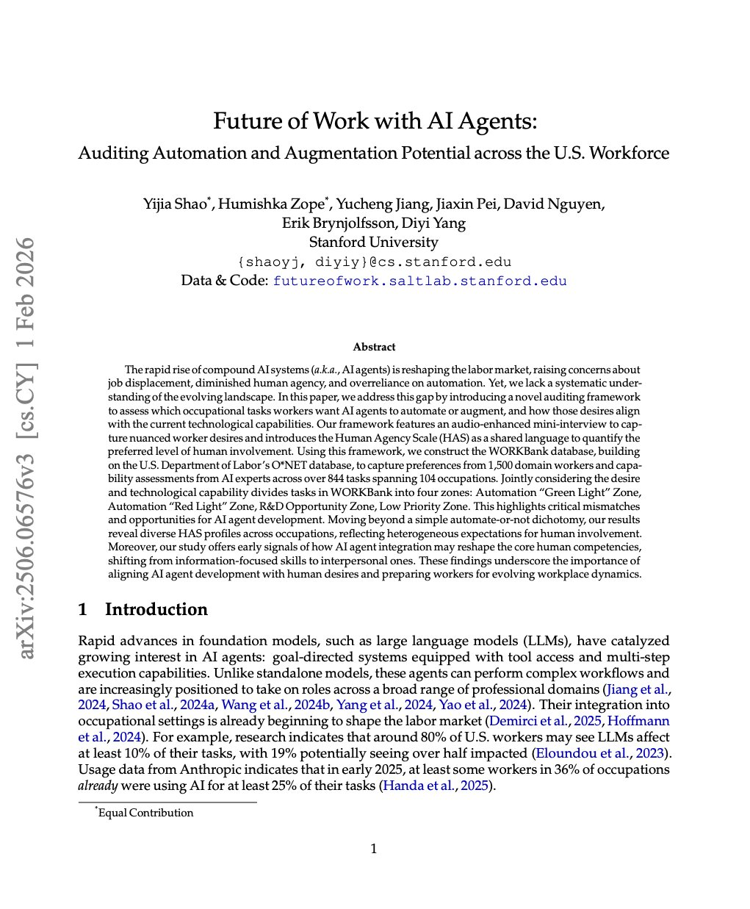

# Stanford Researchers Discover 41% of AI Automation Falls in "Unwanted or Impossible" Zone

- **Author:** Hamza Khalid (@Whizz_ai)
- **Date:** March 14, 2026
- **Source:** [x.com/Whizz_ai/status/2032751126202962252](https://x.com/Whizz_ai/status/2032751126202962252)
- **Likes:** 380 | **Reposts:** 142 | **Replies:** 32 | **Bookmarks:** 441 | **Views:** 36,015

---

Breaking: Stanford researchers just surveyed 1,500 workers and 52 AI experts and discovered that 41% of everything companies are currently automating with AI falls into what they call the "unwanted or impossible" zone. Businesses are spending billions automating the wrong things.

The study introduced something called the WORKBank database, which maps worker desires against actual AI capabilities across 844 tasks spanning 104 occupations. What they found is a massive mismatch between what companies are automating and what workers actually want automated.

Workers overwhelmingly want AI to handle the boring, repetitive tasks that drain their energy, things like scheduling, filing, data entry, and error checking. But companies keep pushing AI into areas workers fiercely want to keep for themselves, especially creative work, client communication, and strategic decision-making.

At the same time, there are tasks workers desperately want automated, like budget monitoring and complex data analysis, that current AI tools simply cannot handle reliably. This creates a gap where investment is flowing to the wrong places while genuine opportunities sit untouched.

The study also introduced the Human Agency Scale, a framework that quantifies exactly how much human involvement workers prefer for different tasks. The dominant pattern across almost every occupation was an inverted U shape, meaning workers want heavy AI involvement for low-value repetitive tasks, shared collaboration for medium complexity work, and full human control for high-stakes creative and interpersonal tasks.

Here is the number that should worry every executive making AI strategy decisions right now. 45% of workers doubt AI's reliability, and 23% actively fear job loss. That means nearly half your workforce does not trust the tools you are deploying, and almost a quarter feels threatened by them. That is not an adoption problem. That is a change management crisis.

The researchers also found that the skills commanding premium salaries are about to shift dramatically. Information processing abilities that currently earn high pay, like data analysis, will decline in value as AI masters them. Meanwhile, interpersonal skills like training, communication, and emotional intelligence will become the most valuable competencies in the market.

The prescription from the researchers was blunt. Stop automating what is technically possible and start building what workers actually need. The humans you are trying to augment are the ones who will make or break adoption.

