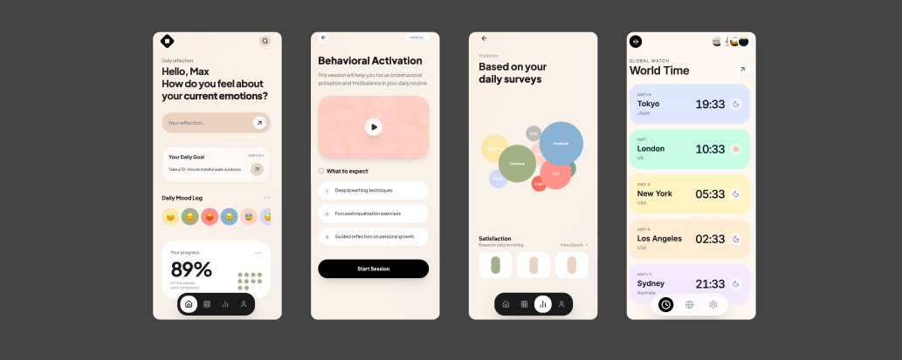

# Vibe Coding 2.0: 18 Rules to be the Top 1% Builder

**Author:** Harshil Tomar (@Hartdrawss)
**Date:** February 24, 2026
**Source:** https://x.com/Hartdrawss/status/2026198305362083910
**Stats:** 33 replies, 2,599 likes

---

Most people waste months building things that should have taken weeks. Not because they're bad developers. Not because they picked the wrong idea. Because they made decisions that felt right in the moment but silently compounded into velocity killers.

The mistake isn't the code. It's the decision made before the code.

Vibe coding 1.0 was just "use AI to write code faster" -- that was the whole insight, and people ran with it without thinking harder. Vibe coding 2.0 is a different skill set: it's not about typing less, it's about knowing exactly which decisions compound your velocity and which ones silently kill it.

Here are 18 rules that separate the builders who ship in 3 weeks from the ones still debugging auth 3 months in.

## Rule 1: Write Detailed Prompts

Every vibe coding tool interprets requirements differently. Vague prompts produce vague code. The more detail you front-load, the less time you spend in back-and-forth loops. This is the new bottleneck in vibe coding -- prompt quality.

## Rule 2: Don't Build Auth from Scratch

Stop building authentication from scratch. Full stop. Clerk and Supabase Auth handle sessions, tokens, OAuth providers, security edge cases, and mobile compatibility. The author has seen founders spend 2 weeks on auth for an MVP nobody has validated yet.

## Rule 3: Use shadcn/ui for UI Components

shadcn/ui gives you production-ready components. Together with Tailwind, they let you build UIs that look legitimate without designing anything from scratch. Don't write raw CSS in 2026 -- Tailwind covers 99% of what you need.

## Rule 4: Zustand and Server Components for State

For state management in MVPs, use Zustand for simple client-side state. Server Components handle the rest. Zustand handles client-side state cleanly. Server Components handle the server state.

## Rule 5: tRPC and Server Actions for APIs

tRPC gives you end-to-end type safety without configuration overhead. Use tRPC and Server Actions instead of building custom API layers from scratch.

## Rule 6: Prisma and Managed Postgres for Database

Prisma exists. Use it. Unless you have very specific performance requirements (which your MVP doesn't), there's no reason to skip an ORM. Raw SQL is harder to maintain and easier to get wrong in security-sensitive ways.

## Rule 7: Zod and React Hook Form for Validation

Zod handles schema validation. React Hook Form handles form state. Together, they make forms predictable and trustworthy.

## Rule 8: Sentry or Error Tracking from Day One

Sentry tells you exactly what broke, exactly where, and exactly how often. Set it up on day one. It costs nothing to start. This rule is the one most people skip and regret the most -- when your app breaks in production, you need to know immediately.

## Rule 9: Use Version Control (Git)

AI agents make mistakes -- confidently, at speed. Without version control, one bad prompt can break your working app with no way to recover. Git gives you a time machine, and feature branches mean your working code stays safe while you experiment. Use feature branches. Set up preview deployments. Even if you're solo, the habit of reviewing your own code before merging it to main catches more bugs than you'd expect.

## Rule 10: Clean Project Structure

Every time you add a feature to a messy codebase, you spend 30% of your time just navigating. Clean, modular structure (components, hooks, utils, types) means you can onboard someone without friction. Keep it predictable.

## Rule 11: Invest in Onboarding and Empty States

This is the most underrated UX investment. Empty states tell users what to do when there's no content. Onboarding tells them how to get value on day one. Without these, users land in your app and have no idea what to do next. Confused users don't convert -- they leave.

## Rule 12: Performance Matters

Performance isn't a nice-to-have -- slow apps lose users. Lighthouse (built into Chrome DevTools) gives you a free performance audit in 30 seconds. A score below 70 is a red flag; fix it before launch, not after you've lost users to it.

## Rule 13: Don't Build Realtime from Scratch

Realtime is hard -- websockets, presence indicators, conflict resolution are all significantly more complex than they look. Supabase Realtime, Pusher, and Partykit exist specifically because building realtime infrastructure from scratch is a full-time project. Don't do it for an MVP.

## Rule 14: Set Up Analytics Before Launch

Pick PostHog or Plausible and set it up before launch. If you don't know how users move through your product, you're making product decisions based on assumptions and building the wrong thing for 3 months.

## Rule 15: Use Push-to-Deploy Platforms

Vercel, Railway, and Render all have push-to-deploy capabilities. Use them. Don't waste time on complex deployment infrastructure for an MVP.

## Rule 16: Protect Your Secrets with Environment Variables

GitHub automatically scans public repos for exposed secrets, and developers have lost access to months of infrastructure. Environment variables should always be used. Never hardcode secrets.

## Rule 17: Manage Technical Debt

Technical debt is fine early, but left unchecked, it compounds into a codebase you can't move fast in. Set a regular schedule. After every 2-3 features, spend a session cleaning up the mess you made. Future you will be grateful.

## Rule 18: Document Your Decisions and Ship

Document your decisions. Why did you pick this library? Why did you structure the database this way? What was the tradeoff you made? Write it down. Future you, your client, and any future developer will thank you.

And above all: don't perfectionism. Ship. The goal of an MVP is not to be perfect -- the goal is to learn. Shipped and imperfect beats polished and never launched every single time. Lock in. Ship. Iterate.

---

## The Bottom Line

Every single point on this list comes down to one thing: knowing where to spend your energy. The best vibe coders aren't better at coding -- they're better at identifying what NOT to build.

---

*Related follow-up tweet by the author:*

> Banger article for every Vibe Coder! Covers 1/ Ready-Made Auth 2/ shadcn-ui 3/ Zustand and Server Components 4/ tRPC and Server Actions 5/ Prisma and Managed Postgres 6/ Zod and React Hook Form 7/ Sentry or Error Tracking and much more! Def a bookmark!
