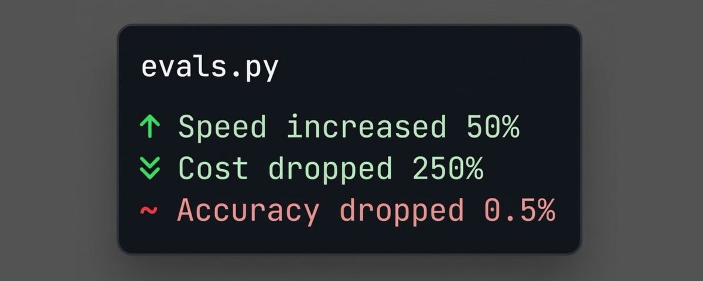

# How to design Experiments to Evaluate your Agentic Harness

**Author:** AVB (@neural_avb)
**Date:** March 10, 2026
**Source:** https://x.com/neural_avb/status/2031417353666441266
**Stats:** 9 replies, 43 retweets, 529 likes, 1,196 bookmarks, 82,579 views

---

Our forefathers and foremothers laid down the script for improving any system: (1) Build, (2) Evaluate, (3) Refine. Step 1 is trivial now thanks to coding agents. Step 3 is also simple too once you finish Step 2.

So this article is about the most open-ended part of the process: **Evaluation**. But it may not be about exactly what you think when you hear that word.

Imo, people underestimate and miscalculate the breadth of evaluation.

> Evaluation is not only about collecting logs and success metrics of the current system you have in place.
>
> It is also about validating your hypothesis and comparing your approach against alternative methods through frequent experiments.

For the past week, I have been running multiple experiments to find out how good all my deployed agentic systems actually are. Throughout this article, I will give a couple of real world examples to get your brain juices flowing and help you transfer some of this stuff into your domain.

> How can you design experiments?
> How do you pick eval metrics?
> How do you interpret your results?

Enough talk, let's jazz.

# Step 1: Decide what you want to evaluate

Most agentic pipelines work with multiple different agents collaborating together towards giving your user some value. A good rule of thumb I follow is to treat each agent as a separate harness. For most of my use-cases, following this rule of thumb has served me well.

Depending on your use-case, you may want to set up a system-level evaluation harness, or a module/unit-level harness.

Your first task is to make a decision - what are you evaluating?

For example, I have a website to study research papers with AI. It has multiple different agentic modules - one to process papers, another to generate diagrams, another to find relevant sections from the paper given an user query, another to respond to answers, etc etc.

Generally you can't evaluate an entire pipeline at once and expect actionable insights. There may be way too many moving variables!

So how to pick the correct module? Ask yourself, you probably already know which module in your project needs instant evaluation. I am sure 99% of you reading already know this! If you in the 1% I will suggest you to ask yourself these questions:

1. Where in the pipeline have I made the most egregious assumptions? ( the whole point of an experiment is to validate hypothesis/assumptions, so may as well start here)

2. What part of my pipeline happens EARLIEST in the the chain? ( the earlier things are in the pipeline, the more impactful they tend to be coz errors propagate downstream! So prioritize these first! )

3. What is my goal here - what vector am I trying to optimize? ( I have an entire section for this one coming up)

For Paper Breakdown, I decided to work on my retrieval subagent.

Q. What does my retrieval subagent do?
Given a user query, my subagent searches one or more research papers and fetches passages that are relevant to the user's question. All types of response generation (through text, diagrams, code, etc) is contextualized by these retrieved passages.

# Step 2: Decide your end goal

When we run experiments, we always have a goal in mind. A hypothesis we want to test, or a suspicion we want to rest.

What does success look like? What will you do with the information once you have it? It is best to have a clear hypothesis and a threshold for action.

Thankfully, there is a universally applicable goal we can all strive for

> We are all optimizing to provide better value to our users...
>
> as fast as possible...
>
> with the least cost...
>
> and minimal tech debt.

The three goals that are generally what we strive for as project owners are:

- Improve accuracy: Can we improve the overall quality of the outputs of our target module?
- Improve latency: Can we make our target module run FASTER?
- Improve cost: Can we make our target module cheap to run?
- Improve code quality: Can we kill dependencies, make our codebase simpler and leaner?

Depending on your business, you may weigh these four things differently. Ideally, pick ONE of these while ensuring the other ones stay acceptable!

For Paper Breakdown, I had a simple goal. Since PBD is completely self-funded by me, I want to cut my cost as much as I can so I can support more free users. Extend limits, and give users a chance to try out the platform for free. This is where the motivation began.

## Step 3: Isolate the black box and your knobs

You picked a module in Step 1 to test. Now it's time to isolate it from the rest of the system. You need a clean function where you shove your inputs in, and it spits the outputs out, without worrying about any internal plumbing.

Before you become happy saying "oh this is already done, I have my functions already duh", there is one more thing you need before you start running experiments.

> Independent variables.

This is basically the "knobs" of your experiment. The hyperparameters (in a machine learning sense). These are the specific configuration parameters you are controlling from the outside to see how they affect the performance of the black box.

Isolate your independent variables from the rest of your program. I will suggest to keep the number of independent variables to like maximum of 2 or 3 so you can study their effects afterwards before adding more variables!

Examples:

1. Suppose you just want to test quality of different LLMs. Put your module as a function and make it accept a parameter (the model name) as input.
2. Suppose you want to test different system prompts. Pass the prompts as input.
3. You want to test new tools, hide these tools behind a feature flag that you can toggle on or off.

Note on persistence

Most real world applications use a caching layer. Maybe a Redis layer that caches past responses inside the API so future computation can use it. This is awesome for production, but for an experiment, you need to reconsider if it's required.

If you are testing a multi-turn feature and the module's ability to read/write input from cache: by all means DO IT. In most cases, you would want to turn these features off. No db writes, no cache writes.

You want experiments to be repeatable and above all, never interfere with any test case. Test case 10 should have zero advantage (or disadvantage) over Test case 4. Every test case needs to be transactional, your black box should be a ephemeral functions with zero persistence.

Q. What did my experiments look like?

In one of my experiments, I wanted to test new (smaller) models. Smaller models run fast, and cost less. So if I can replace my current subagent model with a smaller model, I could save a few dollars.

Having set up my subagent code (almost exactly like how it runs in prod), I was ready for the next stage. Prepare the test-cases for my experiment.

## Step 4: Design your test-cases

Your evaluation is only as good as your dataset. If you test on garbage, you'll optimize for garbage.

Every test-case has 2 components: the input and the expected output. The most simple experiments can just be some kind of a CSV file containing literally those two columns as inputs.

Soooo where do you get these inputs and expected outputs from? Here are some examples:

1. If you have production logs, that is the best place to begin. Ideally, you should be saving all interactions through your service in a database, or structured logs. You should be able to find the exact inputs where your target module was invoked.
2. If you don't have production logs, I encourage you to quit experimenting and set up your analytics first. Look into posthog or something. Add a middleware and let your users use your product for a couple of weeks. Come back to the experiment later.
3. If none of the above apply to you, your best shot is to either write test-cases yourself, or generate synthetic cases with an LLM. I encourage you to decide which route (or a combination) is best for your use-case.

How does quality test-case data look like?

For best results, it is important that your test-case have the following properties:

- Deduplicated and diverse: Since we will be aggregating the performance across these test cases, it is super important for your test cases to be diverse. If you oversample a single subdomain, you stand the risk of biasing your entire experiment.
- Ground truth responses are preferred: If you are logging the inputs of your production system in the logs, you are probably also logging outputs as well. Having access to this is handy coz in the minimum, it tells you how much your new solution is expected to drift from your current solution.

Q. What did I do?

My base input-output dataset is publicly available here:

https://huggingface.co/datasets/paperbd/paper-cited-chunks-v1

1. I pulled a couple hundred real production messages from our database where the assistant referred to a passage in the paper PDF.
2. I reverse-engineer the query that was sent by the main agent to the subagent (I save this info in the database, so this wasn't difficult)
3. Made sure to cap the samples per paper
4. Within each paper I made sure each test case have minimal overlap... this ensures coverage of each paper.

In the end, I had a simple dataset of the query that was asked by the main agent, and the chunks that were referred in it's final response.

# Step 5: Design one or more evaluation metrics

Next step: you need a way to score the system's output automatically.

There are deterministic metrics and probabilistic metrics. Deterministic metrics are exact: did the output contain a specific string? Was the output a valid JSON? Was the length under 500 characters?

Probabilistic metrics usually involve "LLM-as-a-judge", where you prompt a smarter model to grade the output on a scale of 1-5 for helpfulness, tone, or accuracy.

You should use deterministic metrics wherever possible because they are cheaper, faster, and 100% reliable.

Examples of eval metrics:

- If you are evaluating a retrieval agent, use precision, recall, or IOU scores.
- If you are evaluating a full response agent, use LLM-as-judge
- If you are evaluating a task agent, evaluate tool call statistics
- Most task agent also work in verifiable environments - meaning there is a clear way to distinguish if the work succeeded or not. Use this design!
- For citation agents, you would often have system prompts that ask them to respond in a specific format. Use regex to find malformed formatting. This is also true for coding agents, or structured output generators.
- Whatever you do, always record atleast 3 additional things: total walltime, completion token usage, and total cost.

Q. What did I do?

Since my goal was to reduce cost while maintaining latency and accuracy, I used almost all the above:

1. I compared models with the current outputs. I mainly used IOU scores, but I also recorded more metrics like total chunks returned per model (too many will mean main agent will get overwhelmed), precision, and recall.
2. I also compared models with Sonnet-4.6 output. This was the largest model I tried with, so it is as close to LLM-as-a-judge for my harness.
3. Recorded cost, completion tokens, number of tool calls, number of cache write attempts (this is a tool that LLMs have access to), and ofcourse, total walltime to run all experiments.
4. Error rates too, of course. Models get eliminated if they fail.

With my black box ready (retrieval subagent), my knobs (model names) ready, my input cases (actual queries from prod), my expected outputs (passages cited by models in prod + Sonnet-4.6 outputs), and my metrics all setup, it was time to run experiments! Once I got the results, I just began drawing plots to interpret them.

Note on RL Environments vs Evaluation Harnesses

Evaluation harnesses and RL environments are actually very similar. You can procedurally generate prompts (observations), or use your existing input test cases. You already got your reward function (for me: sonnet overlap + latency + cost). In theory, you can run prompt optimization methods (GEPA), or end-to-end RL training already, to train small agents on your harnesses. More on that in a separate article.

# Step 6: Draw graphs and plots

Visualizations are a window to your experiment's soul. Or something like that.

My next step was to plot graphs. Bar graphs to measure response times. Scatter plots to design Cost vs IOU or Walltime vs IOU. I plotted IOU/Recall scores for both comparing with baseline and Sonnet-4.6. I also made box-plots to find the distribution of response times, returned chunk lengths, etc. I want consistent models that have a narrow distribution and a high mean.

You can just ask your coding agent to do this step for you. Tell them what plots you need and you should be good to go!

# Takeaways

So yeah, that helped a lot. I was able to replace my previous system (gpt-5-mini) with a much faster and cheaper alternative (gemini-3-flash-lite). It is faster, it is cheaper, and it also calls one of my tools that allows it to share information for latter subagents (something gpt-5-mini didn't do regularly).

Gemini-3.1-Flash-Lite loves to do auxiliary findings for future subagent calls (making follow-up questions way cheaper and faster) - this alone reduces my cost by a significant margin. I would have never found this trait had I not run these experiments!

The other best part about all this is that I can easily replicate this experiment on a new model whenever something new drops. I will just re-run the existing test-cases only on the new model, and compare it's performance against the established benchmark.

Hope I managed to get the cogs in your head turning. Experiment design is super fun and valuable - I encourage you to try it. Share your questions or experiences, so we can learn from each other.

---

If you are into links, here is where to find me:

Follow me for more: [@neural_avb](https://x.com/@neural_avb)

My YouTube channel: https://www.youtube.com/@avb_fj

Patreon: https://www.patreon.com/NeuralBreakdownwithAVB

Paper Breakdown: https://paperbreakdown.com/

A bit of kindness goes a long way, RT or comment to support!
