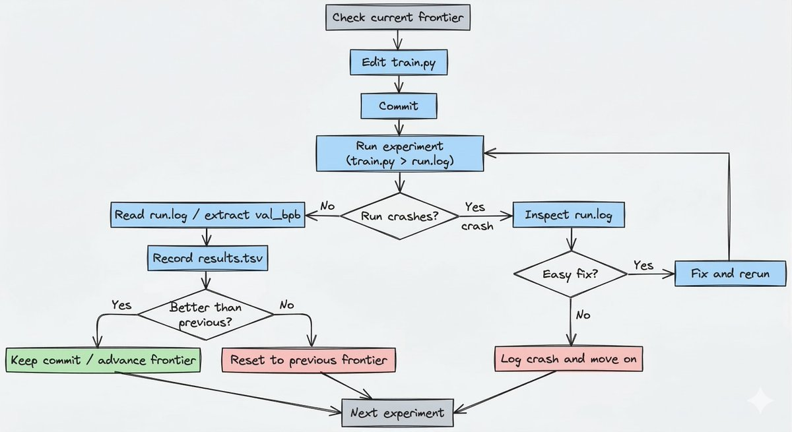

# How Karpathy's Autoresearch Works And What You Can Learn From It

**Author:** Manthan Gupta (@manthanguptaa)
**Date:** March 13, 2026
**Source:** https://x.com/manthanguptaa/status/2032464949952598152
**Stats:** 42 replies, 186 retweets, 1,852 likes, 5,462 bookmarks, 583,861 views

---

*Originally published at [manthanguptaa.in/posts/autoresearcher](https://manthanguptaa.in/posts/autoresearcher/)*

Most "autonomous AI research" demos look impressive for the same reason magic tricks do: you only see the interesting part. An agent edits some code, runs an experiment, and shows a better result. What you usually do not see is the part that actually determines whether the system is useful: **what is the harness optimizing for, how stable is the evaluation, and what happens when the agent fails?**

That is why [Karpathy's Autoresearch](https://github.com/karpathy/autoresearch) is worth paying attention to.

Autoresearch is not trying to be a general-purpose AI scientist. It is a small, tightly constrained system for one specific job: let an agent modify a training script, run a bounded experiment, measure the result, keep the change if it helps, and discard it if it does not. The repo is tiny, but the design behind it is one of the cleanest examples I have seen of how to build a useful autonomous improvement harness.

In this blog post, I will break down how Autoresearch works, and more importantly, what it teaches us about building reliable agentic systems.

## What Autoresearch Is Exactly?

At a high level, Autoresearch turns "AI research" into a bounded optimization problem.

The agent is not browsing papers, forming original theories, or deciding what science should matter. Its job is much narrower:

1. Edit the training code
2. Run an experiment for a fixed amount of time
3. Measure the result using a fixed metric
4. Keep the change if it improves the score
5. Revert it if it does not
6. Repeat

That framing matters. Instead of treating research as an open-ended creative task, Autoresearch treats it as a disciplined search harness over a well-defined surface.

The setup is deliberately minimal. The agent is allowed to modify only one file, `train.py`. Data preparation, tokenization, and evaluation are kept outside the search space. That one decision does a lot of work. It keeps the harness focused, keeps diffs reviewable, and prevents the agent from "improving" the system by changing the benchmark in the background.

There is another subtle idea here too. The real control plane of the repo is not just the Python code. It is `program.md`, the file that tells the agent how to behave. In other words, the human is not only programming the model. The human is programming the researcher.

## How It Works

Autoresearch revolves around three files: `program.md`, `prepare.py`, and `train.py`.

`program.md` is the operating manual for the agent. It tells the agent how to set up a run, what files are in scope, what it is allowed to modify, how to log experiments, when to keep or discard a commit, and how to recover from crashes. This is what makes the harness operationally disciplined rather than just clever in theory.

`prepare.py` is the fixed harness. It downloads the dataset shards, trains the tokenizer, builds the dataloader, and defines evaluation. The most important choice here is the metric: Autoresearch evaluates models using **bits per byte** (`val_bpb`) rather than raw validation loss. That makes results more comparable across tokenizer changes, because the denominator is byte length instead of token count. Just as importantly, the agent is not allowed to modify this file, which means the benchmark stays stable.

`train.py` is the search surface. It contains the model, optimizer, schedules, hyperparameters, and the training logic itself. This is where the agent experiments. It can change architecture, optimizer settings, depth, batch size, and training behavior, but it has to do all of that within one bounded file.

The recurring experiment harness looks like this:

That is the outer harness, including the keep/reset path and the crash-handling branch. Inside each run, `train.py` has its own training logic, but the repo's real autonomous behavior lives in this experiment cycle.

First, every run gets the same wall-clock budget: 5 minutes. That means the question is not "what model is best after N steps?" It is "what configuration gives the best result within this exact amount of time on this machine?" That is a much more useful objective for autonomous iteration, because it forces the system to optimize for improvement per unit time, not just abstract model quality.

Second, every experiment starts from the current frontier. The agent checks the current branch or commit, edits `train.py`, commits the change, runs `uv run train.py > run.log 2>&1`, and then reads the metric back out of the log. If the result is better, that commit becomes the new frontier. If it is equal or worse, the branch resets back to where it started. This keep or reset mechanism makes the branch behave like an evolutionary search path instead of a pile of speculative edits.

Third, results are logged in `results.tsv`, but that file stays outside git history. Git stores the winning line of code evolution. The TSV stores the broader operational history, including discarded runs and crashes.

Finally, the harness assumes that failures will happen. Some experiments will produce NaNs. Some will OOM. Some will simply break the script. The instructions explicitly tell the agent to inspect `run.log`, attempt an easy fix if the problem is trivial, and otherwise log the crash and move on. That is a big reason the project works conceptually: it is designed for unattended operation, not just successful demos.

## Why It Matters For Agent Builders

Autoresearch matters because it demonstrates a broader truth about agents: autonomy gets useful when the harness is tight.

The first lesson is that **constraints make agents better**. The agent edits one file, chases one metric, operates within one fixed harness, and advances only when the score improves. That is not a drawback of the system but the reason the system can run for hours without dissolving into noise. Many agent systems fail because they maximize freedom too early. More freedom usually means a larger error surface.

The second lesson is that **prompts are part of the architecture**. In Autoresearch, `program.md` is not fluff around the code. It defines workflow, boundaries, persistence, logging, recovery, and selection criteria. That is system design, not just prompting. As agentic products mature, more of the real architecture will live in this layer: not only application code, but operating instructions for autonomous workers.

The third lesson is that **you should optimize the harness, not just the model**. A lot of builders focus on model intelligence in isolation. Autoresearch shows that the surrounding machinery matters just as much: how work is launched, how failures are handled, how progress is measured, how bad paths are rolled back, and how state is recorded. A mediocre agent inside a strong harness can outperform a stronger agent inside a messy one.

The fourth lesson is that **time-bounded evaluation is underrated**. The 5-minute wall-clock budget is one of the best ideas in the repo. In real systems, time is often the true constraint: latency, compute, iteration speed, or user patience. Time-bounded loops force the system to optimize for real-world usefulness instead of idealized performance.

The fifth lesson is that **reversibility and observability are non-negotiable**. Autoresearch keeps losers cheap to discard and makes every experiment inspectable through logs, commit history, and `results.tsv`. That is exactly how agentic systems should be designed. If a bad run leaves the system in an unrecoverable mess, the agent cannot explore aggressively. If the system gives you no trace of what happened, you cannot trust it or improve it.

Taken together, these choices point to a bigger principle: the best autonomous systems are not the ones with the most freedom. They are the ones with the clearest objective, the strongest harness, and the cheapest failure mode.

## Limitations

Autoresearch is a strong design, but it is still a narrow one.

The first limitation is that it optimizes a local benchmark. The agent is trying to improve `val_bpb` under a fixed 5-minute budget on a specific setup. That does not automatically mean it is discovering generally superior training strategies. It may be finding what works best under this particular harness.

The second limitation is hardware. The project is built around a single NVIDIA GPU and works best on high-end hardware. The README points to forks and parameter changes for smaller machines, but the default experience is clearly shaped around a powerful CUDA setup.

The third limitation is also its strength: Autoresearch is autonomous only inside a human-designed sandbox. The human defines the metric, the files in scope, the data pipeline, and the operating instructions. That does not make the system less interesting. If anything, it makes it more realistic. Near-term autonomous systems are most useful when they operate inside strong scaffolding, not when they are given open-ended freedom and vague goals.

## Conclusion

Karpathy's Autoresearch is interesting not because it proves that we now have autonomous AI scientists. It proves something more practical: **autonomous systems become much more useful when you reduce them to a tight harness with clear boundaries, a stable metric, reversible experiments, and good operational discipline.**

That is the real lesson of the repo.

The impressive part is not that an agent can edit training code. Plenty of agents can do that. The impressive part is that the environment is designed so those edits become measurable, discardable, and repeatable over long periods without babysitting the run.

If you are building agents, that is the takeaway worth stealing. Do not start by asking how to make the agent more autonomous. Start by asking how to make the harness more reliable.

Because in practice, the best autonomous systems are rarely the most open-ended ones.

They are the ones with the best constraints.
