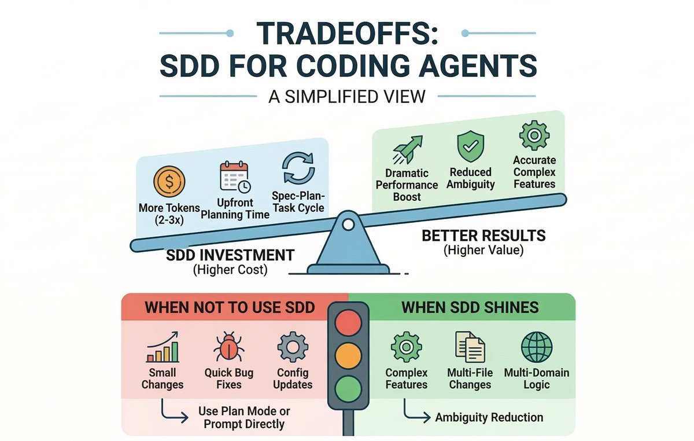
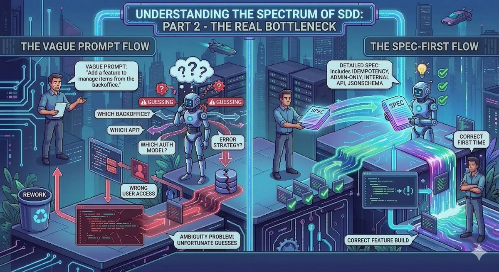
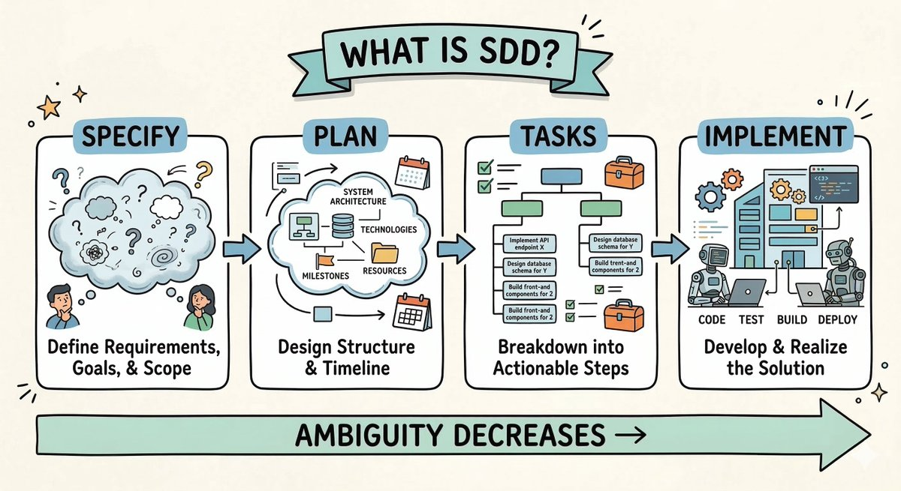
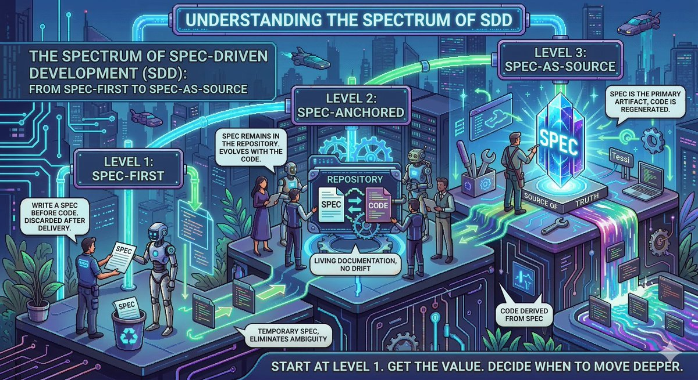
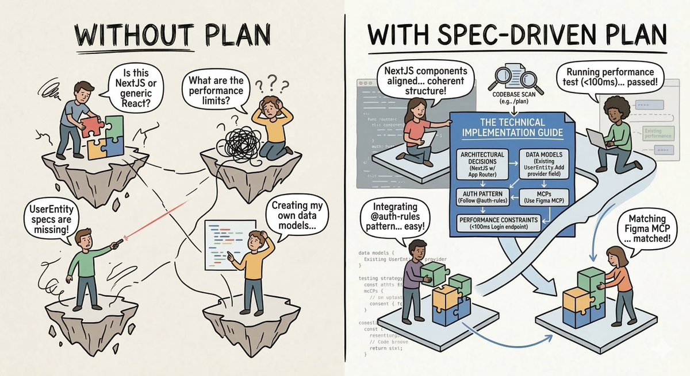

# The Spec Is the New Code: A Guide to Spec Driven Development

**Author:** Julian (@juliandeangeIis)
**Date:** 2026-03-15
**Source:** https://x.com/juliandeangeIis/status/2033303156340240481
**Stats:** 37 replies, 84 retweets, 695 likes, 1958 bookmarks, 228K views

---

AI coding agents don't fail because the model is weak. They fail because the instructions are ambiguous and the agent harness is too weak.

That's why everyone is building spec-driven workflows. The spec is becoming the new code -- the primary artifact that developers write, while agents handle the implementation.

## What Is SDD?

Spec Driven Development (SDD) is a four-phase workflow where ambiguity decreases at each step:

1. **Specify** -- Define requirements, goals, and scope
2. **Plan** -- Design structure and timeline (system architecture, technologies, milestones, resources)
3. **Tasks** -- Break down into actionable steps (implement API endpoint X, design database schema for Y, build front-end components for Z)
4. **Implement** -- Develop and realize the solution (code, test, build, deploy)

The key insight: the bottleneck in AI-assisted coding is not the model's capability but the clarity and specificity of what you ask it to build.

## The Real Bottleneck: Vague Prompts vs. Spec-First

**The Vague Prompt Flow:** A developer says "Add a feature to manage items from the backoffice." The agent starts guessing -- which backoffice? Which API? Which auth model? What error strategy? This leads to wrong user access patterns, unfortunate guesses, and rework.

**The Spec-First Flow:** A detailed spec includes idempotency requirements, admin-only access, internal API routes, and JSON schema definitions. The agent builds the correct feature the first time.

## Without Plan vs. With Spec-Driven Plan

**Without a plan**, the agent faces fragmented questions: "Is this NextJS or generic React?" "What are the performance limits?" "UserEntity specs are missing!" It ends up creating its own data models and making inconsistent architectural choices.

**With a spec-driven plan**, a Technical Implementation Guide is produced first via codebase scan. It contains:
- **Architectural decisions** (NextJS with App Router)
- **Data models** (existing UserEntity, add provider field)
- **Auth pattern** (follow @auth-rules)
- **MCPs** (use Figma MCP)
- **Performance constraints** (<100ms login endpoint)

The result: NextJS components aligned with coherent structure, performance tests passing, integrating existing patterns easily, and matching design system components.

## Understanding the Spectrum of SDD

SDD exists on a spectrum of three levels:

### Level 1: Spec-First
Write a spec before code. The spec is discarded after delivery. This is a temporary artifact that eliminates ambiguity for the current task but doesn't persist.

**Start here.** Get the value. Decide when to move deeper.

### Level 2: Spec-Anchored
The spec remains in the repository and evolves with the code. It becomes living documentation with no drift. The spec and codebase stay in sync as the project evolves.

### Level 3: Spec-as-Source
The spec is the primary artifact. Code is derived from the spec. The spec becomes the single source of truth, and implementation is regenerated from it.

## Tradeoffs: SDD for Coding Agents

### SDD Investment (Higher Cost)
- **More tokens** (2-3x token usage)
- **Upfront planning time**
- **Spec-Plan-Task cycle** overhead

### Better Results (Higher Value)
- **Dramatic performance boost**
- **Reduced ambiguity**
- **Accurate complex features**

### When NOT to Use SDD
- Small changes
- Quick bug fixes
- Config updates

For these, use Plan Mode or prompt directly.

### When SDD Shines
- Complex features
- Multi-file changes
- Multi-domain logic

SDD provides the greatest value through ambiguity reduction on complex, cross-cutting tasks.
