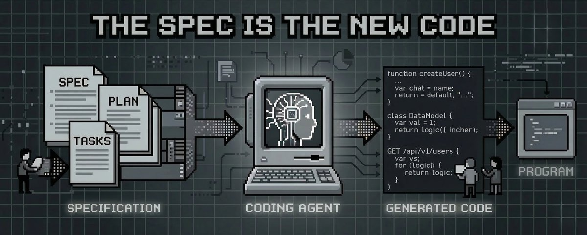

# The Spec Is the New Code. A Guide to Spec Driven Development

**Author:** Julian (@juliandeangeIis)
**Date:** 2026-03-15
**Source:** https://x.com/juliandeangeIis/status/2033303156340240481
**Stats:** 42 replies, 114 retweets, 921 likes, 2,571 bookmarks, 356K views

---

AI coding agents don't fail because the model is weak. They fail because the instructions are ambiguous and the agent harness is too weak. That's why everyone is building specs and agent harnesses.

## The Real Bottleneck

Here's the uncomfortable truth about AI coding agents: the biggest bottleneck isn't the model, the context window, or the tooling. It's the human giving the instructions.

When people first start using coding agents, the interaction looks something like this:

"Add a feature to manage items from the backoffice."

The agent reads the codebase, picks a pattern, and writes the feature. At first, it looks fine. Then you click "add item" again and it inserts the same item twice.

All the assumptions you thought were obvious suddenly become visible: the operation should be idempotent, only admins should be allowed to do it, and "the backoffice" should mean the internal one, not the seller-facing one.

The problem is that none of this was in the prompt. The agent had to guess: which backoffice, which API contract, which storage layer, which authorization model, which error handling strategy.

Each one is a silent decision. Some guesses are right. Some are wrong. And as complexity increases, so does the gap between what you meant and what the agent actually built.

This is the ambiguity problem. It's not the agent's fault. It's a communication issue.

## Why the Ecosystem Is Converging

The entire ecosystem is arriving at the same solution independently:

**GitHub's Spec Kit (77k stars):** structures the spec-plan-task-implement cycle, agent-agnostic, works across Claude Code, Cursor and others.

**OpenAI's Symphony:** monitors your issue tracker, spins up autonomous agents per issue, and requires a SPEC.md as the contract.

**The Ralph Loop:** puts a PRD in an infinite agent loop. Progress persists in files and git, not in the context window.

Even the coding agents themselves are moving this direction natively. Plan mode in Claude Code and Cursor is essentially a lightweight spec-and-plan step. Task decomposition is built into most agent loops now.

All these tools share the same core idea: **define what you want before writing code, then let the agent implement from structured specifications.**

## What Is Spec Driven Development?

Spec Driven Development (SDD) is a methodology, not a tool. It's a simple process with four steps:

1. **Specify** what you want to build
2. **Plan** how to build it technically
3. **Break** it down into small, ordered tasks
4. **Implement** one task at a time with the agent

Each step reduces ambiguity. By the time the agent starts writing code, it has everything it needs: what the feature does, how it integrates, what the edge cases are, what the tests should verify, and what architecture to follow. The coding agent does not have to guess.

When you hand an agent a well-written spec and plan, you're engineering its entire context window in one shot: architecture decisions, step-by-step guidance, and acceptance criteria, all in a single set of artifacts.

The best part: you should use the agent to write the specs too. It's far easier to correct a spec than to write it from scratch. You can also ask the agent for ambiguities from the same spec.

## The Levels of Spec-Driven Development

Not all SDD implementations are equal:

**Spec-First:** write a spec before coding, but discard it after delivery. Most start here, and it already eliminates the ambiguity problem for that cycle.

**Spec-Anchored:** the spec lives in the repo alongside the code and evolves with it. Specs become living documentation for the team.

**Spec-as-Source:** the spec is the primary artifact. You edit the spec, code is regenerated to match. This is the frontier -- we're not fully there yet, but it's where the trajectory points.

## The Spec: What, Not How

The spec is the functional layer. It describes what the feature does, not how it's implemented. It's technology-agnostic on purpose.

A good spec defines the feature's purpose, use cases, requirements, edge cases, and success criteria in non-technical language.

Key insight: **separating functional from technical reduces LLM uncertainty.**

When you mix "the user can authenticate with Google and GitHub" with "use NextAuth.js with the JWT strategy and store sessions in Redis," you're forcing the agent to juggle two different concerns simultaneously.

By keeping the spec purely functional, you give the agent a clear objective without polluting it with premature implementation decisions. You also define expected behavior for edge cases from the start, before anyone writes a line of code.

The acceptance criteria use the Given/When/Then format to make validation unambiguous:

*Given a new user, When they click "Sign in with Google" and authorize the app, Then they are redirected to the dashboard with a valid session.*

*Given a user with an existing Google account, When they try to sign in with GitHub using the same email, Then the accounts are linked and they access the same profile.*

These aren't just documentation. They become the test plan. The agent can verify its own implementation against them.

## The Plan: Where the Developer Adds Expertise

The plan is the technical layer. It's the implementation guide for the agent: how to achieve everything the spec describes.

This is where the developer's expertise matters most. Not in writing the code, but in making the architectural decisions:

- **Architecture and technical decisions:** "Use NextJS with the App Router. Follow the existing auth pattern in @auth-rules."
- **Data models and contracts:** "Use the existing User entity. Add a provider field."
- **Testing strategy:** "Unit tests must cover 90% of the auth flow."
- **Performance constraints:** "Response time under 100ms for the login endpoint."

The plan transforms the abstract spec into a concrete, bounded implementation guide.

Tools like Spec Kit's `/plan` command will read your actual codebase before generating the technical plan. It analyzes your current structure, identifies patterns and conventions, and proposes architecture that's coherent with what already exists.

## Tasks: Divide and Conquer

The plan gets broken down into small, ordered tasks. Each one should be completable in a single agent session and produce a verifiable change with tests.

The key: every task must be self-contained and unambiguous. The agent shouldn't need to make assumptions or search for missing context.

This is also where the developer reviews the approach. Your job is to check the task list isn't overengineering the solution.

Once the tasks are solid, they unlock 2 powerful things: **parallelism** and **agent agnosticism**.

Independent tasks can be executed by multiple agents simultaneously.

And because tasks are self-contained with all context embedded, you can swap agents entirely. Start with Claude Code, pick up a task with Cursor, finish another with Codex.

## Tradeoffs

Spec Driven Development is not free.

The spec-plan-task cycle consumes (a lot of) tokens. A full SDD session can use 2-3x or more tokens than just prompting the agent directly. This is the tradeoff: you spend more upfront to get dramatically better results.

It also doesn't make sense for everything. Small changes, a quick bug fix, a config update -- these don't need a full spec. For those, use Plan mode or just prompt directly.

SDD shines when the feature is complex enough that ambiguity would cause the agent to go sideways: multi-file changes, features that touch multiple domains, legacy repositories, anything where "obvious" business logic isn't obvious at all.

There's also a learning curve. Developers need to shift from "describe the code I want" to "describe the behavior I need." That's a mindset change.

## How We're Rolling This Out at MercadoLibre

At MercadoLibre, we're introducing SDD to nearly 20,000 developers. Two big challenges at this scale:

The first is the habit change. Developers are used to jumping straight into code. Asking them to write a spec first feels like overhead, until they see the results. We learned that the best way to teach SDD is not to explain it -- it's to practice it. That's why we went all-in on hands-on workshops, with more than 5,000 developers attending so far.

The second is the context around the methodology. SDD alone isn't enough. The agent also needs context about your internal tools, SDKs, and platform conventions. That's the agent harness: custom rules that encode your standards, skills that bundle domain knowledge, and MCPs that connect to internal systems.

The methodology defines what to build. The harness gives the agent the internal context to build it right.

## Where to Start

If there's one thing to take away: try Plan mode. It's the most accessible entry point to SDD. You get most of the benefits (reduced ambiguity, a technical outline, clearer intent) without the full ceremony.

When you're ready to go further, adopt a dedicated SDD framework like Spec Kit. It gives you a structured flow for specs, plans, and tasks, and scales much better than ad hoc prompting.

The value of SDD compounds with practice. The first spec you write will feel slow and imperfect. But over time, you develop an intuition for what to specify, when you're overengineering the spec, and what the agent actually needs to get it right.

**Vibe coding builds demos and MVPs. Spec Driven Development builds production systems.**

For any organization serious about scaling AI agents across real codebases, with real constraints and real consequences, this is where the bar is heading.
