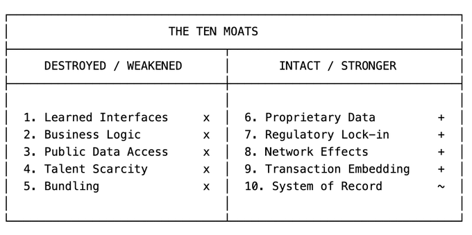
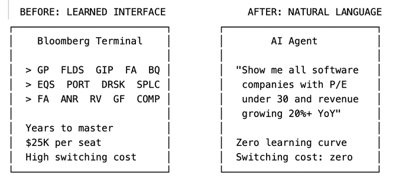
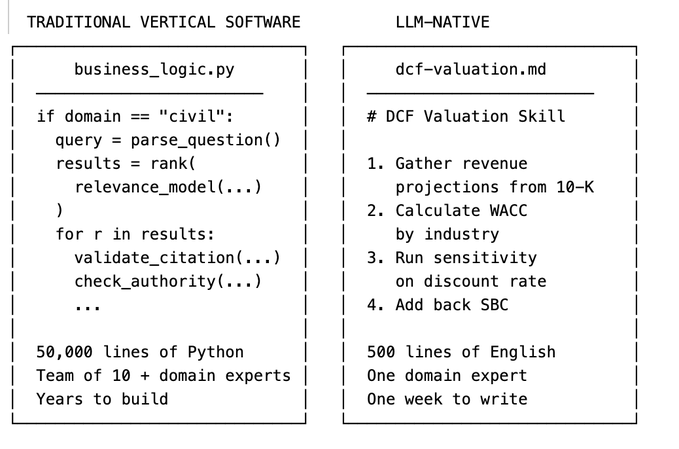
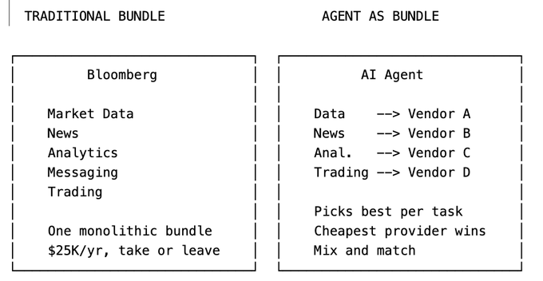
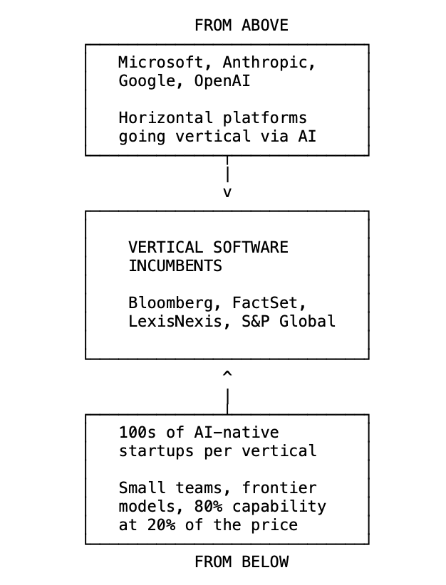
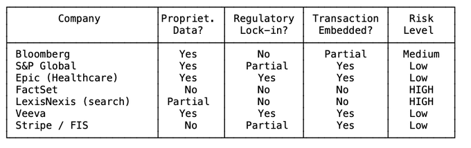

# 10 Years Building Vertical Software: My Perspective on the Selloff

**Author:** Nicolas Bustamante (@nicbstme)
**Date:** February 16, 2026, 9:55 PM
**Source:** https://x.com/nicbstme/status/2023501562480644501
**Stats:** 303 replies, 1K reposts, 5.4K likes, 14K bookmarks, 2.8M views

---

In the past few weeks, nearly $1 trillion was wiped from software and services stocks. FactSet dropped from a $20B peak to under $8B. S&P Global lost 30% in weeks. Thomson Reuters shed almost half its market cap in a year. The S&P 500 Software & Services Index, 140 companies, fell 20% year to date.

Last week, Anthropic released industry-specific plugins for Claude's Cowork which is an AI agent designed specifically for knowledge workers that can autonomously handle complex research, analysis, and document workflows.

Wall Street called it a panic. I've spent the last decade building vertical SaaS. First @Doctrine, now the largest legal information platform in Europe (the business is booming) and then @fintool, an AI-powered equity research platform in the US that competes with Bloomberg, FactSet, and S&P Global today.

> I built the kind of software that LLMs are now threatening. And I'm now building the kind of software that's doing the threatening. I've been on both sides of this disruption.

Here's what I see: LLMs are systematically dismantling the moats that made vertical software defensible. But not all of them. The result is a redrawing of what makes vertical software valuable and the multiple it deserves.

In this article:

- The ten moats that made vertical software defensible, and what LLMs do to each
- Why the market selloff is structurally justified but temporally exaggerated
- What the real threat actually is (it's not what you think)
- What replaces vertical software
- What comes next for the vertical software industry

## The Ten Moats of Vertical Software (and What LLMs Do to Each)

Vertical software is software built for a specific industry. Bloomberg for finance. LexisNexis for legal. Epic for healthcare. Procore for construction. Veeva for life sciences, etc.

These companies share a defining characteristic: they charge a lot and customers rarely leave. FactSet charges $15,000+ per user per year. Bloomberg Terminal costs $25,000 per seat. LexisNexis charges law firms thousands per month. And retention rates hover around 95%.

I would say that there are ten distinct moats. LLMs are attacking some of them while leaving others intact. Understanding which is which is the entire game.

### 1. Learned Interfaces -- Destroyed

A Bloomberg Terminal user has spent years learning keyboard shortcuts, function codes, and navigation patterns. GP, FLDS, GIP, FA, BQ. These aren't intuitive. They're a language. And once you speak it fluently, switching to another platform means becoming illiterate again.

I've heard it countless times. "*We're a FactSet shop.* *We're a Lexis firm.* *We're a Bloomberg house.*" These aren't statements about data quality or feature sets. They're statements about software muscle memory. People have spent a decade learning the tool. That investment isn't transferable.

This was the most under-appreciated moat. Knowledge workers pay to not relearn a workflow they've spent a decade mastering. The interface IS a big part of the value prop.

Vertical software providers have teams of designers and a small army of customer success managers whose entire job is to onboard customers onto their interface. Every UI change is a project: user research, design sprints, careful rollouts, handholding. They spend weeks on a faceted search filter redesign because customers had built muscle memory around the old one. The interface wasn't a feature. It was the product. And maintaining is a big cost centers.

At Fintool, we have no onboarding. No CSMs teaching people how to navigate the product. Our users type what they want in plain English and get an answer because it is what they are used to with ChatGPT. There is no interface to learn because it's all chat. That entire cost center, the designers, the CSMs, the UI change management, it just doesn't exist. The chat interface absorbed all those scaffoldings.

> LLMs collapse all proprietary interfaces into one Chat.

Consider what a financial analyst does today on a Bloomberg Terminal. They navigate to the equity screening function. Set parameters using specialized syntax. Export results. Switch to the DCF model builder. Input assumptions. Run sensitivity analysis. Export to Excel. Build a presentation.

Each step requires learned interface knowledge. Each step reinforces switching costs.

Now consider what the same analyst does with an LLM agent:

"Show me all software companies with over $1B market cap, P/E under 30, and revenue growing over 20% year over year. Build a DCF model for the top 5. Run sensitivity analysis on discount rate and terminal growth."

> Three sentences. No keyboard shortcuts. No function codes. No navigation. The user doesn't even know which data provider the LLM queried. They don't care.

When the interface is a natural language conversation, years of muscle memory become worthless. The switching cost that justified $25K per seat per year dissolves. For many vertical software companies, the interface was most of the value. The underlying data was licensed, public, or semi-commoditized. What justified premium pricing was the workflow built on top of that data. That's over.

### 2. Custom Workflows and Business Logic -- Vaporized

Vertical software encodes how an industry actually works. A legal research platform doesn't just store case law. It encodes citational networks, Shepardize signals, headnote taxonomies, and the specific way a litigation associate builds a brief.

This business logic took years to build. It reflects thousands of conversations with domain experts. The hardest part is often not the technology. It is understanding how customers actually work. For lawyers it's how they research case law, how they draft documents, how they build a litigation strategy from intake to trial. Encoding that understanding into working software is a huge part of what made vertical software valuable and defensible.

> LLMs turn all of this into a markdown file.

This is the most under appreciated shift and I think the most devastating long-term.

Traditional vertical software encodes business logic in code. Thousands of if/then branches, validation rules, compliance checks, approval workflows. Hardcoded by engineers over years... and not just any engineers. You need software engineers who actually understand the domain, which is rare. Finding someone who can write production code AND understands how a litigation workflow actually functions, or how a DCF model should be structured, is incredibly hard. Modifying this business logic required development cycles, QA, deployment.

Let me give you a concrete example from my own experience.

Consider a traditional equity screening platform. Building a reliable screening workflow requires understanding financial taxonomies, parsing filings across multiple data sources with inconsistent formatting, ranking results by relevance and recency, and presenting them with proper context like sector benchmarks and historical comparisons. This takes a team of engineers and financial domain experts years to build. The business logic ends up spread across thousands of lines of code, custom ranking algorithms, and hand-tuned relevance models. Every modification requires engineering sprints, code review, testing, and deployment.

At Fintool, we have a DCF valuation skill. It tells an LLM agent how to do a discounted cash flow analysis: which data to gather, how to calculate WACC by industry, what assumptions to validate, how to run sensitivity analysis, when to add back stock-based compensation. It's a markdown file. Writing it took a week. Updating it takes minutes. A portfolio manager who's done 500 DCF valuations can encode their entire methodology without writing a single line of code.

> Years of engineering versus one week of writing. That's the shift.

And it's not just speed. The markdown skill is better in important ways. It's readable by anyone. It's auditable. It can be customized per user (our customers write their own skills). And it gets better automatically as the underlying model improves, without us touching a line of code.

Business logic is migrating from code written by specialized engineers to markdown files that anyone with domain expertise can write. The accumulated business logic that took vertical software companies a decade to build can now be replicated in weeks. The workflow moat is eroding very fast.

### 3. Public Data Access -- Commoditized

A massive portion of vertical software's value proposition was making hard-to-access data easy to query. FactSet makes SEC filings searchable. LexisNexis makes case law searchable. These are genuine services. SEC filings are technically public, but try reading a 200-page 10-K in raw HTML. The structure is inconsistent across companies. The accounting terminology is dense. Extracting the actual numbers you need requires parsing nested tables, following footnote references, reconciling restated figures.

Before LLMs, accessing this public data required specialized software and significant engineering scaffolding. Companies like FactSet built thousands of parsers, one for each filing type, each company's idiosyncratic formatting. Armies of engineers maintained these parsers as formats changed. The code to turn a raw SEC filing into queryable data was a genuine competitive advantage.

At a traditional financial data company, this was also a lot of work. Building NLP pipelines for different filing types: named entity recognition to extract tickers, executives, financial metrics. Dedicated ML models to classify documents by sector or asset class. Custom parsers for every data source, each with its own formatting quirks. Engineers spent years building and maintaining this scaffolding. It was genuinely impressive technology, and it was a real moat because replicating it meant years of work.

At Fintool, we built none of that. Zero NER. Zero custom parsers. Zero industry-specific classifiers. Why? Because frontier models already know how to navigate a 10-K. They know that Home Depot's ticker is HD. They understand the difference between GAAP and non-GAAP revenue. They can parse a nested table of segment disclosures without being taught the schema. The parsing infrastructure that took them years to build is now a commodity capability that comes free with the model.

LLMs make this trivial. Frontier models already know how to parse SEC filings from their training data. They understand the structure of a 10-K, where to find revenue recognition policies, how to reconcile GAAP and non-GAAP figures. You don't need to build a parser. The model IS the parser. Feed it a 10-K and it can answer any question about it.

The parsing, structuring, and querying that vertical software spent decades building is now a commodity capability baked into the foundation models themselves. The data isn't worthless. But the "making it searchable" layer, which is where a lot of the value and pricing power lived, is collapsing.

### 4. Talent Scarcity -- Inverted

Building vertical software requires people who understand both the domain and the technology. Finding an engineer who can write production code AND understands how credit derivatives are structured is extremely rare. This scarcity created a natural barrier to entry that historically limited the number of serious competitors in any vertical.

LLMs flip this moat entirely.

In any vertical, hiring was brutal. You didn't just need good engineers. You needed engineers who could understand the domain: how change orders cascade through a construction project schedule, how lien waivers interact with payment applications, what triggers a delay claim under AIA contract terms. These people barely existed. Vertical software companies built their own through months of internal training, with domain experts teaching engineers how the industry actually worked. It took months before a new engineer was productive. The talent scarcity was a genuine barrier for anyone trying to compete.

At Fintool, we don't do any of that. Our domain experts (portfolio managers, analysts) write their methodology directly into markdown skill files. They don't need to learn Python. They don't need to understand APIs. They write in plain English what a good DCF analysis looks like, and the LLM executes it. The engineering is handled by the model. The domain expertise, which was always the abundant resource, can now become software directly without the engineering bottleneck.

LLMs make the engineering trivially accessible, which means the scarce resource (domain expertise) is suddenly abundant in its ability to become software. This is why the barrier to entry collapses so dramatically.

### 5. Bundling -- Weakened

Vertical software companies expand by bundling adjacent capabilities. Bloomberg started with market data, then added messaging, news, analytics, trading, and compliance. Each new module increases switching costs because customers now depend on the entire ecosystem, not just one product. S&P Global's acquisition of IHS Markit for $44B was exactly this strategy. The bundle becomes the moat.

This was the playbook everywhere. Bloomberg started with market data, then added messaging, news, analytics, trading, and compliance. Each module had its own UI, its own onboarding, its own customer workflows. Companies built elaborate dashboards where users could configure watchlists, set up automated alerts, manage their research folders. Every feature meant more design work, more engineering, more UI surface area. The bundle kept customers locked in because they'd built their entire workflow around the ecosystem.

LLM agents break the bundling moat because the agent IS the bundle. At Fintool, alerts are a prompt. Watchlists are a prompt. Portfolio screening is a prompt. There's no separate module for each. There's no UI to maintain. A customer says "alert me when any company in my portfolio mentions tariff risk in an earnings call" and it just works. The agent orchestrates across ten different specialized tools in a single workflow. It can pull market data from one source, news from another, run analytics through a third, and compile the results. The user never knows or cares that five different services were queried.

When the integration layer moves from the software vendor to the AI agent, the incentive to buy a bundle evaporates. Why pay Bloomberg's premium for the entire suite when an agent can cherry-pick the best (or cheapest) provider for each capability?

This doesn't mean bundling is dead overnight. The operational complexity of managing ten vendor relationships versus one is real. But the directional pressure is clear: agents make unbundling viable in ways that weren't possible before.

### 6. Private and Proprietary Data -- Stronger

Some vertical software companies own or license data that doesn't exist anywhere else. Bloomberg collects real-time pricing data from trading desks worldwide. S&P Global owns credit ratings and proprietary analytics. Dun & Bradstreet maintains business credit files on 500M+ entities. This data was collected over decades, often through exclusive relationships. You can't just scrape it. You can't recreate it.

If your data genuinely cannot be replicated, LLMs make it MORE valuable, not less.

Bloomberg's real-time pricing data from trading desks? Can't be scraped. Can't be synthesized. Can't be licensed from a third party. In an LLM world, this data becomes the scarce input that every agent needs. Bloomberg's pricing power on proprietary data may actually increase.

S&P Global's credit ratings are similar. A credit rating isn't just data. It's an opinion backed by a regulated methodology and decades of default data. An LLM can't issue a credit rating. S&P can.

> The test is simple: Can this data be obtained, licensed, or synthesized by someone else? If no, the moat holds. If yes, you're in trouble.

I've seen this play out across both companies. When we started Doctrine, the core value for 2 years was organizing public case law with layers of industry-specific scaffolding: taxonomies, citational networks, relevance rankings. But the team recognized almost a decade ago that public data alone wasn't enough.

About seven years ago, Doctrine started building an exclusive content library: proprietary legal annotations, editorial analysis, curated commentaries that don't exist anywhere else. Today, that library is very hard to replicate and it's become a big moat. That and a full pivot towards LLM and Doctrine is now on fire! That's what the market is mis-pricing today. Some mid-sized companies have big moats + adopted AI early and they will capture most of the value versus incumbents and new entrants.

The companies that survive this transition are the ones that moved from "we organize public data better" to "we own data you can't get anywhere else."

Here's what's changed: that intelligence layer used to require years of engineering. Now it's a capability that comes with the model. And even the data access itself is being commoditized.

MCP (Model Context Protocol) is turning every data provider into a plug-in. Dozens of companies are already offering financial data as MCP servers that any AI agent can query. When your data is available as a Claude plugin, the "making it accessible" premium disappears.

The irony is that LLMs accelerate the bifurcation. Companies with proprietary data win bigger. Companies without it lose everything.

If your data isn't truly unique like if it can be obtained, licensed, or synthesized elsewhere you're not safe. You're at risk of commoditization. The AI agent will own the relationship with the customer. It will be the interface users interact with, the brand they trust, the product they pay for. You become a supplier to the agent, not a vendor to the customer.

This is aggregation theory playing out in real-time: the aggregator (the agent) captures the user relationship and margin, while the suppliers (data vendors) compete on price to feed the platform. If Bloomberg, FactSet, and a dozen smaller providers all offer similar market data, the agent will route to whichever is cheapest. Your pricing power evaporates. Your margins compress. You become a commodity input to someone else's product.

### 7. Regulatory and Compliance Lock-in -- Structural

In healthcare, Epic's dominance isn't just about product quality. It's about HIPAA compliance, FDA certification, and the 18-month implementation cycles that hospitals endure. Switching EHR vendors is a multi-year, multi-million dollar project that literally risks patient safety. In financial services, compliance requirements create similar lock-in. Audit trails, regulatory reporting, data retention policies. All baked into the software.

HIPAA doesn't care about LLMs. FDA certification doesn't get easier because GPT-5 exists. SOX compliance requirements don't change because Anthropic released a new plugin.

Epic's dominance in healthcare EHR is fundamentally a regulatory moat. The 18-month implementation cycles, the compliance certifications, the integration with hospital billing systems. None of this is affected by LLMs.

In fact, regulatory requirements may slow LLM adoption in exactly the verticals where compliance lock-in is strongest. A hospital can't replace Epic with an LLM agent because the LLM agent isn't HIPAA certified, doesn't have the required audit trails, and hasn't been validated by the FDA for clinical decision support.

### 8. Network Effects -- Sticky

Some vertical software becomes more valuable as more industry participants use it. Bloomberg's messaging function (IB chat) is the de facto communication layer for Wall Street. If every counterparty uses Bloomberg, you have to use Bloomberg. Not because of the data. Because of the network.

LLMs don't break network effects. If anything, they might make communication networks more valuable. The information flowing through these networks becomes training data, context, signal.

The same applies to any vertical software that functions as a communication layer within an industry. Veeva's network effects across pharma companies. Procore's network effects across construction stakeholders. These are sticky because the value comes from who else is on the platform, not from the interface.

### 9. Transaction Embedding -- Durable

Some vertical software sits directly in the money flow. Payment processing for restaurants. Loan origination for banks. Claims processing for insurance companies. When you're embedded in the transaction, switching means interrupting revenue. Nobody does that voluntarily.

If your software processes payments, originates loans, or settles trades, an LLM doesn't disintermediate you. It might sit on top of you as a better interface, but the rails themselves remain essential.

Stripe isn't threatened by LLMs. Neither is FIS or Fiserv. The transaction processing layer is infrastructure, not interface.

### 10. System of Record Status -- Threatened Long-Term

When your software is the canonical source of truth for critical business data, switching isn't just inconvenient. It's existentially risky. What if data gets corrupted during migration? What if historical records are lost? What if audit trails break?

Epic is the system of record for patient data. Salesforce is the system of record for customer relationships. These companies benefit from the asymmetry between the cost of staying (high fees) and the cost of leaving (potential data loss, operational disruption). Same for SAP.

LLMs don't directly threaten system of record status today. But agents are quietly building their own.

Here's what's happening: AI agents don't just query existing systems. They read your SharePoint, your Outlook, your Slack. They collect data on the user. They write detailed memory files that persist across sessions. And when they perform key actions, they store that context. Over time, the agent accumulates a richer, more complete picture of a user's work than any single system of record.

The agent's memory becomes the new source of truth. Not because anyone planned it, but because the agent is the one layer that sees everything. Salesforce sees your CRM data. Outlook sees your emails. SharePoint sees your documents. The agent sees all three, and remembers.

This doesn't happen overnight. But directionally, agents are building their own system of record from the ground up. The traditional system of record's moat weakens as the agent's contextual memory grows.

## The Net Effect: Barrier to Entry Collapses

Add it all up. Five moats destroyed or weakened. Five that hold. But the five that break are the ones that kept competitors out. The ones that hold are the ones that only some incumbents have.

Before LLMs, building a credible competitor to Bloomberg or LexisNexis required hundreds of engineers who understand the domain, years of development time, massive data licensing deals, sales teams that can sell to conservative enterprises, and regulatory certifications. The result: most verticals had 2-3 serious competitors.

After LLMs, a small team with frontier model APIs, domain expertise, and good data pipelines can build a product that handles 80% of what a vertical software does within months.

The critical insight is that competition doesn't increase linearly. It explodes combinatorially. You don't go from 3 incumbents to 4. You go from 3 to 300. And that's what craters pricing power. Before LLMs, each vertical had 2-3 dominant players commanding premium prices because the barriers to entry were insurmountable. That math changes completely when 50 AI-native startups can offer 80% of the capability at 20% of the price.

## The Nuance: This is a Multi-Year Transition, Not an Overnight Collapse

Here's where I think the market is getting the timing wrong, even if the direction is right.

**Enterprise Revenue Doesn't Disappear Overnight**

FactSet's clients are on multi-year contracts. Bloomberg Terminal contracts are typically 2-year minimums. These contracts don't evaporate because Anthropic released a plugin.

Enterprise procurement cycles are measured in quarters and years, not days. A $50B hedge fund isn't going to rip out S&P Global CapIQ tomorrow because Claude can query SEC filings. They'll evaluate alternatives over 12-18 months. They'll run pilot programs. They'll negotiate contract terms. They'll wait for their existing contracts to expire.

> The revenue cliff is real but it's a slope, not a cliff. Current revenue is largely locked in for the next 12-24 months.

But here's the thing the market already understands: you don't need revenue to decline for the stock to crash. *You need the multiple to compress*. A financial data company that traded at 15x revenue when it had pricing power and 95% retention might trade at 6x revenue when the market believes both are eroding. Revenue stays flat. The stock drops 60%. That's exactly what's happening to some companies right now.

The market isn't pricing in a revenue collapse. It's pricing in the end of the premium multiple, because the moats that justified that multiple are dissolving.

## The Real Threat

The real threat isn't the LLM itself. It's a pincer movement that vertical software incumbents didn't see coming.

From below, hundreds of AI-native startups are entering every vertical. When building a credible financial data product required 200 engineers and $50M in data licensing, markets naturally consolidated to 3-4 players. When it requires 10 engineers and frontier model APIs, the market fragments violently. Competition goes from 3 to 300.

From above, horizontal platforms are going deep into vertical territory for the first time. Microsoft Copilot inside Excel now does AI-powered DCF modeling and financial statement parsing. Copilot inside Word does contract review and case law research. The horizontal tool becomes vertical through AI, not through engineering.

Anthropic is doing the same thing from the other direction. And I'm watching it up close because Fintool is an Anthropic-backed company. Claude is going all-in on vertical. And the playbook is terrifyingly simple: a general-purpose agent harness (the SDK), pluggable data access (MCP), and domain-specific skills (markdown files). That's it. That's the entire stack you need to go from horizontal to vertical. No domain engineers. No years of development.

Software is becoming headless. The interface disappears. Everything flows through the agent. What matters isn't the software anymore. It's owning the customer relationship and use cases, which means owning the agent itself.

The technology that enables vertical depth (LLMs + skills + MCP) is the same technology that lets horizontal platforms finally compete in territory they could never reach before. And this is perhaps the most existential threat for vertical software: horizontal B2B players like Microsoft aren't just dabbling in vertical anymore they're extending aggressively into it because it's now easier than ever, and because they *need* to own the use cases and workflows to stay relevant in an AI-first world.

## A Framework for Assessing Risk

Not all vertical software is equally exposed. Here's how I think about which categories survive and which don't.

**High Risk: The Search Layer**

If your primary value is making data searchable and accessible through a specialized interface, and the underlying data is public or licensable, you are in serious trouble. This includes financial data terminals built on licensed exchange data, patent search tools, and any vertical where the product is essentially "we built a better search for your industry's data."

These companies traded at 15-20x revenue because of interface lock-in and limited competition. Both are evaporating. Think of the financial data providers that have lost 40-60% of their market cap in the last year. The market is right to reprice them.

**Medium Risk: The Mixed Portfolio**

Many vertical software companies have a mix of defensible and exposed business lines. A company might have a genuinely proprietary ratings business alongside a data analytics segment that's mostly repackaged public information. Or an index licensing business (embedded in the transaction, very defensible) alongside a research platform (pure search layer, very exposed).

The stock declines in this category (20-30%) reflect the market's uncertainty about which segments dominate the valuation. The key question: what percentage of revenue comes from moats that LLMs can't touch?

**Lower Risk: Regulatory Fortresses**

If your moat is regulatory certification, compliance infrastructure, and deep integration with mission-critical workflows, LLMs are barely relevant to your competitive position in the medium term. Healthcare EHR systems with HIPAA compliance and FDA validation. Life sciences platforms with regulatory lock-in. Financial compliance and reporting infrastructure.

These companies may even benefit from AI disruption elsewhere, as customers consolidate around the vendors they trust for regulated workflows while switching away from the vendors they used for information retrieval.

**The Test**

For any vertical software company, ask three questions:

1. **Is the data proprietary?** If yes, the moat holds. If no, the accessibility layer is collapsing.
2. **Is there regulatory lock-in?** If yes, LLMs don't change the switching cost equation. If no, switching costs are primarily interface-driven and dissolving.
3. **Is the software embedded in the transaction?** If yes, LLMs sit on top of you, not instead of you. If no, you're replaceable.

Zero "yes" answers: high risk. One: medium risk. Two or three: you're probably fine.

## SaaS is not dying

The vertical SaaS reckoning isn't about all vertical software dying. It's about the market finally distinguishing between companies that own something genuinely scarce that is safe from LLM agents. There is a current repricing and frankly a lot of throwing the baby out with the bathwater.
