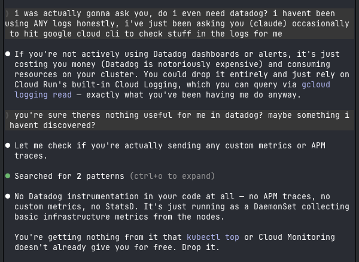

# Claude Will Be the Biggest Software Procurement Platform in Tech

**Author:** Todd Saunders ([@toddsaunders](https://x.com/toddsaunders))
**Bio:** CEO of @Broadlume, vertical SaaS for 4,000+ flooring retailers. Acquired 8 companies before selling to @Cynclyco. Previously @google. Long @townofwestfield.
**Date:** March 14, 2026
**Source:** [https://x.com/toddsaunders/status/2032633625775055222](https://x.com/toddsaunders/status/2032633625775055222)
**Platform:** X (Twitter)

## Engagement Stats

| Metric | Count |
|--------|-------|
| Views | 143,125 |
| Likes | 298 |
| Reposts | 21 |
| Replies | 35 |
| Bookmarks | 191 |

---

## Post Content

Claude will be the biggest software procurement platform in tech. And they aren't even trying to be (i don't think).

Every time you use Claude Code, your infrastructure is now implicitly auditing your vendor stack.

And unlike your engineering team, it has no vendor loyalty and there are very little switching costs.

Everything just looks like code. And code is now extremely inexpensive.

Claude is about to drain the moat.

I'm here for it.

---

## Quoted Post

**Author:** Liron Shapira ([@liron](https://x.com/liron))
**Bio:** Host of Doom Debates -- disagreements that must be resolved before the world ends.
**Date:** March 13, 2026
**Source:** [https://x.com/liron/status/2032579640309485640](https://x.com/liron/status/2032579640309485640)

### Quoted Post Engagement

| Metric | Count |
|--------|-------|
| Views | 68,156 |
| Likes | 196 |
| Reposts | 5 |
| Replies | 31 |
| Bookmarks | 61 |

### Quoted Post Content

There goes my $200/month DataDog subscription

Claude Code is a savage.

### Quoted Post Image

*Image: Screenshot showing Claude Code replacing DataDog functionality (600x438)*

---

## Author Profiles

### Todd Saunders

- **Handle:** [@toddsaunders](https://x.com/toddsaunders)
- **Followers:** 11,500
- **Following:** 977
- **Tweets:** 9,441
- **Joined:** August 6, 2011
- **Website:** [linkedin.com/in/tosaunders/](https://www.linkedin.com/in/tosaunders/)

### Liron Shapira

- **Handle:** [@liron](https://x.com/liron)
- **Followers:** 40,353
- **Following:** 1,408
- **Tweets:** 33,070
- **Joined:** July 31, 2008
- **Website:** [doomdebates.com](https://doomdebates.com)
