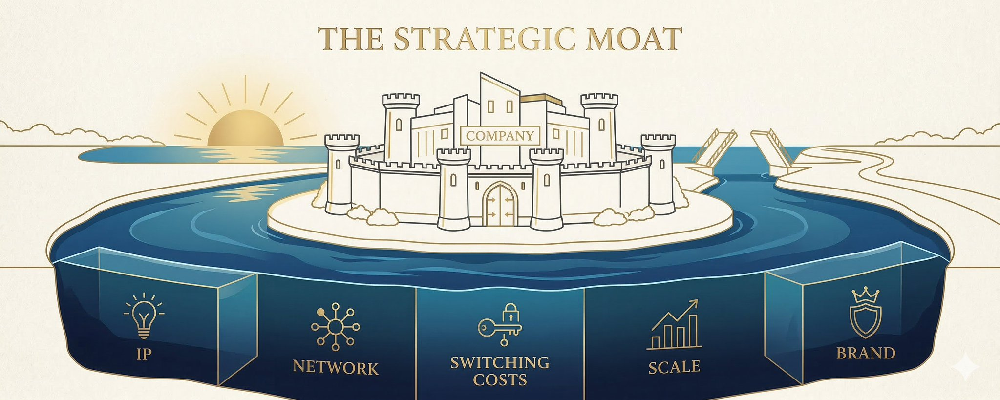

# The Collapse Of Terminal Value - What Happens If AI Makes Every Moat Temporary?

**Author:** Chamath Palihapitiya (@chamath)
**Date:** March 16, 2026
**Source:** https://x.com/chamath/status/2033385903520129161
**Stats:** 2.6K Likes | 428 Reposts | 199 Replies | 542K Views

---

## The Collapse of Terminal Value

The following is a thought exercise. It is an inversion to re-examine...well, everything.

Let's start with first principles.

The entire architecture of modern capital markets rests on a single, rarely examined assumption: that competitive advantages compound over time. Moats persist. Brands endure. Network effects defend. Strip that assumption away, and you aren't just repricing some stocks, you would be dismantling the philosophical foundation of how capital has been allocated for a century.

Here is a scenario worth taking seriously: AI lowers the cost of disruption so dramatically, and raises the pace of innovation so relentlessly, that no company can credibly project its free cash flow beyond five years. Because in the time you use AI to disrupt an incumbent, someone is laying the foundation to use a better model to disrupt you. The cycle accelerates until markets stop paying for what a business might earn in year seven onwards (for example) because year seven becomes, effectively, unknowable. The result: equities would need to get repriced not as discounted streams of future cash flows, but as a multiple of what they generate right now.

That's the same way you'd price a taxi medallion in 2011...right before Uber.

## Why Such a Move Could Be Rational

Before examining the consequences of such a move, it is worth establishing why a compressed free cashflow (FCF) multiple is a rational market response and not a panic or an overreaction.

The starting point is the risk-free rate, or the return an investor can earn with zero risk. A good proxy for this is the US 10-year Treasury, which currently yields ~4.5%. This is the floor. No rational investor should accept less from a risky asset than they could earn from a riskless one, so every equity valuation should clear this hurdle before it can even begin to justify itself.

To go from the risk-free rate to what equities should yield, you add the equity risk premium. This is the additional return investors historically demand for bearing the uncertainty of owning a business rather than a government bond. That premium has averaged 4-5% over the long run, putting the required return on a stable, no-growth equity at roughly 8.5-9.5%. Flip that into a valuation multiple (divide 1 by the required return) and you get 10 to 12x FCF as the rational price for a business whose cash flows are stable but not growing and face no existential threat. That is the baseline: what a boring, durable, competitively insulated business deserves to trade in today's environment.

## Here Comes AI - A Disruption Repricing Framework

If a business faces a 20 percent annual probability of being rendered obsolete by AI in any given year, which is not an unreasonable assumption in fast-moving sectors, its expected lifespan is roughly five years. Discount a five-year cash flow annuity at a 9 percent cost of equity (per above) and you arrive at approximately 3.9x FCF. Push the disruption probability to 30 percent and you get roughly 2.8x FCF. Drop it to 10 percent and you land near 6.5x. So a range of 2 to 7x FCF falls out from a reasonable band of plausible assumptions on risk of disruption, holding all else equal. The key takeaway here is how sensitive the math is when duration risk becomes the dominant variable.

This may be a good moment to ask yourself what annual percentage probability you'd assign to the risk that the most important company in your portfolio gets disrupted by AI - a number less than 10% per annum doesn't seem grounded in what we are being told about the impending tsunami of abundance and innovation in the offing.

## Markets Have Made Such Moves Before

It turns out that this Disruption Repricing Framework is not theoretical. Markets have repriced entire industries to exactly these multiples, and the historical record is instructive.

**Newspapers between 2005 and 2015.**
As digital advertising collapsed the print business model, newspaper companies that had traded at 12 to 15x EBITDA compressed to 2 to 4x, and the market was right to do so. The Philadelphia Inquirer, Tribune Company, and dozens of others eventually went bankrupt. The cash flows were real in year one but they were gone by year seven. The market correctly identified that it was pricing a depleting asset, not a going concern.

**Retail from 2016 to 2020.**
As Amazon systematically dismantled brick-and-mortar economics, department stores and specialty retailers compressed to 3 to 6x FCF even while generating significant cash. In this move, the market was not pricing current earnings per se. It was pricing duration risk and how many years of cash flow would you actually collect before the business deteriorated beyond recovery.

**Energy companies between 2019 and 2021.**
Major oil producers with decades of proven reserves traded at 4 to 6x FCF as markets began pricing the possibility that demand for oil would strand their assets before those reserves could be monetized. Real cash flows today, uncertain duration tomorrow and the multiple compressed accordingly.

**Taxi medallions made the point most brutally.**
Medallion Financial, which lent against New York City taxi medallions, watched its collateral collapse from over a million dollars per medallion to under a hundred thousand. These were cash-flowing assets with decades of operating history. The market repriced them to near-zero once it concluded that the duration of those cash flows was structurally finished. Uber did not need to kill the business immediately. It only needed to make the endpoint visible.

The pattern across all four cases is identical. When a market collectively decides that an industry's cash flows have a probable endpoint in the near future, it applies a steep duration discount regardless of its near-term profitability.

What if the AI disruption scenario is similar? If it is, then this logic, which historically was applied to one sector at a time, would need to be generalized across broad swaths of the economy simultaneously.

## How Big A Change Is This?

To understand the magnitude of such a change, consider where we stand today. The S&P 500 trades at roughly 22x earnings. Top technology companies trade at 30 to 60x. High-growth SaaS companies have commanded 8 to 20x revenue, despite near zero free cash flow, because the market was paying for the empire they would eventually build. For most of these businesses, 60 to 80 percent of their equity value lives not in what they earn today, but in the terminal value: the discounted sum of cash flows in years ten and beyond.

At 5x free cash flow - the midpoint of the range above - the market would only be paying for the cash the business generates in a short term window and not for its growth, nor its potential and, most importantly, not for the empire it might build. The future, in this new world order, is essentially worthless until it arrives.

The aggregate S&P 500 market cap today sits ~ $58 trillion. Corporate free cash flow from operations for the index runs at roughly $2.8 trillion annually. Repriced at 5x, you are looking at an equity market worth $14 trillion, a drawdown of 75 percent from current levels. At the low end of the range, 2x FCF, the losses are nearly total. Even at the generous end, 7x, roughly two thirds of all equity wealth ceases to exist. To put that in context: the 2008 financial crisis erased around $10 trillion in wealth at its worst. This scenario erases multiples of that, across every asset class, in every country, simultaneously.

As chaotic as this sounds, what are the second and third order impacts?

## Growth Investing Dies

Growth equity's entire logic is a bet on tomorrow. Sacrifice free cash flow today, build a dominant market position, harvest it for decades. Amazon's celebrated "invest everything back in" model was applauded by markets for twenty years. But it would be immediately penalized in this new world. Every dollar of reinvestment becomes suspect: you are deploying capital into a business that may not exist in 5-10 years.

Venture capital, in its current form, effectively ceases to function. Who funds a pre-revenue company at a $1 billion valuation if there is no terminal value to grow into? The IPO market, built on stories about what a company will become, collapses into a smaller arena for businesses that already generate serious cash. The entire venture capital/growth equity complex - one of the defining financial innovations of the last forty years - would instantly become a historical artifact.

## Capital Rotates to the Physical World

All of this said, it is not true that money would simply disappear. It would relocate. Capital would flood toward assets where cash flows are insulated from AI disruption: energy infrastructure, farmland, toll roads, water rights, commodity producers, short-duration sovereign bonds. Things you can touch. Things with inelastic demand and physical defensibility. Things that a better large language model cannot unbundle overnight.

Gold performs. Short-term government credit holds up (a five-year government bond doesn't require a terminal value assumption, just survival of the duration). The rotation away from equities would reshape everything from pension fund asset-liability matching to the basic 60/40 portfolio, which quietly stops making sense.

## The Paradox at the Heart of It

Here is the most uncomfortable implication. The companies driving AI disruption are currently committing $300 to $500 billion per year to AI infrastructure. That capital expenditure only makes sense if you believe in durable returns over seven to fifteen years. In a world where markets price on 2 to 7x FCF, that sort of long-term capex is impossible.

AI development would then slow because its own economics become unfinanceable under a short-duration pricing regime. The disruption engine disrupts itself. The cycle that was supposed to accelerate indefinitely runs headlong into a capital market that it has broken.

## Nation-States Fill the Void

The non obvious implication of this is that if private capital cannot finance long-duration projects, sovereign capital can step in. Countries with high savings rates, large borrowing capacity or patient state investment vehicles - US, China, the Gulf states, Norway, Singapore would gain a huge structural advantage on a generational scale. They would be the only ones capable of investing on a twenty and thirty-year horizon. A horizon that private markets would refuse to touch. The state capitalism model, long derided by market orthodoxy, would get vindicated at the precise moment the market's capitalism pricing model breaks down.

The geopolitical implications compound quickly as well. Industrial policy stops being a fringe idea. Strategic infrastructure becomes a national security question, not a return-on-equity question. The separation between capital markets and statecraft, already eroding, collapses entirely.

## The Corporate World Restructures

Below the macro level, the changes in corporate behavior are sweeping. R&D re-orients to funding projects from existing cash flows. For example, few boards will approve a seven-year bet on VR when the market discounts VR entirely by that time. Capital expenditure cycles shorten dramatically. Private companies cannot build a thirty-year LNG terminal without state support. M&A logic inverts: acquirers stop paying for optionality and synergies, demanding immediate free cash flow accretion from every deal.

Stock options - the compensation structure that aligned Silicon Valley talent with long-duration value creation - lose their power. Rational employees begin to demand more cash. Short-termism stops being a pathology and becomes the correct GTO response to the actual incentive structure in play. Every CFO in the world optimizes for the next eighteen months, because that is all the market will pay for.

## Is This Equilibrium Stable?

Probably not, and that may be the most important point of all. This scenario is likely self-defeating. If markets reprice to 2 to 7x FCF, the capital expenditure that drives AI disruption would dry up. The disruption would then slow. And moats would become durable again. The fear that caused the repricing fades, and the cycle reverses.

The more likely outcome, then, is not a permanent new regime but an oscillating transition: shorter cycles, fatter tails, higher volatility, periodic crises of confidence in terminal values followed by recoveries when AI development stalls or consolidates. A world where the equity risk premium structurally rises, where discount rates are persistently higher, and where the comfortable long-run upward drift of equity markets becomes something you earn rather than something you assume.

But even a partial move in this direction - even a world where terminal values compress by 30 or 40 percent rather than 90 - represents the most significant structural shift in capital markets since the postwar era. This wouldn't be a sector rotation or a valuation correction. It would be a fundamental renegotiation of what financial markets are for, and who they serve. And it wouldn't be a question about whether AI disrupts industries. It would be whether the disruption is so fast and broad that it alters the very pricing mechanism that funded the disruption in the first place.
