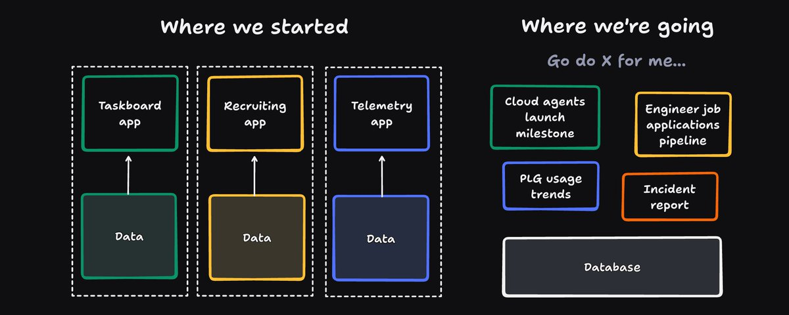

# We will all be digital gods: the death of apps and the rise of the meta-app

**Author:** Zach Lloyd (@zachlloydtweets)
**Date:** February 27, 2026
**Source:** https://x.com/zachlloydtweets/status/2027480476730925116
**Stats:** 1 reply, 14 retweets, 142 likes, 238 bookmarks, 14,015 views

---

Everyone has been talking about how easy Claude Code, Codex and Warp make it to build apps. That's true, but it's missing the more profound implication of these tools: soon we won't need to build apps at all.

By "app," I mean the things everyone uses on their phones and laptops all day -- "there's an app for that" type-apps. You install them one at a time and each has a bespoke interface, hand-built by a team of developers. Each app stores its own user data and has its own business model. These apps are the foundation of trillion dollar software businesses.

Once you choose an app, it's on you to learn how to use it. You shape your behavior to the app.

*Meta-apps* like Claude Code, Codex, and Warp are turning all this upside down. With a meta-app, you start with what you want to accomplish, and the meta-app goes right to the solution, no app needed -- and this works for any kind of task in any domain.

For a meta-app, "build me an app that does X" is the wrong framing.  "Do X for me" is the right one.

The super-power of meta-apps is creating what we used to think of as "apps" on demand -- the meta-app in its final state is the world's best, fastest coder that produces *just-in-time* apps as a user needs them.

If you want to do data analysis, you won't open a spreadsheet. You'll present the data to the meta-app, ask your question, and work with it until it builds the analysis you need. The meta-app might build a spreadsheet, go directly to charts or formulas, or produce a whole white paper for you. The outcome is shaped to your needs.

In the world of the meta-app, data availability is everything. The meta-app will be your CRM, your company wiki, your communication medium with your colleagues. It will see all data flowing through your life and your company, remember it, understand it, and surface it in the right way when you need to use it.

The meta-app will always be running in the background, not tied to your computer. It will live in the cloud but meet you on your phone and on your laptop. It will try and foresee what you need done and do it for you.

You might be thinking that the meta-app will work with agents connecting to existing apps via MCP, CLIs, or APIs, but it won't. These connector technologies are a stopgap that only exist because data is silo'd right now across legacy apps in your system.

These data silos will go away over time. If I were starting a company from scratch, I would put all of my company's data in a series of markdown files or simple databases rather than in apps (and we are in fact doing this at Warp). Why put your data in Notion or GDrive to just go through the dance of making that data available to an agent via MCP? Build your infrastructure right now for agents, not apps (agents are the actuators of the meta-app).

The apps of today have frontends that don't need to exist tomorrow. There's no moat to building a frontend anymore -- in fact, there's negative value because any frontend ossified in an app will probably be worse than the frontend a user might need at any given moment. App frontends need to be owned by their users -- it will be unacceptable to go through the dance of filing issues for support in a world where you can just build a better app yourself.

For example, at Warp, we use Greenhouse as our ATS, but hardly use its frontend anymore. Our talent team built their own UI in Warp that they prefer on top of Greenhouse's API. Greenhouse is just a glorified database for us now. I don't think we will pay for SaaS apps like this going forward.

I also predict that SaaS companies are going to make it harder and harder to get your data out of them because the data they hold is their only moat. They may also try to lock you into their own "agentic" solutions, keeping anything you build tightly coupled to their data. This might work in the short term, but it's not going to be a winning strategy.

The meta-app will answer any questions you have. ChatGPT does this well already, but what really distinguishes the meta-app from ChatGPT is its ability not just just to answer, but to *do*. Don't ask, tell.

The meta-app will have a simple form-factor: you will chat with it or talk to it with your voice. But it won't just be limited to text: the meta-app will build richer interfaces for you on demand when the use-case warrants it. Text is fine, but one thing we have learned from apps is that graphics are nice too, and the meta-app will build you the right thing for your use case.

OpenClaw is the precursor to the meta-app, but not the end state. OpenClaw is not a true meta-app since it's built on-top of and into all your existing apps. It's a duct tape solution of CLIs and tool calls. In the final state, apps other than meta-apps will be dis-intermediated, and the meta-app will work with the data directly.

When and how will we get to the full meta-app? It's already in motion. Claude Code, Codex, Warp are all meta-apps dressed up like developer tools. Their real power isn't in letting folks vibe code new apps -- that's a waste of time -- the world needs fewer apps, not more.

Their real power is in going directly from intent to outcome across any task that an app might have done in the past. The models aren't fast enough or smart enough to do full just-in-time app building yet, [but they will be](https://openai.com/index/introducing-gpt-5-3-codex-spark/).

You'll know the meta-app is maturing when folks stop using apps they used to use all the time. Our Creative Director (who doesn't know how to write code) now uses Warp as the front-door for any task he's doing. He migrated our old website off our CMS just by telling Warp what he wanted.

One consequence: meta-apps are the only interesting software to build right now IMO. I have friends at huge software companies that are still working on apps, and I don't get why. We built a clone of Google Sheets (a project I used to run at Google) internally in a few days -- it's not nearly as good as the real thing, but if you extrapolate the trend, it certainly will be possible to make it as good in the next year or two.

Another consequence: Anthropic and OpenAI certainly realize that we are headed to the world of the meta-app and are trying as hard as they possibly can to be the sole builders of it. They have a lead right now with Codex and Claude Code. I can't tell if Google and Meta and MSFT realize it yet or not, or if they have too much tied up in the innovators' dilemma of maintaining their legacy apps. [The market seems to subliminally realize it too as it punishes vertical SaaS companies.](https://www.forbes.com/sites/petercohan/2026/02/06/saaspocalypse-now-ai-is-disrupting-saas---but-not-all-software-is-doomed/)

The company that really should be building the meta-app in my opinion is Apple. They build the best hardware, and have the real opportunity to create something where the app and the hardware are truly melded into an amazing meta-app experience. Maybe they will one day.

My final thought: the rise of the meta-app will be disruptive, but it also will be awesome. We will all be digital gods in the world of the meta-app. We will all be software builders, although we won't be coders. Software will finally serve us, and we won't need to waste time serving software.

---

We're hiring by the way. If you're interested in helping shape the future of software, [come join us](https://www.warp.dev/careers).
