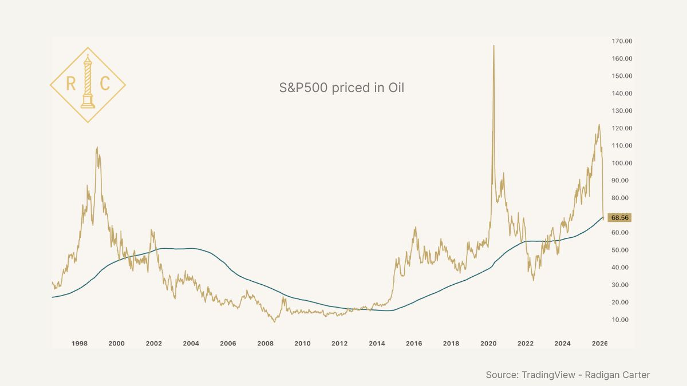
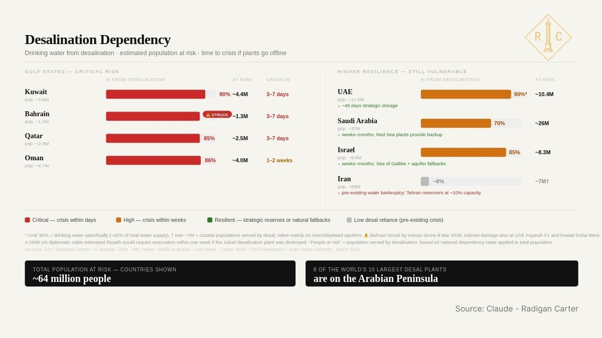

# A Framework for What Comes Next

**Author:** Radigan Carter (@radigancarter)
**Date:** Mar 20, 2026
**Source:** https://x.com/radigancarter/status/2035073252134129757
**Stats:** 166 replies, 687 reposts, 2,866 likes, 5,318 bookmarks, 1.2M views

---

I've been working on this for about a week as time permits around evacuating my wife and responding to attacks in Oman. This is my current thinking on how this war affects markets over the next 6-12 months. I am not trying to predict, only think through the most likely middle path as events unfold so I can adapt to the opportunities I am given.

My mission, as always, is to be like Thucydides. I take my own risks, seek understanding, and tell the truth with clarity. As titan forces once again face off against each other and we all feel the weight of uncertainty, my sole focus is what I should do as an individual investor to protect my family.

I see four phases ahead of us.

## Phase 1

Denial. This is where we are now. We're seeing volatility based around what the President is saying when the market is open. Everyone is desperately wanting to believe this new war in the Middle East for Israel will be short. Powell is already reassuring people this isn't stagflation, then throwing his phone across the room watching Israel bomb South Pars.

## Phase 2

Begins when the 6 week trigger fires in mid-April if the war continues. At 6 weeks the oil shock from the strikes on energy infrastructure works through freight, food, and consumer goods. The CPI prints start scaring people. Tech starts taking real pain as multiples compress.

Tech valuations should fall since higher energy prices lead to hotter CPI prints, which kills any remaining expectation that the Fed will cut rates. Powell has already started crushing those hopes. The data coming in April and May will finish the job. Until someone addresses Israel having a veto over our foreign policy this won't change. Israel is bombing South Pars while the U.S. is letting Russia and Iran sell oil on global markets to stabilize energy prices.

When Powell extinguishes the last hopes for rate cuts, the market will throw a temper tantrum. And unlike every other selloff in the last 15 years, I'm not sure I can just buy the dip and wait for the Fed to lift me back up. The inflation we'll be seeing is supply-driven from bombing gas fields and LNG terminals.

The Fed has a bunch of worthless PhDs and a computer it hits zeroes on to make more made up money. It doesn't have a bunch of petroleum engineers and an LNG train in the basement. The Fed can't fix this problem with monetary policy. So tech valuations that have been priced for falling rates will be repriced for rates staying where they are, and everyone will be miserable heading into summer as the realization hits that there is no easy way out of this.

## Phase 3

Hits over the summer, aiming for July through August as earnings start reporting and the damage we're seeing in the field shows up in actual numbers. Corporate earnings miss. Unemployment rises. AI replacing workers will only accelerate in the background of this war as companies cut costs to survive higher energy inputs. Politicians will start panicking ahead of midterms in November.

Phase 3 is the buying opportunity I am hoping for.

Quality names on my shopping list will hopefully be at meaningful discounts as everyone is tired of this and angry that costs have gone up while they feel more insecure in employment and are demanding action leading into the fall and midterms. Which will happen. We've gone from cutting costs to max money like it's Afghanistan all over again. Costs for the war after barely three weeks are already in the stratosphere, a few hundred billion and not slowing down. The Fed will capitulate, politicians will add fiscal support, and we'll add another trillion plus of debt to pay for Israel's war. Just have to be patient.

## Phase 4

Late 2026 into 2027. The Fed capitulates, cuts rates, and everything bought in Phase 3 starts working. I also think coming out of this in Phase 4 there will be a major focus on energy independence and abundance. Both sides of Congress will be singing out of the same hymnal after midterms. No one will want to be labeled as someone standing in the way of fixing this pain as people see how disrupting energy markets in one part of the world causes costs everywhere to rise. Plus it gives them cover for lower rates, more money spending, and job creation.

The Iran War is going to highlight the need to have control over inputs, and I expect that to be good for assets in U.S. jurisdictions or at least the western hemisphere. In the background of all of this, AI only accelerates. Companies under pressure to maintain profit margins under higher energy and input costs will look to cut labor costs with AI as much as possible. Those aren't the companies anyone thinks of as AI or tech companies, but the productivity gains show up in their profit margins in 2027 and beyond. The AI story coming out of this war isn't just about the companies that build AI it's about the companies that adopts it to survive. That is a structural shift I'm looking for this summer.

## How This Started

We're closing in on three weeks into this war and I still think most people are underpricing how long this conflict drags on. Not because I'm predicting the worst case, I'm trying to stay focused on the middle path most likely to play out here, but because the theological framework driving Iranian decision-making doesn't respond to the incentives Western politicians and commentators assume it does.

The Shia tradition is built on the story of Husayn ibn Ali, the third Shia Imam, who knew he would die at Karbala in 680 CE. He had 72 companions against thousands. He went anyway. In Shia theology, standing against injustice is obligatory *especially* when you cannot win in conventional terms. Defeat and death are not failure, capitulating in the face of overwhelming injustice is the failure.

Israel and the U.S. could not have more faithfully reenacted the very origin story of Shia Islam with their attack to start this war if they tried. Israel and the U.S. used diplomacy as treachery. They attacked Iran while the Foreign Minister of Oman was announcing a diplomatic breakthrough, assassinating Khamenei and his family. Just like how Husayn was killed after being promised safe passage then massacred.

This is why no matter how many targeted assassinations Israel does where they kill men living their life unafraid with their families and civilians around them in residential neighborhoods the Iranians will not kneel. The Israelis know this. They don't care. Israel will bomb Tehran until it looks like Gaza and set the entire Middle East on fire. They are fine with chaos. Is the U.S? I know I am not.

Shia theology reframes pain as confirmation they are walking the righteous path. This goes back to the 7th century when the Arab tribes swept out of the peninsula and started conquering parts of Rome and Persia. Persians is an ancient civilization, they felt Arabs conquering them was an injustice, so Shia theology found a natural home with Persian identity.

The idea Israel and the U.S. would be able to assassinate their leaders like a reenactment of the Shia origin story, throw a few JASSMs (Joint Air-to-Surface Standoff Missile) at them, and they would capitulate to foreign powers when literally their entire history is built around resisting foreign powers for thousands of years is absurd. We remain tragically ignorant of the people we want to wage war on and have learned nothing from the failures of the GWOT and Ukraine War while giving psychopaths a veto on our foreign policy.

If you want the best book I've ever read on this history, told by a great storyteller, read [Destiny Disrupted.](https://www.amazon.com/Destiny-Disrupted-History-Through-Islamic/dp/1586488139)

## The Current Situation

We're now on Day 20 and the conflict has crossed the Rubicon towards energy costs cascading through the physical supply chain laid out in Phase 2 more real with strikes on energy infrastructure.

Yesterday, Israel struck Iran's South Pars gas field, the largest natural gas field in the world. Iran retaliated by heavily damaging Qatar's Ras Laffan LNG facility, also the world's largest. QatarEnergy has now declared force majeure on gas exports and shut down gas liquefaction. Qatar was responsible for roughly 20% of global LNG trade, and over 80% of those cargoes went to Japan, South Korea, China, and Taiwan. That supply is now offline and [could take years](https://www.reuters.com/business/energy/iran-attack-damage-wipes-out-17-qatars-lng-capacity-three-five-years-qatarenergy-2026-03-19/) to bring back online. The Bazan oil refinery in Haifa, Israel that supplies 65% of Israel's diesel fuel and 59% of its gasoline has also been hit, along with other energy infrastructure in the gulf.

For Qatar, I worked in Ras Laffan Industrial City (RLIC) for five years pre-commissioning liquid natural gas (LNG) facilities. QatarEnergy (named QatarGas when I worked there) is vertically integrated. They own everything from the gas fields offshore, to the LNG trains, the kilometer long processing plants that takes the sour gas in one end, and runs it through thirteen stages in the train to get liquid natural gas on the other end. LNG is then piped out to export terminals Qatar built in RLIC, and shipped around the world on the fleet of LNG tankers Qatar had built and owns. Until the U.S. built LNG export terminals and fracking technology became what it is, Qatar was the largest producer and exporter of LNG to the world.

These LNG trains out at RLIC are massive. When they were under construction twenty years ago, 250,000 men would go to work in the haze and heat of that industrial city every morning with the trains under construction resembling a forest made of cranes. Starting these trains up, especially when there has been damage with repairs done, inspected, and then systems brought back online isn't a fast process. These natural gas trains are like a small city, they cost tens of billions to build, the systems are intricate, and some of the components are custom orders with long lead times measured in years.

Once you start flying missiles and shahed-136s into these plants and causing damage from primary and secondary fragmentation, plus fire and the concussive force from explosions, you have to go through these systems meticulously and start them back up in phases. Some of these systems operate at insanely high pressures and you don't want to cause a catastrophic failure because you missed a bit of damage.

If there are custom, long lead time pieces damaged, then you're waiting months or longer for a new vessel to be fabricated, shipped from China or South Korea, then unloaded at the pier and walked up the road by a Mammoet heavy lift crew.

I was hoping the damage in RLIC was not that extensive and could be repaired in months, and not years. That unfortunately does not appear to be the case.

This has immediate follow on effects for other industries. For Qatar, the gas offshore is very sour, and QatarGas uses the whole buffalo, piping liquid hot sulfur once separated from the gas to make sulfur pellets which are then shipped out on bulk ships for making fertilizer, chemicals, cement, oil refining products, and other uses. QatarEnergy does this for other distillates separated from the gas as they make LNG like propane, too. Taking LNG offline starts to cause other cascading effects that I'm not really sure what the second or third order effects will be. It is relatively easy to map LNG offline to fertilizer to increase in food costs. Or LNG offline to sulfur to sulfuric acid needed by copper miners. Past that the path gets hazy for me and I'm not sure anyone else really knows either. Other than if this goes on long enough, things start to break in unexpected ways in the global economy.

As Charles Gave says, an economy is energy transformed. As energy which the world depends on goes offline and stays offline, countries will scramble to secure other energy imports. Energy producers going offline in the Middle East causes global energy prices to rise globally. While this may be good for energy exporters in the U.S., in time heightened energy costs will be passed on to the customer with those that cannot source energy at higher prices will shut down production and lose jobs.

## The Hormuz Crisis

In addition to striking energy infrastructure, the conflict is continuing to spread regionally. Israel is invading southern Lebanon, killing another 1,000 people and displacing close to one million. The Popular Mobilization Forces (PMF), Iranian-backed Shia militias in Iraq, who did a lot of the hard fighting against ISIS in 2016, are now in the fight and attacking U.S. installations in Iraq, Saudi Arabia, Kuwait, and Jordan. This has caused the U.S. to drawdown and relocate personnel out of the region, further degrading the U.S. ability to sustain operations regionally. These events combined with missile and drone strikes from Iran, plus Iran controlling the Strait of Hormuz is why I say the entire region, from the Levant, Persian Gulf, Arabian Peninsula is now under Iranian fire control.

I have sailed through the Strait of Hormuz several times and wrote a piece on the strait [here](https://x.com/radigancarter/status/2033955468352319719).

Currently more than 20 vessels have been hit since the war began. The Islamic Republican Guard Corps (IRGC) has launched 50 waves of operations against U.S. bases in the region. The way I think about this is everything from Adana in southern Turkey, south through Israel, then east encompassing Lebanon, Syria, and Iraq, the Arabian Peninsula, the Persian Gulf, and the Arabian Sea is under Iranian fire control.

If you add the Houthis in Yemen to the equation, then world maritime and energy trade is waiting to be split in two when the Houthis start hitting shipping in the Red Sea. The historical equivalents are between the Ottoman Empire closing the Silk Road, the disruptions to the global economy at the outbreak of World War I in the summer of 1914, and the Suez Crisis in 1956 showing the world the British Empire was finished. This is why coming out of this in Phase 4, I expect investors to look at their holdings and think critically about what they have seen with this war. Many will likely say sure the profits are good, but is the asset safe and what jurisdiction is it in? Assets in jurisdictions deemed safer than others, that don't carry the risk of transiting through chokepoints to reach end markets will likely carry a premium. A lot rides on the outcome of this conflict.

## Climbing the Escalation Ladder

Several asked in regards to Iran having fire control over the strait why didn't the U.S. start striking life support infrastructure. Going further up the escalation ladder after targeted assassinations, the conflict spreading regionally, and currently striking energy producers is not something to take lightly, no matter how much the White House intern makes this war look like a video game with disgusting snuff videos.

And we're already hitting life support infrastructure unfortunately. On Day 7 of the conflict, the U.S. struck a desalination plant on Iran's Qeshm island. This is the island that guards the Strait of Hormuz. The island's geology gives it numerous natural caves, with the IRGC having spent decades improving and reinforcing underground facilities on the island.

The following day, Iran matched the escalation, sending an attack drone to hit a desalination plant in Bahrain. Kuwait and the UAE have now also reported missile-related damage to desalination plants. Losing desalination plants is an existential risk to Gulf States and Israel. The risk of a humanitarian crisis with drinking water and power going offline, especially in the Gulf States, as we go into summer here where temperatures reach 115 degrees is real and will kill people.

More than 90 percent of the Gulf's desalinated water comes from just 56 plants. In Kuwait and Bahrain, desalinated water accounts for around 90 percent of the country's supply. Where I am at in Oman and have a week's supply of water as backup, it is 86 percent. Then 80 percent for Israel, 70 percent in Saudi Arabia, and 42 percent for the UAE.

If the U.S. and Israel continue hitting life support infrastructure, Iran will retaliate and as air interceptors become scarce, hitting these installations will be easier and it is an asymmetrical flaw that the gulf states and Israel. Roughly 64 million people in the region could be affected if this continues. It will cause a humanitarian and refugee crisis that will make the Syrian civil war look like a Spring Break trip having consequences for Europe and Turkey.

Oil may have built the modern Middle East, but desalinated water keeps it alive and Iran has escalation dominance on both in this war. The U.S. needs energy to keep flowing out of the Persian Gulf to keep global markets stable and the region can't lose their desalination plants. Israel can continue to climb the escalation ladder, but eventually they will reach the top and Iran will hit their desalination plants.

## Phase 2 -- The 6 week trigger

Everything up to this point is Phase 1, where we're at currently, why neither side can back down, and conflict will likely continue. However, President Trump could announce on Truth Social tomorrow a glorious win, the war is over, he's made an amazing deal, and it doesn't even matter if it's true or not.

Doesn't matter that the Strait of Hormuz is still under Iranian control, or that the U.S. has now had their Suez moment which have longer term implications. What matters in this instance is the higher energy costs could not flow through the rest of the supply chain and this could all be invalidated.

As I was thinking things through, I thought ok, what's the time hack where it doesn't matter what is said or what deal is announced, that the higher energy prices are flowing through the system regardless?

6 weeks from start of the war is the trigger I came up with. At the 6 week mark the denial period is over. Everything is not fine, this war is not a quick 20-minute adventure and the inflation data in late April and May reflects the embedded damage.

To show my math on how I arrived at a 6 week trigger:

Weeks 1-2, refined product prices adjust which we have seen. Gasoline and diesel reprices at the pump. The more vulnerable countries start having shortages. Oil is up 40% from pre-war levels.

Weeks 3-4, where we are right now. Freight and logistics costs start to adjust as carriers reprice at new fuel costs. The February PPI came in at 0.7% versus 0.3% is an early edge of this stage, and the inflation data in April will be worse once the costs continue to work their way through the system.

Weeks 5-8, the freight and logistics cost increases from the previous two weeks flow into consumer goods as costs are passed onto customers. Food, building materials, manufactured goods, all reprice as the total inflation from the previous month in fuel and freight costs reaches the customer.

By week 6 the higher costs have flowed through to the customer, it doesn't matter if the conflict stops, the higher prices are sustained, especially with energy producers offline, and then it is a matter of being patient through the summer for phase 3 and 4 to play out.

Before six weeks, a ceasefire could unwind most of the damage because contracts haven't fully rolled over, businesses can revert to prior pricing, the Fed will cut rates, the Attorney General will talk about the S&P500 any time Congress questions her about Epstein, and everything will be fine. At least in theory, although with the strikes on energy infrastructure and supplies like QatarGas being offline for the foreseeable future my thinking could be off on this.

After six weeks, even a ceasefire cannot undo what's already in the pipeline. The repricing has happened, and the CPI data arriving in May and June will reflect the damage regardless of what's happening in Iran.

The CPI print will make Powell, who is saying he isn't concerned about stagflation right now, extinguish the last hope of rate cuts this year, holding rates were they are. This will cause tech margins to compress and the market won't be happy. No one is going to be happy as this war drags on.

## Phase 3 -- Endless Summer and AI

My plan for this summer is to go to the beach and the gym to keep myself patient and then towards the end of it will get serious about seeing where we are at. By August we should be seeing company earnings reporting the damage we're seeing in the field currently. All the while, AI continues to accelerate in the background as companies cut costs where they can to survive higher energy inputs.

Companies have been deploying AI rather than hire, and now we're going to layer on a stagflationary energy shock on top of that. It doesn't take a rocket scientist to realize a company, when faced with margin compression from $95 oil and needs to cut costs, will replace employees wherever possible with AI tools. It won't be about an innovation initiative, it will be survival.

AI adoption is going to accelerate into the downturn because it becomes the obvious cost-cutting move.

The cruel paradox is that this works beautifully for individual companies while destroying aggregate demand. It's going to eliminate the income those workers would have spent from the economy, which has effects I'm not sure about for creditors who previously thought they were gold plated investments.

Or about the effect it will have on their peers who won't feel certain in their own prospects and will instead cut unnecessary spending, especially as increased energy inputs drive up costs of goods.

So I'm not going to be surprised if we get prices rising from the energy shock while employment deteriorates faster than any historical model would predict because AI displacement is compounding the cyclical downturn.

This is the piece I think matters most for timing.

The Fed's employment mandate is going to get triggered sooner than anyone expects. Not just because of the war, but because AI is structurally amplifying the job losses in the background. That compresses the entire timeline toward a September rate cut.

The Fed is going to be trapped between inflation they can't fight and employment that's about to deteriorate. They'll hold through summer and cut in September because midterms force their hand.

AI and Tech stock prices are going to fall in this environment because of multiple compression and slowing enterprise revenue. But the narrative actually gets stronger. The companies that adopted AI are the ones surviving the downturn. The ones that didn't are the ones going bankrupt. So the long-term thesis becomes more compelling at exactly the moment when the stocks are cheapest. That's why I want to be patient and buy tech and research companies that are going to be using AI to emerge out of this better in Phase 3.

After Phase 4, people will look back and be like of course I should have bought a copper miner that was getting crushed because there was no sulfur flowing out of the Strait of Hormuz, they were making their 30-ton dump truck autonomous and now printing money since both sides of Congress believe in energy independence!

## The Midterms

The Fed, the White House, Congress, they all have different mandates but they all face the same date in November. No incumbent wants to face voters in a stagflation with no policy response. No Fed chair wants to be seen as having stood by while the economy deteriorated.

That alignment is what breaks gridlock. The Fed will signal at Jackson Hole in August, cuts in September, and every politician gets to campaign on "we acted."

Markets will front run that by 4-6 weeks, which means July to August is when I'll be getting serious about scaling in if we hit the six week trigger and this war continues. And the AI driven employment deterioration actually helps this timeline. It gives the Fed political cover to cut rates even if inflationary pressure is still there because they can frame it as an employment emergency rather than capitulation.

## 2027

The energy independence theme coming out of this is going to be enormous and bipartisan, like global war on terror defense spending but for energy. After higher energy prices and the associated costs hits customers from this war, energy independence becomes the dominant political narrative, transcending partisan lines in 2026-2027.

The mutual targeting of energy infrastructure in this war with South Pars, Qatar's LNG terminal, Saudi refineries all in flames make the vulnerability undeniable. Every politician campaigns on never being dependent on the Middle East again. Both sides of the aisle in congress gets more infrastructure spending, along with expanded drilling, permitting reform, nuclear, and clean energy.

The most important thing I keep telling myself: I'm not trying to predict, only adapt. If a real peace deal happens, not Trump tweeting that it's over, but the actual end of hostilities, with Hormuz reopening and insurance markets re-engaging and an Iranian counterparty who can enforce compliance then I'll pivot.

But let's be real, with Larijani dead and Israel continuing to assassinate anyone we could negotiate with, that hope fades by the day.

That's how I'm thinking about this so far. Not trying to predict, just have a framework to use and adapt as needed. Will update it at the end of the month in the letter. If you liked this and want to read more, you can sign up for the letter here. [https://radigancarter.com/](https://radigancarter.com/)

See you out there, Radigan

